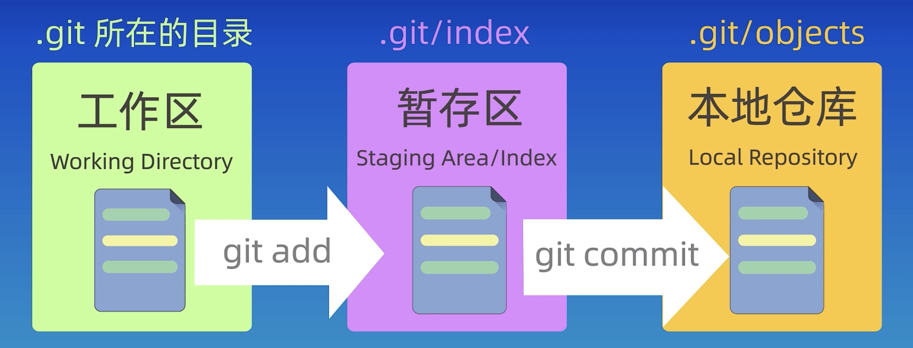

### 1、什么是 Git

Git 是一个开源的分布式版本控制系统。


### 2、Git 的工作区域

Git 的工作区域是其版本控制模型的核心组成部分，主要分为以下三个区域：



工作流程图如下

```bash
工作目录  -- git add -->  暂存区  -- git commit -->  本地仓库  -- git push -->  远程仓库
  ↑                  			↓                     		  ↑											 		↓
	| ---- git checkout --- |                     		  | ----- git pull ---------|
```


#### 2.1 工作目录 `.git`

项目所在的本地目录即为工作目录。工作目录中的文件都是尚未被 Git 跟踪。需要明确说明工作目录是日常编辑文件的地方，所有更改都从这里开始。

- 作用：
    - 用户直接修改文件的区域，所有代码的增删改操作均在此完成。
- 特点：
    - 未跟踪（Untracked）的文件不会被 Git 管理。
    - 已修改（Modified）的文件尚未进入暂存区。
- 操作：
    - git status：查看工作目录的变更状态
    - git diff：对比工作目录与暂存区的差异


#### 2.2 暂存区 `.git/index`

暂存区就是一个缓冲区，用于准备提交内容的中间区域。通过 `git add` 将工作目录的改动添加到此处，可选择性提交部分文件，避免一次性提交所有更改。

- 作用：
    - 临时存放用户打算提交的变更，是工作目录和本地仓库的中间层。
- 特点：
    - 通过 `git add` 将工作目录的变更添加到暂存区。
    - 支持选择性提交（如仅提交部分修改的文件）。
- 操作：
    - git add <file>：将文件添加到暂存区。
    - git rm --cached <file>：取消跟踪新增文件（保留工作目录文件）。


#### 2.3 本地仓库 `.git/objects`

本地仓库用于将暂存区的内容生成永久快照（版本文件），形成可追溯的版本历史。

- 作用：
    - 存储项目的完整提交历史，每次提交生成一个唯一的快照（Commit）。
- 特点：
    - 通过 `git commit` 将暂存区的变更永久保存到本地仓库。
    - HEAD 指针指向当前分支的最新提交。
- 操作：
    - git commit -m "message"：提交暂存区的变更。
    - git log：查看提交历史。


### 3、Git 的文件状态

Git 文件状态包括：`untracked`、`staged`、`unmodified`、`modified`。注意：`unmodified`、`modified` 状态的文件都存在于本地仓库中（即：被提交过的才可能是 modify）。


Git 文件状态的流转情况如下

| **操作或命令**                                           | **状态变化**               | **说明**                                                     |
| :------------------------------------------------------- | :------------------------- | :----------------------------------------------------------- |
| `git add <file>`                                         | `untracked` → `staged`     | 新增文件首次加入暂存区。                                     |
| `git commit`                                             | `staged` → `unmodified`    | 提交暂存区文件，生成新版本后文件变为未修改。                 |
| 修改文件内容                                             | `unmodified` → `modified`  | 对已跟踪文件进行修改。                                       |
| `git add <file>`                                         | `modified` → `staged`      | 将工作目录的修改加入暂存区。                                 |
| 暂存后再次修改文件                                       | `staged` → `modified`      | 文件在暂存区有旧版本，工作目录有新修改（需再次 `git add` 更新暂存区）。 |
| `git rm --cached <file>`                                 | `staged` → `untracked`     | 取消跟踪新增文件（保留工作目录文件）。                       |
| `git rm --cached <file>`                                 | `unmodified` → `untracked` | 停止跟踪已提交文件（保留工作目录文件）。                     |
| `git restore <file>` 或 `git checkout -- <file>`         | `modified` → `unmodified`  | 放弃工作目录的修改，恢复到最后提交版本。                     |
| `git restore --staged <file>` 或 `git reset HEAD <file>` | `staged` → `modified`      | 取消暂存修改（保留工作目录修改）。                           |


Git 文件状态的流程图如下：

1. **新建文件**：
    `untracked` → `git add` → `staged` → `git commit` → `unmodified`
2. **修改已提交文件**：
    `unmodified` → 编辑文件 → `modified` → `git add` → `staged` → `git commit` → `unmodified`
3. **取消暂存或停止跟踪**：
    - 取消暂存修改：`staged` → `git restore --staged` → `modified`
    - 停止跟踪文件：`unmodified` → `git rm --cached` → `untracked`
4. **恢复修改**：
    - 丢弃工作目录修改：`modified` → `git restore` → `unmodified`
    - 丢弃暂存区修改：`staged` → `git restore --staged` → `modified`


### 4、Git 常用命令

以下是常用的 Git 命令。


#### 4.1 配置与初始化


**设置用户信息**

```bash
git config --global user.name "terry"
git config --global user.email "terry@outlook.com"
```

**查看配置**

```bash
# 列出所有配置
git config --list
```

**初始化仓库**

```bash
# 将当前目录初始化为Git仓库
git init
```

**克隆远程仓库**

```bash
# 克隆仓库到本地
git clone <远程仓库地址>
```


#### 4.2 基本操作

**查看仓库状态**

```bash
# 显示工作区与暂存区的状态
git status
```

**添加文件到暂存区**

```bash
# 添加指定文件
git add <文件名>

# 添加所有修改和新文件
git add .

# 仅添加已跟踪文件的修改（不包含新文件）
git add -u
```

**提交更改**

```bash
# 提交暂存区的修改
git commit -m "提交说明"
```

删除文件

```bash
# 将文件从工作区与暂存区一起删除
git rm <文件名>
```


**查看差异**

```bash
# 工作区与暂存区的差异
git diff

# 暂存区与最新提交的差异
git diff --staged

# 比较两个提交的差异
git diff <commit1> <commit2>
```


#### 4.3. 分支管理

**查看分支**

```bash
# 本地分支列表
git branch

# 查看所有分支（包括远程）
git branch -a
```

**创建/切换分支**

```bash
# 创建分支
git branch <分支名>  

# 切换分支
git checkout <分支名>

# 创建并切换分支
git checkout -b <分支名>
```

**合并分支**

```bash
# 将指定分支合并到当前分支
git merge <分支名>

# 变基操作（重写提交历史）
git rebase <分支名>
```

**删除分支**

```bash
# 删除本地分支（需已合并）
git branch -d <分支名>

# 强制删除未合并的分支
git branch -D <分支名>
```


#### 4.4 远程仓库操作

**关联远程仓库**

```bash
# 添加远程仓库别名
git remote add origin <远程仓库地址>

# 查看远程仓库信息
git remote -v
```

**拉取与推送**

```bash
# 拉取远程分支并合并
git pull origin <分支名>

# 推送本地分支到远程
git push origin <分支名>

# 首次推送并关联远程分支
git push -u origin <分支名>
```

**删除远程分支**

```bash
git push origin --delete <分支名>
```


#### 4.5 撤销与回退

**撤销工作区修改**

```bash
# 丢弃工作区的修改（未git add）
git checkout -- <文件名>
```

**撤销暂存区修改**

```bash
# 将文件移出暂存区（保留工作区修改）
git reset HEAD <文件名>
```

**回退到历史提交**

```bash
# 回退提交，保留修改到暂存区
git reset --soft <commit_id>

# 彻底回退，丢弃所有修改（谨慎！）
git reset --hard <commit_id>

# 生成新提交来撤销某次历史提交
git revert <commit_id>
```


#### 4.6. 日志与历史

**查看提交历史**

```bash
# 详细提交记录
git log

# 简洁单行显示
git log --oneline

# 图形化显示分支合并历史
git log --graph

# 显示提交的代码差异
git log -p
```

**查看文件修改记录**

```bash
# 显示文件的逐行修改历史
git blame <文件名>
```