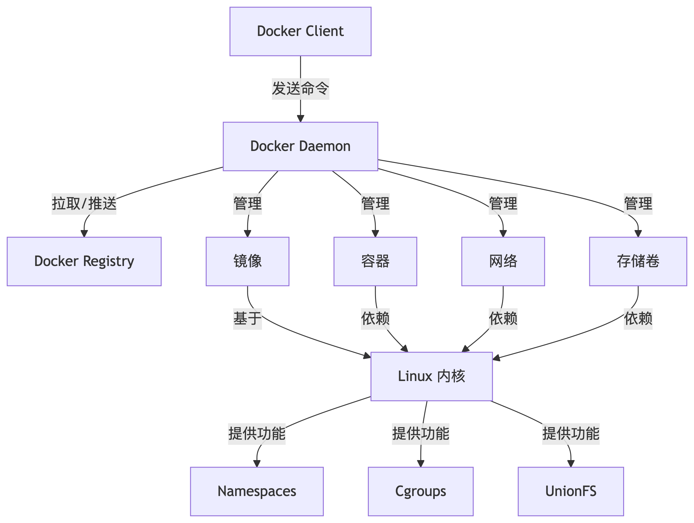

### 1、什么是 Docker

Docker 是一个开源平台，用于自动化应用程序的部署、扩展和管理。它通过容器技术将应用及其依赖打包成独立的、可移植的单元，确保在任何环境中都能一致运行。


### 2、Docker 架构

Docker 的架构采用**客户端-服务器（C/S）模型**，核心组件协同工作以实现容器化环境的创建、管理和运行。以下是 Docker 架构的主要组成部分及其工作原理：

 

Docker 的架构主要由以下几个核心组件组成：

1. **Docker Engine**：是 Docker 的核心，包括两个主要部分：
    - **Docker Daemon (docker daemon)**：运行在后台，管理容器生命周期（创建、启动、停止等），以及与 Docker 容器、镜像、网络和数据卷进行交互。
    - **Docker CLI (Command Line Interface)**：用户通过命令行与 Docker Daemon 交互，执行各种 Docker 操作（如构建、运行、停止容器等）。
2. **Docker Images**：包含应用程序及其依赖的只读模板，用户可以基于这些镜像创建容器。镜像是 Docker 的基础，类似于虚拟机的镜像。
3. **Docker Containers**：是由 Docker 镜像创建的运行时实例，容器是轻量级、可移植的、隔离的环境，运行应用程序及其所有依赖。
4. **Docker Registry**：一个用于存储和分发 Docker 镜像的集中式仓库。默认的公共仓库是 Docker Hub，用户也可以搭建私有仓库。
5. **Docker Network**：用于容器之间的网络通信，提供容器内外的网络连接。容器可以通过不同的网络模式（如桥接、宿主机等）与其他容器或外部网络进行交互。
6. **Docker Volumes**：提供持久化数据存储的机制，可以在容器间共享数据或持久保存数据，即使容器停止或删除。


### 3、Docker 的常用命令

以下是分门别类的 Docker 常用命令总结，包含镜像、容器相关操作。


#### 3.1 镜像相关

Docker 镜像相关的命令用于管理镜像的生命周期，包括拉取、构建、查看、删除和上传镜像等操作。


##### 3.1.1 检索：docker search

用于在 Docker Hub 上查找镜像，并显示相关的镜像列表及其信息。

**语法：**

```bash
docker search [OPTIONS] TERM
```

**参数**：

```bash
# 限制搜索结果数量（默认 25）。
--limit

# 筛选官方镜像。
--filter "is-official=true"
```

**案例**：

```bash
# 在 Docker Hub 上查找 nginx 镜像
docker search nginx

# 仅显示前 5 个 Nginx 镜像
docker search --limit 5 nginx

# 搜索官方 Nginx 镜像
docker search --filter "is-official=true" nginx
```


##### 3.1.2 下载：docker pull

用于从 Docker 仓库下载指定的镜像到本地系统。

**语法：**

```bash
docker pull [OPTIONS] NAME[:TAG]
```

**参数**：

```bash
# （--quiet 的缩写）：静默模式，仅输出镜像 ID。
-q

# （--all-tags 的缩写）：拉取镜像的所有版本。
-a
```

**案例**：

```bash
# 从 Docker 仓库下载 nginx 的镜像到本地系统。
docker pull nginx

# 静默拉取 Nginx 镜像（仅显示 ID）
docker pull -q nginx

# 拉取 Alpine 镜像的所有版本
docker pull -a alpine

# 使用指定镜像源下载镜像：docker pull 镜像源/镜像名
docker pull docker.xuanyuan.me/redis
```


##### 3.1.3 列表：docker images

用于列出本地所有可用的 Docker 镜像及其相关信息。

**语法：**

```bash
docker images [OPTIONS] [REPOSITORY[:TAG]]
```

**参数**：

```bash
# （--all 的缩写）：显示所有镜像（包括中间层）。
-a

# （--quiet 的缩写）：仅显示镜像 ID。
-q

# （--filter 的缩写）：筛选镜像。
-f
```

**案例**：

```bash
# 用于列出本地所有可用的 Docker 镜像及其相关信息。
docker images

# 显示所有镜像（含中间层）
docker images -a

# 列出所有镜像的 ID
docker images -q

# 列出虚悬镜像
docker images -f "dangling=true"
```


##### 3.1.4 删除：docker rmi

用于删除指定的 Docker 镜像。

**语法：**

```bash
docker rmi [OPTIONS] IMAGE [IMAGE...]
```

**参数**：

```bash
# （--force 的缩写）：强制删除正在使用的镜像。
-f
```

**案例**：

```bash
# 删除指定的 nginx 镜像。
docker rmi nginx

# 强制删除正在使用的 nginx 镜像
docker rmi -f nginx
```


#### 3.2 容器相关

Docker 容器相关的命令用于管理容器的生命周期，包括创建、启动、停止、执行命令、查看状态以及删除容器等操作。


##### 3.2.1 运行：docker run

用于创建并启动一个新的容器实例，基于指定的镜像运行应用程序。

**语法：**

```bash
docker run [OPTIONS] IMAGE [COMMAND] [ARG...]
```

**参数**：

```bash
# （--detach 的缩写）：后台运行容器。
-d

# （--publish 的缩写）：端口映射。
-p

# （--volume 的缩写）：挂载数据卷。可以使用【docker volume】命令查看或者操作【卷映射】。
-v

#（--env 的缩写）：设置环境变量。
-e

# 指定容器名称。
--name

# 让容器加入指定的网络。加入了相同的自定义网络的容器，这些容器之间可以通过域名（容器名:端口）进行通信。
--network
```

**案例**：

```bash
# 创建并启动一个新的 nginx 容器实例
docker run nginx

# 后台运行 Nginx 容器
docker run -d nginx

# 将主机 8080 端口映射到容器 80 端口
docker run -p 8080:80 nginx

# 启动一个 nginx 容器，并将主机上的 /app/date/nghtml目录挂载到容器内部的 /usr/share/nginx/html 目录
docker run -v /app/data/nghtml:/usr/share/nginx/html nginx

# 启动一个 nginx 容器，并将之前创建的卷 ngconfig 挂载到容器内的 /etc/nginx 目录。
docker run -v ngconfig:/etc/nginx nginx

# 设置容器环境变量 ENV=prod
docker run -e "ENV=prod" nginx

# 启动名为 my_nginx 的容器
docker run --name my_nginx nginx

# 启动名为 my_nginx 的容器，并让其加入 mynet 网络
docker run --name my_nginx --network mynetwork nginx
```

**实践：**

```bash
# 最佳实践，启动一个容器，主要关注三个方面：

docker run -d -p 3306:3306 -v /app/myconf:/etc/mysql/conf.d -v /app/mydate:/var/lib/mysql -e MYSQL_ROOT_PASSWORD=123456 --name mysql mysql:lastest

	1、网络：-p & --network
		-- 是否要对外暴露端口（端口映射）。
		-- 容器之间是否要进行通信（要通信的容器需要加入相同的自定义网络）。
		
  2、存储：-v
  	-- 是否需要对【配置目录】进行【卷映射】。
  	-- 是否需要对【数据目录】进行【目录挂载】。
  	
  3、环境变量：-e
  	-- 启动容器时是否需要增加环境变量。
```


##### 3.2.2 查看：docker ps

用于列出当前正在运行的 Docker 容器及其相关信息。

**语法：**

```bash
docker ps [OPTIONS]
```

**参数**：

```bash
# （--all 的缩写）：显示所有容器（包括已停止的）。
-a

# （--quiet 的缩写）：仅显示容器 ID。
-q

# （--filter 的缩写）：按条件过滤。
-f
```

**案例**：

```bash
# 列出当前正在运行的 Docker 容器及其相关信息。
docker ps

# 列出所有运行中容器的 ID
docker ps -q

# 仅显示运行中的容器
docker ps -f "status=running"
```


##### 3.2.3 起停：start/stop/restart

分别用于启动、停止和重启 Docker 容器。

**语法：**

```bash
docker stop [OPTIONS] CONTAINER [CONTAINER...]
docker start [OPTIONS] CONTAINER [CONTAINER...]
docker restart [OPTIONS] CONTAINER [CONTAINER...]
```

**参数**：

```bash
#（--time 的缩写）：设置停止超时时间。
-t
```

**案例**：

```bash
# 停止正在运行的 my_nginx 容器
docker stop my_nginx

# 5 秒内强制停止容器
docker stop -t 5 my_nginx
```


##### 3.2.4 删除：docker rm

用于删除一个或多个已停止的 Docker 容器。

**语法：**

```bash
docker rm [OPTIONS] CONTAINER [CONTAINER...]
```

**参数**：

```bash
# （--force 的缩写）：强制删除运行中的容器。
-f

# （--volumes 的缩写）：同时删除关联的卷。
-v
```

**案例**：

```bash
# 删除 my_nginx 容器（已停止）
docker rm -f my_nginx

# 强制删除正在运行的容器
docker rm -f my_nginx

# 删除容器及其关联的卷（只会删除容器挂载的卷，不会删除其他挂载的目录，除非这些目录是在容器内定义为卷的。挂载目录要手动删除
docker rm -v my_nginx
```


##### 3.2.5 日志：docker logs

用于查看运行中的容器输出的日志信息。

**语法：**

```bash
ocker logs [OPTIONS] CONTAINER
```

**参数**：

```bash
# （--follow 的缩写）：实时跟踪日志。
-f

# 显示最后 N 行日志。
--tail
```

**案例**：

```bash
# 查看 my_nginx 的日志
docker logs my_nginx

# 实时查看容器日志
docker logs -f my_nginx

# 查看最后 50 行日志
docker logs --tail 50 my_nginx
```


##### 3.2.6 资源：docker stats

用于实时显示 Docker 容器的资源使用情况，如 CPU、内存、网络和磁盘 I/O 等指标。

**语法：**

```bash
docker stats [OPTIONS] [CONTAINER...]
```

**参数**：

```bash
#（--all 的缩写）：显示所有容器（默认仅显示运行中的容器）。
-a
```

**案例**：

```bash
# 实时显示 Docker 容器的资源使用情况
docker stats

# 实时显示 my_nginx 的资源使用情况
docker stats my_nginx

# 监控所有容器的资源使用（包括已停止的）
docker stats -a
```


##### 3.2.7 进入：docker exec

用于在运行中的容器内执行指定的命令或启动一个交互式终端。

**语法：**

```bash
docker exec [OPTIONS] CONTAINER COMMAND [ARG...]
```

**参数**：

```bash
# （-i 是 --interactive 的缩写，-t 是 --tty 的缩写）：进入交互式终端。
-it

# （--env 的缩写）：设置临时环境变量。
-e
```

**案例**：

```bash
# 在运行中的 my_nginx 容器内启动一个交互式的 Bash shell，允许用户进入容器并进行命令行操作。
docker exec -it my_nginx /bin/bash

# 在运行中的 my_nginx 容器内执行 env 命令，并设置一个环境变量 DEBUG=true，用于显示容器内的环境变量信息，包括新设置的 DEBUG 变量。
docker exec -e "DEBUG=true" my_nginx env /bin/bash
```


##### 3.2.7 详情：docker inspect

用于查看一个或多个 Docker 容器的详细信息，包括配置、状态、网络设置等，支持通过 `--format` 选项提取特定信息。

**语法：**

```bash
docker container inspect [OPTIONS] CONTAINER_NAME [CONTAINER_NAME...]
```

**参数**：

```bash
# （--format 的缩写）：按 Go 模板语法提取特定字段。
-f

# （--size 的缩写）：显示容器占用的总文件系统大小。
-s
```

**案例**：

```bash
# 查看容器的 IP 地址
docker container inspect -f '{{ .NetworkSettings.IPAddress }}' my_container

# 查看所有运行中容器的 IP 地址
docker container inspect -f '{{ .Name }} IP: {{ .NetworkSettings.IPAddress }}' $(docker ps -q)

# 查看容器的启动命令
docker container inspect -f '{{ .Config.Cmd }}' my_container

# 查看容器挂载的卷信息（主机路径 -> 容器路径）
docker container inspect -f '{{ range .Mounts }}{{ .Source }} -> {{ .Destination }}{{ "\n" }}{{ end }}' my_container

# 查看容器状态（运行中/已退出）
docker container inspect -f '{{ .State.Status }}' my_container

# 检查多个容器的状态
docker container inspect -f '{{ .Name }} 状态: {{ .State.Status }}' container1 container2
```


##### 3.2.7 映射：docker volume

用于管理 Docker 容器的数据卷，提供持久化存储，使数据在容器重启或删除后仍能保留。

**语法：**

```bash
docker volume COMMAND
```

**参数**：

```bash
# 创建 Volume
create

# 查看所有 Volume
ls

# 查看指定 Volume 详细信息（如存储路径）
inspect

# 删除 Volume
rm
```

**案例**：

```bash
# 创建 Volume
docker volume create my_volume

# 查看所有 Volume
docker volume ls

# 查看 Volume 详细信息（如存储路径）
docker volume inspect my_volume

# 删除 Volume
docker volume rm my_volume
```


#### 3.3 分享相关

Docker 分享相关的命令用于创建、保存、加载、标记、登录和推送镜像，以便在不同环境间共享和分发 Docker 镜像。


##### 3.3.1 提交：docker commit

用于将容器的当前状态保存为一个新的镜像。

**语法：**

```bash
docker commit [OPTIONS] CONTAINER [REPOSITORY[:TAG]]
```

**参数**：

```bash
# （--message 的缩写）：添加提交信息（类似 Git commit）。
-m

# （--author 的缩写）：指定镜像作者。
-a
```

**案例**：

```bash
# 将 my_container 的当前状态保存为一个名为 my_image 的新镜像，并指定容器的版本为 lastest.
docker commit -m "安装 Apache 服务" my_container my_image:lastest

# 使用 -m 参数添加提交信息
docker commit -m "安装 Apache 服务" my_container my_image:v1

# 使用 -a 参数标注作者
docker commit -a "Dev Team <dev@example.com>" my_container my_image:v1
```


##### 3.3.2 保存：docker save

用于将 Docker 镜像保存为一个 tar 文件，以便于镜像的备份或迁移。

**语法：**

```bash
docker save [OPTIONS] IMAGE [IMAGE...]
```

**参数**：

```bash
# （--output 的缩写）：指定输出文件路径。
-o
```

**案例**：

```bash
# 使用 -o 参数导出镜像（必须指定文件名：cowardly refusing to save to a terminal. Use the -o flag or redirect
docker save -o nginx.tar nginx:latest
```


##### 3.3.3 加载：docker load

用于从 tar 文件中加载 Docker 镜像。

**语法：**

```bash
docker load [OPTIONS]
```

**参数**：

```bash
# （--input 的缩写）：指定输入文件路径。
-i
```

**案例**：

```bash
# 使用 -i 参数加载镜像
docker load -i nginx.tar
```


##### 3.3.4 登陆：docker login

用于登录到 Docker 仓库（如 Docker Hub），以便进行镜像的推送或拉取操作。

**语法：**

```bash
docker login [OPTIONS] [SERVER]
```

**参数**：

```bash
# （--username 的缩写）：指定用户名。
-u

# （--password 的缩写）：指定密码（明文不安全）。
-p
```

**案例**：

```bash
# 登录到 Docker 仓库（如 Docker Hub）
docker login registry.example.com

# 使用 -u 参数指定用户名（推荐交互式输入密码）
docker login -u myuser registry.example.com

# 使用 -u 和 -p 明文登录（不推荐）
docker login -u myuser -p mypassword registry.example.com
```


##### 3.3.5 命名：docker tag

用于为 Docker 镜像创建一个新的标签，以便于更方便地标识和管理镜像版本。

**语法：**

```bash
docker tag SOURCE_IMAGE[:TAG] TARGET_IMAGE[:TAG]
```

**参数**：

```bash
没有常用参数
```

**案例**：

```bash
# 为镜像添加仓库路径标签
docker tag my_image:v1 registry.example.com/my_project/my_image:v1
```


##### 3.3.6 推送：docker push

用于将本地 Docker 镜像上传到远程 Docker 仓库。

**语法：**

```bash
docker push [OPTIONS] NAME[:TAG]
```

**参数**：

```bash
没有常用参数
```

**案例**：

```bash
# 推送镜像到仓库（需先通过 docker tag 重命名）
docker push registry.example.com/my_project/my_image:v1
```


#####  3.3.7 示例

将一个容器打包为镜像，然后推送到仓库的完整流程如下：

```bash
# 1. 提交容器为镜像（同时使用 -m 和 -a）
docker commit -m "初始化配置" -a "Admin <admin@example.com>" my_container my_image:v1

# 2. 添加仓库标签
docker tag my_image:v1 registry.example.com/my_project/my_image:v1

# 3. 登录仓库
docker login -u myuser registry.example.com

# 4. 推送镜像
docker push registry.example.com/my_project/my_image:v1
```


### 4、目录挂载与卷映射

在 Docker 中，目录挂载和卷映射都用于持久化容器数据。它们的作用是将容器内的数据与主机系统或外部存储进行绑定，从而确保数据即使在容器删除后也不会丢失。


容器的核心目录一般有两个：【配置目录】与【数据目录】。【挂载】 & 【映射】 就是应用于这两个目录。


#### 1. 目录挂载 (Bind Mount)

目录挂载是将宿主机的某个目录挂载到容器中，使得容器内的数据和宿主机的数据相互共享，直接反映在宿主机文件系统中。

**应用场景**：

```bash
需要将容器中的数据和宿主机的数据同步，比如日志文件、配置文件等。
```

**命令示例**：

```bash
# 将宿主机的指定目录挂载到指定容器的指定目录
docker run -v /宿主机目录:/容器内目录 <镜像名>
```

**应用示例：**

```bash
# 启动一个 Nginx 容器，并将主机上的 /app/date/nghtml目录挂载到容器内部的 /usr/share/nginx/html 目录	
docker run -v /app/data/nghtml:/usr/share/nginx/html nginx
```


#### 2. 卷映射 (Volume Mapping)

卷映射是将一个 Docker 卷挂载到容器中。Docker 卷是由 Docker 管理的，不直接与宿主机的文件系统挂钩。适用于需要持久化数据且与宿主机隔离的场景。

使用 `docker volume` 命令进行卷的增删改查等操作

**应用场景**：

```bash
1、数据需要持久化存储，并且不依赖宿主机。
2、需要在多个容器间共享数据。
```

**命令示例**：

```bash
# 创建 Docker 卷
docker volume create <卷名>
# 将指定的 Docker 卷映射到执行容器的指定目录
docker run -v <卷名>:/容器内目录 <镜像名>
```

**应用示例：**

```bash
# 创建一个名为 ngconfig 的 Docker 卷（volume）。
docker volume create ngconfig

# 启动一个 nginx 容器，并将之前创建的卷 ngconfig 挂载到容器内的 /etc/nginx 目录。
# 容器内的 /etc/nginx 目录会从卷 ngconfig 中获取数据，这样做的目的是将 Nginx 的配置文件持久化到卷中。
docker run -v ngconfig:/etc/nginx nginx
```


### 5、自定义网络

Docker 默认的网络 `docker0` 是一个桥接网络，它会在 Docker 守护进程启动时自动创建。所有未指定网络的容器都会连接到 `docker0` 网络。这个网络允许容器之间通信，同时与主机通信，但每个容器都在独立的 IP 地址空间内。

与之不同的是，自定义网络允许用户定义自己的网络配置，以便更灵活地控制容器之间的通信。加入了相同的自定义网络的容器，这些容器之间可以通过域名（容器名:端口）进行通信。


docker network 是 与 docker 网络相关的命令

```bash
# 列出所有网络
docker network ls

# 创建自定义网络
docker network create <名称>

# 查看网络详细信息
docker network inspect <名称>

# 将已有容器连接到指定网络
docker network connect <网络> <容器>

# 断开容器与网络的连接
docker network disconnect <网络> <容器>
```


以下是一个自定义网络的使用案例

```bash
# 创建自定义网络 mynet
docker network create mynet

# 启动名为 my_nginx 的容器，并让其加入 mynet 网络
docker run --name my_nginx --network mynetwork nginx
```


### 6、Docker Compose

Docker Compose 是 Docker 官方提供的工具，用于通过一个 YAML 文件定义和运行多容器应用。它简化了多容器编排的流程，允许用户通过单一命令管理整个应用的生命周期。

**语法：**

```bash
docker compose [OPTIONS] COMMAND
```

**参数**：

```bash
# （--file 的缩写）：指定 compose.yaml 文件
-f

# 案例
docker compose -f my_compose.yaml up -d

# docker compose 是主命令。
# up 是子命令，用来执行具体的操作（启动服务）。
# -f 是一个参数，用来指定 Docker Compose 文件（默认情况下是 docker-compose.yml），通过这个参数，你可以指定一个不同的文件，比如 my_compose.yaml。
```

**命令**

| 参数 | 用途                 | 案例                                   |
| ---- | -------------------- | -------------------------------------- |
| up   | 启动所有服务         | `docker compose up -d`（后台启动）     |
| down | 停止并删除容器、网络 | `docker compose down -v`（同时删除卷） |

**案例：**

```bash
# 下面是一个用于启动 WordPress 并依赖 MySQL 的 docker-compose.yml 文件示例：

version: '3.7'

services:
  wordpress:
    image: wordpress:latest
    container_name: wordpress
    ports:
      - "8080:80"
    environment:
      WORDPRESS_DB_HOST: mysql:3306
      WORDPRESS_DB_NAME: wordpress
      WORDPRESS_DB_USER: exampleuser
      WORDPRESS_DB_PASSWORD: examplepass
    depends_on:
      - mysql
    networks:
      - wordpress_network

  mysql:
    image: mysql:5.7
    container_name: mysql
    environment:
      MYSQL_ROOT_PASSWORD: rootpassword
      MYSQL_DATABASE: wordpress
      MYSQL_USER: exampleuser
      MYSQL_PASSWORD: examplepass
    volumes:
      - mysql_data:/var/lib/mysql
    networks:
      - wordpress_network

networks:
  wordpress_network:
  	# 默认驱动类型就是 local（即：可以不写
    driver: bridge

volumes:
  mysql_data:
  	# 默认驱动类型就是 local（即：可以不写
    driver: local
```


### 7、Dockerfile


Dockerfile 是一个文本文件，包含了一系列的命令和参数，用来自动化构建 Docker 镜像的过程。它定义了从基础镜像开始，到安装依赖、设置环境变量、复制文件、暴露端口等一系列的步骤。通过 Dockerfile，可以方便地构建和管理应用的容器化环境。


#### 7.1 常用参数


**FROM**：用来指定基础镜像。

```Dockerfile
FROM ubuntu:20.04
```


**RUN**：用来在镜像构建过程中执行命令。常用来安装软件包。

```Dockerfile
RUN apt-get update && apt-get install -y python3
```


**COPY**：用来将文件从主机复制到容器内。

```Dockerfile
COPY ./app /usr/src/app
```


**ADD**：类似于 COPY，但支持解压压缩文件和从 URL 下载文件。

```Dockerfile
ADD https://example.com/app.tar.gz /usr/src/app
```


**WORKDIR**：设置当前工作目录。

```Dockerfile
WORKDIR /usr/src/app
```


**CMD**：设置容器启动时默认执行的命令。

```Dockerfile
CMD ["python3", "app.py"]
```


**ENTRYPOINT**：设置容器启动时默认的命令，可以与 CMD 配合使用。

```Dockerfile
ENTRYPOINT ["python3"]
CMD ["app.py"]
```


**EXPOSE**：声明容器需要监听的端口。

```Dockerfile
EXPOSE 8080
```


**ENV**：设置环境变量。

```Dockerfile
ENV APP_ENV=production
```


**VOLUME**：创建一个挂载点，用于共享数据。

```Dockerfile
VOLUME /data
```


#### 7.2 使用案例

在 Spring Boot 项目的根目录下，创建一个 `Dockerfile` 来构建 Spring Boot 应用的 Docker 镜像：

```dockerfile
# 使用官方的 OpenJDK 镜像作为基础镜像
FROM openjdk:17-jdk-slim

# 设置工作目录
WORKDIR /app

# 将本地的 JAR 文件复制到容器内
COPY target/your-springboot-app.jar /app/app.jar

# 暴露应用程序使用的端口 (通常 Spring Boot 默认为 8080)
EXPOSE 8080

# 运行 Spring Boot 应用
ENTRYPOINT ["java", "-jar", "app.jar"]
```

