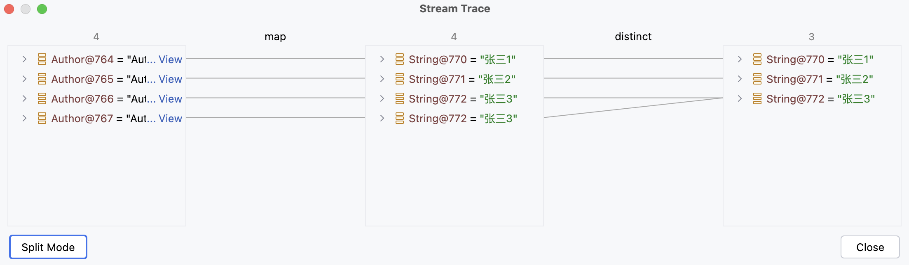
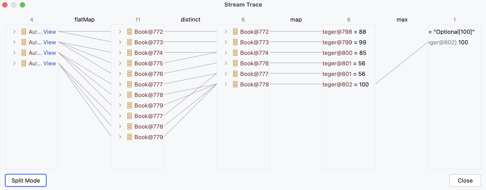
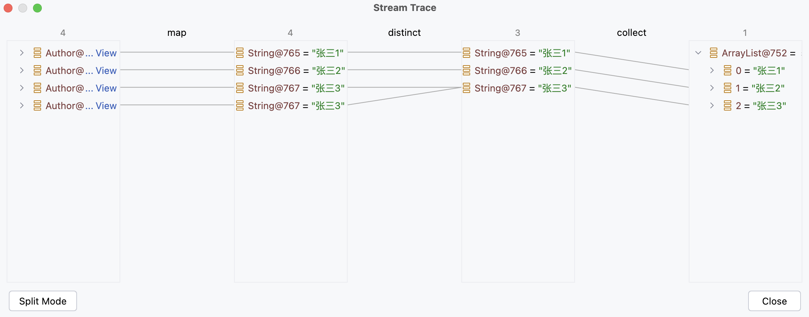
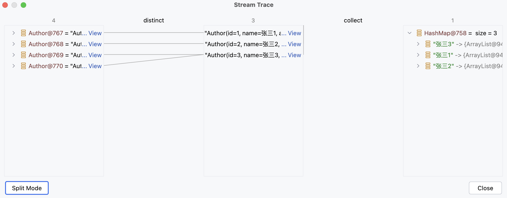
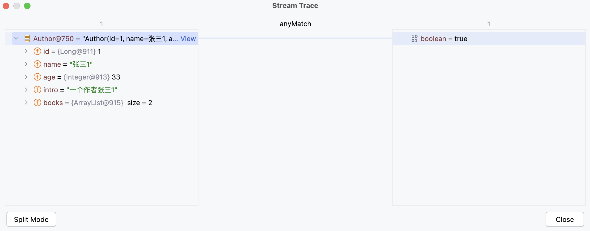
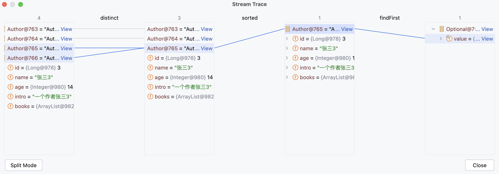
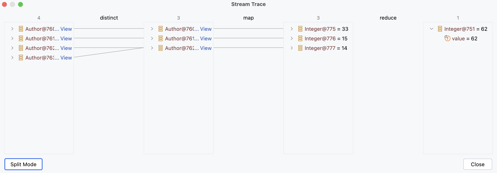

# 一、Lambda

Lambda 表达式是 Java 的


# 二、Stream

Java 8 中的 Stream 是对集合（Collection）对象功能的增强，它专注于对集合对象进行各种便利、高效的聚合操作（aggregate operation），或者大批量数据操作（bulk data operation）。Stream API 借助于 Lambda 表达式，极大的提高编程效率和程序可读性。同时它提供串行和并行两种模式进行汇聚操作，并发模式能够充分利用多核处理器的优势，使用 fork/join 并行方式来拆分任务和加速处理过程。通常编写并行代码很难而且容易出错, 但使用 Stream API 无需编写一行多线程的代码，就可以很方便地写出高性能的并发程序。


对于 Stream 流的使用，一共就三个步骤

1. 创建操作
2. 中间操作
3. 终结操作


这是一个 stream 流的使用案例

```java
List<Integer> numberList = List.of(3, 4, 5, 5);

// 创建流
numberList.stream()
    // 中间操作
    .distinct()
    // 终结操作
    .forEach(System.out::println);
```


另外，对于 Stream 流来说，以下特点需要注意

1. 流不是数据结构，不会保存数据；
2. 任何<u>中间操作</u>和<u>终结操作</u>都不会修改数据源，每个操作都会返回一个新的 Stream 对象；
3. 惰性求值，流在执行<u>中间操作</u>时，只是对操作进行了记录，并不会立即执行，需要等到执行<u>终结操作</u>的时候才会进行实际的计算。


## 1）创建操作

根据数据源类型的不同，创建流的方式有以下三种方式

- 数组
    - 通过 Arrays 的 stream()
- 单列集合
    - 通过 Collection 的 stream()
- 双列集合
    - 先将 Map 转为 Collection，然后再调用 Collection 的 stream()


### 1.1）数组

Java 8 在 Arrays 类中新增了 stream() 方法

```java
public static <T> Stream<T> stream(T[] array)
```


所以，可以通过 Arrays 的 stream() 可以创建一个 stream 对象，案例如下

```java
// 数组
Integer[] numberArray = {2, 3, 4, 4};

// 创建流
Arrays.stream(numberArray)
    // 中间操作
    .distinct()
    // 终结操作
    .forEach(System.out::println);
```


### 1.2）单列集合

Java 8 在 Collection 类中新增了 stream() 方法

```java
default Stream<E> stream()
```


所以，可以通过 Collection 的 stream() 可以创建一个 stream 对象，案例如下

```java
// 单列集合
List<Integer> numberList = List.of(3, 4, 5, 5);

// 创建流
numberList.stream()
    // 中间操作
    .distinct()
    // 终结操作
    .forEach(System.out::println);
```


需要注意的是，由于 List 和 Set 都是 Collction 的子接口，所以 List 和 Set 接口都包含 stream()


### 1.3）双列集合

对于双列集合 Map 来说，需要先将 Map 转 Collection，再调用 Collection 中的 stream()。


Map 中提供了将 Map 转为 Collection 的方法

```java
Set<Map.Entry<K, V>> entrySet();
```


所以，可以通过 Map 创建一个 stream 对象，案例如下

```java
// 双列集合
Map<String, Integer> map = new HashMap<>();
map.put("一", 1);
map.put("二", 2);
map.put("二", 2);

// 将 Map 转为 Collection 的子接口
Set<Map.Entry<String, Integer>> entries = map.entrySet();

// 创建流
entries.stream()
    // 中间操作
    .distinct()
    // 终结操作
    .forEach(System.out::println);
```


## 2）中间操作

一个流可以后面跟随零个或多个 intermediate 操作。其目的主要是打开流，做出某种程度的数据映射/过滤，然后返回一个新的流，交给下一个操作使用。这类操作都是惰性化的（lazy），就是说，仅仅调用到这类方法，并没有真正开始流的遍历。


常见的操作如下：

- distinct
- filter
- map & flatMap
- Sorted
- limit & skip


### 2.1）distinct

过滤重复的元素，依赖于 Object 的 equals()


案例如下（去除重复的作家，并打印作家的姓名

```java
List<Author> authors = getAuthors();

authors.stream()
    // 中间操作：对流中的元素进行去重
    .distinct()
    // 终结操作：遍历流中的各个元素
    .forEach(author -> System.out.println(author.getName()));
```


执行 distinct() 的效果如下


### 2.2）filter

根据指定的条件进行过滤元素，只保留满足条件的元素


案例如下（过滤重复的作家 & 过滤年龄小于18的作家，并打印作家的姓名

```java
List<Author> authors = getAuthors();

authors.stream()
    .distinct()
    // 中间操作：对流中的元素进行去重
    .filter(author -> author.getAge() < 18)
    // 终结操作：遍历流中的各个元素
    .forEach(author -> System.out.println(author.getName()));
```


执行 filter() 的效果如下


### 2.3）map

对流中的每个元素应用指定的函数，并将结果映射为一个新的元素


案例如下（打印所有作家的姓名

```java
List<Author> authors = getAuthors();

authors.stream()
    // 对流中的各个元素，挨个进行计算或者转换，得到一个新的元素
    .map(author -> author.getName())
    .forEach(System.out::println);
```


执行 map() 的效果如下


### 2.4）sorted

对流中的元素进行排序，依赖于比较器：Comparator 接口


案例如下（对作家进行去重，并对作家的年龄进行升序排序，然后打印作家的姓名和年龄

```java
List<Author> authors = getAuthors();

authors.stream()
    .distinct()
    .sorted(new Comparator<Author>() {
        @Override
            public int compare(Author o1, Author o2) {
            		return o1.getAge() - o2.getAge();
            }
        })
    .forEach(author -> System.out.println("姓名：" + author.getName() + ", 年龄：" + author.getAge()));
```


执行 sorted() 的效果如下


### 2.5）limit

用于截断流，保留指定数量的元素，超出的部分直接抛弃


案例如下（将作家按年龄降序排序，并且不能有重复元素，然后打印年龄最大的两个作家的姓名

```java
List<Author> authors = getAuthors();

authors.stream()
    .distinct()
    .sorted(new Comparator<Author>() {
        @Override
        public int compare(Author o1, Author o2) {
            return o2.getAge() - o1.getAge();
        }
    })
    .limit(2)
    .map(author -> author.getName())
    .forEach(System.out::println);
```


执行 limit() 的效果如下


### 2.6）skip

跳过流中指定数量的元素


案例如下（打印除了年龄最大的作家，并且不能有重复的作家，按照年龄降序排序

```java
List<Author> authors = getAuthors();

authors.stream()
    .distinct()
    .sorted(new Comparator<Author>() {
    		@Override
        public int compare(Author o1, Author o2) {
            return o2.getAge() - o1.getAge();
        }
    })
    .skip(1)
    .forEach(System.out::println);
```


执行 skip() 的效果如下


### 2.7）flatMap

将流中的每个元素都转换为一个流，然后将这些流连接起来成为一个新的流（类似于 union）


案例如下

- 打印所有书籍的名字，并且对重复的元素去重
- 打印所有书籍的分类，并且要求对分类去重，且需要拆分逗号：哲学,爱情 -> [哲学,爱情]

```java
List<Author> authors = getAuthors();

// 需求1：打印所有书籍的名字，并且对重复的元素去重
authors.stream()
    .flatMap(new Function<Author, Stream<?>>() {
        @Override
        public Stream<?> apply(Author author) {
            return author.getBooks().stream();
        }
    })
    .distinct()
    .forEach(System.out::println);

// 需求2：打印所有书籍的分类，并且要求对分类去重，且需要拆分逗号：哲学,爱情 -> [哲学,爱情]
authors.stream()
    .flatMap(author -> author.getBooks().stream())
    .distinct()
    .flatMap(book -> Arrays.stream(book.getCategory().split(",")))
    .distinct()
    .forEach(System.out::println);
```


需求1执行 flatMap() 后，效果如下图


需求2执行 flatMap() 后，效果如下图


## 3）终结操作

一个流只能有一个 terminal 操作，当这个操作执行后，流就被使用「光」了，无法再被操作。所以这必定是流的最后一个操作。Terminal 操作的执行，才会真正开始流的遍历，并且会生成一个结果。


常见终结操作操作如下

- forEach
- collect
- max & min
- count
- anyMatch & allMatch & noneMatch
- findFirst & findAny
-  iterator


### 3.1）forEach

接收一个 Lambda 表达式，然后在 Stream 的每一个元素上执行该表达式（即：遍历


案例如下（打印所有作家的名字，并且去重

```java
List<Author> authors = getAuthors();

authors.stream()
    .map(author -> author.getName())
    .distinct()
    .forEach(authorName -> System.out.println(authorName));
```


执行 forEach() 的效果如下




### 3.2）count

返回流中元素的个数


案例如下（打印所有作家的名字，并且去重

```java
List<Author> authors = getAuthors();

long count = authors.stream()
		.map(author -> author.getBooks())
    .flatMap(books -> books.stream())
    .distinct()
    .count();
```


执行 count() 的效果如下


### 3.3）max

max()：返回流中的最大值；

min()：返回流中的最小值


案例如下（分别获取这些作家的所出书籍的最高评分和最低评分，并打印

```java
List<Author> authors = getAuthors();

Optional<Integer> max = authors.stream()
    .flatMap(author -> author.getBooks().stream())
    .distinct()
    .map(book -> book.getScore())
    .max(((o1, o2) -> o1 - o2));

Optional<Integer> min = authors.stream()
    .flatMap(author -> author.getBooks().stream())
    .distinct()
    .map(book -> book.getScore())
    .min(((o1, o2) -> o1 - o2));

System.out.println("min = " + min.orElse(0));
System.out.println("max = " + max.orElse(0));
```


执行 max() 的效果如下




### 3.4）collect

将流中的元素收集到一个集合中，例如：List、Set 或 Map


案例如下

- 获取一个所有作者名字的 List 集合

*      获取一个 Map 集合，Map 的 key 为作家名，value 为 List<Book>

```java
// 需求1：获取一个所有作者名字的 List 集合
List<String> authorNames = getAuthors().stream()
    .map(author -> author.getName())
    .distinct()
    .collect(Collectors.toList());

authorNames.stream().forEach(System.out::println);

// 需求2: 获取一个 Map 集合，Map 的 key 为作家名，value 为 List<Book>
Map<String, List<Book>> authorMap = getAuthors().stream()
    .distinct()
    .collect(Collectors.toMap(Author::getName, Author::getBooks));

authorMap.entrySet().stream().forEach(System.out::println);
```


执行后 toList() 后，效果如下图




执行后 toMap() 后，效果如下图




### 3.5）anyMatch

anyMatch(): 流中是否存在满足指定条件的元素

allMatch(): 流中的元素是否全部满足指定条件

noneMatch(): 流中的元素是否全部都不满足指定条件


案例如下（判断是否有年龄在 29 以上的作家

```java
boolean anyMatch = getAuthors().stream().anyMatch(author -> author.getAge() > 29);
```


执行后 toList() 后，效果如下图




### 3.6）findFirst

findFirst(): 获取流中的第一个元素

findAny(): 随机获取流中的一个元素


案例如下（获取一个年龄最小的作家，并打印他的姓名

```java
Optional<Author> first = getAuthors().stream()
    .distinct()
    .sorted(new Comparator<Author>() {
        @Override
        public int compare(Author o1, Author o2) {
            return o1.getAge() - o2.getAge();
        }
    })
    .findFirst();

first.ifPresent(author -> System.out.println(author.getName()));
```


执行 findFirst() 的效果如下




### 3.7）reduce

对流中的元素进行归约操作，可以用于求和、求最大值、最小值等


案例如下（获取一个年龄最小的作家，并打印他的姓名

```java
Integer sum = getAuthors().stream()
    .distinct()
    .map(author -> author.getAge())
    .reduce(0, new BinaryOperator<Integer>() {
        @Override
        public Integer apply(Integer result, Integer element) {
            return result + element;
        }
    });

System.out.println(sum);
```


执行 reduce() 的效果如下




# 三、Optional

在 Java 中，由于 null 值的存在，导致在访问对象的方法或属性时，都有可能会导致 `NullPointerException`。比如这段代码

```java
String isocode = user.getAddress().getCountry().getIsocode().toUpperCase();
```

如果我们需要确保不触发 `NPE`，就得在访问每一个值之前对其进行明确地检查

```java
if (user != null) {
    Address address = user.getAddress();
    if (address != null) {
        Country country = address.getCountry();
        if (country != null) {
            String isocode = country.getIsocode();
            if (isocode != null) {
                isocode = isocode.toUpperCase();
            }
        }
    }
}
```

为了解决由于 null 导致的过多检查，Java 8 引入 Optional 类。本质上，这是一个包含有可选值的包装类，这意味着 Optional 类既可以含有对象也可以为空。


对于上述案例，使用 Optional 简化

```java
Optional.of(user)
    .map(User::getAddress)
    .map(Address::getCountry)
    .map(Country::getIsocode)
    .ifPresent(String::toUpperCase);
```


## 1）创建 Optional 对象

创建 Optional 的三种方式有三种

- Optional<T> ofNullable(T value)

- Optional<T> of(T value)

- Optional<T> empty()

      

### 1.1) ofNullable

使用静态方法 `ofNullable()` 创建一个即可空又可非空的 Optional 对象

```java
Optional<String> nullableOptional = Optional.ofNullable(null);
Optional<String> nullableOptional = Optional.ofNullable("Hello");
```

`ofNullable()` 内部对 null 进行了处理（返回 `Optional.empty`），推荐用这个方法

```java
public static <T> Optional<T> ofNullable(T value) {
    return value == null ? (Optional<T>) EMPTY : new Optional<>(value);
}
```


### 1.2) of

使用静态方法 `of()` 创建一个非空的 Optional 对象

```java
Optional<String> nonEmptyOptional = Optional.of("Hello");
```

注意，传递给 `of()` 方法的参数必须是非空的，也就是说不能为 null，否则仍然会抛出 NullPointerException。

```java
// 会抛出 NPE
Optional<String> optnull = Optional.of(null);
```


### 1.3) empty

使用静态方法 `empty()` 创建一个空的 Optional 对象

```java
Optional<String> emptyOptional = Optional.empty(); // Optional.empt
```


## 2）Optional 常用方法

Optional 中的方法很多，这里只记录最最最推荐的方法

- 安全地消费值

    - void ifPresent(Consumer<? super T> action)

        - 如果 Optional 的 value 不为 null，则返回 value 值

        

- 安全地获取值

    - T orElseGet(Supplier<? extends T> supplier)

        - 如果 Optional 的 value 不为 null，则返回 value 值

        - 为 null 则执行传入的供给者函数（返回一个默认值

              

    - T orElseThrow(Supplier<? extends X> exceptionSupplier)

        - 如果 Optional 的 value 不为 null，则返回 value 值

        - 为 null 则执行传入的供给者函数（抛出一个异常

              

- 非空判断

    - boolean isPresent()

        - 判断 Optional 的 value 值是否为 null

              

- 过滤数据

    - Optional<T> filter(Predicate<? super T> predicate)

        - 如果当前 Optional 不符合 filter 的过滤条件，则返回 Optional.empty

        - 其实就相当于一个 if 判断，类似于 `if(user.getAge() > 18)` ，如果符合条件在进行其他操作

              

- 数据转换

    - Optional<U> map(Function<? super T, ? extends U> mapper)
    - Optional<U> flatMap(Function<? super T, ? extends Optional<? extends U>> mapper)


### 2.1) 安全消费

ifPresent()：如果 Optional 的 value 不为 null，则执行传入的消费者函数

```java
// 由于 nullOptional 的 value 值为 null，所以调用 ifPresent() 时不会执行
Optional<String> nullOptional = Optional.ofNullable(null);
nullOptional.ifPresent(System.out::println);

System.out.println("----------");

Optional<String> nonEmptyOptional = Optional.ofNullable("Hello");
nonEmptyOptional.ifPresent(System.out::println);
```


### 2.2) 安全获取

orElseGet() 和 orElseThrow() 的作用是类似的，都是当 Optional 的 value 值为 null 时，做一个默认处理。两者的区别在于：

- orElseGet()：执行 `Supplier` 函数，返回一个默认值

- orElseThrow()：执行 `Supplier` 函数，抛出一个异常

    

#### 1）orElseGet

如果 Optional 的 value 不为 null，则返回 value 值，为 null 则执行传入的供给者函数（翻译一个默认值

```java
// 由于 nullOptional 的 value 值为 null，所以执行传入的供给者函数（返回一个默认值 default1
Optional<String> nullOptional = Optional.ofNullable(null);
System.out.println(nullOptional.orElseGet(() -> "default1"));

Optional<String> nonEmptyOptional = Optional.ofNullable("Hello");
System.out.println(nonEmptyOptional.orElseGet(() -> "default2"));
```


#### 2）orElseThrow

如果 Optional 的 value 不为 null，则返回 value 值，为 null 则执行传入的供给者函数（抛出一个异常

```java
// 由于 nullOptional 的 value 值为 null，所以抛出异常
Optional<String> nullOptional = Optional.ofNullable(null);
Optional<String> nonEmptyOptional = Optional.ofNullable("Hello");

try {
    nullOptional.orElseThrow(() -> new RuntimeException("获取 nullOptional 时出现异常！"));
    nonEmptyOptional.orElseThrow(() -> new RuntimeException("获取 nonEmptyOptional 时出现异常！"));
}catch (Exception e) {
    System.out.println(e.getMessage());
}
```


### 2.4) 过滤数据

filter()：如果当前 Optional 不符合 filter 的过滤条件，则返回 Optional.empty

```java
Optional<Author> authorOptional = getAuthor();
authorOptional
    // 如果当前 Optional 不符合 filter 的过滤条件，则返回 Optional.empty
    .filter(author -> author.getAge() > 18)
    .ifPresent(author -> System.out.println(author.getName()));
```


### 2.5) 非空判断

ifPresent()：判断 Optional 的 value 属性是否为 null，如果不为 null，则返回 true

```java
boolean present = Optional.ofNullable(null).isPresent();
System.out.println(present);
```


### 2.6) 数据转换

map() 和 flatMap() 的作用基本一致，两者区别在于 Map方法会将函数执行结果封装到 Optional 中，然后返回

```java
public <U> Optional<U> map(Function<? super T, ? extends U> mapper) {
    Objects.requireNonNull(mapper);
    if (!isPresent()) {
        return empty();
    } else {
      	// 将执行结果封装到 Optional 后再返回
        return Optional.ofNullable(mapper.apply(value));
    }
}
```


而 flatMap 则是直接将执行结果返回，不做额外的封装（这个函数的存在是有必要的，因为有些函数的返回结果是 Optional<T>，如果使用使用 Map 进行处理，则会出现 Optional<Optional<T>>这种结构）

```java
public <U> Optional<U> flatMap(Function<? super T, ? extends Optional<? extends U>> mapper) {
    Objects.requireNonNull(mapper);
    if (!isPresent()) {
        return empty();
    } else {
        @SuppressWarnings("unchecked")
        Optional<U> r = (Optional<U>) mapper.apply(value);
      	// 直接将执行结果返回
        return Objects.requireNonNull(r);
    }
}
```


#### 1）map()

如果 Optional 的 value 不为 null，则执行传入的 `Function` 接口

- 如果 `Function` 接口返回值不为 null，则将返回值封装到 Optional 并返回
- 如果 `Function` 接口返回值为 null，则返回 Optional.empty

```java
Optional<Author> authorOptional = getAuthor();
authorOptional.map(Author::getBooks).ifPresent(System.out::println);
```


#### 2）flatMap()

如果 Optional 的 value 不为 null，则执行传入的 `Function` 接口，并返回 Optional 类型返回值

如果 Optional 的 value 为 null，否则返回 Optional.empty

```java
Optional.ofNullable("hello")
    .flatMap(value -> Optional.ofNullable(value.toUpperCase()))
    .ifPresent(System.out::println);  // HELLO
```


### 2.7) 使用案例

多层级嵌套结构

```java
class Outer {
    Nested nested;
    Nested getNested() {
        return nested;
    }
}

class Nested {
    Inner inner;
    Inner getInner() {
        return inner;
    }
}

class Inner {
    String foo;
    String getFoo() {
        return foo;
    }
}
```

Java8 以前

```java
Outer outer = new Outer();
if (outer != null && outer.nested != null && outer.nested.inner != null) {
    System.out.println(outer.nested.inner.foo);
}
```

Java8 以后

```java
Optional.of(new Outer())
    .map(Outer::getNested)
    .map(Nested::getInner)
    .map(Inner::getFoo)
    .ifPresent(System.out::println);
```


