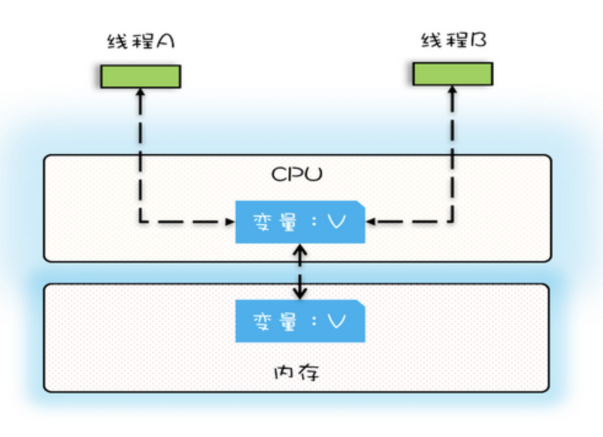
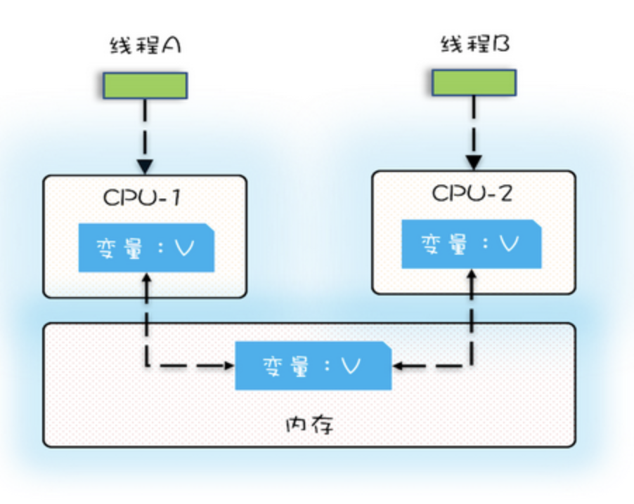
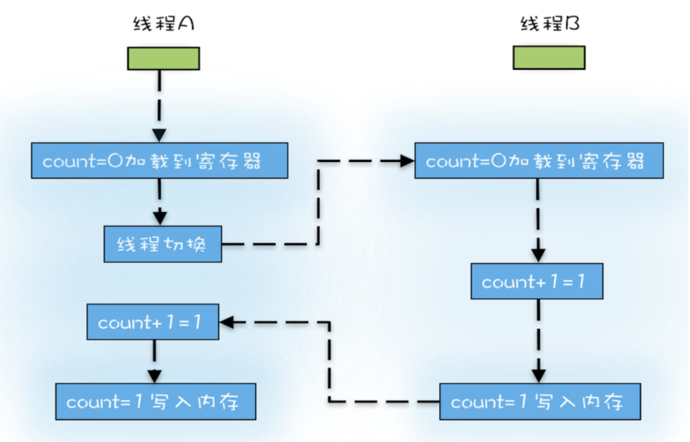
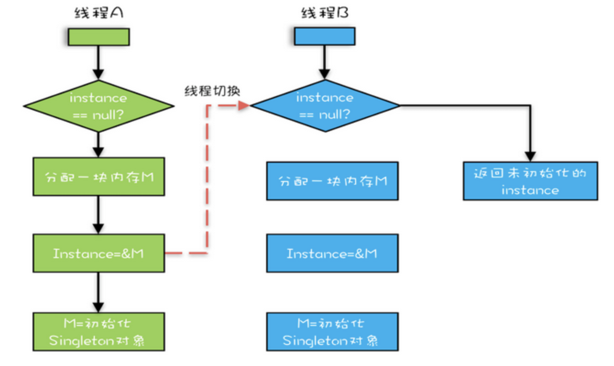
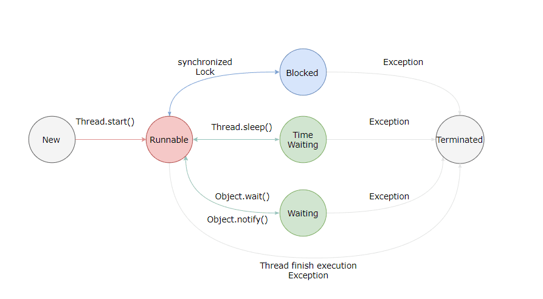

# 一、理论基础


## 1）并发编程的 Bug 源头

由于 `CPU` 和 `内存` & `I/O 设备` 之间的速度是有极大差异的，为了合理利用 CPU 的高性能，平衡这三者的速度差异，计算机体系结构、操作系统、编译程序都做出了相应的优化，主要体现为:

- CPU 增加了缓存，以均衡与内存的速度差异；// 导致 `可见性`问题
- 操作系统增加了进程、线程，以分时复用 CPU，进而均衡 CPU 与 I/O 设备的速度差异；// 导致 `原子性`问题
- 编译程序优化指令执行次序，使得缓存能够得到更加合理地利用。// 导致 `有序性`问题


### 1.1）缓存导致的可见性问题

可见性：一个线程对共享变量的修改，另外一个线程能够立刻看到。


单核时代，不同线程操作同一个 CPU 里面的缓存，不存在可见性问题。



多核时代，每颗 CPU 都有自己的缓存，不同的线程操作不同 CPU 的缓存时，对彼此之间就不具备可见性了。




### 1.2）线程切换导致的原子性问题

原子性：即一个操作或者多个操作 要么全部执行并且执行的过程不会被任何因素打断，要么就都不执行。


线程只有被分配了 CPU 时间片后才能执行，线程切换的时机大多数是在时间片结束的时候。


我们现在使用的高级程序语言一条语句往往对应多条CPU指令，例如语句：count += 1，至少需要三条CPU指令。

- 指令1：首先，需要把变量 count 从内存加载到 CPU 的寄存器；
- 指令2：之后，在寄存器中执行 +1 操作；
- 指令3：最后，将结果写入内存（缓存机制导致可能写入的是 CPU 缓存而不是内存）;


操作系统做任务切换，可以发生在任何一条CPU指令执行完。这就可能得到意想不到的结果。



我们把一个或者多个操作在 CPU 执行的过程中不被中断的特性成为**原子性**。CPU 能够保证原子操作是 CPU 指令级别的，但不是高级语言的操作符，因此很多时候我们需要在高级语言层面保证操作的原子性。


### 1.3）编译优化导致的有序性问题

有序性：即程序执行的顺序按照代码的先后顺序执行。编译器为了优化性能，有时候会改变程序中语句的先后顺序。


双重检查创建单例对象

```java
public class Singleton {
  static Singleton instance;
  static Singleton getInstance(){
    if (instance == null) {
      synchronized(Singleton.class) {
        if (instance == null)
          instance = new Singleton();
      }
    }
    return instance;
  }
}
```


instance = new Singleton() 语句经过编译优化重排序后的CPU执行过程可能是：

- 分配一块内存M；
- 将M的地址赋值给instance实例；
- 最后再内存M上初始化Singleton对象。


当 `线程A` 执行完 `指令2` 时，发生 `线程切换`，`线程B` 调用 `getInstance()` 方法，获得未初始化的 `Singleton` 对象，如果此时访问对象成员变量，那么就可能触发空指针异常。




CPU缓存导致了可见性问题，线程切换带来了原子性问题，编译优化带来了有序性问题。引入它们的目的是为了提高程序性能。


## 2）Java 如何解决可见性和有序性

[https://blog.csdn.net/c15158032319/article/details/117361782#:~:text=Java内存模型与硬](https://blog.csdn.net/c15158032319/article/details/117361782#:~:text=Java内存模型与硬)


# 二、线程基础

- 线程有哪几种状态? 分别说明从一种状态到另一种状态转变有哪些方式?
- 通常线程有哪几种使用方式?
- 基础线程机制有哪些?
- 线程的中断方式有哪些?
- 线程的互斥同步方式有哪些? 如何比较和选择?
- 线程之间有哪些协作方式?


## 1）线程状态转换

线程各个状态转换的示意图如下



### 1.1）新建(New)

创建后尚未启动。

调用了 start()，仅仅是在语言层面创建了一个线程，此时还没有与操作系统进行关联。


### 1.2）可运行(Runnable)

可能正在运行，也可能正在等待 CPU 时间片。

包含了操作系统线程状态中的 Running 和 Ready。


### 1.3）阻塞(Blocking)

等待获取一个排它锁，如果其线程释放了锁就会结束此状态。


### 1.4）无限期等待(Waiting)

等待其它线程显式地唤醒，否则不会被分配 CPU 时间片。

| 进入方法                                   | 退出方法                             |
| ------------------------------------------ | ------------------------------------ |
| 没有设置 Timeout 参数的 Object.wait() 方法 | Object.notify() / Object.notifyAll() |
| 没有设置 Timeout 参数的 Thread.join() 方法 | 被调用的线程执行完毕                 |
| LockSupport.park() 方法                    | LockSupport.unpark()                 |


### 1.5）限期等待(Timed Waiting)

无需等待其它线程显式地唤醒，在一定时间之后会被系统自动唤醒。

调用 Thread.sleep() 方法使线程进入限期等待状态时，常常用 “使一个线程睡眠” 进行描述。

调用 Object.wait() 方法使线程进入限期等待或者无限期等待时，常常用 “挂起一个线程” 进行描述。

睡眠和挂起是用来描述行为，而阻塞和等待用来描述状态。

阻塞和等待的区别在于，阻塞是被动的，它是在等待获取一个排它锁。而等待是主动的，通过调用 Thread.sleep() 和 Object.wait() 等方法进入。

| 进入方法                                 | 退出方法                                        |
| ---------------------------------------- | ----------------------------------------------- |
| Thread.sleep() 方法                      | 时间结束                                        |
| 设置了 Timeout 参数的 Object.wait() 方法 | 时间结束 / Object.notify() / Object.notifyAll() |
| 设置了 Timeout 参数的 Thread.join() 方法 | 时间结束 / 被调用的线程执行完毕                 |
| LockSupport.parkNanos() 方法             | -                                               |
| LockSupport.parkUntil() 方法             | -                                               |


### 1.6）死亡(Terminated)

可以是线程结束任务之后自己结束，或者产生了异常而结束。


## 2）三种使用线程的方法

- 实现 Runnable 接口；
- 实现 Callable 接口；
- 继承 Thread 类。

实现 Runnable 和 Callable 接口的类只能当做一个可以在线程中运行的任务，不是真正意义上的线程，因此最后还需要通过 Thread 来调用。可以说任务是通过线程驱动从而执行的。


继承与实现接口相比，实现接口会更好一些，因为:

- Java 不支持多重继承，因此继承了 Thread 类就无法继承其它类，但是可以实现多个接口；
- 类可能只要求可执行就行，继承整个 Thread 类开销过大。


### 2.1）实现 Runnable 接口

需要实现 run() 方法。

通过 Thread 调用 start() 方法来启动线程。

```java
private static void method02() {
    // 创建任务
    Runnable runnable = new Runnable() {
        @Override
        public void run() {
            log.debug("通过 Runnable 接口创建的线程");
        }
    };

    // 创建并启动线程
    new Thread(runnable).start();
}
```


### 2.2）实现 Callable 接口

与 Runnable 相比，Callable 可以有返回值，返回值通过 FutureTask 进行封装。

```java
private static void method03() {
    // 创建任务
    Callable callable = new Callable() {
        @Override
        public Object call() throws Exception {
            log.debug("通过 Callable 接口创建的线程");
            return 1;
        }
    };

    // 将任务封装进 FutureTask 中，以便后续从该线程中获取处理结果
    FutureTask<Integer> futureTask = new FutureTask<>(callable);
    // 创建并启动线程
    new Thread(futureTask).start();

    // 获取线程执行的结果
    // 主线程执行到该 get() 方法时，会进入阻塞状态，直到子线程执行完毕
    try {
        System.out.println(futureTask.get());
    } catch (Exception e) {
        e.printStackTrace();
    }
}
```


### 2.3）继承 Thread 类

```java
private static void method01() {
    // 创建线程
    Thread thread = new Thread(){
        public void run() {
            try {
                Thread.sleep(3000);
            } catch (InterruptedException e) {
                log.error(e.getMessage());
            }
            log.debug("通过 Thread 类创建的线程");
        }
    };
    // 启动线程
    thread.start();
}
```


## 3）线程的常用方法

线程的方法，指的就是 Thread 中定义的方法


### 3.1）线程的基础机制


#### 1）sleep()

Thread.sleep(millisec) 方法会休眠当前正在执行的线程，millisec 单位为毫秒。

sleep() 可能会抛出 InterruptedException，因为异常不能跨线程传播回 main() 中，因此必须在本地进行处理。线程中抛出的其它异常也同样需要在本地进行处理。

```java
private static void method01() {
    Thread thread = new Thread(() -> {
        try {
            Thread.sleep(3000);
        } catch (InterruptedException e) {
            log.error(e.getMessage());
        }
        log.debug("子线程执行结束");
    });
    thread.start();
    log.debug("主线程执行结束");
}
```


#### 2）yield()

告知 CPU 调度器，当前线程已经完成了生命周期中最重要的部分，可以切换给其它线程来执行。该方法只是对线程调度器的一个建议，而且也只是建议具有相同优先级的其它线程可以运行。


#### 3）setDaemon()

使用 `setDaemon()` 方法将一个线程设置为守护线程。

守护线程是程序运行时在后台提供服务的线程，不属于程序中不可或缺的部分。

当所有非守护线程结束时，程序也就终止，同时会杀死所有守护线程。

main() 属于非守护线程。

```java
private static void method08() {
    Thread thread = new Thread(() -> {
        while (true) {
            if (Thread.currentThread().isInterrupted()) {
                break;
            }
        }
        log.debug("子线程执行结束");
    });
    thread.setDaemon(true);
    thread.start();

    try {
        Thread.sleep(3000);
    } catch (InterruptedException e) {
        log.error(e.getMessage());
    }
  
    log.debug("主线程执行结束");
}
```


### 3.2）线程中断

一个线程执行完毕之后会自动结束，如果在运行过程中发生异常也会提前结束。


#### 1）interrupt()

如果一个线程处于阻塞、限期等待或者无限期等待状态，此时该线程调用 interrupt() ，那么就会抛出 InterruptedException，从而提前结束该线程（中断线程）。但是不能中断 I/O 阻塞和 synchronized 锁阻塞。

```java
private static void method04() {
    Thread thread = new Thread(() -> {
        try {
            log.debug("子线程进入休眠");
            Thread.sleep(3000);
        } catch (InterruptedException e) {
            log.error(e.getMessage());
        }
        log.debug("子线程执行结束");
    });
    thread.start();
    try {
        // 防止子线程还没休眠就开始打断
        log.debug("主线程进入休眠");
        Thread.sleep(1000);
    } catch (InterruptedException e) {
        log.error(e.getMessage());
    }
    log.debug("主线程休眠结束");
    thread.interrupt();
    // sleep, wait, join 被打断后会清除标记
    log.debug("子线程是否被 Interrupt 过：{}", thread.isInterrupted());
    log.debug("主线程执行结束");
}
```

输出日志

```java
17:29:08 [main] - 主线程进入休眠
17:29:08 [Thread-0] - 子线程进入休眠
17:29:09 [main] - 主线程休眠结束
17:29:09 [Thread-0] - sleep interrupted
17:29:09 [Thread-0] - 子线程执行结束
17:29:09 [main] - 子线程是否被 Interrupt 过：true
17:29:09 [main] - 主线程执行结束
```


### 3.3）线程之间协作

