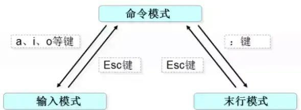

### 1、Linux 系统架构

​	Linux 整体架构采用分层设计，可以粗糙地抽象为 3 个层次，底层是系统内核（`Kernel`）；中间层是 `Shell`；顶层则是应用。

```bash
应用 --> Shell --> 内核 --> 硬件
```


#### 1.1 Kernel

​	内核是 `Linux` 系统的核心，它直接附着在硬件平台之上，是系统与硬件之间的接口，直接与硬件交互。内核负责管理：硬件资源、进程调度、内存系统、文件系统、网络通信等。


#### 1.2 Shell

​	`Shell` 提供了用户（应用程序）与内核进行交互操作的接口。 它接收用户输入的命令， 并将命令送入内核去执行， 然后将执行结果返回给用户。即：Shell 是一个命令解释器。


#### 1.3 Application

​	提供与用户交互的界面，执行具体的应用任务，并通过系统调用与操作系统内核协作来完成各项功能。（就是各种应用软件）


#### 1.4 Hardware

 	计算机的硬件是系统运行的基础，它提供了诸如CPU、内存、硬盘、网络设备等资源，由内核直接管理或通过驱动交互。


### 2、VI 编辑器

​	`vi` 是一个基于命令行的编辑器，它有三种核心模式，分别是命令模式（Command mode），输入模式（Insert mode）和尾行命令模式（Last line mode）。模式直接的切换如图所示：




#### 2.1 命令模式

- **功能**：
    - 移动光标、复制、删除、粘贴、撤销、搜索等基础操作。
- **进入方式**：
    - 编辑文件，立即进入`命令模式`。
    - 按 `Esc` 从`其他模式`返回。
- **常用命令**：
    - `yy`：复制当前行。
    - `dd`：删除当前行。
    - `p`：粘贴`复制/删除`的内容。
    - `u`：撤销操作。
    - `/关键词`：向前搜索关键词（按 `n` 或者`enter`跳转下一个）。


#### 2.2 插入模式

- **功能**：
    - 编辑文本内容。
- **进入方式**：
    - 在命令模式下按 `i`、`a`、`o`进入插入模式（区分大小写）。
    - i：在当前光标所在字符的前面，转为输入模式
    - I：在当前光标所在行的行首转换为输入模式
    - a：在当前光标所在字符的后面，转为输入模式
    - A：在光标所在行的行尾，转换为输入模式
    - o：在当前光标所在行的下方，新建一行，并转为输入模式
    - O：在当前光标所在行的上方，新建一行，并转为输入模式
- **常用命令**：
    - ^：光标移动到当前行的行首
    - $：光标移动到当前行的行尾
- **退出方式**：
    - 按 `Esc` 返回命令模式。


#### 2.3 尾行模式

- **功能**：
    - 保存、退出、全局替换等高级操作。
- **进入方式**：
    - 在命令模式下按 `:`
- **常用命令**：
    - `:w`：保存文件。
    - `:q`：退出 Vi。
    - `:q!`：强制退出不保存。
    - `:wq` 或 `:x`：保存并退出。
    - `:%s/old/new/g`：全局替换 "old" 为 "new"。


### 3、Linux 常用命令

​	在 Linux 系统上常用的命令主要是用于文件管理、系统监控、进程管理、网络配置等方面。以下是 Linux 系统上使用频率较高的 30 个命令，以及它们的常见用法和参数：


#### 3.01 `ls` - 列出目录内容

`ls [params] [dirname ...]` 命令用于列出指定目录的内容，包括文件和子目录。

**参数**：

- `-l`：显示详细信息，包括文件的：类型、 权限、 所有者、 组名、大小及时间信息等
- `-a`：显示所有文件，包括隐藏文件。
- `-h`：以可读性更高的方式显示文件大小（文件大小的单位转为K、M、G）。

**示例**：

```bash
# 列出当前目录下的所有文件（包括隐藏文件）
ls -a

# 列出当前目录下所有的文件，并显示文件和目录的详细信息，并以可读性更高的方式显示文件大小
ls -lha

# 列出 /home/user 目录目录下的文件，并显示文件和目录的详细信息，并以可读性更高的方式显示文件大小
ls -lh /home/user

# 同时列出当前目录下的 conf & repository 这两个目录下的文件信息
ls -la ./conf ./repository
```


#### 3.02 `cd` - 改变当前目录

`cd dirname` 命令用于切换工作目录。

**参数**：

- `~`：用户的主目录。
- `..`：上一级目录。

**示例**：

```bash
# 进入 /home/user 目录
cd /home/user

# 进入当前目录下的 document 目录
cd ./document

# 进入当前目录的爷爷级目录
cd ../..
```


#### 3.03 `pwd` - 显示当前所在路径

`pwd` 命令用于显示当前用户所处的工作目录的完整路径。

**参数**：

**示例**：

```bash
# 进入用户的主目录
cd ~

# 显示当前的工作目录的路径：/Users/terry
pwd
```


#### 3.04 `mkdir` - 创建目录

`mkdir [-p] dirname` 命令用于创建新目录。

**参数：**

- `-p`：递归创建目录，即创建嵌套目录时自动创建父目录。

**示例：**

```bash
# 创建一个名为 test 的目录
mkdir test

# 递归创建目录 /home/user/documents/newdir
mkdir -p /home/user/documents/newdir
```


#### 3.05 `mv` - 移动或重命名文件/目录

`mv [params] source dest` 命令既可以用于移动文件，也可以用于重命名文件。

**参数：**

- `-i`：在覆盖现有文件时提示确认。
- `-f`：强制移动文件，不提示确认。

**示例：**

```bash
# 将文件 file1.txt 移动到 /tmp 目录
mv file1.txt /tmp/

# 将文件 temp 目录移动到 /tmp 目录
mv temp /tmp/

# 重命名文件 file1.txt 为 file2.txt
mv file1.txt file2.txt

# 强制移动文件，覆盖已有文件
mv -f file1.txt /tmp/
```


#### 3.06 `cp` - 复制文件或目录

`cp [params] source dest` 命令用于复制文件或目录。

**参数**：

- `-r`：递归复制目录及其内容。
- `-i`：在覆盖现有文件时提示确认。

**示例**：

```bash
# 复制文件 file1.txt 到 /tmp 目录
cp file1.txt /tmp/

# 递归复制目录 dir1 到 /tmp 目录
cp -r dir1 /tmp/
```


#### 3.07 `rm` - 删除文件或目录

`rm [params] name ...` 命令用于删除文件或目录。

**参数：**

- `-r`：递归删除目录及其内容。
- `-f`：强制删除文件或目录，不提示确认。
- `-i`：删除前提示确认。

**示例：**

```bash
# 删除文件 file1.txt
rm file1.txt

# 递归删除目录 dir1 及其内容
rm -r dir1

# 强制删除文件，不提示确认
rm -f file1.txt
```


#### 3.08 `touch` - 创建空文件

`touch filename` 命令用于创建空文件，或将文件的访问时间和修改时间更新为当前时间。

**参数**

**示例：**

```bash
# 更新 file1.txt 的时间戳，由于此时 file1.txt 不存在，所以改为创建 file1.txt
touch file1.txt

# 更新现有文件 file1.txt 的时间戳
touch file1.txt
```


#### 3.09 `chmod` - 更改文件权限

`cchmod mode name` 命令用于更改文件或目录的权限。

**参数：**

- `-R`：递归更改权限。

**示例：**

```bash
# 将文件权限设置为755
chmod 755 file1.txt

# 递归更改目录权限
chmod -R 755 /path/to/directory
```


#### 3.10 `tar` - 压缩和解压文件

`tar [params] zipname [name ...]` 命令用于创建 `.tar.gz` 格式的压缩包，或解压该格式的压缩包。

**参数：**

- `-c`：创建压缩包。
- `-x`：解压缩包。
- `-f`：指定待`创建/解压`的压缩包名称。
- `-z`：使用 gzip `压缩`或`解压`压缩包。
- `-C`：解压到指定目录

**示例：**

```bash
# 将 file1.txt 和 file2.txt 打包为一个名为 test.tar.gz 的 .tar.gz 压缩包
tar -cf test.tar.gz file1.txt file2.txt

# 将名为 test.tar.gz 的 gzip 压缩包解压到当前目录下
tar -xf test.tar.gz

# 将名为 test.tar.gz 的 gzip 压缩包解压到 /user 目录下
tar -xf test.tar.gz -C /user
```


#### 3.11 `echo` - 输出字符串

`echo [params] value [> filename]` 命令用于在终端中输出文本或变量的值，也可以用于将数据重定向到文件。

**参数**

- `-n`：输出不换行。

**示例：**

```bash
# 输出一行文本
echo "Hello, World!"

# 输出环境变量
echo $JAVA_HOME

# 将字符串写入文件
echo "Hello, File!" > file1.txt
```


#### 3.12 `cat` - 显示文件内容

`cat [params] filename` 命令用于查看文件内容，适用于查看短文件。

**参数：**

- `-n`：显示行号。

**示例：**

```
# 显示文件 settings.xml 的内容
cat settings.xml

# 显示带行号的文件内容
cat -n settings.xml
```


#### 3.13 `less` - 分页查看文件内容

`less filename` 命令用于分页查看文件内容，适合查看长文件。

**参数**

**示例：**

```bash
# 分页显示文件内容
less settings.xml
```


#### 3.14 `head` - 查看文件头部内容

`head [params] filename` 命令用于查看文件的前几行内容，默认显示前10行。

**参数：**

- `-n`：指定显示的行数。

**示例：**

```bash
# 查看文件的前10行
head settings.xml

# 查看文件的前5行
head -n 5 settings.xml
```


#### 3.15 `tail` - 查看文件尾部内容

`tail [params] filename` 命令用于查看文件的最后几行内容，默认显示最后10行。

**参数：**

- `-n`：指定显示的行数。
- `-f`：持续监视文件内容的变化，特别适合用于查看实时日志文件的更新。

**示例：**

```bash
# 查看文件的最后10行
tail file1.txt

# 查看文件的最后5行
tail -n 5 file1.txt

# 持续监视日志文件的内容
tail -f /var/log/syslog
```


#### 3.16 `ps` - 显示进程

`ps [params] [username]` 命令用于显示当前系统中的进程信息。

**参数：**

- `-e`：显示所有进程。
- `-f`：显示完整格式。
- `-u`：显示指定用户的进程。

**示例：**

```bash
# 显示当前用户的所有进程
ps

# 显示所有进程
ps -e

# 显示完整格式的进程信息
ps -f

# 显示特定用户的进程
ps -u username
```


#### 3.17 `grep` - 搜索字符串

`grep [params] pattern [file]` 命令用于在文件或输出中搜索特定字符串。

**参数：**

- `-i`：忽略大小写。
- `-r`：递归搜索目录中的文件。

**示例：**

```bash
# 在文件中搜索字符串 "repository"
grep "repository" settings.xml

# 忽略大小写搜索
grep -i "repository" settings.xml

# 递归搜索目录中的文件
grep -r "repository" settings.xml
```


#### 3.18 `｜管道符` - 输出作为输出

管道符 `|` 是  `Linux` 系统中的一种命令行工具，用于将一个命令的输出传递给另一个命令作为输入。它将前一个命令的`标准输出`与下一个命令的`标准输入`连接起来，实现命令链式操作。

**用法：**

```bash
command1 | command2
```

**示例：**

```bash
# 将 head 命令返回的结果作为 grep 的输出参数
head -n 20 ./settings.xml | grep -i "Apache"

# 只返回包含 "toolchains" 的文件
ls -la | grep "toolchains"
```


#### 3.19 `kill` 和 `killall` - 终止进程

`kill [params] PID` 命令用于通过进程ID终止进程，而 `killall processname` 命令用于根据进程名终止所有匹配的进程。

**参数：**

- `-9`：强制终止进程。

**示例：**

```bash
# 通过进程ID终止进程
kill 1234

# 强制终止进程
kill -9 1234

# 终止名为 "httpd" 的所有进程
killall httpd
```


#### 3.20 `ssh` - 远程安全登录

`ssh [params] username@hostname` 命令用于通过安全外壳协议（SSH）远程登录到另一台Linux服务器。

**参数：**

- `-p`：指定SSH端口。
- `-i`：指定私钥文件。

**示例：**

```bash
# 使用默认端口远程登录
ssh user@remote_server

# 指定端口进行登录
ssh -p 2222 user@remote_server

# 使用私钥文件登录
ssh -i ~/.ssh/id_rsa user@remote_server
```


#### 3.21 `service` - 管理系统服务

`service servicename params` 命令用于启动、停止、重启或查看系统服务的状态。

**常用参数：**

- `start`：启动服务。
- `stop`：停止服务。
- `restart`：重启服务。
- `status`：查看服务状态。

**示例：**

```bash
# 启动Apache服务
service apache2 start

# 停止MySQL服务
service mysql stop

# 重启SSH服务
service ssh restart

# 查看服务状态
service apache2 status
```


#### 3.22 `wget` - 下载文件

`wget [params] url` 命令用于从网络中下载文件，支持HTTP、HTTPS和FTP协议。

**参数：**

- `-b`：后台下载模式。
- `-O`：指定输出文件名。
- `-c`：断点续传。

**示例：**

```bash
# 下载文件到当前目录
wget http://example.com/file.zip

# 将文件保存为指定名称
wget -O myfile.zip http://example.com/file.zip

# 断点续传
wget -c http://example.com/file.zip
```


#### 3.23 `curl` - 数据传输工具

`curl [params] url` 命令用于通过多种协议传输数据，常用于HTTP请求。

**参数：**

- `-o`：指定输出文件。
- `-O`：使用URL中的文件名保存文件。
- `-I`：获取HTTP头信息。
- `-X`：指定HTTP方法（如GET、POST）。
- `-d`：指定请求体数据，通常与 POST 方法一起使用。

**示例：**

```bash
# 下载文件
curl -o myfile.zip http://example.com/file.zip

# 获取HTTP头信息
curl -I http://example.com

# 发送POST请求
curl -X POST -d "name=user&password=123" http://example.com/login
```


#### 3.24 `top` - 实时显示资源使用率

`top [params]` 命令用于动态显示系统中进程的资源使用情况，如CPU、内存、运行时间等。

**参数：**

- `-u`：显示特定用户的进程。
- `-d`：设置刷新间隔。

**示例：**

```bash
# 实时查看系统资源使用情况
top

# 查看指定用户的进程
top -u username

# 设置刷新间隔为5秒
top -d 5
```