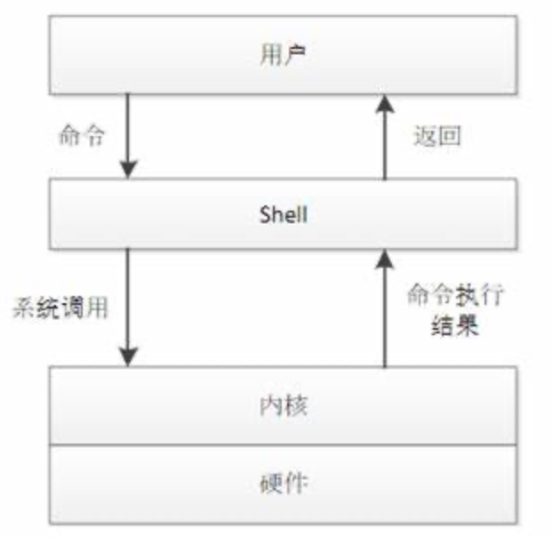

### 1、什么是 Shell

Shell 是一个命令解释器，它的作用是解释并执行用户输入的命令。用户每输入一条命令，Shell 就解释并执行一条。这种从键盘一输入命令，就可以立即得到回应的对话方式，称为交互的方式。



Shell 位于用户与内核之间，是用户与内核沟通的桥梁。Shell 负责把用户的输入的指令解释给内核，内核负责执行指令，并在执行结果返回给 Shell，最后 Shell 再将内核返回的结果响应给用户。输入系统用户名和密码并登录到 Linux 后的所有操作都是由 Shell 解释与执行的。


### 2、常见的 Shell

Linux 系统中的主流 Shell 是 bash。bash 是由 Bourne Shell（sh） 发展而来的。

```bash
# 查询当前系统支持的 Shell 类型
cat /etc/shells

# 查询当前系统使用的 Shell 类型
echo $SHELL

# 切换当前系统使用的 Shell 类型
/bin/zsh
```


### 3、什么是 Shell 脚本

当 Linux 命令或语句不在命令下执行，而是通过一个程序文件执行时，该程序就被称为 Shell 脚本或 shell 程序。如果在 Shell 脚本里内置了很多条命令、语句及循环控制，然后将这些命令一次性执行完毕，这种通过文件执行脚本的方式称为非交互的方式。


### 4、Shell 脚本的创建与执行

Shell 脚本通常由 Linux 命令、bash Shell 命令、程序结构控制语句和注释等内容组成。


**脚本开头**：

一个规范的 Shell 脚本在脚本第一行会指出由哪个解释器来执行脚本中的内容，其中开头的 `#!` 字符又称为幻数。

```bash
#!/bin/bash
```


**脚本执行**：

Shell 脚本是从上至下依次执行每一行的命令及语句的，即执行完了一个命令后再执行下一个，如果在 Shell 脚本中遇到子脚本（即脚本嵌套）时，就会先执行子脚本的内容，完成后再返回父脚本继续执行父脚本内后续的命令及语句。通常情况下，在执行 Shell 脚本时，会向系统内核请求启动一个新的进程，以便在该进程中执行脚本的命令及子 Shell 脚本。

 Shell 脚本的执行通常可以采用以下几种方式。

```bash
# 方式一：创建一个子 Shell 线程执行
sh ./scriptName

# 方式二：创建一个子 Shell 线程执行
./scriptName

# 方式三：在当前的 Shell 线程中执行
source scriptName
```


### 5、 变量

变量用于存储程序中使用的数据，变量存在于内存空间中，通过 `$变量` 就可以从内存中取出变量中存储的数据


#### 5.1 变量的定义

变量定义的语法如为：`变量名=变量值`。注意 `=` 的两侧无空格，否则变量名称会被识别为命令，变量的内容一般要加双引号，以防止出错。另外 bash shell 是弱类型语言。


#### 5.2 变量的类型

变量可分为两类：`环境变量`和`普通变量`。

环境变量也可称为`全局变量`，可以在创建它们的 Shell 及其派生出来的任意子进程 Shell 中使用，环境变量又可分为自定义环境变量和bash内置的环境变量。

普通变量也可称为`局部变量`，只能在创建它们的 Shell 函数或 Shell 脚本中使用。普通变量一般由开发者在开发脚本程序时创建。


```bash
# 1. 定义一个字符型变量
username="Alice"
echo "Hello, $name!"								# 输出: Hello, Alice!


# 2. 定义整形变量
num1=3
num2=5
result=$((num1 + num2))  						# 使用 $(( )) 进行运算
echo "The result is: $result"				# 输出: The result is: 8


# 3. 定义只读类型的浮点型变量
readonly pi=3.14159
echo "Value of pi: $pi"   					# 输出: Value of pi: 3.14159
pi=3.14  														# 错误：bash: pi: readonly variable


# 4. 定义数组变量（使用空格分割）
fruits=("apple" "banana" "cherry")
echo "First fruit: ${fruits[0]}"  	# 输出: First fruit: apple
echo "Second fruit: ${fruits[1]}" 	# 输出: Second fruit: banana

for fruit in "${fruits[@]}"					# 遍历数组
do
  echo "$fruit"
done


# 5. 定义关联数组
declare -A person
person["name"]="John"
person["age"]=30
echo "Name: ${person[name]}"  			# 输出: Name: John
echo "Age: ${person[age]}"    			# 输出: Age: 30
```


### 6、条件判断


### 7、运算符