### 1、什么是 Stream

Java 8 中的 Stream 是对集合（Collection）对象功能的增强，它专注于对集合对象进行各种便利、高效的聚合操作（aggregate operation），或者大批量数据操作（bulk data operation）。Stream API 借助于 Lambda 表达式，极大的提高编程效率和程序可读性。同时它提供串行和并行两种模式进行汇聚操作，并发模式能够充分利用多核处理器的优势，使用 fork/join 并行方式来拆分任务和加速处理过程。通常编写并行代码很难而且容易出错, 但使用 Stream API 无需编写一行多线程的代码，就可以很方便地写出高性能的并发程序。


对于 Stream 流的使用，一共就三个步骤

1. 创建操作
2. 中间操作
3. 终结操作


这是一个 stream 流的使用案例

```java
List<Integer> numberList = List.of(3, 4, 5, 5);

// 创建流
numberList.stream()
    // 中间操作
    .distinct()
    // 终结操作
    .forEach(System.out::println);
```


另外，对于 Stream 流来说，以下特点需要注意

1. 流不是数据结构，不会保存数据；
2. 任何<u>中间操作</u>和<u>终结操作</u>都不会修改数据源，每个操作都会返回一个新的 Stream 对象；
3. 惰性求值，流在执行<u>中间操作</u>时，只是对操作进行了记录，并不会立即执行，需要等到执行<u>终结操作</u>的时候才会进行实际的计算。


### 2、创建操作

根据数据源类型的不同，创建流的方式有以下三种方式

- 数组
    - 通过 Arrays 的 stream()
- 单列集合
    - 通过 Collection 的 stream()
- 双列集合
    - 先将 Map 转为 Collection，然后再调用 Collection 的 stream()


#### 2.1 数组

Java 8 在 Arrays 类中新增了 stream() 方法

```java
public static <T> Stream<T> stream(T[] array)
```


所以，可以通过 Arrays 的 stream() 可以创建一个 stream 对象，案例如下

```java
// 数组
Integer[] numberArray = {2, 3, 4, 4};

// 创建流
Arrays.stream(numberArray)
    // 中间操作
    .distinct()
    // 终结操作
    .forEach(System.out::println);
```


#### 2.2 单列集合

Java 8 在 Collection 类中新增了 stream() 方法

```java
default Stream<E> stream()
```


所以，可以通过 Collection 的 stream() 可以创建一个 stream 对象，案例如下

```java
// 单列集合
List<Integer> numberList = List.of(3, 4, 5, 5);

// 创建流
numberList.stream()
    // 中间操作
    .distinct()
    // 终结操作
    .forEach(System.out::println);
```


需要注意的是，由于 List 和 Set 都是 Collction 的子接口，所以 List 和 Set 接口都包含 stream()


#### 2.3 双列集合

对于双列集合 Map 来说，需要先将 Map 转 Collection，再调用 Collection 中的 stream()。


Map 中提供了将 Map 转为 Collection 的方法

```java
Set<Map.Entry<K, V>> entrySet();
```


所以，可以通过 Map 创建一个 stream 对象，案例如下

```java
// 双列集合
Map<String, Integer> map = new HashMap<>();
map.put("一", 1);
map.put("二", 2);
map.put("二", 2);

// 将 Map 转为 Collection 的子接口
Set<Map.Entry<String, Integer>> entries = map.entrySet();

// 创建流
entries.stream()
    // 中间操作
    .distinct()
    // 终结操作
    .forEach(System.out::println);
```


### 3、中间操作

一个流可以后面跟随零个或多个 intermediate 操作。其目的主要是打开流，做出某种程度的数据映射/过滤，然后返回一个新的流，交给下一个操作使用。这类操作都是惰性化的（lazy），就是说，仅仅调用到这类方法，并没有真正开始流的遍历。


常见的操作如下：

- distinct
- filter
- map & flatMap
- Sorted
- limit & skip


#### 3.1 distinct

过滤重复的元素，依赖于 Object 的 equals()


案例如下（去除重复的作家，并打印作家的姓名

```java
List<Author> authors = getAuthors();

authors.stream()
    // 中间操作：对流中的元素进行去重
    .distinct()
    // 终结操作：遍历流中的各个元素
    .forEach(author -> System.out.println(author.getName()));
```


执行 distinct() 的效果如下


#### 3.2 filter

根据指定的条件进行过滤元素，只保留满足条件的元素


案例如下（过滤重复的作家 & 过滤年龄小于18的作家，并打印作家的姓名

```java
List<Author> authors = getAuthors();

authors.stream()
    .distinct()
    // 中间操作：对流中的元素进行去重
    .filter(author -> author.getAge() < 18)
    // 终结操作：遍历流中的各个元素
    .forEach(author -> System.out.println(author.getName()));
```


执行 filter() 的效果如下

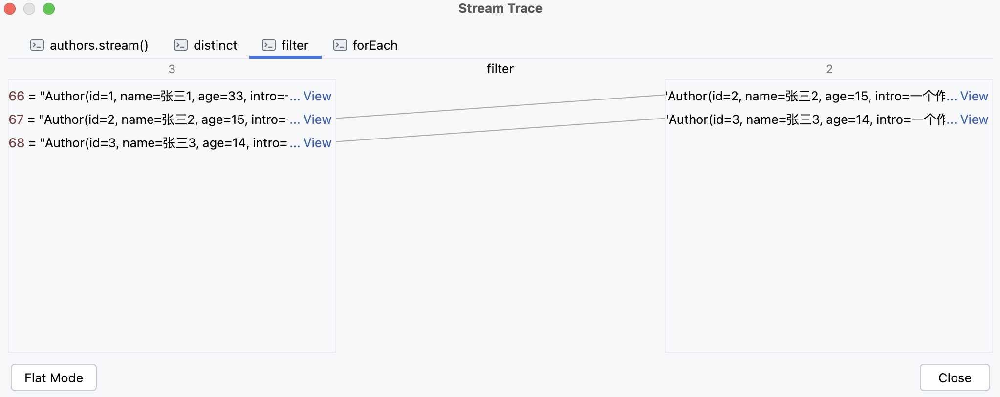


#### 3.3 map

对流中的每个元素应用指定的函数，并将结果映射为一个新的元素


案例如下（打印所有作家的姓名

```java
List<Author> authors = getAuthors();

authors.stream()
    // 对流中的各个元素，挨个进行计算或者转换，得到一个新的元素
    .map(author -> author.getName())
    .forEach(System.out::println);
```


执行 map() 的效果如下

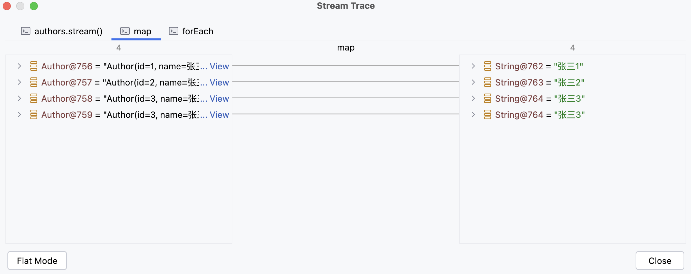


#### 3.4 flatMap

将流中的每个元素都转换为一个流，然后将这些流连接起来成为一个新的流（类似于 union）


案例如下

- 打印所有书籍的名字，并且对重复的元素去重
- 打印所有书籍的分类，并且要求对分类去重，且需要拆分逗号：哲学,爱情 -> [哲学,爱情]

```java
List<Author> authors = getAuthors();

// 需求1：打印所有书籍的名字，并且对重复的元素去重
authors.stream()
    .flatMap(new Function<Author, Stream<?>>() {
        @Override
        public Stream<?> apply(Author author) {
            return author.getBooks().stream();
        }
    })
    .distinct()
    .forEach(System.out::println);

// 需求2：打印所有书籍的分类，并且要求对分类去重，且需要拆分逗号：哲学,爱情 -> [哲学,爱情]
authors.stream()
    .flatMap(author -> author.getBooks().stream())
    .distinct()
    .flatMap(book -> Arrays.stream(book.getCategory().split(",")))
    .distinct()
    .forEach(System.out::println);
```


需求1执行 flatMap() 后，效果如下图

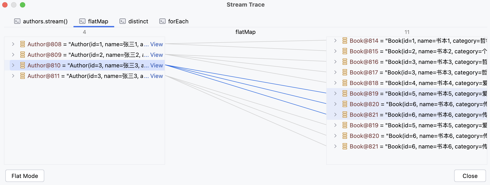


需求2执行 flatMap() 后，效果如下图

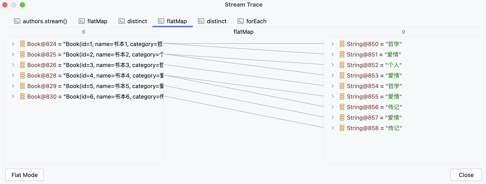


#### 3.5 sorted

对流中的元素进行排序，依赖于比较器：Comparator 接口


案例如下（对作家进行去重，并对作家的年龄进行升序排序，然后打印作家的姓名和年龄

```java
List<Author> authors = getAuthors();

authors.stream()
    .distinct()
    .sorted(new Comparator<Author>() {
        @Override
            public int compare(Author o1, Author o2) {
            		return o1.getAge() - o2.getAge();
            }
        })
    .forEach(author -> System.out.println("姓名：" + author.getName() + ", 年龄：" + author.getAge()));
```


执行 sorted() 的效果如下

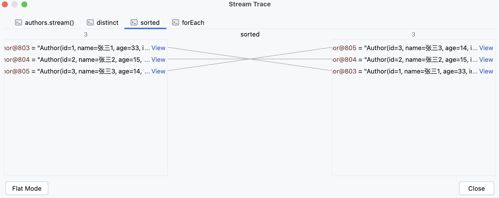


#### 3.6 limit

用于截断流，保留指定数量的元素，超出的部分直接抛弃


案例如下（将作家按年龄降序排序，并且不能有重复元素，然后打印年龄最大的两个作家的姓名

```java
List<Author> authors = getAuthors();

authors.stream()
    .distinct()
    .sorted(new Comparator<Author>() {
        @Override
        public int compare(Author o1, Author o2) {
            return o2.getAge() - o1.getAge();
        }
    })
    .limit(2)
    .map(author -> author.getName())
    .forEach(System.out::println);
```


执行 limit() 的效果如下

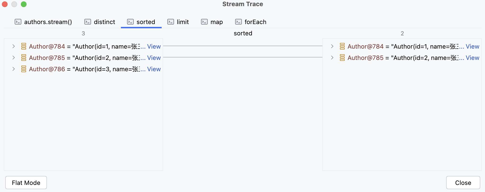


#### 3.7 skip

跳过流中指定数量的元素


案例如下（打印除了年龄最大的作家，并且不能有重复的作家，按照年龄降序排序

```java
List<Author> authors = getAuthors();

authors.stream()
    .distinct()
    .sorted(new Comparator<Author>() {
    		@Override
        public int compare(Author o1, Author o2) {
            return o2.getAge() - o1.getAge();
        }
    })
    .skip(1)
    .forEach(System.out::println);
```


执行 skip() 的效果如下

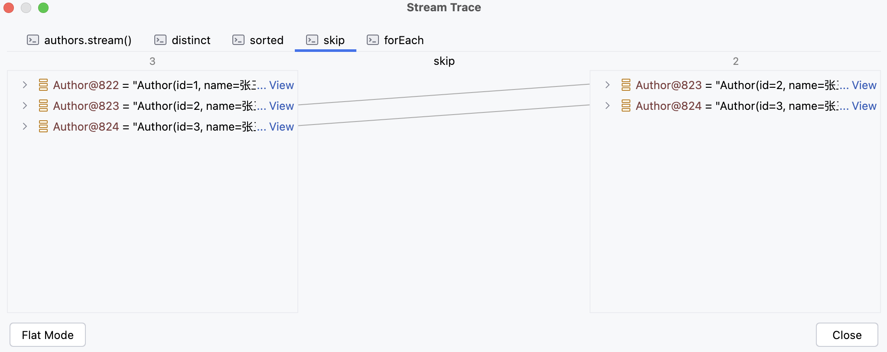


### 4、终结操作

一个流只能有一个 terminal 操作，当这个操作执行后，流就被使用「光」了，无法再被操作。所以这必定是流的最后一个操作。Terminal 操作的执行，才会真正开始流的遍历，并且会生成一个结果。


常见终结操作操作如下

- forEach
- collect
- max & min
- count
- anyMatch & allMatch & noneMatch
- findFirst & findAny
- iterator


#### 4.1 forEach

接收一个 Lambda 表达式，然后在 Stream 的每一个元素上执行该表达式（即：遍历


案例如下（打印所有作家的名字，并且去重

```java
List<Author> authors = getAuthors();

authors.stream()
    .map(author -> author.getName())
    .distinct()
    .forEach(authorName -> System.out.println(authorName));
```


执行 forEach() 的效果如下

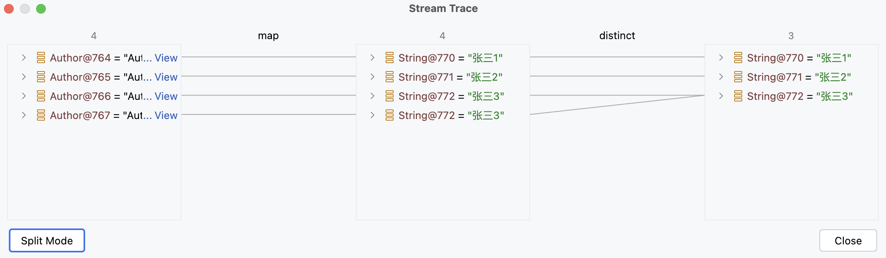


#### 4.2 collect

将流中的元素收集到一个集合中，例如：List、Set 或 Map


案例如下

- 获取一个所有作者名字的 List 集合
- 获取一个 Map 集合，Map 的 key 为作家名，value 为 List<Book>

```java
// 需求1：获取一个所有作者名字的 List 集合
List<String> authorNames = getAuthors().stream()
    .map(author -> author.getName())
    .distinct()
    .collect(Collectors.toList());

authorNames.stream().forEach(System.out::println);

// 需求2: 获取一个 Map 集合，Map 的 key 为作家名，value 为 List<Book>
Map<String, List<Book>> authorMap = getAuthors().stream()
    .distinct()
    .collect(Collectors.toMap(Author::getName, Author::getBooks));

authorMap.entrySet().stream().forEach(System.out::println);
```


执行后 toList() 后，效果如下图

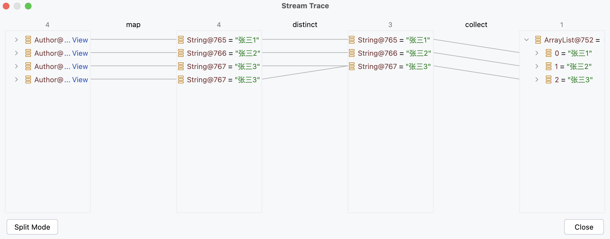


执行后 toMap() 后，效果如下图

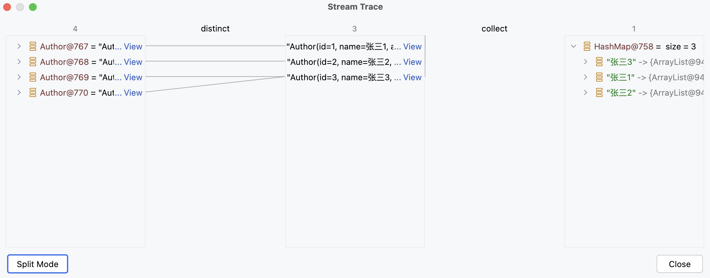


#### 4.3 count

返回流中元素的个数


案例如下（打印所有作家的名字，并且去重

```java
List<Author> authors = getAuthors();

long count = authors.stream()
		.map(author -> author.getBooks())
    .flatMap(books -> books.stream())
    .distinct()
    .count();
```


执行 count() 的效果如下

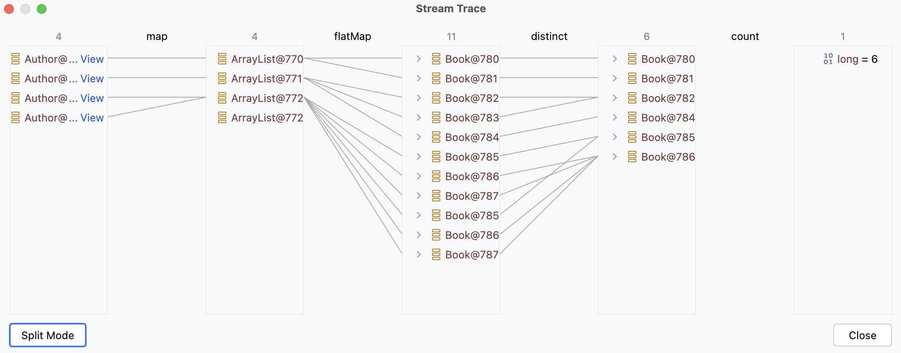


#### 4.4 max

max()：返回流中的最大值；

min()：返回流中的最小值


案例如下（分别获取这些作家的所出书籍的最高评分和最低评分，并打印

```java
List<Author> authors = getAuthors();

Optional<Integer> max = authors.stream()
    .flatMap(author -> author.getBooks().stream())
    .distinct()
    .map(book -> book.getScore())
    .max(((o1, o2) -> o1 - o2));

Optional<Integer> min = authors.stream()
    .flatMap(author -> author.getBooks().stream())
    .distinct()
    .map(book -> book.getScore())
    .min(((o1, o2) -> o1 - o2));

System.out.println("min = " + min.orElse(0));
System.out.println("max = " + max.orElse(0));
```


执行 max() 的效果如下

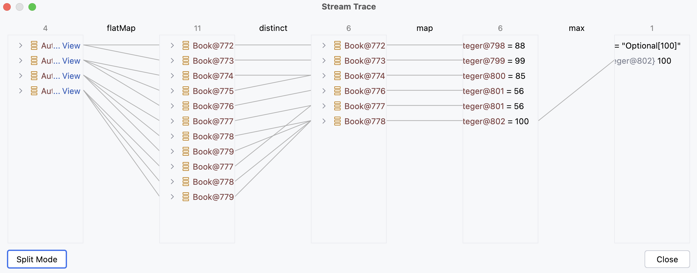


#### 4.5 anyMatch

anyMatch(): 流中是否存在满足指定条件的元素

allMatch(): 流中的元素是否全部满足指定条件

noneMatch(): 流中的元素是否全部都不满足指定条件


案例如下（判断是否有年龄在 29 以上的作家

```java
boolean anyMatch = getAuthors().stream().anyMatch(author -> author.getAge() > 29);
```


执行后 toList() 后，效果如下图

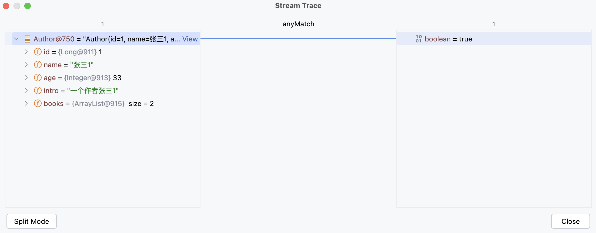


#### 4.6 findFirst

findFirst(): 获取流中的第一个元素

findAny(): 随机获取流中的一个元素


案例如下（获取一个年龄最小的作家，并打印他的姓名

```java
Optional<Author> first = getAuthors().stream()
    .distinct()
    .sorted(new Comparator<Author>() {
        @Override
        public int compare(Author o1, Author o2) {
            return o1.getAge() - o2.getAge();
        }
    })
    .findFirst();

first.ifPresent(author -> System.out.println(author.getName()));
```


执行 findFirst() 的效果如下

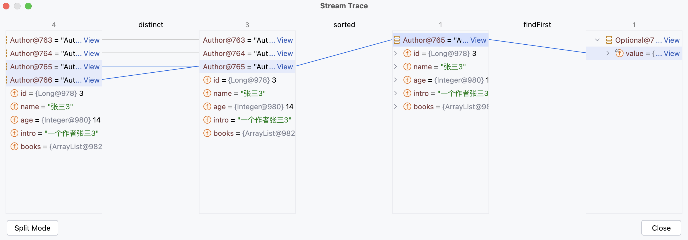


#### 4.7 reduce

对流中的元素进行归约操作，可以用于求和、求最大值、最小值等


案例如下（获取一个年龄最小的作家，并打印他的姓名

```java
Integer sum = getAuthors().stream()
    .distinct()
    .map(author -> author.getAge())
    .reduce(0, new BinaryOperator<Integer>() {
        @Override
        public Integer apply(Integer result, Integer element) {
            return result + element;
        }
    });

System.out.println(sum);
```


执行 reduce() 的效果如下

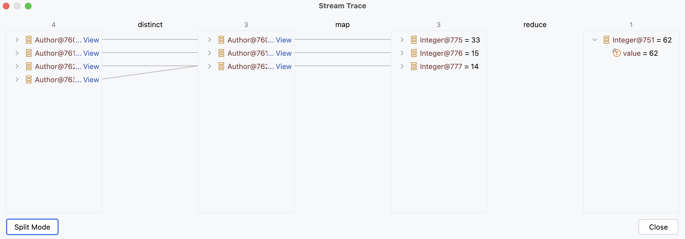
