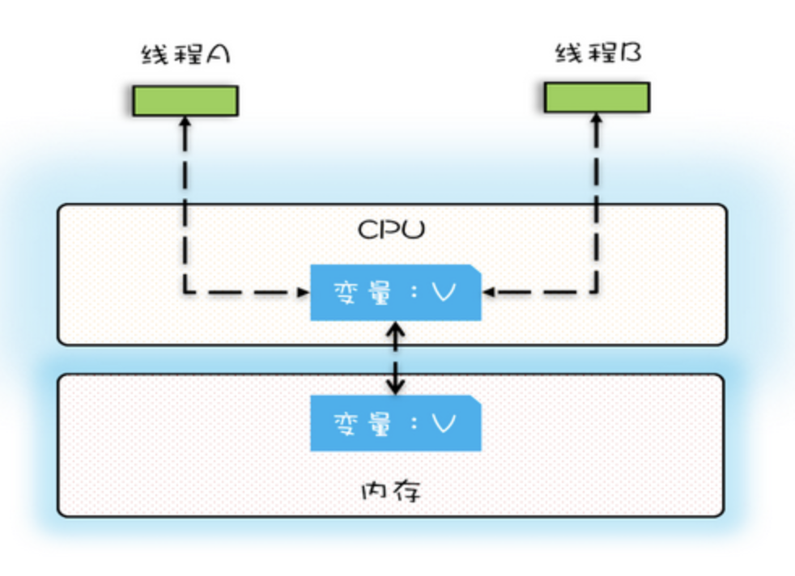
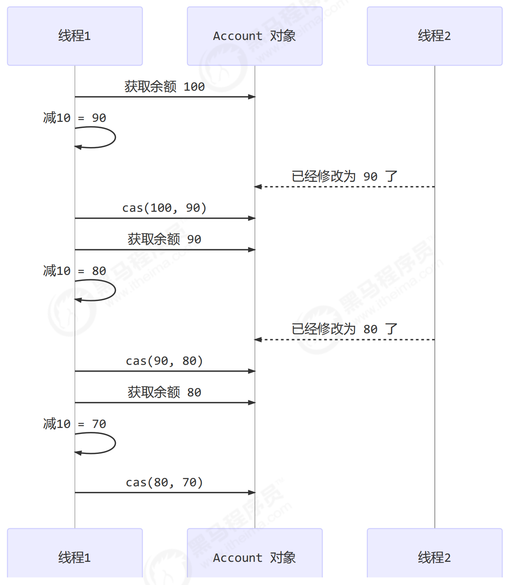

# 1、理论基础

既然多线程并发访问共享资源会导致静态条件的出现，那么为什么还要用多线程呢？

多线程并发访问共享资源导致数据错乱的根本原因是什么？

Java 针对这些问题的解决方案是什么？


## 1.1 并发编程的 Bug 源头

由于 `CPU` 和 `内存` & `I/O 设备` 之间的速度是有极大差异的，为了合理利用 CPU 的高性能，平衡这三者的速度差异，计算机体系结构、操作系统、编译程序都做出了相应的优化，主要体现为:

- CPU 增加了缓存，以均衡与内存的速度差异；// 导致 `可见性`问题
- 操作系统增加了进程、线程，以分时复用 CPU，进而均衡 CPU 与 I/O 设备的速度差异；// 导致 `原子性`问题
- 编译程序优化指令执行次序，使得缓存能够得到更加合理地利用。// 导致 `有序性`问题


### 1.1.1 缓存导致的可见性问题

可见性：一个线程对共享变量的修改，另外一个线程能够立刻看到。


单核时代，不同线程操作同一个 CPU 里面的缓存，不存在可见性问题。



多核时代，每颗 CPU 都有自己的缓存，不同的线程操作不同 CPU 的缓存时，对彼此之间就不具备可见性了。


### 1.1.2 线程切换导致的原子性问题

原子性：即一个操作或者多个操作要么全部执行并且执行的过程不会被任何因素打断，要么就都不执行。


线程只有被分配了 CPU 时间片后才能执行，线程切换的时机大多数是在时间片结束的时候。


我们现在使用的高级程序语言一条语句往往对应多条 CPU 指令，例如语句：count += 1，至少需要三条 CPU 指令。

- 指令1：首先，需要把变量 count 从内存加载到 CPU 的寄存器；
- 指令2：之后，在寄存器中执行 +1 操作；
- 指令3：最后，将结果写入内存（缓存机制导致可能写入的是 CPU 缓存而不是内存）;


操作系统做任务切换，可以发生在任何一条 CPU 指令执行完。这就可能得到意想不到的结果。


我们把一个或者多个操作在 CPU 执行的过程中不被中断的特性成为**原子性**。CPU 能够保证原子操作是 CPU 指令级别的，但不是高级语言的操作符，因此很多时候我们需要在高级语言层面保证操作的原子性。


### 1.1.3 编译优化导致的有序性问题

有序性：即程序执行的顺序按照代码的先后顺序执行。编译器为了优化性能，有时候会改变程序中语句的先后顺序。


双重检查创建单例对象

```java
public class Singleton {
  static Singleton instance;
  static Singleton getInstance(){
    if (instance == null) {
      synchronized(Singleton.class) {
        if (instance == null)
          instance = new Singleton();
      }
    }
    return instance;
  }
}
```


instance = new Singleton() 语句经过编译优化重排序后的CPU执行过程可能是：

- 分配一块内存M；
- 将M的地址赋值给instance实例；
- 最后再内存M上初始化Singleton对象。


当 `线程A` 执行完 `指令2` 时，发生 `线程切换`，`线程B` 调用 `getInstance()` 方法，获得未初始化的 `Singleton` 对象，如果此时访问对象成员变量，那么就可能触发空指针异常。


## 2. Java 如何解决可见性和有序性

可见行问题是由缓存导致的，有序性问题是由编译优化导致的，因此只要禁用缓存和编译优化就可以解决可见性和有序性问题。考虑到性能问题就需要根据实际情况按需禁用。


那么在 Java 中怎么按需禁用 `缓存` 和 `编译优化` 呢？

> Java 内存模型规范了 JVM 如何提供按需禁用缓存和编译优化的方法。具体来说，这些方法包括 volatile，synchronized 和 final 三个关键字，以及六项 Happens-Before 规则。


[https://blog.csdn.net/c15158032319/article/details/117361782#:~:text=Java内存模型与硬](https://blog.csdn.net/c15158032319/article/details/117361782#:~:text=Java内存模型与硬)


# 2、线程基础

线程有哪几种状态? 分别说明从一种状态到另一种状态转变有哪些方式?

通常线程有哪几种使用方式?

基础线程机制有哪些?

线程的中断方式有哪些?

线程的互斥同步方式有哪些? 如何比较和选择?

线程之间有哪些协作方式?


## 2.1 线程状态转换

线程各个状态转换的示意图如下


### 2.1.1 新建(New)

创建后尚未启动。

调用了 start()，仅仅是在语言层面创建了一个线程，此时还没有与操作系统进行关联。


### 2.1.2 可运行(Runnable)

可能正在运行，也可能正在等待 CPU 时间片。

包含了操作系统线程状态中的 Running 和 Ready。


### 2.1.3 阻塞(Blocking)

等待获取一个排它锁，如果其线程释放了锁就会结束此状态。


### 2.1.4 无限期等待(Waiting)

等待其它线程显式地唤醒，否则不会被分配 CPU 时间片。

| 进入方法                                   | 退出方法                             |
| ------------------------------------------ | ------------------------------------ |
| 没有设置 Timeout 参数的 Object.wait() 方法 | Object.notify() / Object.notifyAll() |
| 没有设置 Timeout 参数的 Thread.join() 方法 | 被调用的线程执行完毕                 |
| LockSupport.park() 方法                    | LockSupport.unpark()                 |


### 2.1.5 限期等待(Timed Waiting)

无需等待其它线程显式地唤醒，在一定时间之后会被系统自动唤醒。

调用 Thread.sleep() 方法使线程进入限期等待状态时，常常用 “使一个线程睡眠” 进行描述。

调用 Object.wait() 方法使线程进入限期等待或者无限期等待时，常常用 “挂起一个线程” 进行描述。

睡眠和挂起是用来描述行为，而阻塞和等待用来描述状态。

阻塞和等待的区别在于，阻塞是被动的，它是在等待获取一个排它锁。而等待是主动的，通过调用 Thread.sleep() 和 Object.wait() 等方法进入。

| 进入方法                                 | 退出方法                                        |
| ---------------------------------------- | ----------------------------------------------- |
| Thread.sleep() 方法                      | 时间结束                                        |
| 设置了 Timeout 参数的 Object.wait() 方法 | 时间结束 / Object.notify() / Object.notifyAll() |
| 设置了 Timeout 参数的 Thread.join() 方法 | 时间结束 / 被调用的线程执行完毕                 |
| LockSupport.parkNanos() 方法             | -                                               |
| LockSupport.parkUntil() 方法             | -                                               |


### 2.1.6 死亡(Terminated)

可以是线程结束任务之后自己结束，或者产生了异常而结束。


## 2.2 三种使用线程的方法

在 Java 中，创建线程有三种方法：

- 实现 Runnable 接口；
- 实现 Callable 接口；
- 继承 Thread 类。

实现 Runnable 和 Callable 接口的类只能当做一个可以在线程中运行的任务，不是真正意义上的线程，因此最后还需要通过 Thread 来调用。可以说任务是通过线程驱动从而执行的。


继承与实现接口相比，实现接口会更好一些，因为:

- Java 不支持多重继承，因此继承了 Thread 类就无法继承其它类，但是可以实现多个接口；
- 类可能只要求可执行就行，继承整个 Thread 类开销过大。


### 2.2.1 实现 Runnable 接口

需要实现 run() 方法。

通过 Thread 调用 start() 方法来启动线程。

```java
// 创建任务
Runnable runnable = new Runnable() {
    @Override
    public void run() {
        log.debug("通过 Runnable 接口创建的线程");
    }
};

// 创建并启动线程
new Thread(runnable).start();
```


### 2.2.2 实现 Callable 接口

与 Runnable 相比，Callable 可以有返回值，返回值通过 FutureTask 进行封装。

```java
// 创建任务
Callable callable = new Callable() {
    @Override
    public Object call() throws Exception {
        log.debug("通过 Callable 接口创建的线程");
        return 1;
    }
};

// 将任务封装进 FutureTask 中，以便后续从该线程中获取处理结果
FutureTask<Integer> futureTask = new FutureTask<>(callable);
// 创建并启动线程
new Thread(futureTask).start();

// 获取线程执行的结果
// 主线程执行到该 get() 方法时，会进入阻塞状态，直到子线程执行完毕
try {
    System.out.println(futureTask.get());
} catch (Exception e) {
    e.printStackTrace();
}
```


### 2.2.3 继承 Thread 类

```java
// 创建线程
Thread thread = new Thread(){
    public void run() {
        try {
            Thread.sleep(3000);
        } catch (InterruptedException e) {
            log.error(e.getMessage());
        }
        log.debug("通过 Thread 类创建的线程");
    }
};

// 启动线程
thread.start();
```


## 2.3 线程的常用方法

线程的方法，指的就是 Thread 中定义的方法


### 2.3.1 线程休眠

`Thread.sleep(millisec)` 用于休眠当前正在执行的线程，millisec 单位为毫秒。

sleep() 可能会抛出 InterruptedException，因为异常不能跨线程传播回 main() 中，因此必须在本地进行处理。线程中抛出的其它异常也同样需要在本地进行处理。

```java
Thread thread = new Thread(() -> {
    try {
        Thread.sleep(3000);
    } catch (InterruptedException e) {
        log.error(e.getMessage());
    }
    log.debug("子线程执行结束");
});

thread.start();

log.debug("主线程执行结束");
```

日志输出

```java
19:30:29 [main] - 主线程执行结束
19:30:32 [Thread-0] - 子线程执行结束
```


### 2.3.2 线程中断

一个线程执行完毕之后会自动结束，如果在运行过程中发生异常会提前结束。


Java 提供了线程中断以及判断某个线程是否被中断过的方法：

- interrupt()：给调用了该方法的线程设置一个中断标记，此时
    - 如果调用该方法的线程处于等待或阻塞状态，则会抛出 InterruptedException，并中断线程的执行；
    - 如果调用该方法的线程没有处于等待或阻塞状态，则线程会继续运行（只是设置了一个中断标记
- interrupted()：判断调用了该方法的线程是否被中断过（检查中断标记）
    - 注意，**Thread.interrupted() 的调用线程是当前正在执行的线程**！！！
    - 返回一个 boolean 值，并清除标记位（即：再次调用时，中断标记已经被清除，此时会返回一个 falase）
- isInterrupted()：判断调用了该方法的线程是否被中断过（检查中断标记）
    - 不会清除标记位


总的来说

- interrupt()：设置一个中断标记，如果处于等待或阻塞状态，则会抛出异常并中断线程；
- interrupted()：检测并清除中断标记；
- isInterrupted()：只检测中断标记；


```java
Thread t1 = new Thread(() -> {
    log.debug("t1 线程启动");
}, "t1");
t1.start();
t1.interrupt();

log.debug("第一次调用 t1.isInterrupted(): {}", t1.isInterrupted());
log.debug("第二次调用 t1.isInterrupted(): {}", t1.isInterrupted());

// 注意，Thread.interrupted() 作用于当前正在执行的线程，此处是 main 线程，而不是 t1 线程！！！
log.debug("第一次调用 Thread.interrupted(): {}", Thread.interrupted());
log.debug("第二次调用 Thread.interrupted(): {}", Thread.interrupted());

// interrupt() 作用于 main 线程
Thread.currentThread().interrupt();
log.debug("第一次调用 Thread.interrupted(): {}", Thread.interrupted());
log.debug("第二次调用 Thread.interrupted(): {}", Thread.interrupted());

log.debug("main 线程执行结束");
```

日志输出

```java
19:10:29 [t1] - t1 线程启动
19:10:29 [main] - 第一次调用 t1.isInterrupted(): true
19:10:29 [main] - 第二次调用 t1.isInterrupted(): true
19:10:29 [main] - 第一次调用 Thread.interrupted(): false
19:10:29 [main] - 第二次调用 Thread.interrupted(): false
19:10:29 [main] - 第一次调用 Thread.interrupted(): true
19:10:29 [main] - 第二次调用 Thread.interrupted(): false
19:10:29 [main] - main 线程执行结束
```


### 2.3.3 线程协作

`Thread.join()` 调用此方法的线程被阻塞，仅当该方法完成以后，才能继续运行。

```java
Thread thread1 = new Thread(() -> {
    try {
        Thread.sleep(1000);
    } catch (InterruptedException e) {
        log.error(e.getMessage());
    }
    // private static int r1 = 1;
    r1 = 10;
});

Thread thread2 = new Thread(() -> {
    try {
        Thread.sleep(2000);
    } catch (InterruptedException e) {
        log.error(e.getMessage());
    }
    // private static int r2 = 2;
    r2 = 20;
});

thread1.start();
thread2.start();

try {
    // 需要等待子线程执行完毕
    thread2.join();
    thread1.join();
} catch (InterruptedException e) {
    log.error(e.getMessage());
}

log.debug("r1 = {}", r1);
log.debug("r2 = {}", r2);
```

日志输出

```java
10:47:44 [main] - r1 = 10
10:47:44 [main] - r2 = 20
```


### 2.3.4 线程调度

`yield()` 用于提示线程调度器让出当前线程对 CPU 的使用。

告知 CPU 调度器，当前线程已经完成了生命周期中最重要的部分，可以切换给其它线程来执行。该方法只是对线程调度器的一个建议，而且也只是建议具有相同优先级的其它线程可以运行，是否执行还是看 CUP 的调度策略。


### 2.3.5 守护线程

`setDaemon()` 用于将一个线程设置为守护线程。

守护线程是程序运行时在后台提供服务的线程，不属于程序中不可或缺的部分。

当所有非守护线程结束时，程序也就终止，同时会杀死所有守护线程。

main() 属于非守护线程。

```java
Thread thread = new Thread(() -> {
    while (true) {
        if (Thread.currentThread().isInterrupted()) {
            break;
        }
    }
    log.debug("子线程执行结束");
});

thread.setDaemon(true);
thread.start();

try {
    Thread.sleep(3000);
} catch (InterruptedException e) {
    log.error(e.getMessage());
}

log.debug("主线程执行结束");
```

日志输出

```java
19:31:40 [main] - 主线程执行结束
```


# 3、共享模型之管程

在 Java 中，**共享模型**（Shared Memory Model）指的是多个线程共享同一内存区域，通过读写共享数据来进行通信。Java 的并发编程基于这种模型，多个线程可以访问相同的变量、对象或数据结构。该模型的关键在于线程之间如何协调和同步对共享资源的访问，以避免出现竞态条件和数据不一致的问题。


**共享模型的特点：**

1. **共享内存**：不同线程可以访问同一个内存区域中的数据。
2. **线程间通信**：线程通过共享数据进行信息交换。
3. **同步控制**：为了防止多个线程同时修改共享资源，通常需要通过同步（`synchronized`）或其他锁机制来保证线程安全。


**常见的共享问题：**

- **竞态条件**：多个线程同时修改共享数据，导致不可预测的结果。
- **内存可见性问题**：一个线程的修改可能在其他线程中不可见，导致数据不一致。
- **死锁**：多个线程相互等待对方释放资源，造成程序无法继续执行。


**解决共享问题的常用方式：**

- **同步**（`synchronized`）：保证同一时间只有一个线程访问共享资源。

- **原子操作**（如`AtomicInteger`）：确保操作的原子性，不需要显式加锁。

- **内存屏障**：通过`volatile`关键字或显式锁来保证共享数据的可见性。

    

总的来说，Java 的共享模型要求开发者小心管理多线程对共享资源的访问，使用合适的同步机制避免出现并发问题。


## 3.1 管程-悲观锁（阻塞）

悲观锁（Pessimistic Locking）是一种数据库或多线程编程中的锁机制，其核心思想是假设数据会被多个进程或线程同时修改，因此在操作数据时，会采取锁的方式，确保其他线程或进程不能对数据进行并发修改，直到当前操作完成。


**悲观锁的特点：**

1. **锁定数据**：在读取或修改数据时，先加锁，防止其他事务或线程对数据进行修改，直到当前操作完成。
2. **阻塞性**：其他请求该数据的操作会被阻塞，直到当前操作释放锁。
3. **性能开销**：由于锁的存在，可能会导致性能问题，尤其是在高并发场景下，多个线程需要等待锁的释放。


## 3.2 共享问题

共享问题指的是多个线程在并发执行时，访问和修改同一共享资源时可能出现的数据不一致或竞态条件问题。


比如以下案例：两个线程对初始值为 0 的静态变量一个做自增，一个做自减，各做 5000 次，结果为什么不一定是 0 ？

```java
public class Test05 {

    static int counter = 0;

    public static void main(String[] args) throws InterruptedException {
        Thread t1 = new Thread(() -> {
            for (int i = 0; i < 5000; i++) {
                counter++;
            }
        }, "t1");

        Thread t2 = new Thread(() -> {
            for (int i = 0; i < 5000; i++) {
                counter--;
            }
        }, "t2");

        t1.start();
        t2.start();
        t1.join();
        t2.join();

        log.debug("{}", counter);
    }
}
```


执行结果可能是正数、负数、零。为什么呢？


因为 Java 中对静态变量的自增，自减并不是原子操作，要彻底理解，必须从字节码来进行分析：


对于静态变量而言，实际会产生如下的 JVM 字节码指令:

```java
- getstatic      i			//	获取静态变量 i 的值（从主存获取值到工作内存）
- iconst_i							//	准备一个常量，且值为 1，用于准备进行自增操作
- iadd									//	进行自增操作
- putstatic      i			//	将自增后的值保存到静态变量 i 中（将值从工作内存保存到主存）
```


又由于计算机是采用分时系统，所以多个线程间会存在上下文切换，所以会出现自增字节码指令还没执行完毕时，线程就进行上下文切换，导致数据错乱。

```java
- 比如 t1 线程执行自增操作，执行 iadd 完成后，cup 时间片使用完毕，然后进行上下文切换（修改后的值还没从工作内存保存到主存
- 这时 t2 线程执行自减操作，执行 getstatic 时，从主存中获取到的值为 0，而不是 1，然后进行自减后将 -1 从工作内存保存到主存
- 然后 t2 运行完毕，轮到 t1 运行，t1 从上下文信息得知自己该执行 putstatic 指令了
- 此时 t1 往下运行 putstatis 指令，将之前的运算结果 1 保存到主存，这样就出现了数据错乱！！！
```


以上图解如下。


线程先从主存将变量复制到工作内存


在单线程环境下运行时，以上 8 行代码是没有问题的


但是在多线程环境下，这 8 行代码可能会交错执行（上下文切换导致），出现正负数情况


出现正数的情况


多线程操作共享变量出现数据错乱的原因：在多个线程对共享资源读写操作时发生指令交错（上下文切换导致指令错乱），就会出现问题


什么是临界区：一段代码块内如果存在对共享资源的多线程读写操作，称这段代码块为临界区

```java
static int counter = 0;

static void increment() {   // 临界区 
    counter++;
}

static void decrement() {   // 临界区 
    counter--;
}
```


什么是竞态条件：多个线程在临界区内执行，由于代码的执行序列不同而导致结果无法预测，称之为发生了竞态条件

```java
static int counter = 0;

// 线程1对临界区进行操作
Thread t1 = new Thread(() -> {
    for (int i = 0; i < 5000; i++) {
        counter++;
    }
}, "t1");

// 线程2对临界区进行操作
Thread t2 = new Thread(() -> {
    for (int i = 0; i < 5000; i++) {
        counter--;
    }
}, "t2");
```


## 3.3 synchronized 入门

为了避免临界区的竞态条件发生，有多种手段可以达到目的。

- 阻塞式的解决方案：synchronized，Lock

- 非阻塞式的解决方案：原子变量


`synchronized` 是 Java 中的一种关键字，用于控制对共享资源的访问，以保证线程安全。在多线程程序中，当多个线程访问同一个资源时，可能会发生竞争条件，导致数据不一致。通过使用 `synchronized`，可以确保同一时刻只有一个线程能够访问被同步的代码块或方法，从而避免数据冲突。


`synchronized` 关键字可以加在方法上或者代码块上，它们的区别如下：


**同步方法（方法级别）**
`synchronized` 可以用来修饰方法，表示该方法在同一时刻只能被一个线程执行。

```java
public synchronized void method() {
    // 同步代码块
}
```

这种方式是同步整个方法，在调用该方法的线程执行期间，其他线程无法访问该方法。


**同步代码块（代码块级别）**
`synchronized` 也可以用来修饰代码块，这样可以只同步部分代码，而不是整个方法。它需要一个锁对象，只有获取到这个锁的线程才能执行代码块中的代码。

```java
public void method() {
    synchronized (lockObject) {
        // 同步代码块
    }
}
```

在这个例子中，`lockObject` 是一个对象锁，只有当线程获得 `lockObject` 锁时，才能执行代码块中的内容。


**关键点：**

- 位置

    - 同步方法： 在方法上加 `synchronized`，表示对整个方法进行同步。

    - 同步代码块： 使用 `synchronized` 修饰代码块，可以在方法内对特定代码区域进行同步。通常会使用一个对象作为锁。

- 锁对象

    - 类锁（静态方法）：如果是静态方法（`static`），锁对象是类的 `Class` 对象。
    - 实例锁： 如果是实例方法（非静态），锁对象是当前实例（即 `this`）。

    

示例：同步实例方法和同步代码块

```java
public class SyncExample {

    // 同步实例方法
    public synchronized void instanceMethod() {
        // 这段代码在同一时刻只能被一个线程访问
        System.out.println("同步实例方法");
    }

    // 使用同步代码块
    public void methodWithBlock() {
        synchronized (this) {
            // 这段代码在同一时刻只能被一个线程访问
            System.out.println("同步代码块");
        }
    }

    // 使用类锁
    public static synchronized void staticMethod() {
        // 静态同步方法，锁的是 Class 对象
        System.out.println("同步静态方法");
    }
}
```


在多线程环境中，使用 `synchronized` 可以有效避免并发问题，但也要注意使用过多的同步可能会影响性能。


使用 `synchronized` 来决解此前的问题

```java
static int counter = 0;
static final Object room = new Object();

public static void main(String[] args) throws InterruptedException {
    Thread t1 = new Thread(() -> {
        for (int i = 0; i < 5000; i++) {
            synchronized (room) {
                counter++;
            }
        }
    }, "t1");
    Thread t2 = new Thread(() -> {
        for (int i = 0; i < 5000; i++) {
            synchronized (room) {
                counter--;
            }
        }
    }, "t2");
    t1.start();
    t2.start();
    t1.join();
    t2.join();
    log.debug("{}", counter);
}
```


代码的执行的时序图如下：


## 3.4 线程安全分析

在Java多线程环境中，不同类型的变量具有不同的线程安全性。我们可以从成员变量、静态变量和局部变量的角度进行分析。


**成员变量的线程安全性**

成员变量（即实例变量）在多线程环境中通常不是线程安全的。这是因为每个线程可能会访问同一个对象的成员变量，多个线程可能同时对成员变量进行读写操作，导致数据不一致或竞态条件（race conditions）。

- 如果多个线程修改同一个实例的成员变量，而这些线程没有使用适当的同步机制（如 `synchronized` 关键字、`Lock` 接口或原子变量等），则可能出现线程不安全的问题。
- 线程安全的实现方法包括使用同步方法、`synchronized` 块或者使用 `java.util.concurrent` 包中的线程安全类（如 `AtomicInteger`、`ReentrantLock` 等）。


**静态变量的线程安全性**

静态变量（即类变量）也是多线程环境中常见的线程安全问题来源。由于静态变量属于类的所有实例，多个线程可能会同时访问同一个类的静态变量，因此它们也不具备线程安全性，除非采取适当的同步措施。

- 静态变量如果没有同步机制保护，也可能会出现竞态条件。
- 同样，使用 `synchronized`，`Atomic` 类或者 `volatile` 关键字来确保线程安全。
- 比如，`AtomicInteger` 是线程安全的，可以用来替代普通的 `int` 类型静态变量，确保操作的原子性。


**局部变量的线程安全性**

局部变量通常是方法内的变量，它们的生命周期仅限于方法调用的过程中，因此局部变量在线程安全性方面通常不需要额外考虑。

- **局部变量是线程安全的**，因为每个线程都有自己的栈空间，每个线程在调用方法时都会在自己的栈上创建局部变量的副本。因此，多个线程调用同一个方法时，局部变量不会相互干扰。
- 但是，如果局部变量是引用类型对象并且该对象被共享或者该对象本身存在非线程安全的问题，则仍然需要考虑线程安全性。


**总结**

- **成员变量和静态变量**在多线程环境下通常不是线程安全的。它们可能需要同步机制来保证线程安全。

- **局部变量**是线程安全的，因为每个线程都有独立的栈空间来存储局部变量的副本，除非局部变量是引用类型对象并且这些对象在多个线程间共享。

    

为了确保多线程环境中的安全性，通常需要使用 `synchronized`、`volatile`、`Atomic` 类、`Lock` 等机制来保证数据一致性和原子性。


以下是一些常见的安全类

```java
String
Integer
StringBuffer
Random
Vector
Hashtable
java.util.concurrent 包下的类
```


这里说它们是线程安全的是指，多个线程调用它们同一个实例的某个方法时，是线程安全的。比如：

```java
Hashtable table = new Hashtable();

new Thread(() -> {
    table.put("key", "value1");
}).start();

new Thread(() -> {
    table.put("key", "value2");
}).start();
```


需要注意是：它们的每个方法是原子的，但它们多个方法的组合不是原子的，所以不是安全的，比如：

```java
Hashtable table = new Hashtable();

// 线程1，线程2 同时访问如下方法时，就是不安全的
if (table.get("key") == null) {
    table.put("key", value);
}
```


时序图如下：


## 3.5 Monitor

Java 的 monitor 是一种同步机制，用于控制多个线程对共享资源的访问，确保线程安全。


### 3.5.1 对象头

在介绍对象在内存中的组成结构前，我们先简要回顾一个对象的创建过程：

- JVM 将对象所在的 class 文件加载到方法区中；
- JVM 读取 main 方法入口，将 main 方法入栈，执行创建对象代码;
- 在 main 方法的栈内存中分配对象的引用，在堆中分配内存放入创建的对象，并将栈中的引用指向堆中的对象;


所以当对象在实例化完成之后，是被存放在堆内存中的，这里的对象由3部分组成，如下图所示：


对各个组成部分的功能简要进行说明

- 对象头：对象头存储的是对象在运行时状态的相关信息、指向该对象所属类的元数据的指针，如果对象是数组对象那么还会额外存储对象的数组长度；

- 实例数据：实例数据存储的是对象的真正有效数据，也就是各个属性字段的值，如果在拥有父类的情况下，还会包含父类的字段。字段的存储顺序会受到数据类型长度、以及虚拟机的分配策略的影响；

- 对齐填充字节：在 Java 对象中，需要对齐填充字节的原因是，64 位的 JVM 中对象的大小被要求向 8 字节对齐，因此当对象的长度不足8字节的整数倍时，需要在对象中进行填充操作;

    

对于学习多线程来说，最主要的部分就是对象头中的 Markword，所以仅先学习对象头。

 

对象头（Object header）的组成部分，根据普通对象和数组对象的不同，结构将会有所不同。只有当对象是数组对象才会有数组长度部分，普通对象没有该部分，如下图所示

 

普通对象

```java
|-----------------------------------------------------------|
|                    Object Header (64 bits)                |
|---------------------------------|-------------------------|
|             Mark Word (32 bits) | Klass Word (32 bits)    |
|---------------------------------|-------------------------|
```


数组对象

```java
|---------------------------------------------------------------------------------|
|                                  Object Header (96 bits)                        |
|--------------------------------|-----------------------|------------------------|
|       Mark Word(32bits)        | Klass Word(32bits)    | array length(32bits)   |
|--------------------------------|-----------------------|------------------------|

```


其中，Klass Word 是用于存储对象的类型指针，该指针指向它所属类的元数据（指向被 JVM 加载到方法区中的 Class 对象），这样 JVM 才能知道对象是哪个类的实例。

 

而 Mark Word 是用于存储对象在运行时的一些数据，如：hashcode，GC 分代年龄等。Mark Word 的长度为 JVM 的一个 Word 的大小，也就是说 32 位的 JVM 的 Mark Word 为 32 位，64 位的 JVM 的 Mark Word 为 64 位。

 

为了让一个 Word 能存储更多信息，JVM 将 Word 的最低两位设置为标记为，不同的标记为表示对象处于不同的状态，具体如下

```java
|--------------------------------------------------------------------------------------------------------------|
|                                          Object Header(64bits)                                               |
|--------------------------------------------------------------------------------------------------------------|
|                    Mark Word(32bits)                           |  Klass Word(32bits)    |      State         |
|--------------------------------------------------------------------------------------------------------------|
|     hashcode:25                   | age:4 | biased_lock:0 | 01 | OOP to metadata object |      Nomal         |
|--------------------------------------------------------------------------------------------------------------|
|     thread:23           | epoch:2 | age:4 | biased_lock:1 | 01 | OOP to metadata object |      Biased        |
|--------------------------------------------------------------------------------------------------------------|
|     ptr_to_lock_record:30                                 | 00 | OOP to metadata object | Lightweight Locked |
|--------------------------------------------------------------------------------------------------------------|
|     ptr_to_heavyweight_monitor:30                         | 10 | OOP to metadata object | Heavyweight Locked |
|--------------------------------------------------------------------------------------------------------------|
|                                                           | 11 | OOP to metadata object |    Marked for GC   |
|--------------------------------------------------------------------------------------------------------------|


```


标记信息的含义如下：

1. **Hashcode**

    - 当你调用`Object.hashCode()`方法时，JVM会计算并返回对象的哈希值。为了优化性能，JVM会将对象的哈希码缓存起来，在`Mark Word`中存储。

    - 如果对象没有显式的哈希码值，JVM会计算它的哈希码。

2. **Age**
    - 这个字段与垃圾回收（GC）相关，特别是与年轻代（Young Generation）中的对象生命周期有关。它记录了对象的年龄，即对象经历的GC轮次数。
    - 在对象晋升到老年代之前，年龄用于决定何时晋升对象。

3. **Biased Lock**
    - **偏向锁**是一种优化，旨在减少锁竞争。偏向锁假定只有一个线程会访问该对象，因此它在`Mark Word`中存储了线程ID。如果对象的锁没有竞争，JVM会偏向于当前线程，这样可以避免每次获取锁时的复杂性。
    - 如果有其他线程争用锁，偏向锁会被撤销并转为轻量级锁（Spin Lock）。

4. **Thread**
    - 这个字段存储了当前线程的ID，在偏向锁（Biased Lock）模式下使用。当对象加锁时，如果启用了偏向锁，JVM会记录哪个线程持有锁，以便后续的访问可以快速判断是否由该线程访问。

5. **Epoch**
    - 在JVM中，`Epoch`字段与偏向锁的撤销有关。它用于管理锁的偏向状态，通常与锁的撤销和重置操作相关。

6. **ptr_to_lock_record**

    - 这是指向锁记录的指针，用于在对象锁定时存储锁的相关信息。锁记录包含了对象的锁信息，可能用于管理不同的锁状态（如轻量级锁、重量级锁等）。

    - 这个指针的存在是为了帮助JVM管理锁的状态转换，例如从偏向锁转换到轻量级锁或重量级锁。

7. **ptr_to_heavyweight_monitor**
    - 当对象的锁变得非常争用（即多个线程试图访问同一个对象），对象的锁会变成重量级锁，这时JVM会将`Mark Word`中的相关信息转换为指向一个重量级监视器（heavyweight monitor）的指针。这个监视器用于管理线程的排队和阻塞。


### 3.5.2 Monitor

什么是 Monitor？可以把它理解为一个同步工具，也可以描述为一种同步机制，它通常被描述为一个对象。与一切皆对象一样，所有的 Java 对象是天生的 Monitor，每一个 Java 对象都有成为Monitor 的潜质，因为在 Java 的设计中 ，每一个 Java 对象自打娘胎里出来就带了一把看不见的锁，它叫做内部锁或者 Monitor 锁。Moniter 也就是通常说 Synchronized 的对象锁，MarkWord 锁标识位为 10，其中指针指向的是 Monitor 对象的起始地址。

在 Java 虚拟机（HotSpot）中，Monitor 是由 ObjectMonitor 实现的，其主要数据结构如下（位于HotSpot虚拟机源码ObjectMonitor.hpp文件，C++实现的）：

```java
ObjectMonitor() {
    _header       = NULL;
    _count        = 0;    //记录个数
    _waiters      = 0,
    _recursions   = 0;
    _object       = NULL;
    _owner        = NULL;
    _WaitSet      = NULL; //处于wait状态的线程，会被加入到_WaitSet
    _WaitSetLock  = 0 ;
    _Responsible  = NULL ;
    _succ         = NULL ;
    _cxq          = NULL ;
    FreeNext      = NULL ;
    _EntryList    = NULL ; //处于等待锁block状态的线程，会被加入到该列表
    _SpinFreq     = 0 ;
    _SpinClock    = 0 ;
    OwnerIsThread = 0 ;
}
```


ObjectMonitor 中有两个队列，WaitSet 和 EntryList，用来保存 ObjectWaiter 对象列表（ 每个等待锁的线程都会被封装成 ObjectWaiter 对象 ），Owner 指向持有 ObjectMonitor 对象的线程，用于表示该对象锁已经被线程持有。图列：


上图的线程获取 Monitor 的流程如下：

- 开始时     Monitor 中 Owner 为 null；

- 当 Thread-2 进入临界区并执行 synchronized(obj) 时，就会将     Monitor 的所有者 Owner 置为     Thread-2（Owner 指向线程对象，obj 对象的 Mark Word 指向 Monitor），把对象原有的     MarkWord 存入线程栈中的锁记录中；
- 在     Thread-2 上锁的过程，Thread-3、Thread-4、Thread-5 页进入临界区并执行     synchronized(obj)，就会进入 EntryList（双向链表），线程状态变为 BLOCKED；

- Thread-2 执行完临界区的代码后，根据 obj 对象的 Mark Word 中的引用地址找到 Monitor 对象，设置 Owner 为空，并把此前保存在栈帧的锁记录中的     obj Mark Word     信息还原到 obj 的 Mark Word 中；
- 然后 Thread-2 唤醒 EntryList     中等待的线程，被唤醒的线程开始竞争锁，竞争是非公平的，如果这时有新的线程想要获取锁，可能直接就抢占到了，阻塞队列的线程就会继续阻塞；
- WaitSet 中的 Thread-0 和 Thread-1 是以前获得过锁，但由于不满足继续执行的条件，从而进入 WAITING 状态的线程（wait-notify 机制）；

 

注意：synchronized 必须是进入同一个对象的 Monitor 才有上述的效果，不加 synchronized 的对象不会关联监视器，不遵从以上规则。


### 3.5.3 synchronized 进阶

synchronized 的实现方式涉及偏向锁、轻量级锁和重量级锁。这些锁的设计目的是提升性能，减少线程争用时的开销。需要注意的是，然后锁分为了偏向锁、轻量级锁和重量级锁，但在使用的时候，都是用的 synchronized 关键字，锁的膨胀对开发者来说是透明的。


首先，先从字节码的角度理解 synchronize 的执行流程。执行如下代码：

```java
static final Object lock = new Object();
static int counter = 0;

public static void main(String[] args) {
    synchronized (lock) {
        counter++;
    }
}
```


得到的字节码如下：

```java
0: 	getstatic     #2		// 获取 lock 对象的引用，这个引用是 static final 类型的。#2 表示 lock 变量在常量池中的索引。
3: 	dup									// dup 指令复制栈顶的对象引用（即 lock），为 monitorenter 指令提供必要的操作数。
4: 	astore_1						// 将栈顶的 lock 引用存储到本地变量 1 位置。这个位置用于存储锁对象的副本。
5: 	monitorenter				// 获取 lock 对象的监视器锁，确保同步代码块中代码的原子性。
6: 	getstatic     #3    // 获取静态变量 counter 的值。#3 是 counter 变量在常量池中的索引。            
9: 	iconst_1						// 将常量 1 推送到栈顶，准备与 counter 进行加法操作。
10: iadd								// 将栈顶的两个整数相加（counter 和 1），并将结果压回栈顶。
11: putstatic     #3    // 将栈顶的值存回 counter 变量中，完成 counter++ 操作。
14: monitorexit					// 释放 lock 对象的监视器锁，退出同步块，确保在多个线程中不会发生竞争条件。
15: return							// 返回方法，程序执行结束。

```


这段字节码展示了同步块的执行过程，锁定 `lock` 对象、修改 `counter` 的值并解锁。注意：方法级别的 synchronized 不会在字节码指令中有所体现。


### 3.5.3.1 偏向锁

很多时候，同步代码其实只有一个线程在执行，并不存在竞争锁的情况。这时候直接加锁就会导致性能问题。偏向锁是 Java 的一种锁优化方式，适用于没有线程竞争的情况。当一个线程获得锁之后，它会偏向于该线程，这意味着后续的锁请求会直接授予该线程，而不需要获取锁。只有当其他线程尝试获取锁时，偏向锁才会被撤销。


简单来说就是：只有第一次使用 CAS 将线程 ID 设置到对象的 Mark Word 头，之后发现这个线程 ID 是自己的就表示没有竞争，不用重新 CAS。以后只要不发生竞争，这个对象就归该线程所有


例如一下代码的执行时，然后锁被使用了三次，但是都是同一个线程使用，不存在其他线程，使用的就是偏向锁

```java
static final Object obj = new Object();

public static void m1() {
    synchronized (obj) {
        // 同步块 A
        m2();
    }
}

public static void m2() {
    synchronized (obj) {
        // 同步块 B
        m3();
    }
}

public static void m3() {
    synchronized (obj) {
        // 同步块 C
    }
}

public static void main(String[] args) {
    Thread thread = new Thread(() -> {Test.m1();});
}
```


执行流程如下


对于偏向锁，需要注意的是：

- 如果开启了偏向锁（默认开启），那么对象创建后，markword 最后 3 位为 101，这时它的 threadId、epoch、age 都为 0。

- 如果没有开启偏向锁，那么对象创建后，markword 最后 3 位为 001，这时它的 hashcode、age 都为 0，第一次用到 hashcode() 时才会赋值（hashcode）。
- 偏向锁是默认是延迟的，不会在程序启动时立即生效，如果想避免延迟，可以加 VM 参数 -XX:BiasedLockingStartupDelay=0 来禁用延迟


导致偏向锁撤销的场景：

- 调用对象的 hashcode() 时，会导致偏向锁被撤销。原因：要存储 hashcode，但是 mark word 空间不够，只能占用 threadId 的位置，从而导致偏向锁被撤销。
- 发生锁膨胀，也会导致偏向锁被撤销。


### 3.5.3.2 轻量级锁

轻量级锁是为了减少锁竞争的开销。它在无竞争的情况下采用自旋的方式来获取锁，即线程尝试获取锁时，如果锁未被占用，线程会短时间内不断尝试获得锁。如果锁被占用，线程会放弃自旋，升级为重量级锁。


简单来说：如果一个对象虽然有多线程要加锁，但加锁的时间是错开的（也就是没有竞争），那么可以使用轻量级锁来优化。


假设有两个方法同步块，然后有两个线程0和1会进行访问，但是它们一个是上午访问，一个是下午访问，时间是错开的。即：虽然有多个线程都会访问同一个锁，但是访问时间不存在交叉，没有发生锁竞争。那么就会使用轻量级锁。

```java
static final Object obj = new Object();

public static void method1() {
    synchronized (obj) {
        // 同步块 A
        method2();
    }
}

public static void method2() {
    synchronized (obj) {
        // 同步块 B
    }
}
```


当一个线程启动时，JVM 会为该线程在【虚拟机栈】中分配一块【栈内存】，这块【栈内存】时是线程私有的。每当线程访问方法时，都会在其【栈内存】中创建一个【栈贞】。【栈贞】遵循【先进后去】的原则。

栈帧的主要构成如下：

1. 局部变量表：用于存储方法的输入参数和局部变量。每个局部变量占用一定的空间，按照顺序存储。

2. 锁记录：包含【锁记录的地址引|00】以及【锁对象的引用】，应用与轻量级锁（让线程与锁对象相互找到对方，同时保存锁对情的对象头信息）。

3. 操作数栈：用于存储中间计算结果，是方法执行过程中用于操作的栈，类似于一个临时数据区。

4. 方法返回地址：指向方法调用完成后的返回地址。

5. 动态链接：指向方法的引用，存储当前方法调用的常量池引用。

    

以下为上述代码的图解，首先【Thread-0】准备访问【method1()】


然后进行【锁记录】的 CAS 交换

- 首先找到【Thread-0】的【method1栈贞】。
- 然后找到【method1栈贞】的【锁记录】。
- 然后在找到【锁记录】中的【Object reference】，将其引用指向【锁对象】。
- 尝试用 CAS 替换 Object 的 Mark Word，将 Mark Word 的值存 入锁记录


如果 CAS 替换成功，对象头中存储了 锁记录地址和状态 00 ，表示由该线程给对象加锁，这时图示如下


如果 CAS 失败，则有两种情况

- 情况一：如果是其它线程已经持有了该 Object 的轻量级锁，这时表明有竞争，进入锁膨胀过程，升级为重量级锁。
- 情况二：如果是自己执行了 synchronized 锁重入，那么再添加一条 Lock Record 作为重入的计数。


### 3.5.3.3 重量级锁

当多个线程频繁竞争同一锁时，轻量级锁会升级为重量级锁。重量级锁会使线程阻塞，操作系统需要将线程从用户态切换到内核态，开销较大。


比如上面的【轻量级锁】进行 CAS 时，出现失败的【情况一】场景。即：在尝试加轻量级锁的过程中，CAS 操作无法成功，这时一种情况就是有其它线程为此对象加上了轻量级锁（有竞争），这时需要进行锁膨胀，将轻量级锁变为重量级锁。

```java
static Object obj = new Object();

public static void method1() {
    synchronized (obj) {	// 【Thread-0】和【Thread-1】同时访问，产生了【锁竞争】
        // 同步块
    }
}
```


当 Thread-1 进行轻量级加锁时，Thread-0 已经对该对象加了轻量级锁


这时 Thread-1 加轻量级锁失败，进入锁膨胀流程

- 立即为 Object 对象申请 Monitor 锁，让 Object 指向重量级锁地址。
- 然后自己进入 Monitor 的 EntryList 中进行等待，并进入 BLOCKED 状态。


当【Thread-0】退出同步块解锁时，想使用 CAS 将 Mark Word 的值恢复给对象头，失败（锁对象的 Mark Word 标记为已经不是00，而是10，不能再按轻量级锁的流程解锁了）。这时会进入重量级解锁流程，即按照 Monitor 地址找到 Monitor 对象，设置 Owner 为 null，唤醒 EntryList 中 BLOCKED 线程。


需要注意的是，当唤醒 EntryList 中 BLOCKED 线程后，这些线程会进行非公平竞争锁。


### 3.5.3.4 锁自旋

重量级锁竞争的时候，还可以使用自旋来进行优化，如果当前线程自旋成功（即这时候持锁线程已经退出了同步块，释放了锁），这时当前线程就可以避免阻塞。

锁自旋优化主要是为了提高多线程程序在高并发环境下的性能，尤其是在某些情况下锁的争用不激烈时，可以通过避免频繁的上下文切换来提高性能。

在 Java 6 之后自旋锁是自适应的，比如对象刚刚的一次自旋操作成功过，那么认为这次自旋成功的可能性会高，就多自旋几次；反之，就少自旋甚至不自旋，总之，比较智能。


### 3.5.3.5 锁消除

Java 锁消除（Lock Elimination）是 JIT（即时编译器）优化的一部分，目的是减少不必要的同步操作，以提高程序的性能。锁消除主要是在编译期间进行的，它会分析代码并尝试消除那些在执行过程中不实际需要的同步锁。


锁消除的前提是，JIT 编译器通过静态分析可以确定某些同步块的锁在某些情况下并不会导致竞争条件。换句话说，锁消除的目标是避免在没有多线程竞争的情况下加锁，从而减少同步操作带来的开销。


锁消除的场景：

- 局部变量和方法中的锁：JIT 编译器会分析对象的生命周期，推测某个对象是否只在一个线程中使用，如果是，则可以消除对该对象的同步。
- 不可共享的数据：如果数据始终在一个线程中使用，则 JIT 编译器可以推断该数据是“线程私有”的，从而消除锁的开销。


锁消除的代码案例

```java
public class MyBenchmark {
    static int x = 0;

    public void a() throws Exception {
        x++;
    }

    public void b() throws Exception {
        Object o = new Object();
        synchronized (o) {	// 局部变量，切没有逃逸，加不加锁没有影响，所以该锁会被 JIT 优化去掉
            x++;
        }
    }
}
```


## 3.6 wait/nofity

在 Java 中，`wait()` 和 `notify()` 是用于线程间通信的基本方法，它们属于 `Object` 类，因此可以在任何对象上调用。


### 3.6.1 wait()

- 作用：

    - 让当前线程进入等待状态，直到它被其他线程通过 `notify()` 或 `notifyAll()` 唤醒。

- 特点

    - 需要在同步块中调用（即必须持有锁）。

    - 线程进入等待状态后会释放锁，允许其他线程获取该锁。

    - `wait()` 方法有三种重载形式，可以指定等待时间（单位：毫秒和纳秒），如果在指定时间内没有被唤醒，线程会自动唤醒。

        

### 3.6.2 notify()

- 作用：

    - 唤醒在当前对象监视器上等待的单个线程。该线程会在下次获取锁时继续执行。

- 特点

    - 必须在同步块中调用（即必须持有锁）。

    - 唤醒的线程并不一定立即执行，它需要等待当前线程释放锁。

    - 通常用于生产者-消费者模型中的信号传递。

        

### 3.6.3 notifyAll()

- 作用：
    - 唤醒在当前对象监视器上等待的所有线程。
- 特点
    - 同样必须在同步块中调用。
    - 会唤醒所有等待的线程，允许它们重新竞争锁资源。


### 3.6.4 wait() 和 sleep()

wait() 和 sleep() 都用于暂停线程的执行，但它们有几个主要区别：

- 所属类：

    - wait() 是 Object 类的方法，必须在同步块或同步方法中调用，并且它会释放当前对象的锁。
    - sleep() 是 Thread 类的方法，不需要在同步块中调用，也不会释放锁。

- 使用场景：

    - wait() 用于线程间的通信，通常在多线程环境下，某个线程等待某个条件满足时调用。它会使当前线程放弃锁，并使线程进入等待状态，直到被唤醒。
    - sleep() 用于使当前线程休眠一段时间，进入阻塞状态，指定的时间后自动恢复运行。它不涉及线程间的通信。

- 唤醒方式：

    - wait() 需要通过其他线程调用 notify() 或 notifyAll() 来唤醒。

    - sleep() 在指定的时间过去后自动醒来。

        

总之，wait() 用于线程间的同步和通信，而 sleep() 只是让线程休眠，不涉及同步或通信。


### 3.6.5 park() 和 unpark()

park & unpark 和 wait & notify 的区别？

- wait，notify 和 notifyAll 必须配合 Object Monitor 一起使用，而 park，unpark 不必。

- park & unpark 是以线程为单位来【阻塞】和【唤醒】线程，而 notify 只能随机唤醒一个等待线程，notifyAll 

    是唤醒所有等待线程，就不那么【精确】

- park & unpark 可以先 unpark，而 wait & notify 不能先 notify

    

**总结**：

- park & unpark 更灵活且底层，不依赖于对象锁。
- wait & notify 依赖于对象锁，适用于条件同步，通常用于基于锁的线程间协作。


### 3.6.6 避免虚假唤醒

为了避免虚假唤醒，我们通常需要将 `wait()` 调用放在循环中，并检查线程是否满足继续执行的条件。这样，即使 `notifyAll()` 被调用后线程被唤醒，它也会检查条件是否满足，而不是直接执行，从而避免虚假唤醒的情况。


以下是一个实现两个消费线程同时访问共享资源，并使用 `wait()` 和 `notifyAll()` 进行通信的 Java 示例代码：

```java
import org.slf4j.Logger;
import org.slf4j.LoggerFactory;

public class ProducerConsumerExample {

    private static final Object lock = new Object(); // 锁对象
    private static int resource = 0; // 共享资源
    private static final Logger logger = LoggerFactory.getLogger(ProducerConsumerExample.class); // 创建日志对象

    // 消费者线程
    static class Consumer extends Thread {
        @Override
        public void run() {
            while (true) {
                synchronized (lock) {
                    // 在进入临界区时，检查资源是否可用
                    while (resource == 0) {
                        try {
                            lock.wait(); // 资源不可用时，消费者等待
                        } catch (InterruptedException e) {
                            Thread.currentThread().interrupt();
                        }
                    }

                    // 消费资源
                    resource--;
                    logger.debug("{} consumed a resource, remaining: {}", Thread.currentThread().getName(), resource);

                    // 唤醒生产者线程
                    lock.notifyAll();
                }

                try {
                    Thread.sleep(1000); // 模拟消费过程的延迟
                } catch (InterruptedException e) {
                    Thread.currentThread().interrupt();
                }
            }
        }
    }

    // 生产者线程
    static class Producer extends Thread {
        @Override
        public void run() {
            while (true) {
                synchronized (lock) {
                    // 在进入临界区时，检查资源是否已满
                    while (resource > 0) {
                        try {
                            lock.wait(); // 资源已满时，生产者等待
                        } catch (InterruptedException e) {
                            Thread.currentThread().interrupt();
                        }
                    }

                    // 生产资源
                    resource++;
                    logger.debug("{} produced a resource, remaining: {}", Thread.currentThread().getName(), resource);

                    // 唤醒消费者线程
                    lock.notifyAll();
                }

                try {
                    Thread.sleep(1000); // 模拟生产过程的延迟
                } catch (InterruptedException e) {
                    Thread.currentThread().interrupt();
                }
            }
        }
    }

    public static void main(String[] args) {
        // 启动生产者线程
        Thread producer1 = new Producer();
        Thread producer2 = new Producer();

        // 启动消费者线程
        Thread consumer1 = new Consumer();
        Thread consumer2 = new Consumer();

        producer1.start();
        producer2.start();
        consumer1.start();
        consumer2.start();
    }
}
```


### 3.7 异步生产者与消费者

定义一个消息队列，用于生产与消费消息

- 消费队列可以用来平衡生产和消费的线程资源

- 生产者仅负责产生结果数据，不关心数据该如何处理，而消费者专心处理结果数据

- 消息队列是有容量限制的，满时不会再加入数据，空时不会再消耗数据

- JDK 中各种阻塞队列，采用的就是这种模式


模型如下：


代码如下：

```java
@Slf4j(topic = "c.Test09")
public class Test09 {
    public static void main(String[] args) {
        MessageQueue messageQueue = new MessageQueue(2);
        // 4 个生产者线程, 下载任务
        for(int i = 0; i < 4; i++) {
            int id = i;
            new Thread(() -> {
                messageQueue.put(new Message(id, "值" + id));
            }, "生产者" + i).start();
        }

        // 1 个消费者线程, 处理结果
        new Thread(() -> {
            while (true) {
                try {
                    Thread.sleep(1000);
                } catch (InterruptedException e) {
                    throw new RuntimeException(e);
                }
                Message message = messageQueue.take();
                log.debug("消费消息：{}，{}", message.getId(), message.getMessage());
            }
        }, "消费者").start();
    }
}


@Slf4j(topic = "c.Message")
class Message {
    private int id;
    private Object message;

    public Message(int id, Object message) {
        this.id = id;
        this.message = message;
    }

    public int getId() {
        return id;
    }

    public Object getMessage() {
        return message;
    }
}

@Slf4j(topic = "c.MessageQueue")
class MessageQueue {
    private LinkedList<Message> queue;
    private int capacity;

    public MessageQueue(int capacity) {
        this.capacity = capacity;
        queue = new LinkedList<>();
    }

    public Message take() {
        synchronized (queue) {
            while (queue.isEmpty()) {
                log.debug("没货了, wait");
                try {
                    queue.wait();
                } catch (InterruptedException e) {
                    e.printStackTrace();
                }
            }
            Message message = queue.removeFirst();
            queue.notifyAll();
            return message;
        }
    }

    public void put(Message message) {
        synchronized (queue) {
            while (queue.size() == capacity) {
                log.debug("库存已达上限, wait");
                try {
                    queue.wait();
                } catch (InterruptedException e) {
                    e.printStackTrace();
                }
            }
            log.debug("存入消息：{}", message.getMessage());
            queue.addLast(message);
            queue.notifyAll();
        }
    }
}
```


输出如下

```java
17:13:25 [生产者0] - 存入消息：值0
17:13:25 [生产者3] - 存入消息：值3
17:13:25 [生产者2] - 库存已达上限, wait
17:13:25 [生产者1] - 库存已达上限, wait
17:13:26 [消费者] - 消费消息：0，值0
17:13:26 [生产者2] - 存入消息：值2
17:13:26 [生产者1] - 库存已达上限, wait
17:13:27 [消费者] - 消费消息：3，值3
17:13:27 [生产者1] - 存入消息：值1
17:13:28 [消费者] - 消费消息：2，值2
17:13:29 [消费者] - 消费消息：1，值1
17:13:30 [消费者] - 没货了, wait
```


## 3.7 线程状态转换

下图是线程的各个状态相互转换的示意图：


假设有线程 Thread-t


**情况 1、NEW --> RUNNABLE**

当调用 t.start() 方法时，由 NEW --> RUNNABLE


**情况 2、RUNNABLE <--> WAITING**

**t** **线程**调用 synchronized(obj) 获取了对象锁后

- 调用 obj.wait() 方法时，**t** **线程**从 RUNNABLE --> WAITING

- 调用 obj.notify() ， obj.notifyAll() ， t.interrupt() 时

    - 竞争锁成功，**t** **线程**从 WAITING --> RUNNABLE

    - 竞争锁失败，**t** **线程**从 WAITING --> BLOCKED


**情况 3、RUNNABLE <--> WAITING**

- **当前线程**调用 t.join() 方法时，**当前线程**从 RUNNABLE --> WAITING
    - 注意是**当前线程**在**t** **线程对象**的监视器上等待

- **t** **线程**运行结束，或调用了**当前线程**的 interrupt() 时，**当前线程**从 WAITING --> RUNNABLE


**情况 4、RUNNABLE <--> WAITING**

当前线程调用 LockSupport.park() 方法会让当前线程从 RUNNABLE --> WAITING

- 调用 LockSupport.unpark(目标线程) 或调用了线程 的 interrupt() ，会让目标线程从 WAITING --> RUNNABLE


**情况 5、RUNNABLE <--> TIMED_WAITING**

**t** **线程**用 synchronized(obj) 获取了对象锁后

- 调用 obj.wait(long n) 方法时，**t** **线程**从 RUNNABLE --> TIMED_WAITING

- **t** **线程**等待时间超过了 n 毫秒，或调用 obj.notify() ， obj.notifyAll() ， t.interrupt() 时
    - 竞争锁成功，**t** **线程**从 TIMED_WAITING --> RUNNABLE
    - 竞争锁失败，**t** **线程**从 TIMED_WAITING --> BLOCKED


**情况 6、RUNNABLE <--> TIMED_WAITING**

- **当前线程**调用 t.join(long n) 方法时，**当前线程**从 RUNNABLE --> TIMED_WAITING
    - 注意是**当前线程**在**t** **线程对象**的监视器上等待
- **当前线程**等待时间超过了 n 毫秒，或**t** **线程**运行结束，或调用了**当前线程**的 interrupt() 时，**当前线程**从 TIMED_WAITING --> RUNNABLE


**情况 7、RUNNABLE <--> TIMED_WAITING**

- 当前线程调用 Thread.sleep(long n) ，当前线程从 RUNNABLE --> TIMED_WAITING
- **当前线程**等待时间超过了 n 毫秒，**当前线程**从 TIMED_WAITING --> RUNNABLE


**情况 8、RUNNABLE <--> TIMED_WAITING**

当前线程调用 LockSupport.parkNanos(long nanos) 或 LockSupport.parkUntil(long millis) 时，**当前线程**从 RUNNABLE --> TIMED_WAITING

调用 LockSupport.unpark(目标线程) 或调用了线程 的 interrupt() ，或是等待超时，会让目标线程从 TIMED_WAITING--> RUNNABLE


**情况 9、RUNNABLE <--> BLOCKED**

- **t** **线程**用 synchronized(obj) 获取了对象锁时如果竞争失败，从 RUNNABLE --> BLOCKED
- 持 obj 锁线程的同步代码块执行完毕，会唤醒该对象上所有 BLOCKED 的线程重新竞争，如果其中 **t** **线程**竞争成功，从 BLOCKED --> RUNNABLE ，其它失败的线程仍然 BLOCKED


**情况 10、RUNNABLE <--> TERMINATED**

当前线程所有代码运行完毕，进入 TERMINATED


## 3.8 多把锁

一间大屋子有两个功能：睡觉、学习，互不相干。

- 现在张三要学习，里斯要睡觉，但如果只用一间屋子（一个对象锁）的话，那么并发度很低。
- 解决方法是准备多个房间（多个对象锁）


将锁的粒度细分

- 好处，是可以增强并发度

- 坏处，如果一个线程需要同时获得多把锁，就容易发生死锁

    

```java
public class RoomExample {
    // 创建两个房间锁，分别用于学习和睡觉
    private final Object studyRoomLock = new Object();
    private final Object sleepRoomLock = new Object();

    public static void main(String[] args) {
        RoomExample example = new RoomExample();

        // 创建线程分别进行学习和睡觉
        Thread zhangSanThread = new Thread(example::study);
        Thread liSiThread = new Thread(example::sleep);

        // 启动线程
        zhangSanThread.start();
        liSiThread.start();
    }

    // 张三学习的方法
    public void study() {
        synchronized (studyRoomLock) {  // 获取学习房间锁
            logger.debug("张三开始学习");
            try {
                // 模拟学习时间
                Thread.sleep(2000);
            } catch (InterruptedException e) {
                Thread.currentThread().interrupt();
            }
            logger.debug("张三完成学习");
        }
    }

    // 李四睡觉的方法
    public void sleep() {
        synchronized (sleepRoomLock) {  // 获取睡觉房间锁
            logger.debug("李四开始睡觉");
            try {
                // 模拟睡觉时间
                Thread.sleep(3000);
            } catch (InterruptedException e) {
                Thread.currentThread().interrupt();
            }
            logger.debug("李四完成睡觉");
        }
    }
}

```


## 3.9 活跃性

在 Java 中，"活跃性"（Liveness）通常是与并发编程相关的概念。它指的是程序在多线程环境下能否在适当的时间内完成其任务，尤其是在没有出现死锁、饥饿等问题的情况下。活跃性通常包括以下几个方面：

1. **死锁（Deadlock）**：当两个或多个线程在等待彼此释放资源时，会导致它们永远无法继续执行，从而造成程序停止运行。死锁的存在会影响程序的活跃性。

2. **饥饿（Starvation）**：指一个线程因为得不到足够的执行机会，无法完成其任务。通常是因为其他线程获得了过多的资源或执行优先级过高。

3. **活跃性保证**：在并发编程中，确保系统的所有线程都有机会执行，避免死锁或饥饿现象，确保系统能够继续运行，并最终完成预期任务。

简而言之，活跃性确保程序中的线程可以按预期执行，不会被阻塞或永远等待其他线程的资源。


怎么定位死锁？

1. 使用 jps 
    - `jps` 是一个用于列出当前系统中所有运行的 Java 进程及其相关信息（比如 pid：进程 id）的工具。
2. 使用 jstack （需要 pid ）获取到某个正在运行的 java 进程的堆栈信息 
    - `jstack` 是 Java 提供的一个命令行工具，用于打印 Java 进程的线程堆栈信息。


以下是一个死锁的案列

```java
Object A = new Object();
Object B = new Object();

Thread t1 = new Thread(() -> {
    synchronized (A) {
        log.debug("lock A");
        try {
            sleep(1000);
        } catch (InterruptedException e) {
            throw new RuntimeException(e);
        }
        synchronized (B) {
            log.debug("lock B");
            log.debug("操作...");
        }
    }
}, "t1");

Thread t2 = new Thread(() -> {
    synchronized (B) {
        log.debug("lock B");
        try {
            Thread.sleep(200);
        } catch (InterruptedException e) {
            throw new RuntimeException(e);
        }
        synchronized (A) {
            log.debug("lock A");
            log.debug("操作...");
        }
    }
}, "t2");

t1.start();
t2.start();
```


在终端通过 jps 查找到正在运行的 java 进程的 pid，然后通过 jstack 查看进程信息

```bash
terry@TerrydeMacBook-Pro ~ % jps
3844 Main
17924 Jps
17911 Launcher
17912 Test10
terry@TerrydeMacBook-Pro ~ % jstack 17912
2025-05-23 08:32:37
Full thread dump Java HotSpot(TM) 64-Bit Server VM (17.0.12+8-LTS-286 mixed mode, sharing):

Threads class SMR info:
_java_thread_list=0x0000600000c792a0, length=15, elements={
0x000000011f008200, 0x000000011f00aa00, 0x000000011e878200, 0x000000011e877000,
0x000000011e878800, 0x000000011e87a600, 0x000000011e87ac00, 0x000000012a80a400,
0x000000011f00ca00, 0x000000012b83f600, 0x000000012b88c000, 0x000000012b80d200,
0x000000012b898a00, 0x000000012a019200, 0x000000011f812e00
}

"Reference Handler" #2 daemon prio=10 os_prio=31 cpu=0.09ms elapsed=52.29s tid=0x000000011f008200 nid=0x4d03 waiting on condition  [0x000000016c782000]
   java.lang.Thread.State: RUNNABLE
	at java.lang.ref.Reference.waitForReferencePendingList(java.base@17.0.12/Native Method)
	at java.lang.ref.Reference.processPendingReferences(java.base@17.0.12/Reference.java:253)
	at java.lang.ref.Reference$ReferenceHandler.run(java.base@17.0.12/Reference.java:215)

"Finalizer" #3 daemon prio=8 os_prio=31 cpu=0.13ms elapsed=52.29s tid=0x000000011f00aa00 nid=0x4c03 in Object.wait()  [0x000000016c98e000]
   java.lang.Thread.State: WAITING (on object monitor)
	at java.lang.Object.wait(java.base@17.0.12/Native Method)
	- waiting on <0x00000006f1c02f30> (a java.lang.ref.ReferenceQueue$Lock)
	at java.lang.ref.ReferenceQueue.remove(java.base@17.0.12/ReferenceQueue.java:155)
	- locked <0x00000006f1c02f30> (a java.lang.ref.ReferenceQueue$Lock)
	at java.lang.ref.ReferenceQueue.remove(java.base@17.0.12/ReferenceQueue.java:176)
	at java.lang.ref.Finalizer$FinalizerThread.run(java.base@17.0.12/Finalizer.java:172)

"Signal Dispatcher" #4 daemon prio=9 os_prio=31 cpu=0.45ms elapsed=52.28s tid=0x000000011e878200 nid=0x7903 waiting on condition  [0x0000000000000000]
   java.lang.Thread.State: RUNNABLE

"Service Thread" #5 daemon prio=9 os_prio=31 cpu=0.03ms elapsed=52.28s tid=0x000000011e877000 nid=0x5b03 runnable  [0x0000000000000000]
   java.lang.Thread.State: RUNNABLE

"Monitor Deflation Thread" #6 daemon prio=9 os_prio=31 cpu=4.08ms elapsed=52.28s tid=0x000000011e878800 nid=0x7703 runnable  [0x0000000000000000]
   java.lang.Thread.State: RUNNABLE

"C2 CompilerThread0" #7 daemon prio=9 os_prio=31 cpu=49.44ms elapsed=52.28s tid=0x000000011e87a600 nid=0x5d03 waiting on condition  [0x0000000000000000]
   java.lang.Thread.State: RUNNABLE
   No compile task

"C1 CompilerThread0" #10 daemon prio=9 os_prio=31 cpu=79.71ms elapsed=52.28s tid=0x000000011e87ac00 nid=0x5f03 waiting on condition  [0x0000000000000000]
   java.lang.Thread.State: RUNNABLE
   No compile task

"Sweeper thread" #11 daemon prio=9 os_prio=31 cpu=0.04ms elapsed=52.28s tid=0x000000012a80a400 nid=0x7503 runnable  [0x0000000000000000]
   java.lang.Thread.State: RUNNABLE

"Common-Cleaner" #12 daemon prio=8 os_prio=31 cpu=0.09ms elapsed=52.28s tid=0x000000011f00ca00 nid=0x7403 in Object.wait()  [0x000000016d8fa000]
   java.lang.Thread.State: TIMED_WAITING (on object monitor)
	at java.lang.Object.wait(java.base@17.0.12/Native Method)
	- waiting on <0x00000006f1c43000> (a java.lang.ref.ReferenceQueue$Lock)
	at java.lang.ref.ReferenceQueue.remove(java.base@17.0.12/ReferenceQueue.java:155)
	- locked <0x00000006f1c43000> (a java.lang.ref.ReferenceQueue$Lock)
	at jdk.internal.ref.CleanerImpl.run(java.base@17.0.12/CleanerImpl.java:140)
	at java.lang.Thread.run(java.base@17.0.12/Thread.java:842)
	at jdk.internal.misc.InnocuousThread.run(java.base@17.0.12/InnocuousThread.java:162)

"Monitor Ctrl-Break" #13 daemon prio=5 os_prio=31 cpu=11.45ms elapsed=52.26s tid=0x000000012b83f600 nid=0x7203 runnable  [0x000000016db06000]
   java.lang.Thread.State: RUNNABLE
	at sun.nio.ch.SocketDispatcher.read0(java.base@17.0.12/Native Method)
	at sun.nio.ch.SocketDispatcher.read(java.base@17.0.12/SocketDispatcher.java:47)
	at sun.nio.ch.NioSocketImpl.tryRead(java.base@17.0.12/NioSocketImpl.java:266)
	at sun.nio.ch.NioSocketImpl.implRead(java.base@17.0.12/NioSocketImpl.java:317)
	at sun.nio.ch.NioSocketImpl.read(java.base@17.0.12/NioSocketImpl.java:355)
	at sun.nio.ch.NioSocketImpl$1.read(java.base@17.0.12/NioSocketImpl.java:808)
	at java.net.Socket$SocketInputStream.read(java.base@17.0.12/Socket.java:966)
	at sun.nio.cs.StreamDecoder.readBytes(java.base@17.0.12/StreamDecoder.java:270)
	at sun.nio.cs.StreamDecoder.implRead(java.base@17.0.12/StreamDecoder.java:313)
	at sun.nio.cs.StreamDecoder.read(java.base@17.0.12/StreamDecoder.java:188)
	- locked <0x00000006f1e18598> (a java.io.InputStreamReader)
	at java.io.InputStreamReader.read(java.base@17.0.12/InputStreamReader.java:177)
	at java.io.BufferedReader.fill(java.base@17.0.12/BufferedReader.java:162)
	at java.io.BufferedReader.readLine(java.base@17.0.12/BufferedReader.java:329)
	- locked <0x00000006f1e18598> (a java.io.InputStreamReader)
	at java.io.BufferedReader.readLine(java.base@17.0.12/BufferedReader.java:396)
	at com.intellij.rt.execution.application.AppMainV2$1.run(AppMainV2.java:55)

"Notification Thread" #14 daemon prio=9 os_prio=31 cpu=0.02ms elapsed=52.26s tid=0x000000012b88c000 nid=0x7103 runnable  [0x0000000000000000]
   java.lang.Thread.State: RUNNABLE

"t1" #15 prio=5 os_prio=31 cpu=2.72ms elapsed=52.17s tid=0x000000012b80d200 nid=0x6403 waiting for monitor entry  [0x000000016e12a000]
   java.lang.Thread.State: BLOCKED (on object monitor)
	at org.example.juc.Test10.lambda$main$0(Test10.java:22)
	- waiting to lock <0x00000006f1ba2230> (a java.lang.Object)
	- locked <0x00000006f1ba2220> (a java.lang.Object)
	at org.example.juc.Test10$$Lambda$42/0x000000e80102f780.run(Unknown Source)
	at java.lang.Thread.run(java.base@17.0.12/Thread.java:842)

"t2" #16 prio=5 os_prio=31 cpu=1.49ms elapsed=52.17s tid=0x000000012b898a00 nid=0x6603 waiting for monitor entry  [0x000000016e336000]
   java.lang.Thread.State: BLOCKED (on object monitor)
	at org.example.juc.Test10.lambda$main$1(Test10.java:37)
	- waiting to lock <0x00000006f1ba2220> (a java.lang.Object)
	- locked <0x00000006f1ba2230> (a java.lang.Object)
	at org.example.juc.Test10$$Lambda$43/0x000000e80102f9a8.run(Unknown Source)
	at java.lang.Thread.run(java.base@17.0.12/Thread.java:842)

"DestroyJavaVM" #17 prio=5 os_prio=31 cpu=115.39ms elapsed=52.17s tid=0x000000012a019200 nid=0x2903 waiting on condition  [0x0000000000000000]
   java.lang.Thread.State: RUNNABLE

"Attach Listener" #18 daemon prio=9 os_prio=31 cpu=1.38ms elapsed=0.10s tid=0x000000011f812e00 nid=0x7d07 waiting on condition  [0x0000000000000000]
   java.lang.Thread.State: RUNNABLE

"VM Thread" os_prio=31 cpu=2.01ms elapsed=52.29s tid=0x000000012b60cc20 nid=0x4903 runnable  

"GC Thread#0" os_prio=31 cpu=0.17ms elapsed=52.29s tid=0x000000012b607e70 nid=0x3203 runnable  

"G1 Main Marker" os_prio=31 cpu=0.02ms elapsed=52.29s tid=0x000000012b608520 nid=0x3703 runnable  

"G1 Conc#0" os_prio=31 cpu=0.02ms elapsed=52.29s tid=0x000000012b608db0 nid=0x3603 runnable  

"G1 Refine#0" os_prio=31 cpu=0.02ms elapsed=52.29s tid=0x0000000105605940 nid=0x5403 runnable  

"G1 Service" os_prio=31 cpu=5.61ms elapsed=52.29s tid=0x00000001056061e0 nid=0x4203 runnable  

"VM Periodic Task Thread" os_prio=31 cpu=20.71ms elapsed=52.26s tid=0x000000012b629150 nid=0x7003 waiting on condition  

JNI global refs: 15, weak refs: 0


Found one Java-level deadlock:
=============================
"t1":
  waiting to lock monitor 0x0000600003744000 (object 0x00000006f1ba2230, a java.lang.Object),
  which is held by "t2"

"t2":
  waiting to lock monitor 0x0000600003768340 (object 0x00000006f1ba2220, a java.lang.Object),
  which is held by "t1"

Java stack information for the threads listed above:
===================================================
"t1":
	at org.example.juc.Test10.lambda$main$0(Test10.java:22)
	- waiting to lock <0x00000006f1ba2230> (a java.lang.Object)
	- locked <0x00000006f1ba2220> (a java.lang.Object)
	at org.example.juc.Test10$$Lambda$42/0x000000e80102f780.run(Unknown Source)
	at java.lang.Thread.run(java.base@17.0.12/Thread.java:842)
"t2":
	at org.example.juc.Test10.lambda$main$1(Test10.java:37)
	- waiting to lock <0x00000006f1ba2220> (a java.lang.Object)
	- locked <0x00000006f1ba2230> (a java.lang.Object)
	at org.example.juc.Test10$$Lambda$43/0x000000e80102f9a8.run(Unknown Source)
	at java.lang.Thread.run(java.base@17.0.12/Thread.java:842)

Found 1 deadlock.
```


可以发现 jstack 返回的信息中，打印出了出现死锁的线程信息

```bash
"t1" #15 prio=5 os_prio=31 cpu=2.72ms elapsed=52.17s tid=0x000000012b80d200 nid=0x6403 waiting for monitor entry  [0x000000016e12a000]
   java.lang.Thread.State: BLOCKED (on object monitor)
	at org.example.juc.Test10.lambda$main$0(Test10.java:22)
	- waiting to lock <0x00000006f1ba2230> (a java.lang.Object)
	- locked <0x00000006f1ba2220> (a java.lang.Object)
	at org.example.juc.Test10$$Lambda$42/0x000000e80102f780.run(Unknown Source)
	at java.lang.Thread.run(java.base@17.0.12/Thread.java:842)

"t2" #16 prio=5 os_prio=31 cpu=1.49ms elapsed=52.17s tid=0x000000012b898a00 nid=0x6603 waiting for monitor entry  [0x000000016e336000]
   java.lang.Thread.State: BLOCKED (on object monitor)
	at org.example.juc.Test10.lambda$main$1(Test10.java:37)
	- waiting to lock <0x00000006f1ba2220> (a java.lang.Object)
	- locked <0x00000006f1ba2230> (a java.lang.Object)
	at org.example.juc.Test10$$Lambda$43/0x000000e80102f9a8.run(Unknown Source)
	at java.lang.Thread.run(java.base@17.0.12/Thread.java:842)
```


避免死锁要注意加锁顺序。另外如果由于某个线程进入了死循环，导致其它线程一直等待，对于这种情况 linux 下可以通过 top 先定位到

CPU 占用高的 Java 进程，再利用 top -Hp 进程id 来定位是哪个线程，最后再用 jstack 排查。


## 3.10 ReentrantLock

`ReentrantLock` 是 Java 中的一个可重入锁，它实现了 `Lock` 接口，用于替代传统的 `synchronized` 关键字。`ReentrantLock` 提供了比 `synchronized` 更加灵活的锁机制，允许开发者进行更多的操作和控制。其常用方法和特性如下：


### 3.10.1 基本用法

   - **加锁**：使用 `lock()` 方法获取锁。
   - **释放锁**：使用 `unlock()` 方法释放锁，必须在 `finally` 块中释放，以避免死锁。
   ```java
   ReentrantLock lock = new ReentrantLock();
   
   lock.lock(); // 获取锁
   try {
       // 临界区代码
   } finally {
       lock.unlock(); // 释放锁
   }
   ```


### 3.10.2 可重入性

`ReentrantLock` 是可重入的，即同一个线程可以多次获取锁而不会发生死锁。

   ```java
   ReentrantLock lock = new ReentrantLock();
   
   lock.lock();
   try {
       // 临界区代码
       lock.lock(); // 重新获取锁
       try {
           // 进一步的临界区代码
       } finally {
           lock.unlock(); // 释放锁
       }
   } finally {
       lock.unlock(); // 释放锁
   }
   ```


### 3.10.3 尝试加锁

使用 `tryLock()` 方法可以尝试加锁，如果锁不可用则不会阻塞，返回 `false`，否则返回 `true`。
   ```java
   if (lock.tryLock()) {
       try {
           // 临界区代码
       } finally {
           lock.unlock();
       }
   } else {
       // 锁未获取，执行其他操作
   }
   ```


### 3.10.4 带超时的加锁

`tryLock(long time, TimeUnit unit)` 方法尝试在指定时间内获取锁，超过时间未获取则返回 `false`。

   ```java
   if (lock.tryLock(1000, TimeUnit.MILLISECONDS)) {
       try {
           // 临界区代码
       } finally {
           lock.unlock();
       }
   } else {
       // 超时未获取锁，执行其他操作
   }
   ```


### 3.10.5 中断响应的加锁

`lockInterruptibly()` 方法可以在加锁时响应中断，避免线程死锁。

   ```java
   try {
       lock.lockInterruptibly(); // 响应中断
       try {
           // 临界区代码
       } finally {
           lock.unlock();
       }
   } catch (InterruptedException e) {
       // 处理中断异常
   }
   ```


### 3.10.6 锁的公平性

`ReentrantLock` 允许设置公平性，默认情况下是非公平的（即不保证线程获取锁的顺序）。如果希望确保线程按顺序获取锁，可以设置 `fair` 为 `true`。

   ```java
   ReentrantLock lock = new ReentrantLock(true); // 公平锁
   ```


### 3.10.7 获取锁的数量

`ReentrantLock` 提供 `getHoldCount()` 方法返回当前线程持有该锁的次数。

   ```java
   int holdCount = lock.getHoldCount();
   ```


### 3.10.8 与 synchronized 的区别

**`ReentrantLock` 和 `synchronized` 的区别是什么？**

- `ReentrantLock` 提供更灵活的锁控制，例如尝试锁、带超时的锁等。
- `ReentrantLock` 必须手动释放锁，而 `synchronized` 会自动释放锁。
- `ReentrantLock` 可以被中断和公平性设置，而 `synchronized` 不支持这些。


## 3.11 Condition

`Condition` 是 Java 中 `java.util.concurrent.locks` 包的一部分，通常与 `ReentrantLock` 一起使用，用于实现线程间的协调和等待通知机制。它提供了更强大和灵活的功能来管理线程之间的同步，而不是仅仅依靠传统的 `synchronized` 块。


### 3.11.1 基本用法

`Condition` 的工作原理是让线程可以在某些条件下等待，直到其他线程满足特定条件并通知它们。与 `Object` 类上的 `wait()`, `notify()`, `notifyAll()` 方法相比，`Condition` 提供了更多的控制权和灵活性。


#### 3.11.1.1 获取 Condition

首先，你需要通过 `ReentrantLock` 创建一个 `Condition` 对象：
```java
ReentrantLock lock = new ReentrantLock();
Condition condition = lock.newCondition();
```


#### 3.11.1.2 线程等待

线程可以在 `Condition` 上调用 `await()` 方法进行等待。当条件不满足时，线程会释放锁并进入等待状态。等待期间，线程将被阻塞，直到它被其他线程通知。
```java
lock.lock();
try {
    while (/* some condition */) {
        condition.await(); // 线程等待，释放锁
    }
    // 执行接下来的代码
} finally {
    lock.unlock();
}
```


#### 3.11.1.3 通知其他线程

当其他线程改变条件状态时，它们可以通过 `signal()` 或 `signalAll()` 方法通知正在等待的线程。
- `signal()` 唤醒一个等待的线程。
- `signalAll()` 唤醒所有等待的线程。

```java
lock.lock();
try {
    // 更改条件
    condition.signal(); // 唤醒一个等待的线程
    // 或者
    condition.signalAll(); // 唤醒所有等待的线程
} finally {
    lock.unlock();
}
```


### 3.11.2 常见的方法

```java
await()
- 使当前线程进入等待状态，直到被其他线程唤醒。
- 线程会自动释放锁，其他线程可以获取锁。

signal()
- 唤醒一个正在等待该 Condition 对象的线程。
- 被唤醒的线程将重新竞争锁。

signalAll()
- 唤醒所有正在等待该 Condition 对象的线程。
- 所有被唤醒的线程将重新竞争锁。

await(long time, TimeUnit unit)
- 等待指定的时间，或者直到被唤醒。
- 如果在指定的时间内没有被唤醒，线程将自动返回。
```


### 3.11.3 使用案例

```java
import java.util.concurrent.locks.*;

public class ProducerConsumer {
    private static final int MAX_CAPACITY = 10;
    private static final LinkedList<Integer> buffer = new LinkedList<>();
    private static final ReentrantLock lock = new ReentrantLock();
    private static final Condition notFull = lock.newCondition();
    private static final Condition notEmpty = lock.newCondition();

    public static void main(String[] args) {
        Thread producer = new Thread(new Producer());
        Thread consumer = new Thread(new Consumer());
        producer.start();
        consumer.start();
    }

    static class Producer implements Runnable {
        @Override
        public void run() {
            try {
                while (true) {
                    lock.lock();
                    try {
                        while (buffer.size() == MAX_CAPACITY) {
                            notFull.await(); // 等待直到缓冲区有空间
                        }
                        buffer.add(1); // 生产一个产品
                        System.out.println("Produced, buffer size: " + buffer.size());
                        notEmpty.signal(); // 唤醒消费者线程
                    } finally {
                        lock.unlock();
                    }
                    Thread.sleep(1000); // 模拟生产的时间
                }
            } catch (InterruptedException e) {
                e.printStackTrace();
            }
        }
    }

    static class Consumer implements Runnable {
        @Override
        public void run() {
            try {
                while (true) {
                    lock.lock();
                    try {
                        while (buffer.isEmpty()) {
                            notEmpty.await(); // 等待直到缓冲区有产品
                        }
                        buffer.remove(); // 消费一个产品
                        System.out.println("Consumed, buffer size: " + buffer.size());
                        notFull.signal(); // 唤醒生产者线程
                    } finally {
                        lock.unlock();
                    }
                    Thread.sleep(1500); // 模拟消费的时间
                }
            } catch (InterruptedException e) {
                e.printStackTrace();
            }
        }
    }
}
```


## 3.12 交替输出

线程 1 输出 a 5 次，线程 2 输出 b 5 次，线程 3 输出 c 5 次。现在要求输出 abcabcabcabcabc 怎么实现


使用 wait() 和 notify() 实现

```java
public class Test11 {
    public static void main(String[] args) {
        SyncWaitNotify syncWaitNotify = new SyncWaitNotify(1, 5);
      
        new Thread(() -> {
            syncWaitNotify.print(1, 2, "a");
        }).start();
      
        new Thread(() -> {
            syncWaitNotify.print(2, 3, "b");
        }).start();
      
        new Thread(() -> {
            syncWaitNotify.print(3, 1, "c");
        }).start();
    }
}

class SyncWaitNotify {
    private int flag;
    private int loopNumber;

    public SyncWaitNotify(int flag, int loopNumber) {
        this.flag = flag;
        this.loopNumber = loopNumber;
    }

    public void print(int waitFlag, int nextFlag, String str) {
        for (int i = 0; i < loopNumber; i++) {
            synchronized (this) {
                while (this.flag != waitFlag) {
                    try {
                        this.wait();
                    } catch (InterruptedException e) {
                        e.printStackTrace();
                    }
                }
                System.out.print(str);
                flag = nextFlag;
                this.notifyAll();
            }
        }
    }
}
```


使用 Lock 条件变量实现

```java
public class Test12 {
    public static void main(String[] args) {
        AwaitSignal as = new AwaitSignal(5);
        Condition aWaitSet = as.newCondition();
        Condition bWaitSet = as.newCondition();
        Condition cWaitSet = as.newCondition();

        new Thread(() -> {
            as.print("a", aWaitSet, bWaitSet);
        }).start();

        new Thread(() -> {
            as.print("b", bWaitSet, cWaitSet);
        }).start();

        new Thread(() -> {
            as.print("c", cWaitSet, aWaitSet);
        }).start();

        as.start(aWaitSet);
    }
}

class AwaitSignal extends ReentrantLock {
    public void start(Condition first) {
        this.lock();
        try {
            log.debug("start");
            first.signal();
        } finally {
            this.unlock();
        }
    }

    public void print(String str, Condition current, Condition next) {
        for (int i = 0; i < loopNumber; i++) {
            this.lock();
            try {
                current.await();
                System.out.print(str);
                next.signal();
            } catch (InterruptedException e) {
                e.printStackTrace();
            } finally {
                this.unlock();
            }
        }
    }

    // 循环次数
    private int loopNumber;

    public AwaitSignal(int loopNumber) {
        this.loopNumber = loopNumber;
    }
}
```


使用 LockSupport 的 park() 和 unpack() 实现

```java
public class Test13 {
    public static void main(String[] args) {
        SyncPark syncPark = new SyncPark(5);

        Thread t1 = new Thread(() -> {
            syncPark.print("a");
        });

        Thread t2 = new Thread(() -> {
            syncPark.print("b");
        });

        Thread t3 = new Thread(() -> {
            syncPark.print("c");
        });

        syncPark.setThreads(t1, t2, t3);
        syncPark.start();
    }
}

class SyncPark {
    private int loopNumber;
    private Thread[] threads;

    public SyncPark(int loopNumber) {
        this.loopNumber = loopNumber;
    }

    public void setThreads(Thread... threads) {
        this.threads = threads;
    }

    public void print(String str) {
        for (int i = 0; i < loopNumber; i++) {
            LockSupport.park();
            System.out.print(str);
            LockSupport.unpark(nextThread());
        }
    }

    private Thread nextThread() {
        Thread current = Thread.currentThread();
        int index = 0;
        for (int i = 0; i < threads.length; i++) {
            if (threads[i] == current) {
                index = i;
                break;
            }
        }
        if (index < threads.length - 1) {
            return threads[index + 1];
        } else {
            return threads[0];
        }
    }

    public void start() {
        for (Thread thread : threads) {
            thread.start();
        }
        LockSupport.unpark(threads[0]);
    }
}
```


## 3.13 章节总结

本章我们需要重点掌握的是

- 分析多线程访问共享资源时，哪些代码片段属于临界区
- 使用 synchronized 互斥解决临界区的线程安全问题
    - 掌握 synchronized 锁对象语法
    - 掌握 synchronzied 加载成员方法和静态方法语法
    - 掌握 wait/notify 同步方法
- 使用 lock 互斥解决临界区的线程安全问题
    - 掌握 lock 的使用细节：可打断、锁超时、公平锁、条件变量
- 学会分析变量的线程安全性、掌握常见线程安全类的使用
- 了解线程活跃性问题：死锁、活锁、饥饿
- 应用方面
    - 互斥：使用 synchronized 或 Lock 达到共享资源互斥效果
    - 同步：使用 wait/notify 或 Lock 的条件变量来达到线程间通信效果
- 原理方面
    - monitor、synchronized 、wait/notify 原理
    - synchronized 进阶原理
    - park & unpark 原理
- 模式方面
    - 同步模式之保护性暂停
    - 异步模式之生产者消费者
    - 同步模式之顺序控制


# 4、共享模型之内存

共享内存模型是多线程或多进程编程中，用于描述多个线程或进程如何通过共享内存进行数据交换和访问的机制。它主要解决的是如何在并发环境中管理多个线程或进程对同一块内存区域的访问，从而确保数据的一致性和线程之间的同步。

在共享内存模型中，多个线程或进程共享一段内存区域，而不是每个线程或进程都有自己的独立内存空间。通过共享内存，线程或进程可以直接访问该内存区域中的数据，从而实现高效的通信和数据交换。


## 4.1 JMM

JMM 即 Java Memory Model，它定义了主存、工作内存抽象概念，底层对应着 CPU 寄存器、缓存、硬件内存、CPU 指令优化等。

- 主内存（Main Memory）

    - 主内存是所有线程共享的内存区域，存储了所有的**共享变量**（包括实例变量、静态变量和常量）。

    - 每个线程都有自己的工作内存，但所有线程都可以通过主内存来读取和写入共享变量。

- 工作内存（Working Memory）

    - 每个线程都有自己的工作内存，工作内存用于存储当前线程使用的变量的副本。

    - 线程对共享变量的所有操作（读取、写入）都是在工作内存中进行的。线程不能直接操作主内存中的变量，所有对变量的操作必须通过工作内存进行。

    - 工作内存中的数据是该线程的本地缓存，并且它会定期与主内存进行同步。

- 工作内存与主内存的交互

    - **读取操作**：线程从主内存读取数据到工作内存。当线程需要访问共享变量时，它首先会从主内存读取数据并将其存储在工作内存中。

    - **写入操作**：线程将修改后的数据从工作内存写回主内存。当线程对某个变量进行了更改时，必须将其更新到主内存中，以便其他线程可以看到更新后的数据。

        

JMM 体现在以下几个方面：

- 原子性 - 保证指令不会受到线程上下文切换的影响（就是第四章的锁）。
- 可见性 - 保证指令不会受 cpu 缓存的影响。
- 有序性 - 保证指令不会受 cpu 指令并行优化的影响。


## 4.3 可见性

什么是可见性？当一个线程修改了共享变量的值，其他线程能够立即看到这个修改。通过 `volatile` 或同步机制（如 `synchronized`）来确保可见性。


### 4.3.1 退不出的循环

先来看一个现象，main 线程对 run 变量的修改对于 t 线程不可见，导致了 t 线程无法停止：

```java
static boolean run = true;

public static void main(String[] args) throws InterruptedException {
    Thread t = new Thread(() -> {
        while (run) {
            // do something
        }
    });
    t.start();
    Thread.sleep(1000);
    run = false; // 线程t不会如预想的停下来
}
```


为什么呢？分析一下：


初始状态， t 线程刚开始从主内存读取了 run 的值到工作内存。


因为 t 线程要频繁从主内存中读取 run 的值，JIT 编译器会将 run 的值缓存至自己工作内存中的高速缓存中，减少对主存中 run 的访问，提高效率。


1 秒之后，main 线程修改了 run 的值，并同步至主存，而 t 是从自己工作内存中的高速缓存中读取这个变量的值，结果永远是旧值。


对于这个问题，可以使用 volatile 关键字来解决。它可以用来修饰成员变量和静态成员变量，他可以避免线程从自己的工作缓存中查找变量的值，必须到主存中获取它的值，线程操作 volatile 变量都是直接操作主存。

```java
static volatile boolean run = true;
```


### 4.3.2 可见性 VS 原子性

前面例子体现的实际就是可见性。它保证的是在多个线程之间，一个线程对 volatile 变量的修改，另一个线程立即可见。但 volatile 不能保证原子性，volatile 通常用于一个写线程，多个读线程的情况： 


上例从字节码理解是这样的：

```java
getstatic run // 线程 t 获取 run true 
getstatic run // 线程 t 获取 run true 
getstatic run // 线程 t 获取 run true 
getstatic run // 线程 t 获取 run true 
putstatic run // 线程 main 修改 run 为 false， 仅此一次
getstatic run // 线程 t 获取 run false
```


比较一下之前我们将线程安全时举的例子：假设i的初始值为0，两个线程一个 i++ 一个 i-- ，只能保证看到最新值，不能解决指令交错

```java
getstatic i			// 线程2：获取静态变量i的值 线程内i=0

getstatic i			// 线程1：获取静态变量i的值 线程内i=0
iconst_1				// 线程1：准备常量1
iadd						// 线程1：自增 线程内i=1
putstatic i			// 线程1：将修改后的值存入静态变量i 静态变量i=1

iconst_1				// 线程2：准备常量1
isub						// 线程2：自减 线程内i=-1
putstatic i			// 线程2：将修改后的值存入静态变量i 静态变量i=-1
```


注意：synchronized 语句块既可以保证代码块的原子性，也同时保证代码块内变量的可见性。但缺点是 synchronized 是属于重量级操作，性能相对更低。


## 4.4 有序性

在 Java 中，指令重排序（Instruction Reordering）指的是编译器、处理器或者虚拟机对代码执行顺序进行重新安排，以优化程序的执行效率。这种重排序通常发生在编译阶段、JIT（即时编译器）优化阶段，或者由 CPU 的硬件执行模型决定。其目的是为了提高程序的性能，尤其是在多核处理器上，可以减少执行时间或提高并行性。


指令重排序可以在一定程度上提高程序的性能，但它也可能引入并发问题，尤其是在多线程编程中。例如，如果线程 A 执行某些操作的顺序被编译器或 CPU 重排，而线程 B 依赖于线程 A 执行的顺序，可能会导致程序的行为不可预测。


为了保证多线程程序的正确性，Java 提供了 happens-before 规则。happens-before 规定了对共享变量的写操作对其它线程的读操作可见，它是可见性与有序性的一套规则总结，抛开以下 happens-before 规则，JMM 并不能保证一个线程对共享变量的写，对于其它线程对该共享变量的读可见。


规则一：线程解锁 m 之前对变量的写，对于接下来对 m 加锁的其它线程对该变量的读可见。

```java
static int x;
static Object m = new Object();

public static void main(String[] args) {
    new Thread(() -> {
        synchronized (m) {
            x = 10;
        }
    }, "t1").start();
  
    new Thread(() -> {
        synchronized (m) {
            System.out.println(x);
        }
    }, "t2").start();
}
```


规则二：线程对 volatile 变量的写，对接下来其它线程对该变量的读可见

```java
volatile static int x;

public static void main(String[] args) {
    new Thread(() -> {
        x = 10;
    }, "t1").start();

    new Thread(() -> {
        System.out.println(x);
    }, "t2").start();
}
```


规则三：线程 start 前对变量的写，对该线程开始后对该变量的读可见

```java
static int x;

public static void main(String[] args) {
    x = 10;

    new Thread(() -> {
        System.out.println(x);
    }, "t2").start();
}
```


规则四：线程结束前对变量的写，对其它线程得知它结束后的读可见（比如其它线程调用t1.join()等待它结束）

```java
static int x;

public static void main(String[] args) throws InterruptedException {
    Thread t1 = new Thread(() -> {
        x = 10;
    }, "t1");

    t1.start();
    t1.join();

    log.dug(x);
}
```


规则五：线程 t1 打断 t2（interrupt）前对变量的写，对于其他线程得知 t2 被打断后对变量的读可见（通过 t2.isInterrupted）

```java
static int x;

public static void main(String[] args) throws InterruptedException {
    Thread t2 = new Thread(() -> {
        while (true) {
            if (Thread.currentThread().isInterrupted()) {
                System.out.println(x);
                break;
            }
        }
    }, "t2");
    t2.start();
  
    new Thread(() -> {
        Thread.sleep(1000);
        x = 10;
        t2.interrupt();
    }, "t1").start();
  
    while (!t2.isInterrupted()) {
        Thread.yield();
    }
  
    System.out.println(x);
}
```


规则六：具有传递性，如果 x > y 并且 y -> z 那么有 x -> z 

```java
volatile static int x;
static int y;

public static void main(String[] args) throws InterruptedException {
    new Thread(() -> {
        y = 10;
        x = 20;
    }, "t1").start();
    new Thread(() -> {
        // x=20 对 t2 可见, 同时 y=10 也对 t2 可见
        System.out.println(x);
    }, "t2").start();
}
```


规则七：对变量默认值（0，false，null）的写，对其它线程对该变量的读可见


# 5、共享模型之无锁

Java共享模型中的无锁技术是指在多线程环境下，通过避免使用传统的锁机制（如`synchronized`或`ReentrantLock`）来保证数据的一致性和线程安全。无锁编程通常依赖于原子操作和内存屏障，使用CAS（Compare-and-Swap）等技术进行高效的并发控制。这种方式可以避免锁竞争带来的性能瓶颈，适用于高并发、高性能的场景，如Java中的`java.util.concurrent`包中的一些类（如`AtomicInteger`、`AtomicReference`等）就实现了无锁机制。


通过无锁技术，线程可以在不阻塞的情况下对共享资源进行操作，从而提升程序的执行效率，减少延迟和开销。


## 5.1 CAS 和 volatile

CAS（Compare-And-Swap）是一种原子操作，常用于并发编程中。CAS操作用于在多线程环境下实现数据的同步，避免使用传统的锁机制（如`sychronized`关键字），从而提高性能。


CAS的核心思想是：在进行更新操作时，先检查某个值是否与预期值相等，如果相等，就将该值更新为新值；如果不相等，表示该值已经被其他线程修改过，那么CAS操作会失败，通常会尝试重新执行该操作，直到成功为止。


CAS操作通常由硬件提供支持，它是乐观锁的一种实现方式。Java的`java.util.concurrent`包中的一些并发工具类（如`AtomicInteger`、`AtomicLong`等）就使用了CAS来保证线程安全。


需要注意的是：CAS 必须借助 volatile 才能读取到共享变量的最新值来实现【比较并交换】的效果。


CAS操作的优点：
1. 无需加锁，避免了线程阻塞和上下文切换的开销。

2. 性能较高，特别适用于高并发场景。

   

CAS的缺点：
1. 可能会导致"ABA问题"（即值可能在两次比较之间被修改为相同的值），为了解决这个问题，可以使用带版本号的CAS操作。
2. 适用于简单的数据更新操作，复杂的更新操作仍然需要其他同步机制。


下面是两个使用 CAS 的示例，展示了没有 CAS 和使用 CAS 的不同情况。


**没有使用CAS的情况下，存在线程安全问题**

在这个例子中，我们有一个简单的计数器类，多个线程并发地更新计数器，但没有使用CAS来保证线程安全。由于多个线程可能同时读取和更新`count`值，导致数据竞争和线程安全问题。

```java
public class CounterWithoutCAS {
    private int count = 0;

    // 增加计数的方法
    public void increment() {
        // 这里是非原子的操作，多个线程同时执行时会发生线程安全问题
        count++;
    }

    // 获取计数值
    public int getCount() {
        return count;
    }

    public static void main(String[] args) throws InterruptedException {
        CounterWithoutCAS counter = new CounterWithoutCAS();

        // 启动多个线程并发增加计数
        Thread[] threads = new Thread[1000];
        for (int i = 0; i < 1000; i++) {
            threads[i] = new Thread(() -> {
                for (int j = 0; j < 1000; j++) {
                    // 多个线程并发修改count值
                    counter.increment();
                }
            });
            threads[i].start();
        }

        // 等待所有线程完成
        for (Thread thread : threads) {
            thread.join();
        }

        // 由于没有线程安全保护，输出的结果通常小于预期值1000000
        System.out.println("最终计数值：" + counter.getCount());
    }
}
```


运行这个程序时，由于多个线程并发修改`count`值，没有使用CAS保护，所以最终的计数结果往往小于预期的1000000。这是因为`count++`操作并不是原子的，多个线程在读取和更新`count`时可能会覆盖彼此的修改，导致丢失更新。


**使用CAS对上述案例进行改造，解决线程安全问题**

通过`AtomicInteger`类来改造这个案例。`AtomicInteger`类内部实现了CAS操作，能够保证对`count`的更新是线程安全的。

```java
public class CounterWithCAS {
    private AtomicInteger count = new AtomicInteger(0);

    // 增加计数的方法，使用CAS确保线程安全
    public void increment() {
        // CAS操作，原子地增加count
        count.incrementAndGet();
    }

    // 获取计数值
    public int getCount() {
        return count.get();
    }

    public static void main(String[] args) throws InterruptedException {
        CounterWithCAS counter = new CounterWithCAS();

        // 启动多个线程并发增加计数
        Thread[] threads = new Thread[1000];
        for (int i = 0; i < 1000; i++) {
            threads[i] = new Thread(() -> {
                for (int j = 0; j < 1000; j++) {
                    // 使用CAS保证线程安全
                    counter.increment();
                }
            });
            threads[i].start();
        }

        // 等待所有线程完成
        for (Thread thread : threads) {
            thread.join();
        }

        // 由于使用CAS保护，最终计数值应该是1000000
        System.out.println("最终计数值：" + counter.getCount());
    }
}
```


运行这个程序时，由于使用了`AtomicInteger`，它内部使用了CAS操作来保证对`count`值的更新是线程安全的。因此，最终的计数值将正确地为1000000，符合预期。


查看 AtomicInteger 的源码，发现其内部并没有用锁来保护共享变量的线程安全。那么它是如何实现的呢？CAS 如何工作呢？

1. CAS 是一种原子操作，它有三个操作数：

   1. **内存位置（V）**：要更新的共享变量的地址。
   2. **预期值（A）**：当前内存位置的预期值，通常是读出来的当前值。
   3. **新值（B）**：要写入内存位置的值。

2. CAS 操作的基本步骤是：

   1. **读取**：从内存位置读取当前的值（A）。

   2. **比较**：将当前值与预期值（A）进行比较。

   3. **交换**：如果当前值等于预期值（A），则将内存位置的值替换为新值（B）；如果不相等，则什么都不做。

      

CAS 保证了 **原子性**（硬件层面保证原子性：X86架构下的`lock cmpxchg` 指令：在多核状态下，某个核执行到带 lock 的指令时，CPU 会让总线锁住，当这个核把此指令执行完毕，再开启总线。这个过程中不会被线程的调度机制所打断，保证了多个线程对内存操作的准确性，是原子的。），也就是说，在一个线程执行 CAS 操作时，其他线程不能干扰这个操作。因此，即使多个线程并发地更新同一个变量，CAS 也能确保只有一个线程的更新会成功，其它线程会重试，直到它们成功为止。


`AtomicInteger` 是基于 CAS 实现的线程安全整数类。它通过底层的原子操作来确保对整数值的更新是无锁的。 `AtomicInteger` 底层使用 `volatile` 关键字来保证对值的可见性，并且通过 `unsafe.compareAndSwapInt` 或 `sun.misc.Unsafe` 类来执行 CAS 操作。


CAS的操作思路可以参考这段代码

```java
// 账户余额
AtomicInteger balance = new AtomicInteger(1000);
// 扣除金额
int amount = 10;
// 使用 CAS 进行扣钱操作
while (true) {
    // 当前值：比如拿到了旧值 1000
    int prev = balance.get();
    // 新值：在这个基础上 1000-10 = 990
    int next = prev - amount;
    /**
     * compareAndSet的操作流程：
     *      1、读取：从内存位置读取当前的值（立即从主存获取最新的值）。
     *      2、比较：将当前值与预期值（prev）进行比较。
     *      3、交换：如果当前值等于预期值（prev），则将内存位置的值替换为新值（next）；如果不相等，则什么都不做。
     */
    if (balance.compareAndSet(prev, next)) {
        break;
    }
}
```


流程如下




## 5.2 原子整数

Java 的原子整数类（`AtomicBoolean`, `AtomicInteger`, `AtomicLong`）提供了在并发环境下对基本数据类型（布尔值、整数、长整数）的线程安全操作。它们都位于 `java.util.concurrent.atomic` 包中，能够避免使用传统的锁机制（如 `synchronized` 或 `ReentrantLock`），提高并发性能。


### 5.2.1 AtomicBoolean

`AtomicBoolean` 提供了对 `boolean` 类型的原子操作，用于处理布尔值的并发更新。

- `get()`: 获取当前值。
- `set(boolean newValue)`: 设置新值。
- `getAndSet(boolean newValue)`: 获取当前值并设置为新值。
- `compareAndSet(boolean expect, boolean update)`: 如果当前值为 `expect`，则将其设置为 `update`。

使用示例：

```java
AtomicBoolean atomicBoolean = new AtomicBoolean(true);
boolean currentValue = atomicBoolean.get();
atomicBoolean.set(false);
boolean oldValue = atomicBoolean.getAndSet(false);
boolean success = atomicBoolean.compareAndSet(true, false);
```


### 5.2.2 AtomicInteger

`AtomicInteger` 提供了对 `int` 类型的原子操作，适用于需要线程安全整数操作的场景。

- `get()`: 获取当前值。
- `set(int newValue)`: 设置新值。
- `getAndSet(int newValue)`: 获取当前值并设置为新值。
- `compareAndSet(int expect, int update)`: 如果当前值为 `expect`，则将其更新为 `update`。
- `incrementAndGet()`: 原子地增加值并返回新值。
- `getAndIncrement()`: 获取当前值并增加。
- `decrementAndGet()`: 原子地减少值并返回新值。
- `getAndDecrement()`: 获取当前值并减少。
- `addAndGet(int)`: 原子地增加指定增量并返回新值。
- `getAndAdd(int)`: 获取当前值并增加指定增量。

使用示例：

```java
AtomicInteger atomicInteger = new AtomicInteger(0);
int currentValue = atomicInteger.get();
atomicInteger.set(10);
int newValue = atomicInteger.incrementAndGet();
boolean success = atomicInteger.compareAndSet(10, 20);
int addedValue = atomicInteger.addAndGet(5);
```


### 5.2.3 AtomicLong

`AtomicLong` 提供了对 `long` 类型的原子操作，适用于大范围整数的线程安全操作。

- `get()`: 获取当前值。
- `set(long newValue)`: 设置新值。
- `getAndSet(long newValue)`: 获取当前值并设置为新值。
- `compareAndSet(long expect, long update)`: 如果当前值为 `expect`，则将其更新为 `update`。
- `incrementAndGet()`: 原子地增加值并返回新值。
- `getAndIncrement()`: 获取当前值并增加。
- `decrementAndGet()`: 原子地减少值并返回新值。
- `getAndDecrement()`: 获取当前值并减少。
- `addAndGet(long)`: 原子地增加指定增量并返回新值。
- `getAndAdd(long)`: 获取当前值并增加指定增量。

使用示例：

```java
AtomicLong atomicLong = new AtomicLong(1000);
long currentValue = atomicLong.get();
atomicLong.set(2000);
long newValue = atomicLong.incrementAndGet();
boolean success = atomicLong.compareAndSet(2000, 3000);
long addedValue = atomicLong.addAndGet(500);
```


## 5.3  原子引用

Java的原子引用（`AtomicReference`、`AtomicMarkableReference` 和 `AtomicStampedReference`）是用于原子操作对象引用的类，通常用于多线程环境中，以保证在并发环境下操作对象时的数据一致性。它们都位于`java.util.concurrent.atomic`包中，利用CAS（Compare-And-Swap）机制来确保操作的原子性。


### 5.3.1 AtomicReference
`AtomicReference<T>` 是一个原子引用类，用于操作引用类型的对象。它能够保证在多线程环境下对对象的读取、更新是原子的。

- **`get()`**：返回当前引用的值。
- **`set(T newValue)`**：设置当前引用为 `newValue`。
- **`getAndSet(T newValue)`**：获取当前值，并将当前引用更新为 `newValue`。这个操作是原子的。
- **`compareAndSet(T expect, T update)`**：如果当前引用等于 `expect`，则原子地将其更新为 `update`。返回值为 `true` 表示更新成功，`false` 表示更新失败。

使用示例：

```java
public interface DecimalAccount {
    // 获取余额
    BigDecimal getBalance();
    
    // 取款
    void withdraw(BigDecimal amount);

    // 方法内会启动 1000 个线程，每个线程做 -10 元 的操作， 如果初始余额为 10000 那么正确的结果应当是 0
    static void demo(DecimalAccount account) {
        List<Thread> ts = new ArrayList<>();
        for (int i = 0; i < 1000; i++) {
            ts.add(new Thread(() -> {
                account.withdraw(BigDecimal.TEN);
            }));
        }
        ts.forEach(Thread::start);
        ts.forEach(t -> {
            try {
                t.join();
            } catch (InterruptedException e) {
                e.printStackTrace();
            }
        });
        System.out.println(account.getBalance());
    }
}

class DecimalAccountSafeCas implements DecimalAccount {
    AtomicReference<BigDecimal> ref;

    public DecimalAccountSafeCas(BigDecimal balance) {
        ref = new AtomicReference<>(balance);
    }

    @Override
    public BigDecimal getBalance() {
        return ref.get();
    }

    @Override
    public void withdraw(BigDecimal amount) {
        while (true) {
            BigDecimal prev = ref.get();
            BigDecimal next = prev.subtract(amount);
            if (ref.compareAndSet(prev, next)) {
                break;
            }
        }
    }
    
    public static void main(String[] args) {
        // 输出：0 cost: 274 ms
        DecimalAccount.demo(new DecimalAccountSafeCas(new BigDecimal("10000")));
    }
}
```


注意 AtomicReference 存在 ABA 问题（这个问题对大部分业务没有影响）：

- 假设线程 A 读取了一个共享变量的值，并准备进行修改。此时，线程 B 可能也在修改这个共享变量，并将其值恢复为最初的值。
- 当线程 A 再次读取共享变量时，它可能无法检测到线程 B 对值的修改（因为值看起来没有变化），从而导致不正确的行为。


使用 AtomicStampedReference 来解决 ABA 问题：

- AtomicStampedReference 通过给每个值添加一个 时间戳（stamp） 来避免 ABA 问题。每次更新该值时，不仅会更新值本身，还会更新时间戳。
- 在对 AtomicStampedReference 进行操作时，除了检查值本身的变化，还会检查时间戳的变化。这样，即使值恢复到了原来的状态，如果时间戳不同，仍然能检测到变化，避免了ABA问题。


### 5.3.2 AtomicMarkableReference

`AtomicMarkableReference<T>` 是一个原子引用类，它除了存储对象引用外，还可以存储一个布尔标记。这个布尔标记可以用于表示对象的状态或标记一些元数据，适用于需要在原子操作中维护标记或状态的场景。

- **`getReference()`**：返回当前引用的值。
- **`getMark()`**：返回当前标记值。
- **`set(T newReference, boolean newMark)`**：设置引用和标记。
- **`compareAndSet(T expectedReference, T newReference, boolean expectedMark, boolean newMark)`**：如果当前引用和标记分别等于 `expectedReference` 和 `expectedMark`，则原子地更新为新的引用和新的标记。

使用示例：

```java
AtomicMarkableReference<String> markableRef = new AtomicMarkableReference<>("Initial Value", false);
String ref = markableRef.getReference();
boolean mark = markableRef.getMark();
markableRef.set("Updated Value", true);
boolean updated = markableRef.compareAndSet("Updated Value", "New Value", true, false);
```


### 5.3.3 AtomicStampedReference

`AtomicStampedReference<T>` 也是一个原子引用类，它存储了一个对象引用和一个整数版本号。这个版本号可以用于解决ABA问题，即避免多个线程对同一对象进行更新时发生意外的覆盖问题。

- **`getReference()`**：返回当前引用的值。
- **`getStamp()`**：返回当前版本号。
- **`set(T newReference, int newStamp)`**：设置新的引用和版本号。
- **`compareAndSet(T expectedReference, T newReference, int expectedStamp, int newStamp)`**：如果当前引用和版本号分别等于 `expectedReference` 和 `expectedStamp`，则原子地更新为新的引用和新的版本号。

使用示例：

```java
AtomicStampedReference<String> stampedRef = new AtomicStampedReference<>("Initial Value", 1);
String ref = stampedRef.getReference();
int stamp = stampedRef.getStamp();
boolean success = stampedRef.compareAndSet("Initial Value", "Updated Value", 1, 2);
```


## 5.4 原子数组

在Java中，`AtomicIntegerArray`、`AtomicLongArray` 和 `AtomicReferenceArray` 都是原子数组类，用于实现对数组元素的线程安全操作。它们提供了对数组元素的原子操作，确保在多线程环境中不会发生数据竞争问题。下面是这些类的用法总结：


### 5.4.1 AtomicIntegerArray

`AtomicIntegerArray` 是一个整型的原子数组，它提供了一些原子方法来对数组元素进行操作。

- `get(int index)`：获取指定索引位置的元素值。
- `set(int index, int value)`：设置指定索引位置的元素为 `value`。
- `getAndSet(int index, int value)`：原子地将指定索引位置的元素设置为 `value`，并返回原来的值。
- `getAndIncrement(int index)`：原子地将指定索引位置的元素值加1，并返回加之前的值。
- `incrementAndGet(int index)`：原子地将指定索引位置的元素值加1，并返回加之后的值。
- `addAndGet(int index, int delta)`：原子地将指定索引位置的元素值加上 `delta`，并返回加之后的值。
- `compareAndSet(int index, int expect, int update)`：如果指定索引位置的元素值等于 `expect`，则原子地将其设置为 `update`。

使用示例：

```java
// 初始化一个长度为5的原子数组
AtomicIntegerArray array = new AtomicIntegerArray(5);

// 设置索引0的元素为10
array.set(0, 10);

// 获取索引0的元素
System.out.println(array.get(0)); // 输出：10

// 原子地将索引0的元素加1
array.incrementAndGet(0);
System.out.println(array.get(0)); // 输出：11

// 使用compareAndSet进行原子更新
array.compareAndSet(0, 11, 20);
System.out.println(array.get(0)); // 输出：20
```


### 5.4.2 AtomicLongArray

`AtomicLongArray` 是一个长整型的原子数组，提供类似于 `AtomicIntegerArray` 的功能，适用于长整型数据。

- `get(int index)`：获取指定索引位置的元素值。
- `set(int index, long value)`：设置指定索引位置的元素为 `value`。
- `getAndSet(int index, long value)`：原子地将指定索引位置的元素设置为 `value`，并返回原来的值。
- `getAndIncrement(int index)`：原子地将指定索引位置的元素值加1，并返回加之前的值。
- `incrementAndGet(int index)`：原子地将指定索引位置的元素值加1，并返回加之后的值。
- `addAndGet(int index, long delta)`：原子地将指定索引位置的元素值加上 `delta`，并返回加之后的值。
- `compareAndSet(int index, long expect, long update)`：如果指定索引位置的元素值等于 `expect`，则原子地将其设置为 `update`。

使用示例：

```java
// 初始化一个长度为5的原子数组
AtomicLongArray array = new AtomicLongArray(5);

// 设置索引0的元素为100L
array.set(0, 100L);

// 获取索引0的元素
System.out.println(array.get(0)); // 输出：100

// 原子地将索引0的元素加1
array.incrementAndGet(0);
System.out.println(array.get(0)); // 输出：101

// 使用compareAndSet进行原子更新
array.compareAndSet(0, 101L, 200L);
System.out.println(array.get(0)); // 输出：200
```


### 5.4.3 AtomicReferenceArray

`AtomicReferenceArray` 是一个引用类型的原子数组，可以用于存储对象类型的数组，确保对引用元素的线程安全操作。

- `get(int index)`：获取指定索引位置的元素。
- `set(int index, V value)`：设置指定索引位置的元素为 `value`。
- `getAndSet(int index, V value)`：原子地将指定索引位置的元素设置为 `value`，并返回原来的值。
- `compareAndSet(int index, V expect, V update)`：如果指定索引位置的元素值等于 `expect`，则原子地将其设置为 `update`。

使用示例：

```java
// 初始化一个长度为5的原子数组
AtomicReferenceArray<String> array = new AtomicReferenceArray<>(5);

// 设置索引0的元素为"Hello"
array.set(0, "Hello");

// 获取索引0的元素
System.out.println(array.get(0)); // 输出：Hello

// 原子地将索引0的元素更新为"World"
array.compareAndSet(0, "Hello", "World");
System.out.println(array.get(0)); // 输出：World
```


## 5.5 字段更新器

Java中的字段更新器（Field Updater）是一组特殊的原子类，用于通过反射机制对特定类型的字段进行原子操作。这些类可以确保对字段的更新是线程安全的，避免了在多线程环境中进行常规操作时可能发生的竞态条件。常用的字段更新器包括`AtomicReferenceFieldUpdater`、`AtomicIntegerFieldUpdater`和`AtomicLongFieldUpdater`，它们分别针对不同类型的字段进行原子更新。


### 5.5.1 **AtomicReferenceFieldUpdater**

`AtomicReferenceFieldUpdater`是用来原子性地更新字段类型为引用类型（即`Object`类型）的类。它允许你以线程安全的方式对对象的字段进行更新。

- `get(T obj)`：获取字段的当前值。
- `set(T obj, V newValue)`：将字段的值设置为`newValue`。
- `compareAndSet(T obj, V expect, V update)`：如果字段当前值等于`expect`，则将其更新为`update`，并返回`true`；否则返回`false`。

使用示例：

```java
class Person {
    volatile String name;
}

public class AtomicReferenceFieldUpdaterExample {
    public static void main(String[] args) {
        Person person = new Person();
        AtomicReferenceFieldUpdater<Person, String> updater = 
            AtomicReferenceFieldUpdater.newUpdater(Person.class, String.class, "name");

        updater.set(person, "John");
        System.out.println(updater.get(person)); // 输出 John
    }
}
```


### 5.5.2 **AtomicIntegerFieldUpdater**

`AtomicIntegerFieldUpdater`是用于对`int`类型的字段进行原子更新的类。它的操作类似于`AtomicReferenceFieldUpdater`，但是专门针对`int`类型的字段提供原子性支持。

- `get(T obj)`：获取字段的当前值。
- `set(T obj, int newValue)`：将字段的值设置为`newValue`。
- `compareAndSet(T obj, int expect, int update)`：如果字段当前值等于`expect`，则将其更新为`update`，并返回`true`，否则返回`false`。
- `getAndSet(T obj, int newValue)`：获取字段的当前值并将其设置为`newValue`。

使用示例：

```java
class Counter {
    volatile int count;
}

public class AtomicIntegerFieldUpdaterExample {
    public static void main(String[] args) {
        Counter counter = new Counter();
        AtomicIntegerFieldUpdater<Counter> updater = 
            AtomicIntegerFieldUpdater.newUpdater(Counter.class, "count");

        updater.incrementAndGet(counter);
        System.out.println(updater.get(counter)); // 输出 1
    }
}
```


### 5.5.3 **AtomicLongFieldUpdater**

`AtomicLongFieldUpdater`与`AtomicIntegerFieldUpdater`类似，只不过它针对`long`类型的字段进行原子操作。它提供了一些用于`long`类型字段的原子方法。

- `get(T obj)`：获取字段的当前值。
- `set(T obj, long newValue)`：将字段的值设置为`newValue`。
- `compareAndSet(T obj, long expect, long update)`：如果字段当前值等于`expect`，则将其更新为`update`，并返回`true`，否则返回`false`。
- `getAndSet(T obj, long newValue)`：获取字段的当前值并将其设置为`newValue`。

使用示例：

```java
class Timer {
    volatile long time;
}

public class AtomicLongFieldUpdaterExample {
    public static void main(String[] args) {
        Timer timer = new Timer();
        AtomicLongFieldUpdater<Timer> updater = 
            AtomicLongFieldUpdater.newUpdater(Timer.class, "time");

        updater.addAndGet(timer, 10);
        System.out.println(updater.get(timer)); // 输出 10
    }
}
```


## 5.6 原子累加器

`LongAdder` 和 `DoubleAdder` 是 Java 中的并发工具类，用于在多线程环境下进行原子性累加操作。它们属于 `java.util.concurrent.atomic` 包，并且比传统的 `AtomicLong` 和 `AtomicDouble` 更适用于高并发场景。


### 5.6.1 LongAdder

`LongAdder` 是一个线程安全的原子累加器，适用于多个线程同时对一个变量进行加法操作的场景。它通过将数据分散到多个内部计数器中，从而减少了锁竞争，提高了性能。每个线程在累加时操作的是局部的计数器，最终会定期合并成一个全局的计数器值。

**使用场景**：

- 当有大量线程需要对一个单一变量进行累加时，`LongAdder` 会比 `AtomicLong` 性能更好，尤其在高并发环境下。

**示例代码**：

```java
public class LongAdderExample {
    public static void main(String[] args) throws InterruptedException {
        LongAdder adder = new LongAdder();
        
        // 启动多个线程进行累加
        Runnable task = () -> {
            for (int i = 0; i < 1000; i++) {
                adder.increment();
            }
        };

        Thread thread1 = new Thread(task);
        Thread thread2 = new Thread(task);
        thread1.start();
        thread2.start();

        thread1.join();
        thread2.join();

        // 输出累加结果
        System.out.println("Final value: " + adder.sum());
    }
}
```

### 5.6.2 **DoubleAdder**
`DoubleAdder` 类似于 `LongAdder`，但是用于 `double` 类型的原子累加。它也采用了分散的计数器结构，从而在高并发时提高性能，减少线程之间的竞争。

**使用场景**：

- 如果要在多线程环境下对 `double` 类型的变量进行原子累加操作，`DoubleAdder` 是一个比 `AtomicDouble` 更高效的选择。

**示例代码**：

```java
public class DoubleAdderExample {
    public static void main(String[] args) throws InterruptedException {
        DoubleAdder adder = new DoubleAdder();
        
        // 启动多个线程进行累加
        Runnable task = () -> {
            for (int i = 0; i < 1000; i++) {
                adder.add(1.0);
            }
        };

        Thread thread1 = new Thread(task);
        Thread thread2 = new Thread(task);
        thread1.start();
        thread2.start();

        thread1.join();
        thread2.join();

        // 输出累加结果
        System.out.println("Final value: " + adder.sum());
    }
}
```


### 5.6.3 LongAdder & AtomicLong

为什么使用 `LongAdder` 和 `DoubleAdder` 而不是 `AtomicLong` 和 `AtomicDouble`？

- **性能优势**：`AtomicLong` 和 `AtomicDouble` 采用的是单一的变量进行操作，每次修改都会导致锁竞争，而 `LongAdder` 和 `DoubleAdder` 通过内部多个计数器并行工作，减少了线程之间的竞争，从而提升了性能。
- **高并发场景**：在高并发下，如果有很多线程同时对一个变量进行修改，`LongAdder` 和 `DoubleAdder` 提供了更好的吞吐量和响应时间。

总的来说，当面对高并发的累加操作时，`LongAdder` 和 `DoubleAdder` 是更合适的选择，能够有效提高性能并减少锁竞争。


## 5.7 Unsafe

`Unsafe` 类是 Java 中提供的一个非常强大的类，它允许直接操作内存和执行一些高性能的操作，比如原子性操作（CAS）。`Unsafe` 类位于 `sun.misc` 包中，通常用于高效的并发编程和低级别的内存管理。它提供了一些原子操作方法，例如 `compareAndSwap`（CAS）操作。


**常用方法：**

**`compareAndSwapInt`**：用于比较并交换一个对象的 `int` 类型字段的值。

```java
public native boolean compareAndSwapInt(Object o, long offset, int expected, int update);
```
**`compareAndSwapObject`**：用于比较并交换一个对象的引用类型字段的值。

```java
public native boolean compareAndSwapObject(Object o, long offset, Object expected, Object update);
```


**使用示例**

```java
public class UnsafeCASExample {
    private static final Unsafe unsafe;
    private static final long valueOffset;
    private volatile int value = 0;

    static {
        try {
            // 获取 Unsafe 实例
            Field field = Unsafe.class.getDeclaredField("theUnsafe");
            field.setAccessible(true);
            unsafe = (Unsafe) field.get(null);
            // 获取 value 字段的内存偏移量
            valueOffset = unsafe.objectFieldOffset(UnsafeCASExample.class.getDeclaredField("value"));
        } catch (Exception e) {
            throw new Error(e);
        }
    }

    public boolean compareAndSwap(int expected, int newValue) {
        return unsafe.compareAndSwapInt(this, valueOffset, expected, newValue);
    }

    public static void main(String[] args) {
        UnsafeCASExample example = new UnsafeCASExample();
        
        // 线程 1
        new Thread(() -> {
            boolean result = example.compareAndSwap(0, 10);
            System.out.println("Thread 1 CAS result: " + result + " new value: " + example.value);
        }).start();

        // 线程 2
        new Thread(() -> {
            boolean result = example.compareAndSwap(0, 20);
            System.out.println("Thread 2 CAS result: " + result + " new value: " + example.value);
        }).start();
    }
}
```


**示例输出：**

```
Thread 1 CAS result: true new value: 10
Thread 2 CAS result: false new value: 10
```


# 6、共享模型之不可变

不可变通常指的是模型在其生命周期内不允许被修改或更新（参考 String 类的设计）。具体来说，在这种模型中，一旦模型创建并投入使用，模型的结构、参数等都不能被更改。这种不可变性使得共享模型在多个用户或系统间共享时，能够保证一致性和稳定性。


## 6.1 不可变类设计

在 Java 中设计不可变类（Immutable Class）是一种常见的设计模式，它使得对象一旦创建后就不能被修改。这种设计通常有助于提高线程安全性并防止错误的修改。


要设计一个不可变类，需要遵循以下几个关键原则：


**1、将类声明为 `final`**：这样可以防止类被继承，因为继承可能会改变类的不可变特性。

```java
public final class ImmutableClass {
    // 类体
}
```


**2、所有字段声明为 `final` 和 `private`**：`final` 确保字段的值一旦被赋值后就不能更改。`private` 确保字段不能被外部直接访问。

```java
public final class ImmutableClass {
    private final String name;
    private final int age;
    
    // 构造方法和其它代码
}
```


**3、没有提供 `setter` 方法**：不提供 setter 方法意味着外部不能直接修改字段的值。

```java
public final class ImmutableClass {
    private final String name;
    private final int age;
    
    // 构造方法
    public ImmutableClass(String name, int age) {
        this.name = name;
        this.age = age;
    }
    
    // getter 方法
    public String getName() {
        return name;
    }

    public int getAge() {
        return age;
    }
}
```


**4、确保字段的深拷贝（如果需要）**：如果字段是引用类型（如数组或集合），则应在构造方法中对它们进行深拷贝。这样即使外部修改了传入的对象，也不会影响到不可变类的字段。

```java
public final class ImmutableClass {
    private final Date birthDate;

    public ImmutableClass(Date birthDate) {
        // 创建 birthDate 的深拷贝
        this.birthDate = new Date(birthDate.getTime());
    }

    public Date getBirthDate() {
        // 返回 birthDate 的拷贝
        return new Date(birthDate.getTime());
    }
}
```


**5、构造方法初始化所有字段**：所有字段必须通过构造方法来初始化，并且初始化后不能被更改。

```java
public final class ImmutableClass {
    private final String name;
    private final int age;

    public ImmutableClass(String name, int age) {
        this.name = name;
        this.age = age;
    }
    
    public String getName() {
        return name;
    }
    
    public int getAge() {
        return age;
    }
}
```


通过这种设计，我们可以确保不可变类的对象在创建后就保持不变，从而避免了在多线程环境下出现修改对象状态的错误。一个典型的不可变类设计遵循以下原则：

- 使用 final 类和字段；
- 提供只有 getter 方法，没有 setter 方法；
- 确保字段的深拷贝（尤其是引用类型）；
- 确保类初始化后不能改变对象的状态。


## 6.2 无状态类设计

无状态类（Stateless Class）是指那些不依赖于实例变量（也就是不依赖类的成员属性）的类。换句话说，这些类的行为不受类实例状态的影响，它们的每个方法调用只依赖于方法传入的参数，而不会使用或修改类中的实例变量。


**无状态类的特点：**

1. **没有实例变量**：无状态类不保存任何实例变量或成员属性，所有的状态都通过方法的输入参数传递。
2. **方法无副作用**：无状态类中的方法通常不修改类的任何实例状态，执行的结果完全由输入参数决定。
3. **多线程下安全**：由于没有实例变量，不同的线程可以并发调用无状态类的不同实例方法而不会产生冲突，它们通常是线程安全的。
4. **较简洁的设计**：无状态类通常设计得非常简洁，只提供某些特定的功能，而不维护任何长久的对象状态。


例如，下面是一个简单的无状态类，它提供数学计算功能：

```java
public class MathUtils {

    // 无状态的加法方法
    public static int add(int a, int b) {
        return a + b; // 结果仅由参数 a 和 b 决定
    }

    // 无状态的减法方法
    public static int subtract(int a, int b) {
        return a - b; // 结果仅由参数 a 和 b 决定
    }
}
```

在这个例子中，MathUtils 类是一个无状态类。它的所有方法都不依赖于类的实例变量（成员属性），而是通过方法参数来计算结果。因此，它们是完全无状态的。


# 7、共享模型之工具

共享模型工具通常指的是一些用于管理和操作共享资源的工具和技术，它们帮助程序在多线程或并发环境中高效地共享数据和资源。比如：线程池，并发集合类等等。


## 7.1 线程池

Java的线程池通过`Executor`框架管理线程，允许复用已有的线程来执行多个任务，从而提高程序的性能和资源利用效率。


### 7.1.1 自定义线程池

自定义一个线程池，用于学习


代码如下

```java
@Slf4j(topic = "c.Test18")
public class Test18 {
    public static void main(String[] args) {
        ThreadPool threadPool = new ThreadPool(1,
                1000, TimeUnit.MILLISECONDS, 1, (queue, task) -> {
            // 1. 死等
            // queue.put(task);
            // 2) 带超时等待
            // queue.offer(task, 1500, TimeUnit.MILLISECONDS);
            // 3) 让调用者放弃任务执行
            // log.debug("放弃{}", task);
            // 4) 让调用者抛出异常
            // throw new RuntimeException("任务执行失败 " + task);
            // 5) 让调用者自己执行任务
            task.run();
        });
        for (int i = 0; i < 4; i++) {
            int j = i;
            threadPool.execute(() -> {
                try {
                    Thread.sleep(1000L);
                } catch (InterruptedException e) {
                    e.printStackTrace();
                }
                log.debug("{}", j);
            });
        }
    }
}

@FunctionalInterface // 拒绝策略
interface RejectPolicy<T> {
    void reject(BlockingQueue<T> queue, T task);
}

@Slf4j(topic = "c.BlockingQueue")
class BlockingQueue<T> {
    // 1. 任务队列
    private Deque<T> queue = new ArrayDeque<>();
    // 2. 锁
    private ReentrantLock lock = new ReentrantLock();
    // 3. 生产者条件变量
    private Condition fullWaitSet = lock.newCondition();
    // 4. 消费者条件变量
    private Condition emptyWaitSet = lock.newCondition();
    // 5. 容量
    private int capcity;

    public BlockingQueue(int capcity) {
        this.capcity = capcity;
    }

    // 带超时阻塞获取
    public T poll(long timeout, TimeUnit unit) {
        lock.lock();
        try {
            // 将 timeout 统一转换为 纳秒
            long nanos = unit.toNanos(timeout);
            while (queue.isEmpty()) {
                try {
                    // 返回值是剩余时间
                    if (nanos <= 0) {
                        return null;
                    }
                    nanos = emptyWaitSet.awaitNanos(nanos);
                } catch (InterruptedException e) {
                    e.printStackTrace();
                }
            }
            T t = queue.removeFirst();
            fullWaitSet.signal();
            return t;
        } finally {
            lock.unlock();
        }
    }

    // 阻塞获取
    public T take() {
        lock.lock();
        try {
            while (queue.isEmpty()) {
                try {
                    emptyWaitSet.await();
                } catch (InterruptedException e) {
                    e.printStackTrace();
                }
            }
            T t = queue.removeFirst();
            fullWaitSet.signal();
            return t;
        } finally {
            lock.unlock();
        }
    }

    // 阻塞添加
    public void put(T task) {
        lock.lock();
        try {
            while (queue.size() == capcity) {
                try {
                    log.debug("等待加入任务队列 {} ...", task);
                    fullWaitSet.await();
                } catch (InterruptedException e) {
                    e.printStackTrace();
                }
            }
            log.debug("加入任务队列 {}", task);
            queue.addLast(task);
            emptyWaitSet.signal();
        } finally {
            lock.unlock();
        }
    }

    // 带超时时间阻塞添加
    public boolean offer(T task, long timeout, TimeUnit timeUnit) {
        lock.lock();
        try {
            long nanos = timeUnit.toNanos(timeout);
            while (queue.size() == capcity) {
                try {
                    if (nanos <= 0) {
                        return false;
                    }
                    log.debug("等待加入任务队列 {} ...", task);
                    nanos = fullWaitSet.awaitNanos(nanos);
                } catch (InterruptedException e) {
                    e.printStackTrace();
                }
            }
            log.debug("加入任务队列 {}", task);
            queue.addLast(task);
            emptyWaitSet.signal();
            return true;
        } finally {
            lock.unlock();
        }
    }

    public int size() {
        lock.lock();
        try {
            return queue.size();
        } finally {
            lock.unlock();
        }
    }

    public void tryPut(RejectPolicy<T> rejectPolicy, T task) {
        lock.lock();
        try {
            // 判断队列是否满
            if (queue.size() == capcity) {
                rejectPolicy.reject(this, task);
            } else { // 有空闲
                log.debug("加入任务队列 {}", task);
                queue.addLast(task);
                emptyWaitSet.signal();
            }
        } finally {
            lock.unlock();
        }
    }
}

@Slf4j(topic = "c.ThreadPool")
class ThreadPool {
    // 任务队列
    private BlockingQueue<Runnable> taskQueue;
    // 线程集合
    private HashSet<Worker> workers = new HashSet<>();
    // 核心线程数
    private int coreSize;
    // 获取任务时的超时时间
    private long timeout;
    private TimeUnit timeUnit;
    private RejectPolicy<Runnable> rejectPolicy;

    // 执行任务
    public void execute(Runnable task) {
        // 当任务数没有超过 coreSize 时，直接交给 worker 对象执行
        // 如果任务数超过 coreSize 时，加入任务队列暂存
        synchronized (workers) {
            if (workers.size() < coreSize) {
                Worker worker = new Worker(task);
                log.debug("新增 worker{}, {}", worker, task);
                workers.add(worker);
                worker.start();
            } else {
                // taskQueue.put(task);
                // 1) 死等
                // 2) 带超时等待
                // 3) 让调用者放弃任务执行
                // 4) 让调用者抛出异常
                // 5) 让调用者自己执行任务
                taskQueue.tryPut(rejectPolicy, task);
            }
        }
    }

    public ThreadPool(int coreSize, long timeout, TimeUnit timeUnit, int queueCapcity,
                      RejectPolicy<Runnable> rejectPolicy) {
        this.coreSize = coreSize;
        this.timeout = timeout;
        this.timeUnit = timeUnit;
        this.taskQueue = new BlockingQueue<>(queueCapcity);
        this.rejectPolicy = rejectPolicy;
    }

    class Worker extends Thread {
        private Runnable task;

        public Worker(Runnable task) {
            this.task = task;
        }

        @Override
        public void run() {
            // 执行任务
            // 1) 当 task 不为空，执行任务
            // 2) 当 task 执行完毕，再接着从任务队列获取任务并执行
            // while(task != null || (task = taskQueue.take()) != null) {
            while (task != null || (task = taskQueue.poll(timeout, timeUnit)) != null) {
                try {
                    log.debug("正在执行...{}", task);
                    task.run();
                } catch (Exception e) {
                    e.printStackTrace();
                } finally {
                    task = null;
                }
            }
            synchronized (workers) {
                log.debug("worker 被移除{}", this);
                workers.remove(this);
            }
        }
    }
}
```


### 7.1.2 Executor

Java的线程池（`Executor`）是通过预先创建一组线程来管理和调度任务的技术，从而避免了频繁创建和销毁线程的开销。线程池的使用有助于提高性能和资源利用率。


#### 1. **核心接口**
   - **`Executor`**: 定义了执行任务的方法，但不关心线程的管理。

   - **`ExecutorService`**: 扩展了`Executor`，增加了关闭线程池、提交返回结果等方法。

   - **`ScheduledExecutorService`**: 扩展了`ExecutorService`，支持定时任务调度。

     

#### 2. **线程池的实现类**
   - **`ThreadPoolExecutor`**: 最常用的线程池实现类，提供了更详细的配置选项。

   - **`ScheduledThreadPoolExecutor`**: 允许执行延迟任务和定时任务的线程池。

     

#### 3. **线程池的核心参数**
   - **核心线程数（`corePoolSize`）**: 保持活动的线程数，默认情况下，如果线程数少于核心线程数，即使空闲，也不会被回收。
   - **最大线程数（`maximumPoolSize`）**: 线程池允许的最大线程数。
   - **空闲线程的存活时间（`keepAliveTime`）**: 空闲线程在被销毁之前的最大存活时间（针对救急线程）。
   - **时间单位（`unit`）**: 指定时间单位（针对救急线程）。
   - **任务队列（`BlockingQueue`）**: 用于存放待执行任务的队列。常见的队列有`LinkedBlockingQueue`、`ArrayBlockingQueue`、`SynchronousQueue`等。
   - **线程工厂（`ThreadFactory`）**: 用于创建新线程的工厂（主要用于指定线程的名字）。
   - **拒绝策略（`RejectedExecutionHandler`）**: 当线程池无法处理更多的任务时，选择如何处理任务。常见的拒绝策略有：`AbortPolicy`（默认，抛出异常）、`CallerRunsPolicy`（调用者执行任务）、`DiscardPolicy`（丢弃任务）等。
   - 

#### 4. **线程池的工作流程**
   1. 当提交任务时，如果当前活跃线程数小于核心线程数，会立即创建一个新线程执行任务。

   2. 如果核心线程数已满，则任务会被提交到任务队列中等待。

   3. 如果任务队列已满且活跃线程数还未达到最大线程数时，线程池会创建更多的线程（救急线程）来执行任务。

   4. 如果线程池的线程数达到最大线程数，并且任务队列已满，线程池会根据拒绝策略处理超出的任务。

      

#### 5. **常用的线程池工厂方法**

   - **`Executors.newFixedThreadPool(int nThreads)`**: 创建固定大小的线程池。
   - **`Executors.newCachedThreadPool()`**: 创建一个可缓存的线程池，线程池的线程数会根据需求增长，空闲线程会被回收。
   - **`Executors.newSingleThreadExecutor()`**: 创建一个只有单个线程的线程池，适用于只需要一个线程的任务。


#### 6. **线程池的优缺点**
   - **优点**：
     - 提高了线程的复用率，减少了频繁创建和销毁线程的开销。
     - 提供了对线程池大小的管理，避免了系统资源的过度消耗。
     - 通过拒绝策略，可以灵活应对高负载情况。
     
   - **缺点**：
     - 如果配置不当（比如线程数设置过大或队列设置不当），可能导致资源浪费或者拒绝任务的情况。
     
     - 对于非常短的小任务，可能反而引入额外的性能开销。
     
       

#### 7. **关闭线程池**
   - **`shutdown()`**: 启动线程池的关闭过程，线程池不再接收新任务，已提交任务会继续执行。

   - **`shutdownNow()`**: 尝试停止所有正在执行的任务，并返回尚未执行的任务列表。

     

#### 8. **适用场景**
   - 适用于高并发场景，如任务量大且需要并发执行的程序（例如Web服务器）。
   - 适用于定时任务调度，利用`ScheduledExecutorService`来管理定时任务。


### 7.1.3 Fork/Join

Java 的 Fork/Join 框架是一个用于并行计算的框架，它在Java 7中引入，属于`java.util.concurrent`包的一部分。该框架主要通过将任务分解成更小的子任务来提升并发性能，特别适合处理计算密集型的任务。它的核心思想是**分治法**（Divide and Conquer），将一个大任务分成多个小任务并行处理，然后合并结果。


#### 1. Fork/Join框架的核心组件
   - **ForkJoinPool**：这是Fork/Join框架的核心，管理线程池并调度任务的执行。它实现了`ExecutorService`接口，可以通过`ForkJoinPool.commonPool()`获取默认的公共池，或者使用`new ForkJoinPool()`来创建一个自定义的线程池。

   - **ForkJoinTask**：任务须是`ForkJoinTask`的子类，常用的是`RecursiveTask`和`RecursiveAction`。
     
     - **RecursiveTask**：有返回值的任务，当子任务完成时，可以返回结果。
     
     - **RecursiveAction**：没有返回值的任务，适用于不需要返回计算结果的情况。
     
       

#### 2. Fork/Join框架的工作原理
   - **Fork**：任务被分解成多个子任务，这些子任务会递归地调用`fork()`方法提交给线程池执行。

   - **Join**：主任务等待子任务完成，并获取子任务的结果。通过调用`join()`方法等待每个子任务完成，并合并其结果。

     

#### 3. Fork/Join的使用步骤
   - 定义一个继承`RecursiveTask`（或`RecursiveAction`）的类，重写`compute()`方法，完成分解子任务和合并结果的逻辑。

   - 使用`ForkJoinPool`来执行任务。

     

#### 4. 代码示例
```java
import java.util.concurrent.RecursiveTask;
import java.util.concurrent.ForkJoinPool;

public class ForkJoinExample extends RecursiveTask<Long> {
    private final long start;
    private final long end;

    public ForkJoinExample(long start, long end) {
        this.start = start;
        this.end = end;
    }

    @Override
    protected Long compute() {
        if (end - start <= 10) {  // 临界值，任务较小时直接计算
            long sum = 0;
            for (long i = start; i <= end; i++) {
                sum += i;
            }
            return sum;
        } else {
            long middle = (start + end) / 2;
            ForkJoinExample task1 = new ForkJoinExample(start, middle);
            ForkJoinExample task2 = new ForkJoinExample(middle + 1, end);
            task1.fork();  // 将任务异步提交
            task2.fork();
            long result1 = task1.join();  // 等待任务1完成并返回结果
            long result2 = task2.join();  // 等待任务2完成并返回结果
            return result1 + result2;
        }
    }

    public static void main(String[] args) {
        ForkJoinPool pool = new ForkJoinPool();
        ForkJoinExample task = new ForkJoinExample(1, 100);
        long result = pool.invoke(task);  // 提交任务并获取结果
        System.out.println("Sum: " + result);
    }
}
```


#### 5. Fork/Join的优势

   - **效率**：可以通过将大任务拆分为小任务并行处理，提高CPU的利用率。
   - **自适应任务分配**：Fork/Join框架会根据系统的负载自动调整任务的执行策略，避免任务过多导致的线程竞争。
   - **简化并行编程**：不需要显式地管理线程池或锁等低级并发控制，可以通过`fork()`和`join()`操作来处理复杂的并行任务。


#### 6. 应用场景

   - 大规模数据处理（如归并排序、快速排序、数值计算等）。
   - 适合计算密集型任务，不适合I/O密集型任务。


## 7.2 JUC

`java.util.concurrent`（简称 `j.u.c`）包提供了一组并发工具类，旨在简化多线程编程，支持线程池、锁、并发集合等常用功能，提高并发编程的效率与安全性。


### 7.2.1 AQS

AQS（Abstract Queue Synchronizer）是Java中一个用于构建锁和同步器的抽象类，属于`java.util.concurrent`包。它为多线程并发控制提供了一个基础框架，能够管理线程的排队、挂起和恢复。AQS的设计理念是通过状态值来控制线程的同步操作。


**主要特点**

1. **队列机制**：AQS基于队列来管理线程的状态。它将等待获取锁的线程排队，当锁释放时，队列中的线程可以被唤醒并获取锁。

2. **状态管理**：AQS使用一个整数状态值来表示同步器的状态。这个状态值可以表示锁的拥有者、线程的等待状态等。

3. **模板方法**：AQS提供了一些抽象方法，如`tryAcquire()`、`tryRelease()`等，子类通过实现这些方法来定义具体的锁行为。

4. **可扩展性**：AQS本身并不是一个具体的锁，它是一个框架，允许子类根据需要实现具体的同步器，如`ReentrantLock`、`CountDownLatch`、`Semaphore`等。

   

**常见方法**

- `acquire(int arg)`：获取锁，成功时返回，失败时将线程加入到等待队列。
- `release(int arg)`：释放锁，成功时通知其他等待线程。
- `tryAcquire(int arg)`：尝试获取锁，如果成功则返回。
- `tryRelease(int arg)`：尝试释放锁，如果成功则返回。
- `isHeldExclusively()`：查询锁是否被当前线程独占。


自定义一个不可重入锁

```java
import java.util.concurrent.locks.AbstractQueuedSynchronizer;

class NonReentrantLock {
    private static class Sync extends AbstractQueuedSynchronizer {
        // 锁定状态
        @Override
        protected boolean tryAcquire(int acquires) {
            Thread currentThread = Thread.currentThread();
            // 如果当前线程已经持有锁，则返回false（不可重入）
            if (getState() == 0) {
                if (compareAndSetState(0, 1)) {
                    setExclusiveOwnerThread(currentThread);
                    return true;
                }
            } else if (getExclusiveOwnerThread() == currentThread) {
                // 如果当前线程已经持有锁，返回false，禁止重入
                return false;
            }
            return false;
        }

        @Override
        protected boolean tryRelease(int releases) {
            // 释放锁时，设置状态为0
            if (getState() == 0) {
                throw new IllegalMonitorStateException();
            }
            setExclusiveOwnerThread(null);
            setState(0);
            return true;
        }

        @Override
        protected boolean isHeldExclusively() {
            // 只允许一个线程持有锁
            return getState() == 1;
        }
    }

    private final Sync sync = new Sync();

    public void lock() {
        sync.acquire(1);
    }

    public void unlock() {
        sync.release(1);
    }

    public boolean tryLock() {
        return sync.tryAcquire(1);
    }

    public boolean isLocked() {
        return sync.isHeldExclusively();
    }
}

public class Test {
    public static void main(String[] args) {
        NonReentrantLock lock = new NonReentrantLock();
        
        // 一个线程尝试加锁
        Thread t1 = new Thread(() -> {
            lock.lock();
            System.out.println("Thread 1 acquired the lock");
            try {
                // 在这里模拟线程的工作
            } finally {
                lock.unlock();
            }
        });

        // 另一个线程尝试加锁
        Thread t2 = new Thread(() -> {
            lock.lock();
            System.out.println("Thread 2 acquired the lock");
            try {
                // 在这里模拟线程的工作
            } finally {
                lock.unlock();
            }
        });

        t1.start();
        t2.start();
    }
}
```


**应用场景：**AQS广泛用于实现各种同步器

- **ReentrantLock**：可重入锁
- **CountDownLatch**：倒计时锁
- **Semaphore**：信号量


### 7.2.2 Semaphore

在Java中，`Semaphore`是`java.util.concurrent`包中的一个类，它实现了信号量机制，用于控制对共享资源的访问。`Semaphore`通过维持一个许可计数来限制同时访问某个特定资源的线程数量，确保多线程环境下的并发控制。


**主要特点**

1. **许可数**：`Semaphore`内部有一个许可计数（`permits`），它决定了最多有多少个线程可以同时访问共享资源。

2. **阻塞和唤醒机制**：当许可数为0时，尝试获取许可的线程会被阻塞。获取到许可后，许可数减少，线程可以执行资源访问任务；执行完成后，线程释放许可，许可数增加，其他阻塞线程可以被唤醒。

3. **公平性**：`Semaphore`支持公平性，表示线程可以按请求的顺序获取许可。公平性可以通过构造函数来指定。

   

**常见方法**

- **`acquire()`**：请求一个许可，如果没有可用许可，线程将被阻塞，直到获得许可。

- **`acquire(int permits)`**：请求多个许可，如果许可不足，线程将被阻塞，直到获得足够的许可。

- **`release()`**：释放一个许可，将许可数加1，并唤醒一个等待的线程（如果有的话）。

- **`release(int permits)`**：释放多个许可，将许可数增加指定数量，并唤醒相应数量的等待线程。

- **`availablePermits()`**：返回当前可用的许可数。

- **`hasQueuedThreads()`**：判断是否有线程在等待获取许可。

- **`tryAcquire()`**：尝试获取许可，如果成功获取则返回`true`，否则返回`false`，不会阻塞当前线程。

- **`tryAcquire(long timeout, TimeUnit unit)`**：尝试获取许可，在指定的时间内，如果成功获取许可则返回`true`，超时则返回`false`，不会一直阻塞。

  

**示例代码**

```java
import java.util.concurrent.Semaphore;

public class SemaphoreExample {
    public static void main(String[] args) {
        // 创建一个信号量，初始许可数为3
        Semaphore semaphore = new Semaphore(3);

        // 创建多个线程，模拟多个线程访问共享资源
        for (int i = 0; i < 5; i++) {
            new Thread(new Worker(semaphore)).start();
        }
    }
}

class Worker implements Runnable {
    private Semaphore semaphore;

    public Worker(Semaphore semaphore) {
        this.semaphore = semaphore;
    }

    @Override
    public void run() {
        try {
            // 获取许可
            semaphore.acquire();
            System.out.println(Thread.currentThread().getName() + " is working.");

            // 模拟工作
            Thread.sleep(2000);

            System.out.println(Thread.currentThread().getName() + " finished working.");
        } catch (InterruptedException e) {
            Thread.currentThread().interrupt();
        } finally {
            // 释放许可
            semaphore.release();
        }
    }
}
```


**注意事项**

1. **公平性**：`Semaphore`的公平性是通过传入`true`来保证的，表示线程按请求顺序获取许可（即FIFO）。默认是非公平的。
2. **死锁避免**：使用信号量时需要小心避免死锁，因为线程可能因无法获取到许可而被阻塞。


**简要总结**

Java中的`Semaphore`是一种有效的并发控制工具，适用于限制访问共享资源的线程数量，常用于实现资源池等场景。它通过许可机制帮助管理资源访问，避免过度竞争和资源耗尽。


### 7.2.3 CountDownLatch

`CountDownLatch` 是 Java 并发编程中的一个同步工具类，位于 `java.util.concurrent` 包中。它允许一个或多个线程等待，直到其他线程完成操作。`CountDownLatch` 通常用于实现某些任务必须在其他任务完成后才能继续执行的场景。


**主要特点：**

1. **计数器机制**：`CountDownLatch` 维护一个计数器，初始值为 `count`，每当一个线程调用 `countDown()` 方法时，计数器减一。

2. **等待机制**：通过 `await()` 方法，线程可以在 `CountDownLatch` 上等待，直到计数器减到零为止。

3. **线程同步**：当所有线程都调用 `countDown()` 并且计数器为零时，所有调用了 `await()` 的线程才会继续执行。

   

**主要方法：**

- **`CountDownLatch(int count)`**：构造方法，传入计数器的初始值 `count`。

- **`void await()`**：使当前线程等待，直到计数器为零。如果计数器已经为零，则立即返回。

- **`boolean await(long timeout, TimeUnit unit)`**：带超时限制的 `await` 方法，在指定时间内等待。

- **`void countDown()`**：将计数器减一。如果计数器为零，则所有在 `await()` 上等待的线程将被唤醒。

- **`long getCount()`**：返回当前的计数器值。

  

**使用场景：**

- **多线程并行执行任务**：在并发程序中，某些任务需要等待其他任务完成后再开始。例如，启动多个线程去执行任务，所有任务完成后才能继续执行下一步操作。

- **主线程等待所有子线程执行完毕**：主线程可以通过 `await()` 等待所有工作线程的完成。

  

**示例代码：**

```java
import java.util.concurrent.CountDownLatch;

/**
 * 1. 主线程通过调用 latch.await() 来等待所有子线程完成，子线程在执行完各自的任务后调用 latch.countDown()。
 * 2. 当 countDown() 被调用三次后，计数器变为零，主线程才能继续执行，输出 All workers have finished their tasks.
 *
/
public class CountDownLatchExample {
    public static void main(String[] args) throws InterruptedException {
        // 创建一个计数器为3的 CountDownLatch
        CountDownLatch latch = new CountDownLatch(3);
        
        // 启动3个线程
        for (int i = 0; i < 3; i++) {
            new Thread(new Worker(latch)).start();
        }
        
        // 主线程等待，直到计数器为0
        latch.await();
        System.out.println("All workers have finished their tasks.");
    }
}

class Worker implements Runnable {
    private final CountDownLatch latch;
    
    public Worker(CountDownLatch latch) {
        this.latch = latch;
    }

    @Override
    public void run() {
        try {
            // 模拟工作
            Thread.sleep(1000);
            System.out.println(Thread.currentThread().getName() + " has finished work.");
        } catch (InterruptedException e) {
            Thread.currentThread().interrupt();
        } finally {
            // 每个线程完成任务后调用 countDown() 方法
            latch.countDown();
        }
    }
}
```


**注意事项：**

- `CountDownLatch` 一旦计数器达到零，不能重置。如果需要重置计数器，应该考虑使用 `CyclicBarrier` 或其他工具类。
- `CountDownLatch` 适用于一次性的任务同步，不能重复使用。
