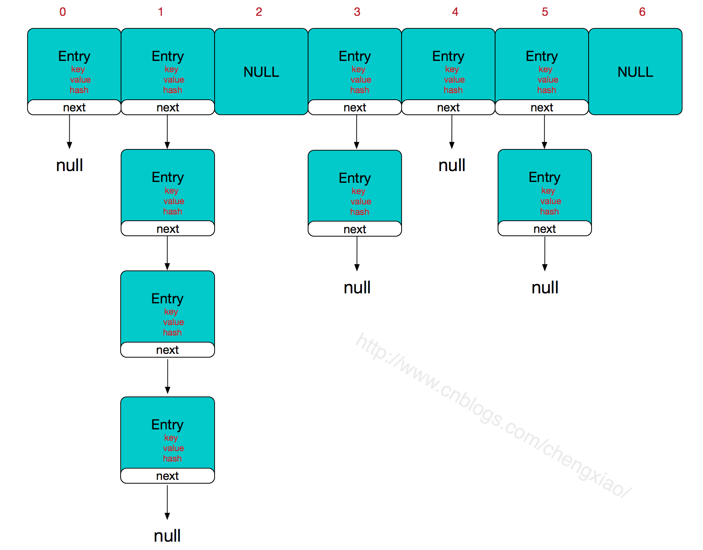
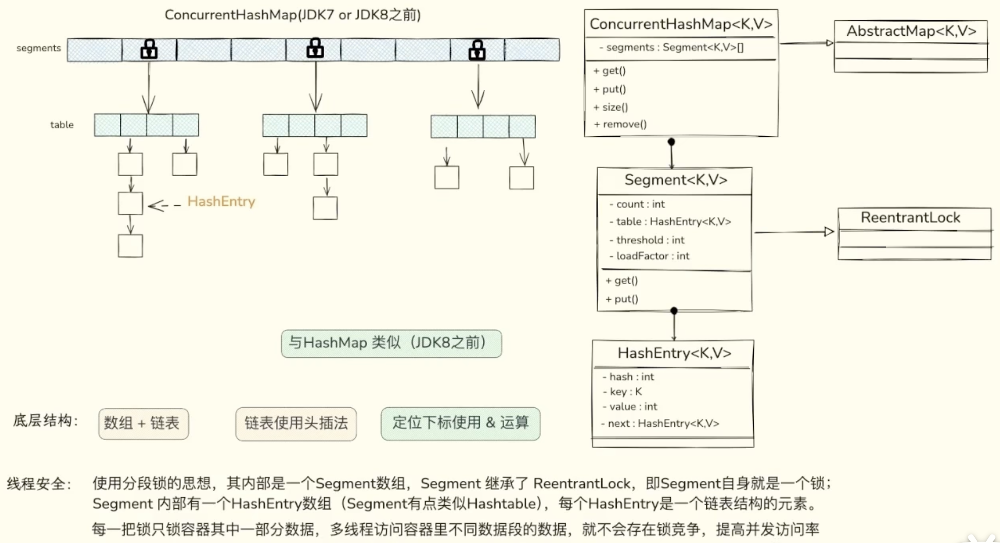
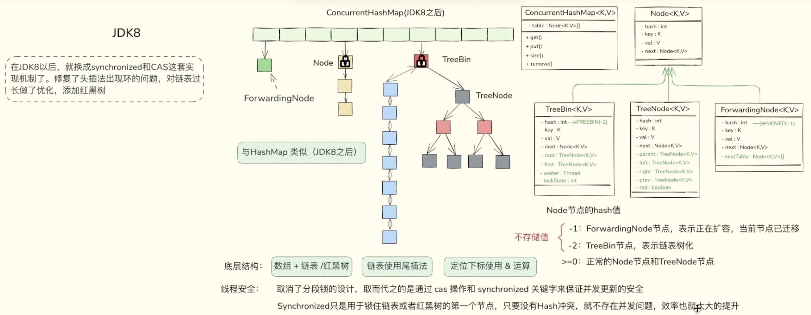
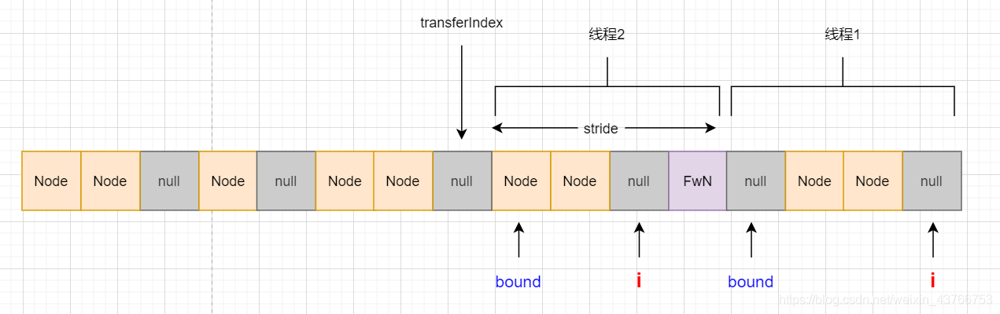

## 1、HashMap


### 1.1 存储结构

JDK1.7 的 HashMap 底层存储结构为：数组 + 链表

JDK1.8 的 HashMap 底层存储结构为：数组 + 链表 + 红黑树

JDK1.7 Entry<K,V>

JDK1.8 Node<K,V>

Entry & Node，只是名字不同，结构相同




### 1.2 核心定义

以下是 HashMap 中最核心的成员变量以及相关的类定义

```java
public class HashMap<K,V> extends AbstractMap<K,V> implements Map<K,V>, Cloneable, Serializable {
    // 默认的 table 容量，规定必须是 2 的幂。
    static final int DEFAULT_INITIAL_CAPACITY = 1 << 4; // aka 16
    // 空参构造时使用的默认负载因子。
    static final float DEFAULT_LOAD_FACTOR = 0.75f;
    // 链表转红黑树的阈值1：当某个桶的链表长度大于 8
    static final int TREEIFY_THRESHOLD = 8;
    // 链表转红黑树的阈值2：table 的长度不小于 64
    static final int MIN_TREEIFY_CAPACITY = 64;
    // 将红黑树转为链表的阈值
    static final int UNTREEIFY_THRESHOLD = 6;
    
    // 键值对的数量
    transient int size;
    // 扩容阈值
    // 初始化：threshold = DEFAULT_LOAD_FACTOR * DEFAULT_INITIAL_CAPACITY
    // 扩容时：threshold = oldThr << 1; // double threshold
    int threshold;
    
    // 加载因子（被 final 修饰，在构造方法中就被初始化，不指定就用默认的）
    final float loadFactor;
    
    // 存放数据的数组
    transient Node<K,V>[] table;
    
    // Node 充当数组与链表，是 HashMap 的核心
    static class Node<K,V> implements Map.Entry<K,V> {
        final int hash;
        final K key;
        V value;
        Node<K,V> next;  // 链表

        Node(int hash, K key, V value, Node<K,V> next) {
            this.hash = hash;
            this.key = key;
            this.value = value;
            this.next = next;
        }
    }
    
    // 无参构造（调用 put 方法时才进行 table 的初始化）
    public HashMap() {
        this.loadFactor = DEFAULT_LOAD_FACTOR; // all other fields defaulted
    }
}
```


### 1.2 插入数据

HashMap 的插入流程大概为：首先是先定位要插入的键值对属于哪个桶，定位到桶后，再判断桶是否为空。如果为空，则将键值对存入即可。如果不为空，则需将键值对接在链表最后一个位置，或者更新键值对。

```java
public V put(K key, V value) {
    return putVal(hash(key), key, value, false, true);
}

final V putVal(int hash, K key, V value, boolean onlyIfAbsent,
               boolean evict) {
    Node<K,V>[] tab; Node<K,V> p; int n, i;
    // 初始化桶数组 table，table 被延迟到插入新数据时再进行初始化
    if ((tab = table) == null || (n = tab.length) == 0)
        n = (tab = resize()).length;
    // 如果桶中没有元素，则将新节点的引用存入桶中即可
    if ((p = tab[i = (n - 1) & hash]) == null)
        tab[i] = newNode(hash, key, value, null);
    else {
        Node<K,V> e; K k;
        // 如果键的值以及节点 hash 等于链表中的第一个键值对节点时，则将 e 指向该键值对
        if (p.hash == hash && ((k = p.key) == key || (key != null && key.equals(k))))
            e = p;
        // 如果桶中的引用类型为 TreeNode，则调用红黑树的插入方法
        else if (p instanceof TreeNode)  
            e = ((TreeNode<K,V>)p).putTreeVal(this, tab, hash, key, value);
        else {
            // 对链表进行遍历，并统计链表长度
            for (int binCount = 0; ; ++binCount) {
                // 链表中不包含要插入的键值对节点时，则将该节点接在链表的最后
                if ((e = p.next) == null) {
                    p.next = newNode(hash, key, value, null);
                    // 如果链表长度大于或等于树化阈值，则进行树化操作
                    if (binCount >= TREEIFY_THRESHOLD - 1) // -1 for 1st
                        treeifyBin(tab, hash);
                    break;
                }
                // 条件为 true，表示当前链表包含要插入的键值对，终止遍历
                if (e.hash == hash && ((k = e.key) == key || (key != null && key.equals(k))))
                    break;
                p = e;
            }
        }
        
        // 判断要插入的键值对是否存在 HashMap 中
        if (e != null) { // existing mapping for key
            V oldValue = e.value;
            // onlyIfAbsent 表示是否仅在 oldValue 为 null 的情况下更新键值对的值
            if (!onlyIfAbsent || oldValue == null)
                e.value = value;
            afterNodeAccess(e);
            return oldValue;
        }
    }
    ++modCount;
    // 键值对数量超过阈值时，则进行扩容
    if (++size > threshold)
        resize();
    afterNodeInsertion(evict);
    return null;
}
```


插入操作的入口方法是 `put(K,V)`，但核心逻辑在`V putVal(int, K, V, boolean, boolean)` 方法中。主要做了这么几件事情：

1. 计算 key 的 hash 值

   - 计算方式是 `(key == null) ? 0 : (h = key.hashCode()) ^ (h >>> 16);`

2. 检查当前数组是否为空，为空需要进行初始化，初始化容量是 **16** ，负载因子默认 **0.75**。

3. 计算 key 在数组中的坐标

   - 计算方式：`(容量 - 1) & hash`.

   - 因为容量总是2的次方，所以 length-1的值的二进制**总是全1**。方便与 hash 值进行**与**运算。

4. 如果计算出的坐标元素为空，创建节点加入，put() 结束

   - 如果当前数组容量大于负载因子设置的容量，**进行扩容**。

5. 如果计算出的坐标元素有值。

   1. 如果坐标上的元素值和要加入的值 key 完全一样，覆盖原有值。
   2. 如果坐标上的元素是**红黑树**，把要加入的值和 key 加入到红黑树。
   3. 如果坐标上的元素和要加入的元素不同（**尾插法**增加）。
      1. 如果 next 节点为空，把要加入的值和 key 加入 next 节点。
      2. 如果 next 节点不为空，循环查看 next 节点。
      3. 如果发现有 next 节点的 key 和要加入的 key 一样，对应的值替换为新值。
      4. 如果循环 next 节点查找**超过 8 层**还不为空，把这个位置元素转换为**红黑树**。


### 1.2 查找数据

HashMap 的查找操作比较简单，先定位键值对所在的桶的位置，然后再对链表或红黑树进行查找。

```java
public V get(Object key) {
    Node<K,V> e;
    return (e = getNode(hash(key), key)) == null ? null : e.value;
}

final Node<K,V> getNode(int hash, Object key) {
    Node<K,V>[] tab; Node<K,V> first, e; int n; K k;
    // 1. 定位键值对所在桶的位置
    if ((tab = table) != null && (n = tab.length) > 0 && (first = tab[(n - 1) & hash]) != null) {
        if (first.hash == hash && ((k = first.key) == key || (key != null && key.equals(k))))
            // 如果是头节点则直接返回
            return first;
        if ((e = first.next) != null) {
            // 2. 如果 first 是 TreeNode 类型，则调用黑红树查找方法
            if (first instanceof TreeNode)
                return ((TreeNode<K,V>)first).getTreeNode(hash, key);
                
            // 2. 对链表进行查找
            do {
                if (e.hash == hash && ((k = e.key) == key || (key != null && key.equals(k))))
                    return e;
            } while ((e = e.next) != null);
        }
    }
    return null;
}
```


### 1.3 数组扩容

HashMap 的扩容机制与其他变长集合的套路不太一样，HashMap 按当前桶数组长度的 2 倍进行扩容，阈值也变为原来的 2 倍。扩容之后，要重新计算键值对的位置，并把它们移动到合适的位置上去。以上就是 HashMap 的扩容大致过程。

```java
final Node<K,V>[] resize() {
    Node<K,V>[] oldTab = table;
    int oldCap = (oldTab == null) ? 0 : oldTab.length;
    int oldThr = threshold;
    int newCap, newThr = 0;
    // 如果 table 不为空，表明已经初始化过了
    if (oldCap > 0) {
        // 当 table 容量超过容量最大值，则不再扩容
        if (oldCap >= MAXIMUM_CAPACITY) {
            threshold = Integer.MAX_VALUE;
            return oldTab;
        // newCap = oldCap << 1 --> table.length 扩大2倍
        } else if ((newCap = oldCap << 1) < MAXIMUM_CAPACITY && oldCap >= DEFAULT_INITIAL_CAPACITY)
            // 按旧容量和阈值的 2 倍计算新容量和阈值的大小
            newThr = oldThr << 1; // double threshold
    } else if (oldThr > 0)
        // 初始化时，将 threshold 的值赋值给 newCap，HashMap 使用 threshold 变量暂时保存 initialCapacity 参数的值
        newCap = oldThr;
    else {
        // 调用无参构造方法时，桶数组容量为默认容量，阈值为默认容量与默认负载因子乘积
        newCap = DEFAULT_INITIAL_CAPACITY;
        newThr = (int)(DEFAULT_LOAD_FACTOR * DEFAULT_INITIAL_CAPACITY);
    }
    
    // newThr 为 0 时，按阈值计算公式进行计算
    if (newThr == 0) {
        float ft = (float)newCap * loadFactor;
        newThr = (newCap < MAXIMUM_CAPACITY && ft < (float)MAXIMUM_CAPACITY ? (int)ft : Integer.MAX_VALUE);
    }
    threshold = newThr;
    // 创建新的桶数组，桶数组的初始化也是在这里完成的
    Node<K,V>[] newTab = (Node<K,V>[])new Node[newCap];
    table = newTab;
    if (oldTab != null) {
        // 如果旧的桶数组不为空，则遍历桶数组，并将键值对映射到新的桶数组中
        for (int j = 0; j < oldCap; ++j) {
            Node<K,V> e;
            if ((e = oldTab[j]) != null) {
                oldTab[j] = null;
                if (e.next == null)
                    newTab[e.hash & (newCap - 1)] = e;
                else if (e instanceof TreeNode)
                    // 重新映射时，需要对红黑树进行拆分
                    ((TreeNode<K,V>)e).split(this, newTab, j, oldCap);
                else { // preserve order
                    Node<K,V> loHead = null, loTail = null;
                    Node<K,V> hiHead = null, hiTail = null;
                    Node<K,V> next;
                    // 遍历链表，并将链表节点按原顺序进行分组
                    do {
                        next = e.next;
                        if ((e.hash & oldCap) == 0) {
                            if (loTail == null)
                                loHead = e;
                            else
                                loTail.next = e;
                            loTail = e;
                        }
                        else {
                            if (hiTail == null)
                                hiHead = e;
                            else
                                hiTail.next = e;
                            hiTail = e;
                        }
                    } while ((e = next) != null);
                    // 将分组后的链表映射到新桶中
                    if (loTail != null) {
                        loTail.next = null;
                        newTab[j] = loHead;
                    }
                    if (hiTail != null) {
                        hiTail.next = null;
                        newTab[j + oldCap] = hiHead;
                    }
                }
            }
        }
    }
    return newTab;
}
```


## 2、ConcurrentHashMap


### 2.1 存储结构

参考：https://segmentfault.com/a/1190000038416595#item-2


<span style="color:red">JDK1.7 存储结构如下：</span>



put()：当前 segment 会将自己锁住，此时其他线程无法操作这个 segment，但不会影响到其他 segment 的操作；

get()：使用 UNSAFE.getObjectVolatile() 获取节点，底层是用了 C++ 的 volatile 来实现 java 中的 volatile 效果；

remove()：当前 segment 会将自己锁住；


<span style="color:red">JDK1.8 存储结构如下：</span>



put()：使用 CAS + synchronized 来保证线程安全；

get()：没有使用加锁，使用的是 Unsafe.getObjectVolatile方法获取数据；

remove()：使用 synchronized 来保证线程安全；


### 2.2 核心定义

以下是 HashMap 中最核心的成员变量以及相关的类定义

```java
public class ConcurrentHashMap<K,V> extends AbstractMap<K,V> implements ConcurrentMap<K,V>, Serializable {
	// table 默认长度
    private static final int DEFAULT_CAPACITY = 16;
    // 默认加载因子
    private static final float LOAD_FACTOR = 0.75f;
	// 链表超过8，转为红黑树
    static final int TREEIFY_THRESHOLD = 8;
    // 红黑树小6，转为链表
    static final int UNTREEIFY_THRESHOLD = 6;
    // 树化时 table 的最小长度，长度小于64，先扩容
    static final int MIN_TREEIFY_CAPACITY = 64;
    
    // 散列表
    transient volatile Node<K,V>[] table;
    // 扩容时用到的过渡表
    private transient volatile Node<K,V>[] nextTable;
    
    /**
     * sizeCtl默认为 0（int类型的默认值）：
     *  1、在正常情况下，sizeCtl 表示扩容阈值，是个正数，sizeCtl = CAPACITY - (CAPACITY>>2)
     *  2、当table正在初始化时，sizeCtl值置为-1，表示当前正在初始化，其他线程只需要判断sizeCtl==-1 ，就知道数组正在初始化。
     *  3、当table正在扩容时，sizeCtl值置为负数，表示当前有多少个线程正在协助扩容的负数（例如：有三个，则为 -3）。
     */
    private transient volatile int sizeCtl;  // 默认为0，put() 初始化 table 时，会将 sizeCtl = 12
    
    public ConcurrentHashMap() {
        
    }
    
    static class Node<K,V> implements Map.Entry<K,V> {
        final int hash;
        final K key;
        volatile V val;
        volatile Node<K,V> next;

        Node(int hash, K key, V val) {
            this.hash = hash;
            this.key = key;
            this.val = val;
        }
    }
    
    static final class ForwardingNode<K,V> extends Node<K,V> {
        final Node<K,V>[] nextTable;  // 指向正在扩容的 nextTable
        ForwardingNode(Node<K,V>[] tab) {
            super(MOVED, null, null);  // static final int MOVED = -1;
            this.nextTable = tab;
        }
    }
    
    static final class TreeBin<K,V> extends Node<K,V> {
        TreeNode<K,V> root;  // 指向红黑树
        volatile TreeNode<K,V> first;  // 指向由红黑树所有节点构成的单链表
        volatile Thread waiter;
        volatile int lockState;  // 用于 CAS 操作的状态位
        // ...
        
        TreeBin(TreeNode<K,V> b) {
            super(TREEBIN, null, null);  // static final int TREEBIN = -2;
            // ...
        }
    }
    
    static final class TreeNode<K,V> extends Node<K,V> {
        TreeNode<K,V> parent;  // red-black tree links
        TreeNode<K,V> left;
        TreeNode<K,V> right;
        TreeNode<K,V> prev;    // needed to unlink next upon deletion
        boolean red;
    }
}
```


### 2.3 插入数据

ConcurrentHashMap 添加数据时，采取了 CAS + synchronize 结合的策略。

1. 首先会判断该节点是否为 null，如果为 null，尝试使用 CAS 添加节点；
2. 如果添加失败，说明发生了并发冲突，再对节点进行上锁并插入数据。


核心流程如下：

1. **定位桶**：根据 `key` 的 `hash` 计算桶位置 `i`。
2. **读取头节点**：`tabAt(tab, i)`（`volatile` 读）。
3. **空桶**：通过 CAS 插入新节点（原子+可见）。
4. **非空桶**：
   - 锁住头节点 (`synchronized (f)`)。
   - 遍历链表/树更新或插入节点。
   - 修改 `volatile` 字段（`val`/`next`）。
5. **扩容**：若需扩容，新数组 `nextTable` 通过 `volatile` 写替换旧数组。


在并发较低的情景下无需加锁，可以显著提高性能。同时只会 CAS 尝试一次，也不会造成线程长时间等待浪费 CPU 时间的情况。详情：

1. 首先会判断数组是否已经初始化，如若未初始化，会先去初始化数组；
2. 如果当前要插入的节点为 null，尝试使用 CAS 插入数据；
3. 如果不为 null，则判断节点 hash 值是否为 -1；-1 表示数组正在扩容，会先去协助扩容，再回来继续插入数据
4. 最后会执行上锁，并插入数据，最后判断是否需要返回旧值；如果不是覆盖旧值，需要更新 table 中的节点数；

```java
public V put(K key, V value) {
    return putVal(key, value, false);
}

final V putVal(K key, V value, boolean onlyIfAbsent) {
    /**
     * 不允许插入空值或空键，允许 value 空值会导致 get() 返回 null 时语义存在二义性：
     *     1. 找不到对应的 key
     *     2. 找到了但是 value 为 null
     * 当 get() 返回 null 时无法判断是哪种情况，在并发环境下 containsKey() 不再可靠
     */
    if (key == null || value == null) throw new NullPointerException();
    // 高低位异或扰动 hashcode，和 HashMap 类似，但有一点点不同，确保返回的 hash 值是个正数（& 01111... 31个，高位位零）
    int hash = spread(key.hashCode());
    // bincount 表示链表的节点数
    int binCount = 0;
    // 尝试多种方法循环处理，后续会有很多这种设计
    for (Node<K,V>[] tab = table;;) {
        Node<K,V> f; int n, i, fh;
        // 情况一：如果数组为空则进行初始化
        if (tab == null || (n = tab.length) == 0)
            tab = initTable();
        else if ((f = tabAt(tab, i = (n - 1) & hash)) == null) {
            // 情况二：目标下标对象为 null，采用CAS进行插入
            if (casTabAt(tab, i, null,new Node<K,V>(hash, key, value, null)))
                break;
        }
        else if ((fh = f.hash) == MOVED)
            // 情况三：数组正在扩容，帮忙迁移数据到新的数组，扩容完成后再插入
            tab = helpTransfer(tab, f);
        else {
            // 情况四：直接对节点进行加锁，插入数据，因为已经上锁，不涉及并发安全设计
            V oldVal = null;
            // 同步加锁
            synchronized (f) {
                // 重复检查一下刚刚获取的对象有没有发生变化
                if (tabAt(tab, i) == f) {
                    // 链表处理情况
                    if (fh >= 0) {
                        binCount = 1;
                        // 循环链表
                        for (Node<K,V> e = f;; ++binCount) {
                            K ek;
                            // 找到相同的则记录旧值
                            if (e.hash == hash &&
                                    ((ek = e.key) == key ||
                                            (ek != null && key.equals(ek)))) {
                                oldVal = e.val;
                                // 判断是否需要更新数值
                                if (!onlyIfAbsent)
                                    e.val = value;
                                break;
                            }
                            Node<K,V> pred = e;
                            // 若未找到则插在链表尾
                            if ((e = e.next) == null) {
                                pred.next = new Node<K,V>(hash, key,
                                        value, null);
                                break;
                            }
                        }
                    }
                    // 红黑树处理情况
                    else if (f instanceof TreeBin) {
                        Node<K,V> p;
                        binCount = 2;
                        if ((p = ((TreeBin<K,V>)f).putTreeVal(hash, key,
                                value)) != null) {
                            oldVal = p.val;
                            if (!onlyIfAbsent)
                                p.val = value;
                        }
                    }
                    else if (f instanceof ReservationNode)
                        throw new IllegalStateException("Recursive update");
                }
            }
            // 判断是否需要转化为红黑树，和返回旧数值
            if (binCount != 0) {
                if (binCount >= TREEIFY_THRESHOLD)
                    treeifyBin(tab, i);
                if (oldVal != null)
                    return oldVal;
                break;
            }
        }
    }
    // 总数+1；这是一个非常硬核的设计，这是 ConcurrentHashMap 设计中的一个重点
    addCount(1L, binCount);
    return null;
}
```


插入数据时，如果 table 为空，需要先初始化，此时会使用【CAS + 自旋】确保并发环境下，只有一个线程能初始化成功

```java
private final Node<K,V>[] initTable() {
    Node<K,V>[] tab; int sc;
    // 这里的循环是采用自旋的方式而不是上锁来初始化
    // 首先会判断数组是否为null或长度为0
    // 没有在构造函数中进行初始化，主要是涉及到懒加载的问题
    while ((tab = table) == null || tab.length == 0) {
        // sizeCtl是一个非常关键的变量；
        // 默认为0，-1表示正在初始化，<-1表示有多少个线程正在帮助扩容，>0表示阈值
        if ((sc = sizeCtl) < 0)
            Thread.yield(); // 让出cpu执行时间
        
        // 通过CAS设置sc为-1，表示获得自选锁
        // 其他线程则无法进入初始化，进行自选等待
        else if (U.compareAndSwapInt(this, SIZECTL, sc, -1)) {
            try {
                // 重复检查是否为空
                if ((tab = table) == null || tab.length == 0) {
                    int n = (sc > 0) ? sc : DEFAULT_CAPACITY;
                    @SuppressWarnings("unchecked")
                    Node<K,V>[] nt = (Node<K,V>[])new Node<?,?>[n];
                    table = tab = nt;
                    // 设置sc为阈值，n>>>2表示1/4*n，也就相当于0.75n
                    sc = n - (n >>> 2);
                }
            } finally {
                // 把sc赋值给sizeCtl
                sizeCtl = sc;
            }
            break;
        }
    }
    // 最后返回tab数组
    return tab;
}
```


### 2.4 查找数据

先来看get，get其实和`HashMap`的类似。对于普通的空桶或者链表，是不用加锁的，空桶返回null，链表不会有并发读写问题，因为链表都是往后追加，要么加上了要么没加上。与HashMap的不同的在于`eh<0`这一行，在HashMap中hash值不会小于0，而在这里是可能小于0的，小于0代表了三种节点类型。

1 正在扩容的时候，需要对每个桶的节点转移到新的数组中，如果当前桶所有节点转移完成会给桶的第一个元素塞入一个`ForwardingNode`节点，注意虽然叫`ing`其实代表自己这个桶完成了转移，其他桶还在转移进行中，其指向新的数组`nextTable`。他代表的是当前桶内的所有节点，已经全部安全转移到新的扩容后的数组中啦，只不过还有其他桶还在转移，所以暂时标记一下，对于这个桶的get操作，就是在`nextTable`中递归`find`操作。

2 如果桶内是树结构的话，第一个节点的hash是-2，是`TreeBin`类型的节点他下面挂了`TreeNode`才是真正的树的root节点，是持有数据的，而`TreeBin`的entry不持有有效数据。除了用hash=-2来作为树的判断，他主要的作用还是持有一个状态cas锁，通过其保证读写操作不会有并发的问题，因为树与list不同，树会进行`restructuring`自平衡调整，即当写操作触发自平衡，那么这时候的读就乱套了。因而有`LOCKSTATE`变量的`cas`操作，控制写操作需等待读操作完成之后才能触发。例如get时候的find操作就是，获取这个读写锁，之后运行root TreeNode节点的find函数。treeNode的find就和链表一样没有任何锁了。

3 `ReservationNode`是除了`Node(普通/链表节点)`,`ForwardingNode(扩容时会有的节点)`, `TreeBin（树桶头元素）`， `TreeNode（数节点）`之外的一种节点，仅存在于`compute/computeIfAbsent`函数运行的时候，是个空节点，我们先不讨论他。

```java
public V get(Object key) {
    Node<K,V>[] tab; Node<K,V> e, p; int n, eh; K ek;
    // h是当前元素算出的下标
    int h = spread(key.hashCode());
    // e是h桶的第一个元素
    if ((tab = table) != null && (n = tab.length) > 0 &&
        (e = tabAt(tab, (n - 1) & h)) != null) {
        // 第一个元素e.key刚好equals要找的key，那就直接返回e.val
        if ((eh = e.hash) == h) {
            if ((ek = e.key) == key || (ek != null && key.equals(ek)))
                return e.val;
        }
        // eh小于0的话，有三种情况-1正在扩容，-2是tree的根节点，-3是一个受保护的节点
        // 运行find方法找，对于不同节点类型的find方法是重写的
        else if (eh < 0)
            return (p = e.find(h, key)) != null ? p.val : null;


        // 当前坑位有别人，并且hash还是正常的>0，那么就是链表一直往下找就行
        while ((e = e.next) != null) {
            if (e.hash == h &&
                ((ek = e.key) == key || (ek != null && key.equals(ek))))
                return e.val;
        }
    }
    return null;
}
```


### 2.5 数组扩容

ConcurrentHashMap 的扩容是多个线程协同工作的，提高了效率，如下图：



ConcurrentHashMap 把整个数组进行分段，每个线程负责一段。bound 表示该线程范围的下限，i 表示当前正在迁移的下标。每一个迁移完成的节点都会被赋值 ForwardingNode，表示迁移完成。stride 表示线程迁移的“步幅”，当线程完成范围内的任务后，就会继续往前看看还有没有需要迁移的，transferIndex 就是记录下个需要迁移的下标；当 transferIndex==0 时则表示不需要帮忙了。这就是ConcurrentHashMap 扩容方案的核心思路了 。保证线程安全的思路和前面介绍的方法大同小异，都是通过 CAS+自旋锁+synchronize 来实现的。


扩容的逻辑是发生在 addCount() 和 treeifyBin() 的过程中的 transfer()，以 addCount() 为例，这个方法一共做两件事：

1. 统计散列表中的元素个数；
2. 进行散列表的扩容；

```java
private final void addCount(long x, int check) {
    // 1、素个数统计的逻辑
    CounterCell[] cs; long b, s;
    if ((cs = counterCells) != null ||
        !U.compareAndSetLong(this, BASECOUNT, b = baseCount, s = b + x)) {
        CounterCell c; long v; int m;
        boolean uncontended = true;
        if (cs == null || (m = cs.length - 1) < 0 ||
            (c = cs[ThreadLocalRandom.getProbe() & m]) == null ||
            !(uncontended =
              U.compareAndSetLong(c, CELLVALUE, v = c.value, v + x))) {
            fullAddCount(x, uncontended);
            return;
        }
        if (check <= 1)
            return;
        s = sumCount();
    }
    
    // 2、散列表扩容逻辑
    if (check >= 0) {
        // 这部分的逻辑主要是判断是否需要扩容
        // 同时保证只有一个线程能够创建新的数组
        // 其他的线程只能辅助迁移数据
        Node<K,V>[] tab, nt; int n, sc;
        // 当长度达到阈值且长度并未达到最大值时进行下一步扩容
        while (s >= (long)(sc = sizeCtl) && (tab = table) != null && (n = tab.length) < MAXIMUM_CAPACITY) {
            // 这个数配合后续的sizeCtr计算
            // 它的格式是第16位肯定为1,低15位表示n前面连续的0个数
            int rs = resizeStamp(n);
            // 小于0表示正在扩容或者正在初始化,否则进入下一步抢占锁进行创建新数组
            if (sc < 0) {
                // 如果正在迁移右移16位后一定等于rs
                // ( sc == rs + 1 || sc == rs + MAX_RESIZERS) 这两个条件我认为不可能为 true
                // 有兴趣可以点击下方网站查看
                // https://bugs.java.com/bugdatabase/view_bug.do?bug_id=JDK-8214427
                // nextTable==null 说明下个数组还未创建
                // transferIndex<=0 说明迁移已经够完成了
                // 符合以上情况的重新循环自旋
                if ((sc >>> RESIZE_STAMP_SHIFT) != rs 
                    || sc == rs + 1 || sc == rs + MAX_RESIZERS 
                    || (nt = nextTable) == null || transferIndex <= 0)
                    break;
                // 帮忙迁移,sc+1
                if (U.compareAndSwapInt(this, SIZECTL, sc, sc + 1))
                    transfer(tab, nt);
            }
            // 抢占锁进行扩容
            // 对rs检验码进行左移16位再+2，这部分我们在上面介绍过
            else if (U.compareAndSwapInt(this, SIZECTL, sc, (rs << RESIZE_STAMP_SHIFT) + 2))
                // 抢占自旋锁成功，进行扩容
                transfer(tab, null);
            
            // 更新节点总数，继续循环
            s = sumCount();
        }
    }
}
```

上面的方法重点是利用 sizeCtl 充当自旋锁，保证只有一个线程能创建新的数组，而其他的线程只能协助迁移数组。那么下面的方法就是扩容方案的重点方法：

```java
// 这里的两个参数：tab表示旧数组，nextTab表示新数组
// 创建新数组的线程nextTab==null，其他的线程nextTab等于第一个线程创建的数组
private final void transfer(Node<K,V>[] tab, Node<K,V>[] nextTab) {
    int n = tab.length, stride;
    // stride表示每次前进的步幅，最低是16
    if ((stride = (NCPU > 1) ? (n >>> 3) / NCPU : n) < MIN_TRANSFER_STRIDE)
        stride = MIN_TRANSFER_STRIDE; // subdivide range
    
    // 如果新的数组还未创建，则创建新数组
    // 只有一个线程能进行创建数组
    if (nextTab == null) {            
        try {
            @SuppressWarnings("unchecked")
            // 扩展为原数组的两倍
            Node<K,V>[] nt = (Node<K,V>[])new Node<?,?>[n << 1];
            nextTab = nt;
        } catch (Throwable ex) {      
            // 扩容失败出现OOM，直接把阈值改成最大值
            sizeCtl = Integer.MAX_VALUE;
            return;
        }
        // 更改concurrentHashMap的内部变量nextTable
        nextTable = nextTab;
        // 迁移的起始值为数组长度
        transferIndex = n;
    }
    
    int nextn = nextTab.length;
    // 标志节点，每个迁移完成的数组下标都会设置为这个节点
    ForwardingNode<K,V> fwd = new ForwardingNode<K,V>(nextTab);
    // advance表示当前线程是否要前进
    // finish表示迁移是否结束
    // 官方的注释表示在赋值为true之前，必须再重新扫描一次确保迁移完成，后面会讲到
    boolean advance = true;
    boolean finishing = false; // to ensure sweep before committing nextTab
    
    // i表示当前线程迁移数据的下标，bound表示下限，从后往前迁移
    for (int i = 0, bound = 0;;) {
        Node<K,V> f; int fh;
        
        // 这个循环主要是判断是否需要前进，如果需要则CAS更改下个bound和i
        while (advance) {
            int nextIndex, nextBound;
            // 如果还未到达下限或者已经结束了，advance=false
            if (--i >= bound || finishing)
                advance = false;
            // 每一轮循环更新transferIndex的下标
            // 如果下一个下标是0，表示已经无需继续前进
            else if ((nextIndex = transferIndex) <= 0) {
                i = -1;
                advance = false;
            }
            // 利用CAS更改bound和i继续前进迁移数据
            else if (U.compareAndSwapInt
                     (this, TRANSFERINDEX, nextIndex,
                      nextBound = (nextIndex > stride ?
                                   nextIndex - stride : 0))) {
                bound = nextBound;
                i = nextIndex - 1;
                advance = false;
            }
        }
        
        // i已经达到边界，说明当前线程的任务已经完成，无需继续前进
        // 如果是第一个线程需要更新table引用
        // 协助的线程需要将sizeCtl减一再退出
        if (i < 0 || i >= n || i + n >= nextn) {
            int sc;
            // 如果已经更新完成，则更新table引用
            if (finishing) {
                nextTable = null;
                table = nextTab;
                // 同时更新sizeCtl为阈值
                sizeCtl = (n << 1) - (n >>> 1);
                return;
            }
            // 线程完成自己的迁移任务，将sizeCtl减一
            if (U.compareAndSwapInt(this, SIZECTL, sc = sizeCtl, sc - 1)) {
                // 这里sc-2不等于校验码，说明此线程不是最后一个线程，还有其他线程正在扩容
                // 那么就直接返回，他任务已经完成了
                // 最后一个线程需要重新把整个数组再扫描一次，看看有没有遗留的
                if ((sc - 2) != resizeStamp(n) << RESIZE_STAMP_SHIFT)
                    return;
                // finish设置为true表示已经完成
                // 这里把i设置为n，重新把整个数组扫描一次
                finishing = advance = true;
                i = n; // recheck before commit
            }
        }
        // 如果当前节点为null，表示迁移完成，设置为标志节点
        else if ((f = tabAt(tab, i)) == null)
            // 这里的设置有可能会失败，所以不能直接设置advance为true，需要再循环
            advance = casTabAt(tab, i, null, fwd);
        // 当前节点是ForwardingNode，表示迁移完成，继续前进
        else if ((fh = f.hash) == MOVED)
            advance = true; // already processed
        else {
            // 给头节点加锁，进行迁移
            // 加锁后下面的内容就不涉及并发控制细节了，就是纯粹的数据迁移
            // 思路和HashMap差不多，但也有一些不同，多了一个lastRun
            // 读者可以阅读一下下面源码，这部分比较容易理解
            synchronized (f) {
                // 上锁之后再判断一次看该节点是否还是原来那个节点
                // 如果不是则重新循环
                if (tabAt(tab, i) == f) {
                    Node<K,V> ln, hn;
                    // hash值大于等于0表示该节点是普通链表节点
                    if (fh >= 0) {
                        int runBit = fh & n;
                        Node<K,V> lastRun = f;
                        // ConcurrentHashMap并不是直接把整个链表分为两个
                        // 而是先把尾部迁移到相同位置的一段先拿出来
                        // 例如该节点迁移后的位置可能为 1或5 ，而链表的情况是：
                        // 1 -> 5 -> 1 -> 5 -> 5 -> 5
                        // 那么concurrentHashMap会先把最后的三个5拿出来，lastRun指针指向倒数第三个5
                        for (Node<K,V> p = f.next; p != null; p = p.next) {
                            int b = p.hash & n;
                            if (b != runBit) {
                                runBit = b;
                                lastRun = p;
                            }
                        }
                        // 判断尾部整体迁移到哪个位置
                        if (runBit == 0) {
                            ln = lastRun;
                            hn = null;
                        }
                        else {
                            hn = lastRun;
                            ln = null;
                        }
                        for (Node<K,V> p = f; p != lastRun; p = p.next) {
                            int ph = p.hash; K pk = p.key; V pv = p.val;
                            // 这个node节点是改造过的
                            // 相当于使用头插法插入到链表中
                            // 这里的头插法不须担心链表环，因为已经加锁了
                            if ((ph & n) == 0)
                                ln = new Node<K,V>(ph, pk, pv, ln);
                            else
                                hn = new Node<K,V>(ph, pk, pv, hn);
                        }
                        // 链表构造完成，把链表赋值给数组
                        setTabAt(nextTab, i, ln);
                        setTabAt(nextTab, i + n, hn);
                        // 设置标志对象，表示迁移完成
                        setTabAt(tab, i, fwd);
                        advance = true;
                    }
                    // 树节点的处理，和链表思路相同，不过他没有lastRun，直接分为两个链表，采用尾插法
                    else if (f instanceof TreeBin) {
                        TreeBin<K,V> t = (TreeBin<K,V>)f;
                        TreeNode<K,V> lo = null, loTail = null;
                        TreeNode<K,V> hi = null, hiTail = null;
                        int lc = 0, hc = 0;
                        for (Node<K,V> e = t.first; e != null; e = e.next) {
                            int h = e.hash;
                            TreeNode<K,V> p = new TreeNode<K,V>
                                (h, e.key, e.val, null, null);
                            if ((h & n) == 0) {
                                if ((p.prev = loTail) == null)
                                    lo = p;
                                else
                                    loTail.next = p;
                                loTail = p;
                                ++lc;
                            }
                            else {
                                if ((p.prev = hiTail) == null)
                                    hi = p;
                                else
                                    hiTail.next = p;
                                hiTail = p;
                                ++hc;
                            }
                        }
                        ln = (lc <= UNTREEIFY_THRESHOLD) ? untreeify(lo) :
                            (hc != 0) ? new TreeBin<K,V>(lo) : t;
                        hn = (hc <= UNTREEIFY_THRESHOLD) ? untreeify(hi) :
                            (lc != 0) ? new TreeBin<K,V>(hi) : t;
                        setTabAt(nextTab, i, ln);
                        setTabAt(nextTab, i + n, hn);
                        setTabAt(tab, i, fwd);
                        advance = true;
                    }
                }
            }
        }
    }
}
```

扩容是一个相对重量级的操作，他需要创建一个新的数组再把原来的节点一个个搬过去，在高并发环境下，如果直接对整个表上锁，会有很多线程被阻塞。而ConcurrentHashMap的设计使得多个线程可协同完成扩容操作，甚至扩容的同时还可以进行数据的读取与插入，极大提高了效率。和前面的拆分size变量有异曲同工之妙：**利用多线程协同工作来提高效率** 。

关于扩容还有另外一个方法：`helpTransfer`。顾名思义，就是帮忙扩容，在putVal方法中，遇到ForwardingNode对象会调用此方法。

```java
final Node<K,V>[] helpTransfer(Node<K,V>[] tab, Node<K,V> f) {
    Node<K,V>[] nextTab; int sc;
    // 判断当前节点为ForwardingNode，且已经创建新的数组
    if (tab != null && (f instanceof ForwardingNode) &&
        (nextTab = ((ForwardingNode<K,V>)f).nextTable) != null) {
        int rs = resizeStamp(tab.length);
        // sizeCtl<0表示还在扩容
        while (nextTab == nextTable && table == tab &&
               (sc = sizeCtl) < 0) {
            // 校验是否已经扩容完成或者已经推进到0，则不需要帮忙扩容
            if ((sc >>> RESIZE_STAMP_SHIFT) != rs || sc == rs + 1 ||
                sc == rs + MAX_RESIZERS || transferIndex <= 0)
                break;
            // 尝试让让sc+1并帮忙扩容
            if (U.compareAndSwapInt(this, SIZECTL, sc, sc + 1)) {
                transfer(tab, nextTab);
                break;
            }
        }
        // 返回扩容之后的数组
        return nextTab;
    }
    // 若数组尚未初始化或节点非ForwardingNode,返回原数组
    return table;
}
```

