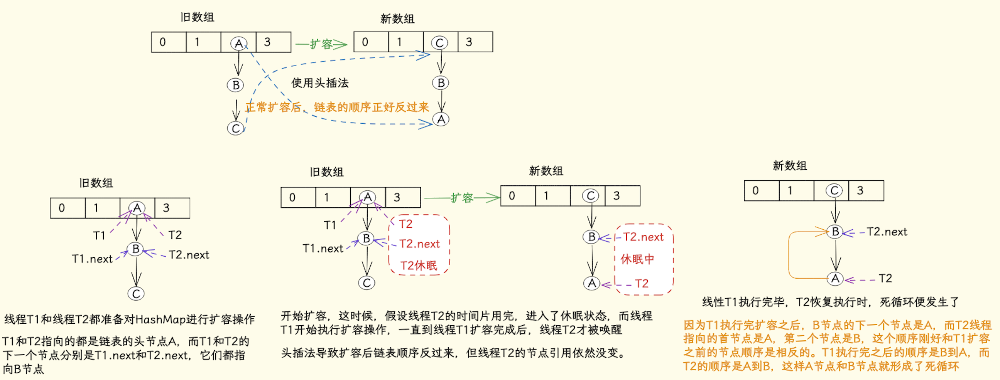
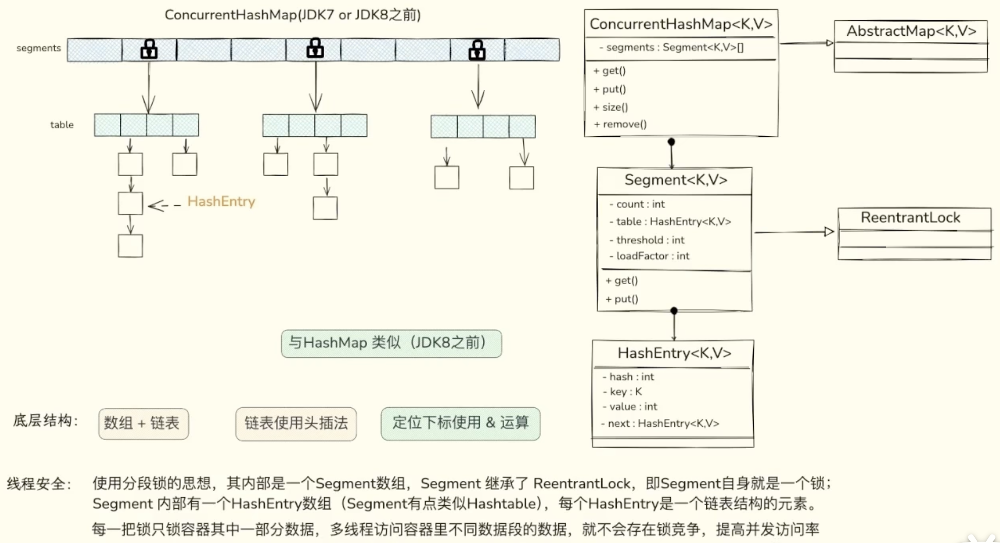
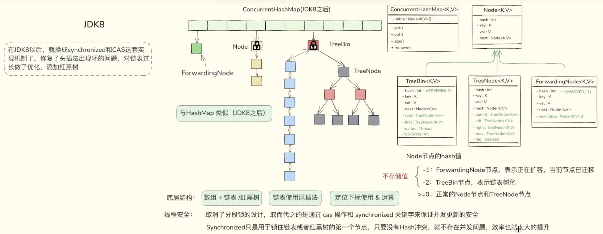

## 1、集合

### 1.1 ArrayList


### 1.2 HashSet

HashSet 就是 HashMap

```java
public boolean add(E e) {
    // private static final Object PRESENT = new Object();
    return map.put(e, PRESENT)==null;
}
```


### 1.3 HashMap

HashMap 的结构图

JDK1.7 的 HashMap 底层存储结构为：数组 + 链表

JDK1.8 的 HashMap 底层存储结构为：数组 + 链表 + 红黑树

JDK1.7 Entry<K,V>

JDK1.8 Node<K,V>

Entry & Node，只是名字不同，结构相同


<span style="color:red">**HashMap 的底层数据结构是什么？**</span>

数组 + 链表 + 红黑树（JDK1.8才有红黑树）

1. 数组：HashMap 会使用一个数组来存储数据。数组的索引是通过 hashCode 计算得到的，具体来说，它会根据键的哈希值来确定该键值对应该存放在数组的哪个位置。

2. 链表：在数组的每个位置（桶）中，当多个键的哈希值相同时（即发生哈希冲突），会使用链表来存储这些冲突的键值对。链表的每个节点存储一个键值对（key-value），并通过 next 指针连接。

3. 红黑树（可选）：当链表的长度超过一定阈值（通常是 8）且数组长度大于64，HashMap 会将链表转化为红黑树。


<span style="color:red">**JDK1.8 的 HashMap 做了哪些优化？**</span>

- 数据结构：由 JDK1.7的【数组+链表】改成了 JDK1.8的【数组+链表或红黑树】
  - 原因：插入数据发生 hash 冲突时，元素在桶位置形成链表，链表过长影响查询效率，所以使用红黑树优化。
- 单链表插入方式：单链表的插入方式由 JDK1.7 的头插法改成了 JDK1.8 的尾插法
  - 插入数据时，发生 hash 冲突的话
    - JDK1.7 将新元素放到数组中，原始节点作为新节点的后继节点；
    - JDK1.8 遍历链表，将元素放置到链表的最后；
  - 原因：因为JDK1.7 头插法扩容时，头插法会使链表发生反转，多线程环境下会产生环（死链）。
- 扩容：JDK1.7 扩容的时候需要对原数组中的元素进行重新 hash 定位在新数组的位置，JDK8 采用更简单的判断逻辑，不需要重新通过哈希函数计算位置，新的位置不变或索引+新增容量大小。
  - 原因：提高扩容的效率，更快地扩容。
- 扩容时机：在插入时，JDK1.7 先判断是否需要扩容，再插入。JDK1.8 先进行插入，插入完成再判断是否需要扩容;
- 散列函数：JDK1.7 做了四次移位和四次异或，JDK1.8 只做一次。
  - 原因：做 4次的话，边际效用也不大，JDK1.8 中对算哈希值的哈希算法进行了简化以提高运算效率。


<span style="color:red">**JDK1.7头插法导致的死链问题？**</span>

死链的产生主要是因为在插入新元素时，链表的指针被错误地设置或更新，导致链表的某些节点无法被访问到，从而形成循环或者无法正确遍历。




<span style="color:red">**一般用什么作为 HashMap 的 key？**</span>

一般用 lnteger、String 等不可变类当作 HashMap 的 key，String 最为常见。因为字符串是不可变的，所以在它创建的时候 hashcode   就被缓存了，不需要重新计算。并且获取对象的时候要用到 equals() 和 hashCode() 方法，那么键对象正确的重写这两个方法是非常重要的。Integer、String 这些类已经很规范的重写了 hashCode() 以及 equals() 方法。


<span style="color:red">**HashMap 为什么引入红黑树？**</span>

JDK1.8 以前 HashMap 的实现是：数组+链表，即便哈希函数取得再好，也很难达到元素百分百均匀分布。当有大量的元素都存放到同一个桶时，这个桶下就有一条长长的链表，此时 HashMap 就相当于一个单链表，假如单链表有 n 个元素，遍历的时间复杂度就是 O(n)，完全失去了它的优势。针对这种情况，JDK1.8 中引入了红黑树来优化这个问题。红黑树查找时间复杂度为 O(logn)


<span style="color:red">**链表过深问题为什么不用二叉查找树代替，而选择红黑树？**</span>

选择红黑树是为了解决二叉查找树的缺陷，二叉查找树在特殊情况下会变成一条线性结构(这就跟原来使用链表结构一样了，造成很深的问题)，遍历查找会非常慢。


<span style="color:red">**为什么不直接使用红黑树？**</span>

首先红黑树相对于链表来说，数据结构与操作更复杂，会对性能肯定是有影响的。其次引入红黑树就是为了优化查找速度，解决链表查询深度的问题，但当元素小于 8 个的时候，此时做查询操作，链表结构已经能保证查询性能。所以，只有当元素大于 8 个的时候，才会使用红黑树来加快查询速度。


<span style="color:red">**为什么 HashMap 的数组大小 length 是 2 的 n 次幂？**</span>

方便 & 操作：如果除数是 2 的 N 次幂，则取模操作等价于：除数 & (被除数 - 1)，即：hash % length = hash & (length -1)。

方便扩容：扩容之后的长度是原来的二倍，新的容量也是2的次幂，所以，元素，要么在原位置，要么在原位置再移动2的次幂。


<span style="color:red">**那么为什么初始容量的默认值是 16 呢？而不是 4 或 8？**</span>

关于这个默认容量的选择，JDK 并没有给出官方解释，那么这应该就是个经验值，既然一定要设置一个默认的 2^n 作为初始值，那么就需要在效率和内存使用上做一个权衡。这个值既不能太小，也不能太大。太小了就有可能频繁发生扩容，影响效率。太大了又浪费空间，不划算。16是一个经验值。

另外，如果输入数据若不是 2 的幂，HashMap 会重新计算得到一个离该数字最接近的 2^n（比如：输入17，重新计算得到 32）


<span style="color:red">**HashMap 扩容的时机（JDK1.8）？**</span>

创建 HashMap 对象后，并不会立即初始化 table，而是在第一次插入元素时，会判断 table 是否为 null，为 null 时会调用 resize() 进行初始化，这是HashMap节省内存的一种机制。

JDK1.8 在新增数据成功后进行扩容，扩容会发生在两种情况下（满足任意一种条件即发生扩容）

- 放入数据后，数组内元素数量大于阈值时，调用 resize() 进行扩容；
- 存入数据到某一条单链表上，此时单链表长度大于8，且数组长度小于 64 时调用 resize() 扩容；


<span style="color:red">**HashMap 扩容的流程（JDK1.8）？**</span>

1. 创建一个新数组（新数组大小是旧数组的两倍），并将其赋值给成员变量 table
2. 遍历老数组，将其元素复制到新数组中：
   1. 如果 table[i] 的头节点的 next 指针为 null，说明这个桶只有一个节点，直接计算新的数组下标并插入即可；
   2. 如果节点是红黑树类型，则调用split() 进行红黑树的拆分操作
      1. 生成 low 和 high 两颗红黑树；
      2. 如果生成的 low，high 树中元素个数小于等于6退化成链表，再插入到新数组的相应下标的位置；
   3. 节点为链表类型，会生成 low 和 high 两条链表
      1. 依靠 `hash & oldcap) ==0` 判断 Node 中的每个结点归属于 low 还是 high；
      2. 把 low 插入到新数组中当前数组下标的位置，把 high 链表插入到新数组中【当前数组下标+旧数组长度】的位置
3. 返回新数组 newTab。旧数组会被垃圾回收机制回收。


<span style="color:red">**添加数据时，是先添加再扩容？还是先扩容再添加？**</span>

JDK1.8 的扩容：新增数据存入成功后进行扩容判断，扩容会发生在两种情况下（满足任意一种条件即发生扩容）

- 元素个数大于阈值，进行扩容：threshold = capacity * loadFactor
- 桶上的链表元素个数大于 8（TREEIFY_THRESHOLD）且数长度小于 64（MIN_TREEIFY_CAPACITY），进行扩容

JDK1.7 的扩容：先判断是否需要扩容，后插入数据（同时满足以下两个条件才会进行扩容）

- 存放新值时当前已有元素的个数大于等于阈值；
- 存放新值时当前存放数据发生 hash 碰撞；
- 即：只有存储元素超过阈值并且当前存储位置不为 null，才会进行扩容


<span style="color:red">**JDK1.7，默认长度下，可能存第 27 个元素时，才发生扩容**</span>

JDK1.7 扩容必须满足两个条件:

- 存放新值的时候，当前已有元素的个数必须大于等于阈值；
- 存放新值的时候，数据发生 hash 碰撞；

因为上面这两个条件，所以存在下面这些情况

1. 就是 Hashmap 在存值的时候（默认大小为16，负载因子0.75，值12），可能达到最后存满 16 个值的时候，再存入第 17 个值才会发生扩容现象，因为前16个值，每个值在底层数组中分别占据一个位置，并没有发生 hash 碰撞。
2. 当然也有可能存储更多值（超多16个值，最多可以存26个值）都还没有扩容。原理：前11个值全部 hash 碰撞，存到数组的同一个位置（虽然hash冲突，但是这时元素个数小于阈值12，并没有同时满足扩容的两个条件，所以不会扩容），后面所有存入的 15 个值全部分散到数组剩下的 15 个位置（这时元素个数大于等于阈值，但是每次存入的元素并没有发生 hash 碰撞，也没有同时满足扩容的两个条件，所以叶不会扩容），前面 11+15=26，所以在存入第 27 个值的时候才同时满足上面两个条件，这时候才会发生扩容。


<span style="color:red">**为什么 JDK1.8 改为先插入后扩容了？**</span>

优化覆盖操作，避免无效扩容，提升性能

- JDK 1.7 的问题：
  - 插入元素前会先检查容量是否达到阈值（threshold）。如果达到阈值，会先扩容再插入。
  - 缺陷：若插入的 key 已存在（覆盖操作），实际只需替换 value，无需扩容。但 1.7 仍会先触发扩容，造成性能浪费。
- JDK 1.8 的优化：
  - 先插入新元素（或覆盖旧值），再检查是否需要扩容。
  - 优势：覆盖操作不会触发扩容，减少了不必要的数组复制和哈希重计算。


<span style="color:red">**HashMap 什么时候会将链表转为红黑树？**</span>

只有当某个桶内的元素超过 8，并且 `HashMap` 的容量大于 64 时，才会允许转换为红黑树。这是为了在小容量的情况下避免额外的内存开销，因为红黑树比链表需要更多的内存。


<span style="color:red">**HashMap 实现了 Serializable 接口，为什么把存放数据的 table 声明为 transient？**</span>

首先，HashMap 序列化的时候已经将每个元素的 Key 和 Value 都进行序列化。在反序列化的时候，重新计算 Key 和 Value 的位置，重新填充一个数组。所以 table 本身在序列形式中是不必要的，以节省空间。


<span style="color:red">**HashMap 的 loadFactor 作用是什么？**</span>

loadFactor 是加载因子，表示 HashMap 的拥挤程度，默认值为 0.75。当 HashMap 里面容纳的元素已经达到数组长度的 75% 时，表示数组太挤了，需要扩容。0.75 是在时间和空间成本之间的一个权衡。


<span style="color:red">**为什么加载因子的默认值是 0.75，并且不推荐我们修改？**</span>

如果 loadFactor 太小，阈值就越小，数组就需要不断的扩容，而扩容是个比较耗时的过程。

如果 loadFactor 太大，阈值就越大，数组放满了也不扩容，导致冲突越来越多，解决冲突而起的链表越来越长，查询效率越来越低。

而 0.75 这是一个折中的值，是一个比较理想的值。


<span style="color:red">**table 的初始化时机是什么时候（常用无参构成方法）？**</span>

一般情况下，在第一次 put 的时候，调用 resize() 进行 table 的初始化（懒初始化），

- capacity = DEFAULT_INITIAL_CAPACITY（16）

- threshold = DEFAULT_LOAD_FACTOR * DEFAULT_INITIAL_CAPACITY（12）
- loadFactor = DEFAULT_LOAD_FACTOR（0.75）


<span style="color:red">**红黑树的总结**</span>

HashMap 在 JDK1.8 中的实现增加了红黑树，当链表节点达到 8 个的时候，会把链表转换成红黑树，低于6个的时候，会退回链表。究其原因是因为当节点过多时，使用红黑树可以更高效的查找到节点。毕竟红黑树是一种二叉查找树。

- 节点个数是多少的时候，链表会转变成红黑树？
  - 链表节点个数大于等于 8 时，链表会转换成树结构。
- 节点个数是多少的时候，红黑树会退回链？
  - 表节点个数小于等于 6 时，树会转变成链表。
- 为什么转变条件 8 和 6 有一个差值。
  - 如果没有差值，都是 8，那么如果频繁的插入删除元素，链表个数又刚好在 8 徘徊，那么就会频繁的发生链表转树，树转链表。


<span style="color:red">**HashMap允许空键空值么？**</span>

HashMap 最多只允许一个键为 null（多条会覆盖），如果键为 null，则存放在 table[0]，但允许多个值为 null。


<span style="color:red">**你知道 hash 的实现吗?为什么要这样实现？**</span>

JDK1.8 中，具体方式为：`(h=k.hashCode()^(h >>> 16)`，设计者将 key 的哈希值与右移16位的哈希值进行异或运算，以此来让高16位也参与运算，随机性，使得在做 & 运算确定桶下标时更加均匀，减少哈希碰撞的次数。


<span style="color:red">**为什么重写对象的 equals() 时，要重写 hashcode()，跟 HashMap 有关系吗？**</span>

跟 HashMap 有关系，或者说因为 HashMap 中用到了对象的 hashcode() 所以会有关系

- 对于类 A，如果只重写 equals()，那么就会存在 `A1.egual(A2) == true` 但是`A1.hashcode != A2.hashcode`。
- 当将 A1 和 A2 都作为 HashMap 的 key 时，HashMap 在判断 key 值是否相等时，会先判断 key 的hashcode 是不是一样，不一样就直接会认为不相等了，所以在这种场景下会出现我们认为这两个对象相等，但是 HashMap 认为不相等，所以会有问题。


### 1.4 ConcurrentHashMap 


JDK1.7 结构




JDK1.8 结构




<span style="color:red">ConcurrentHashMap 的底层结构及实现原理?</span>

**JDK1.7**

1. CurrentHashMap 使用分段锁的思想，其内部维护了一个 Segment 数组，Segment 继承了 ReentrantLock。
2. Segment 内部维护了一个 HashEntry 数组，即：table。
3. 数据存储在 table 中，当某个桶（table[i]）发生 hash 冲突时，形成链表。
4. 即：通过 Segment 将数据分段存储（Segment长度为16，也就是分为16段，固定值），然后给每段数据配一把锁（Segment 本身就是锁），当多线程访问不同数据段的数据时，就不会存在锁竞争（一共16把锁），提高了并发访问率。

**JDK1.8**

1. 取消了分段锁的设计，取而代之的是通过【CAS + sychronized】关键字来保证并发更新的安全，synchronized 只是用于锁住【链表或者红黑树】的头节点。只要没有 Hash冲突，就不存在并发问题，从而提升效率。


<span style="color:red">JDK1.8 中 ConcurrentHashMap 为什么是线程安全的（怎么保证线程安全的）？</span>

1. CAS 处理无竞争写入：当插入位置桶为空（头节点为 null）时，直接用 CAS 操作设置头节点，避免加锁开销，保证原子写入。
2. Synchronized 锁桶处理竞争写入：当插入位置桶非空（已有链表或树）时，使用 synchronized 锁住该桶的头节点。
   - 作用： 确保同一时间只有一个线程能修改这个桶内的链表/树结构（增、删、改节点值、树化），保证并发修改的原子性。
   - 关键： 锁粒度是单个桶，不同桶的写操作可并行，大幅提升并发度。
3. Volatile 保证可见性：
   - Node 的 val 和 next 字段用 volatile 修饰。
   - 作用： 确保线程修改节点值或更新链表指针（如 next）后，其他线程（包括读线程）能立即看到最新结果。这是锁和 CAS 能正确工作的内存可见性基础。


<span style="color:red">JDK1.8 中 ConcurrentHashMap 的 put 方法如何保证数组元素的可见性？</span>

1. volatile 数组引用：table 数组声明为 volatile transient Node<K,V>[] table，确保数组引用更新对所有线程立即可见。
2. CAS 操作数组元素：插入元素时，CAS 方式修改数组元素，CAS 本身具有 volatile 写语义，保证修改后的值对其他线程可见。
3. volatile 读获取元素：读取数组元素时（如 tabAt() 方法）通过 U.getObjectVolatile() 实现 volatile 读，强制从主内存获取最新值，避免读缓存。


<span style="color:red">ConcurrentHashMap 的 get 方法为什么不加锁？</span>

无论是 JDK7 还是 JDK8，`ConcurrentHashMap` 都利用 `volatile` 关键字确保了线程安全的同时，也避免了频繁加锁带来的性能损耗。特别是在节点的 `value` 和 `next` 指针上使用 `volatile`，能够确保线程 A 的修改对线程 B 是可见的，而使用 `unsafe.getObjectVolatile()` 则保证了对数组下标元素的访问是原子性的，从而提高了并发性能。


<span style="color:red">ConcurrentHashMap 的扩容逻辑？怎么实现多线程扩容？扩容时怎么保证数据的安全对？</span>


**ConcurrentHashMap 扩容方案的核心思路**： 扩容时，把整个数组进行分段，每个线程负责一段。bound 表示该线程范围的下限，i 表示当前正在迁移的下标。每一个迁移完成的节点都会被赋值 ForwardingNode，表示迁移完成。stride 表示线程迁移的“步幅”，当线程完成范围内的任务后，就会继续往前看看还有没有需要迁移的，transferIndex 就是记录下个需要迁移的下标；当 transferIndex==0 时则表示不需要帮忙了。

1. 当散列表中的元素个数大于扩容阈值时，会触发扩容操作。
2. 扩容前，会根据 table 的长度获取扩容的唯一标识，多线程协助扩容时，用于判断是否是同一批次的扩容。
3. 扩容时的新数组长度为原数组长度的两倍，初始化好新数组，然后会确认当前线程负责的槽位，确认好之后会从大到小开始迁移数据。
4. 迁移的逻辑同 HashMap 一样，根据 `hash&n==0` 把桶中元素分化成两个链表或树，低位链表(树)存储在原来的位置，高们链表(树)存储（原来的索引位置 + 原来的数组长度）处。
5. 迁移完成的槽位在里面放置 ForwardingNode 类型的元素，标记该槽位已迁移完成。
   1. 当有线程来读取数据的时候，发现当前节点为ForwardingNode 节点，会调用对应的 find 方法，定向到新散链表中去查询元素
   2. 当有线程来写数据的时候，发现当前节点为 ForewardingNode 节点，会调用 helpTransfer 方法，判断是否需要协助扩容。
   3. 如果是其他还没被迁移的节点，是可以正常读写的。
6. 扩容完成后，将新数组赋值给成员属性 table。


<span style="color:red">JDK1.8，ConcurrentHashMap 正在扩容过程中（假设从16扩容到32），如果此时只有一个线程进行扩容，并且正在迁移table[15]处的节点，此时来了一个线程，要在table[1]处进行插入，能插入成功吗</span>

在 JDK 8 中，`ConcurrentHashMap` 的扩容是分段进行的，扩容过程中不同桶的迁移是独立的，不会锁住整个 map，而是通过局部锁和 CAS 来保证线程安全。假设 `ConcurrentHashMap` 正在从容量 16 扩容到 32，并且正在迁移 `table[15]` 的节点。如果一个线程正在迁移 `table[15]`，而另一个线程要插入到 `table[1]`，插入是**可以成功的**。

原因如下：

- **扩容是桶级别的独立操作**：在扩容过程中，`ConcurrentHashMap` 会按桶进行分段迁移，也就是说某个桶的迁移不会影响其他桶的操作。
- **散列表的局部锁机制**：当迁移某个桶时，扩容过程中会通过 CAS 和分段锁来处理每个桶。假设 `table[15]` 正在迁移，但这不会影响 `table[1]`，因为它们的迁移是并行的，且没有互相锁定。
- **并发插入**：在扩容期间，其他线程可以并发地操作未被迁移的桶，如 `table[1]`。并发插入操作是安全的，因为扩容期间并不会改变未迁移桶的位置。

因此，即使 `table[15]` 正在迁移，`table[1]` 上的插入操作仍然能够成功执行。


<span style="color:red">JDK1.8 ConcurrentHashMap 的负载因子可以指定值吗？</span>

HashMap 是可以指定负载因子的，但是 ConcurrentHashMap 不可以，ConcurentHashMap 中没有声负载因子的属性，无法保存自定义的负载因子，构造函数中传的负载因子，只是用于计算初始容量，计算扩容时的值使用的是默认值 0.75。


<span style="color:red">JDK1.8 为什么使用 synchronized 替换 ReenTrantLock？</span>

- 在JDK1.6 中对 synchronized 锁的实现进行了大量的优化，会从无锁>偏向锁>轻量级锁>重量级锁逐步转换，也就是锁膨胀的优化。
- 使用 CAS + synchronized 加锁的对象是每个链表的头节点，提升并发度并减少了内存开销；如果使用可重入锁达到同样的效果，则需要大量继承 ReentrantLock 的对象，造成大量的内存浪费。


<span style="color:red">ConcurrentHashMap 和 HashTable 的效率哪个更高？为什么？</span>

在 `Hashtable` 中，整个哈希表的操作都由一个 **全局锁**（即对整个哈希表加锁）来保护。这意味着无论你执行查询、插入、删除等操作，都会对整个表加锁，从而导致高并发情况下，多个线程访问 `Hashtable` 时会产生较大的锁竞争，性能瓶颈非常明显。

而 ConcurrentHashMap 的锁粒度更低，使用的是桶级别的锁（table[i]）。

- 在 JDK1.7 中采用分段锁实现线程安全。
- 在 JDK1.8 中采用 CAS+Synchronized 实现线程安全。


<span style="color:red">JDK8，ConcurrentHashMap，当链表升级为红黑树过程中，此时来了一个新的线程，要对该红黑树进行读操作，此时会怎么处理？如果再有新的线程对该红黑树进行写操作，怎么处理？</span>

1. **链表升级为红黑树的过程**

当 ConcurrentHashMap 中某个桶（bucket）的链表长度超过了阈值（默认是 8），并且桶的总大小大于阈值（默认是 64），链表会被升级为红黑树。这个过程在 put 操作中进行，如果发现链表太长，才会触发这种升级。

在触发红黑树升级的过程中，会锁住桶（bucket）所在的段。JDK 8 使用了 分段锁 来保证并发安全，即每个桶对应的链表或树会有一个独立的锁来保护它。这是为了避免对整个 ConcurrentHashMap 的大范围锁定。

2. **读操作的处理**

假设在链表升级为红黑树的过程中，来了一个新的线程尝试读取（get）该桶的数据。

- 读操作（get）: ConcurrentHashMap 在设计时尽量避免对读操作加锁，因此它是通过 无锁 方式实现并发的。即使在链表升级为红黑树的过程中，读操作也会尽量绕过锁定。
  
  - 在升级过程中，如果读操作尝试读取数据，JDK 8 会在读取链表或红黑树的结构时保证一致性。具体来说，读操作会读取数据的一个快照，这样即使升级过程中结构在发生变化，读操作也能正确地返回数据。

  - 在这种情况下，读操作会获取到升级前或升级后的数据，不会因为结构调整而出现读取不一致的问题。

3. **写操作的处理**

如果在链表升级为红黑树的过程中，有另一个线程对红黑树进行写操作（例如 put 或 remove），则会如何处理呢？

- 写操作（put 或 remove）: 在进行写操作时，如果链表正在升级为红黑树，ConcurrentHashMap 会使用锁来保护数据结构的修改，确保操作的原子性。具体来说，这种写操作会等到当前升级过程完成后再进行。这样能够保证不会在结构调整的过程中修改正在变动的结构。

  - 写操作通常会尝试获取桶的锁（synchronized），以保证在结构调整完成之前不会发生并发修改。

  - 如果有并发写操作，它们会被排队等待，直到桶内的结构调整完成。

4. **总结**

- 读操作：即使在链表升级为红黑树过程中，get 操作也能无锁读取数据，并且不会受到升级影响，能保证数据一致性。
- 写操作：在链表升级为红黑树的过程中，写操作会通过锁机制进行同步，确保结构的原子性和一致性，避免在结构升级过程中进行并发修改。


<span style="color:red">ConcurrentHashMap 为什么 key 和 value 不能为 null？</span>

ConcurrentHashMap 的 key 和 value 不能为 null 主要是为了避免二义性。

null 是一个特殊的值，表示没有对象或没有引用。如果你用 null 作为键，那么你就无法区分这个键是存在于 ConcurrentHashMap 中为null，还是根本没有这个键。同样，如果你用 null 作为值，那么你就无法区分这个值是否是真正存储在 ConcurrentHashMap 中的，还是因为找不到对应的键而返回。

当 get() 返回 null 时无法判断是哪种情况，在并发环境下 containsKey() 不再可靠。


<span style="color:red">HashMap 的 key 和 value 为什么可以为 null，而 ConcurrentHashMap 不能？</span>

HashMap是非线程安全的，默认单线程环境中使用，不会存在一个线程操作该 HashMap 时，其他的线程将该 HashMap 修改的情况，如果 get(key)为 null，可以通过 containsKey(key)来判断这个 key 的 value 为 null，还是不存在这个key，从而做相应的处理；也就不存在二义性问题。

而在多线程环境下，可能会存在多个线程同时修改键值对的情况，get(key) 和 containsKey(key) 两个操作和在一起不是一个原子性操作，可能在执行中间，有其他线程修改了数据，这时是无法通过containskey(key) 来判断键值对是否存在的，这会带来一个二义性的问题，Doug Lea说二义性是多线程中不能容忍的！

可以 putIfAbsent() 解决 get(key) 和 containsKey(key) 两个操作和在一起不是一个原子性操作的问题。

`putIfAbsent` 方法会在指定的 `key` **不存在**时将 `key` 和 `value` 插入 `ConcurrentHashMap`，如果 `key` 已经存在，它不会做任何修改。

`computeIfAbsent` 方法在指定的 `key` 不存在时，会 **计算并插入**一个新的值。该值是通过一个 `Function`（函数）计算出来的。

```java
ConcurrentHashMap<String, String> map = new ConcurrentHashMap<>();
map.putIfAbsent("key1", "value1"); // 插入 key1 和 value1
map.putIfAbsent("key1", "newValue"); // 不会更新，返回 value1

// 安全的累加
while(true) {
    // 第二次调用的时候，由于已经存在 key1，所以不会执行后面的函数了，但是会返回 value 值
    // 注意不能使用 putIfAbsent，此方法返回的是上一次的 value，首次调用返回 null，也就是第一次不能累加，少加了一次
    LongAdder adder = map.computeIfAbsent("key1", key -> new LongAdder().increment();
    // 返回的计数器执行累加
    adder.increment();
}

```


## 2、并发


## 3、JVM


## 4、数据库

### 4.1 MySQL

### 4.2 Oracle


## 5、中间件

### 5.1 Redis

### 5.2 Kafka


## 6、框架

### 6.1 Spring

### 6.2 Spring boot

### 6.3 Spring Cloud