## 1、集合

### 1.1 ArrayList


### 1.2 HashSet

HashSet 就是 HashMap

```java
public boolean add(E e) {
    // private static final Object PRESENT = new Object();
    return map.put(e, PRESENT)==null;
}
```


### 1.3 HashMap

HashMap 的结构图

JDK1.7 的 HashMap 底层存储结构为：数组 + 链表

JDK1.8 的 HashMap 底层存储结构为：数组 + 链表 + 红黑树

JDK1.7 Entry<K,V>

JDK1.8 Node<K,V>

Entry & Node，只是名字不同，结构相同


==HashMap 的底层数据结构是什么？==

数组 + 链表 + 红黑树（JDK1.8才有红黑树）

1. 数组：HashMap 会使用一个数组来存储数据。数组的索引是通过 hashCode 计算得到的，具体来说，它会根据键的哈希值来确定该键值对应该存放在数组的哪个位置。

2. 链表：在数组的每个位置（桶）中，当多个键的哈希值相同时（即发生哈希冲突），会使用链表来存储这些冲突的键值对。链表的每个节点存储一个键值对（key-value），并通过 next 指针连接。

3. 红黑树（可选）：当链表的长度超过一定阈值（通常是 8）且数组长度大于64，HashMap 会将链表转化为红黑树。


==JDK1.8 的 HashMap 做了哪些优化？==

- 数据结构：由 JDK1.7的【数组+链表】改成了 JDK1.8的【数组+链表或红黑树】
  - 原因：插入数据发生 hash 冲突时，元素在桶位置形成链表，链表过长影响查询效率，所以使用红黑树优化。
- 单链表插入方式：单链表的插入方式由 JDK1.7 的头插法改成了 JDK1.8 的尾插法
  - 插入数据时，发生 hash 冲突的话
    - JDK1.7 将新元素放到数组中，原始节点作为新节点的后继节点；
    - JDK1.8 遍历链表，将元素放置到链表的最后；
  - 原因：因为JDK1.7 头插法扩容时，头插法会使链表发生反转，多线程环境下会产生环（死链）。
- 扩容：JDK1.7 扩容的时候需要对原数组中的元素进行重新 hash 定位在新数组的位置，JDK8 采用更简单的判断逻辑，不需要重新通过哈希函数计算位置，新的位置不变或索引+新增容量大小。
  - 原因：提高扩容的效率，更快地扩容。
- 扩容时机：在插入时，JDK1.7 先判断是否需要扩容，再插入。JDK1.8 先进行插入，插入完成再判断是否需要扩容;
- 散列函数：JDK1.7 做了四次移位和四次异或，JDK1.8 只做一次。
  - 原因：做 4次的话，边际效用也不大，JDK1.8 中对算哈希值的哈希算法进行了简化以提高运算效率。


==JDK1.7头插法导致的死链问题？==

死链的产生主要是因为在插入新元素时，链表的指针被错误地设置或更新，导致链表的某些节点无法被访问到，从而形成循环或者无法正确遍历。


==一般用什么作为 HashMap 的 key？==

一般用 lnteger、String 等不可变类当作 HashMap 的 key，String 最为常见。因为字符串是不可变的，所以在它创建的时候 hashcode   就被缓存了，不需要重新计算。并且获取对象的时候要用到 equals() 和 hashCode() 方法，那么键对象正确的重写这两个方法是非常重要的。Integer、String 这些类已经很规范的重写了 hashCode() 以及 equals() 方法。


==HashMap 为什么引入红黑树？==

JDK1.8 以前 HashMap 的实现是：数组+链表，即便哈希函数取得再好，也很难达到元素百分百均匀分布。当有大量的元素都存放到同一个桶时，这个桶下就有一条长长的链表，此时 HashMap 就相当于一个单链表，假如单链表有 n 个元素，遍历的时间复杂度就是 O(n)，完全失去了它的优势。针对这种情况，JDK1.8 中引入了红黑树来优化这个问题。红黑树查找时间复杂度为 O(logn)


==链表过深问题为什么不用二叉查找树代替，而选择红黑树？==

选择红黑树是为了解决二叉查找树的缺陷，二叉查找树在特殊情况下会变成一条线性结构(这就跟原来使用链表结构一样了，造成很深的问题)，遍历查找会非常慢。


==为什么不直接使用红黑树？==

首先红黑树相对于链表来说，数据结构与操作更复杂，会对性能肯定是有影响的。其次引入红黑树就是为了优化查找速度，解决链表查询深度的问题，但当元素小于 8 个的时候，此时做查询操作，链表结构已经能保证查询性能。所以，只有当元素大于 8 个的时候，才会使用红黑树来加快查询速度。


==为什么 HashMap 的数组大小 length 是 2 的 n 次幂？==

方便 & 操作：如果除数是 2 的 N 次幂，则取模操作等价于：除数 & (被除数 - 1)，即：hash % length = hash & (length -1)。

方便扩容：扩容之后的长度是原来的二倍，新的容量也是2的次幂，所以，元素，要么在原位置，要么在原位置再移动2的次幂。


==那么为什么初始容量的默认值是 16 呢？而不是 4 或 8？==

关于这个默认容量的选择，JDK 并没有给出官方解释，那么这应该就是个经验值，既然一定要设置一个默认的 2^n 作为初始值，那么就需要在效率和内存使用上做一个权衡。这个值既不能太小，也不能太大。太小了就有可能频繁发生扩容，影响效率。太大了又浪费空间，不划算。16是一个经验值。

另外，如果输入数据若不是 2 的幂，HashMap 会重新计算得到一个离该数字最接近的 2^n（比如：输入17，重新计算得到 32）


==HashMap 扩容的时机（JDK1.8）？==

创建 HashMap 对象后，并不会立即初始化 table，而是在第一次插入元素时，会判断 table 是否为 null，为 null 时会调用 resize() 进行初始化，这是HashMap节省内存的一种机制。

JDK1.8 在新增数据成功后进行扩容，扩容会发生在两种情况下（满足任意一种条件即发生扩容）

- 放入数据后，数组内元素数量大于阈值时，调用 resize() 进行扩容；
- 存入数据到某一条单链表上，此时单链表长度大于8，且数组长度小于 64 时调用 resize() 扩容；


==HashMap 扩容的流程（JDK1.8）？==

1. 创建一个新数组（新数组大小是旧数组的两倍），并将其赋值给成员变量 table
2. 遍历老数组，将其元素复制到新数组中：
   1. 如果 table[i] 的头节点的 next 指针为 null，说明这个桶只有一个节点，直接计算新的数组下标并插入即可；
   2. 如果节点是红黑树类型，则调用split() 进行红黑树的拆分操作
      1. 生成 low 和 high 两颗红黑树；
      2. 如果生成的 low，high 树中元素个数小于等于6退化成链表，再插入到新数组的相应下标的位置；
   3. 节点为链表类型，会生成 low 和 high 两条链表
      1. 依靠 `hash & oldcap) ==0` 判断 Node 中的每个结点归属于 low 还是 high；
      2. 把 low 插入到新数组中当前数组下标的位置，把 high 链表插入到新数组中【当前数组下标+旧数组长度】的位置
3. 返回新数组 newTab。旧数组会被垃圾回收机制回收。


==添加数据时，是先添加再扩容？还是先扩容再添加？==

JDK1.8 的扩容：新增数据存入成功后进行扩容判断，扩容会发生在两种情况下（满足任意一种条件即发生扩容）

- 元素个数大于阈值，进行扩容：threshold = capacity * loadFactor
- 桶上的链表元素个数大于 8（TREEIFY_THRESHOLD）且数长度小于 64（MIN_TREEIFY_CAPACITY），进行扩容

JDK1.7 的扩容：先判断是否需要扩容，后插入数据（同时满足以下两个条件才会进行扩容）

- 存放新值时当前已有元素的个数大于等于阈值；
- 存放新值时当前存放数据发生 hash 碰撞；
- 即：只有存储元素超过阈值并且当前存储位置不为 null，才会进行扩容


==JDK1.7，默认长度下，可能存第 27 个元素时，才发生扩容==

JDK1.7 扩容必须满足两个条件:

- 存放新值的时候，当前已有元素的个数必须大于等于阈值；
- 存放新值的时候，数据发生 hash 碰撞；

因为上面这两个条件，所以存在下面这些情况

1. 就是 Hashmap 在存值的时候（默认大小为16，负载因子0.75，值12），可能达到最后存满 16 个值的时候，再存入第 17 个值才会发生扩容现象，因为前16个值，每个值在底层数组中分别占据一个位置，并没有发生 hash 碰撞。
2. 当然也有可能存储更多值（超多16个值，最多可以存26个值）都还没有扩容。原理：前11个值全部 hash 碰撞，存到数组的同一个位置（虽然hash冲突，但是这时元素个数小于阈值12，并没有同时满足扩容的两个条件，所以不会扩容），后面所有存入的 15 个值全部分散到数组剩下的 15 个位置（这时元素个数大于等于阈值，但是每次存入的元素并没有发生 hash 碰撞，也没有同时满足扩容的两个条件，所以叶不会扩容），前面 11+15=26，所以在存入第 27 个值的时候才同时满足上面两个条件，这时候才会发生扩容。


==为什么 JDK1.8 改为先插入后扩容了？==

优化覆盖操作，避免无效扩容，提升性能

- JDK 1.7 的问题：
  - 插入元素前会先检查容量是否达到阈值（threshold）。如果达到阈值，会先扩容再插入。
  - 缺陷：若插入的 key 已存在（覆盖操作），实际只需替换 value，无需扩容。但 1.7 仍会先触发扩容，造成性能浪费。
- JDK 1.8 的优化：
  - 先插入新元素（或覆盖旧值），再检查是否需要扩容。
  - 优势：覆盖操作不会触发扩容，减少了不必要的数组复制和哈希重计算。


==HashMap 什么时候会将链表转为红黑树？==

只有当某个桶内的元素超过 8，并且 `HashMap` 的容量大于 64 时，才会允许转换为红黑树。这是为了在小容量的情况下避免额外的内存开销，因为红黑树比链表需要更多的内存。


==HashMap 实现了 Serializable 接口，为什么把存放数据的 table 声明为 transient？==

首先，HashMap 序列化的时候已经将每个元素的 Key 和 Value 都进行序列化。在反序列化的时候，重新计算 Key 和 Value 的位置，重新填充一个数组。所以 table 本身在序列形式中是不必要的，以节省空间。


==HashMap 的 loadFactor 作用是什么？==

loadFactor 是加载因子，表示 HashMap 的拥挤程度，默认值为 0.75。当 HashMap 里面容纳的元素已经达到数组长度的 75% 时，表示数组太挤了，需要扩容。0.75 是在时间和空间成本之间的一个权衡。


==为什么加载因子的默认值是 0.75，并且不推荐我们修改？==

如果 loadFactor 太小，阈值就越小，数组就需要不断的扩容，而扩容是个比较耗时的过程。

如果 loadFactor 太大，阈值就越大，数组放满了也不扩容，导致冲突越来越多，解决冲突而起的链表越来越长，查询效率越来越低。

而 0.75 这是一个折中的值，是一个比较理想的值。


==table 的初始化时机是什么时候（常用无参构成方法）？==

一般情况下，在第一次 put 的时候，调用 resize() 进行 table 的初始化（懒初始化），

- capacity = DEFAULT_INITIAL_CAPACITY（16）

- threshold = DEFAULT_LOAD_FACTOR * DEFAULT_INITIAL_CAPACITY（12）
- loadFactor = DEFAULT_LOAD_FACTOR（0.75）


==红黑树的总结==

HashMap 在 JDK1.8 中的实现增加了红黑树，当链表节点达到 8 个的时候，会把链表转换成红黑树，低于6个的时候，会退回链表。究其原因是因为当节点过多时，使用红黑树可以更高效的查找到节点。毕竟红黑树是一种二叉查找树。

- 节点个数是多少的时候，链表会转变成红黑树？
  - 链表节点个数大于等于 8 时，链表会转换成树结构。
- 节点个数是多少的时候，红黑树会退回链？
  - 表节点个数小于等于 6 时，树会转变成链表。
- 为什么转变条件 8 和 6 有一个差值。
  - 如果没有差值，都是 8，那么如果频繁的插入删除元素，链表个数又刚好在 8 徘徊，那么就会频繁的发生链表转树，树转链表。


==HashMap允许空键空值么？==

HashMap 最多只允许一个键为 null（多条会覆盖），如果键为 null，则存放在 table[0]，但允许多个值为 null。


==你知道 hash 的实现吗?为什么要这样实现？==

JDK1.8 中，具体方式为：`(h=k.hashCode()^(h >>> 16)`，设计者将 key 的哈希值与右移16位的哈希值进行异或运算，以此来让高16位也参与运算，随机性，使得在做 & 运算确定桶下标时更加均匀，减少哈希碰撞的次数。


==为什么重写对象的 equals() 时，要重写 hashcode()，跟 HashMap 有关系吗？==

跟 HashMap 有关系，或者说因为 HashMap 中用到了对象的 hashcode() 所以会有关系

- 对于类 A，如果只重写 equals()，那么就会存在 `A1.egual(A2) == true` 但是`A1.hashcode != A2.hashcode`。
- 当将 A1 和 A2 都作为 HashMap 的 key 时，HashMap 在判断 key 值是否相等时，会先判断 key 的hashcode 是不是一样，不一样就直接会认为不相等了，所以在这种场景下会出现我们认为这两个对象相等，但是 HashMap 认为不相等，所以会有问题。


### 1.4 ConcurrentHashMap 


JDK1.7 结构


JDK1.8 结构


==ConcurrentHashMap 的底层结构及实现原理?==

**JDK1.7**

1. CurrentHashMap 使用分段锁的思想，其内部维护了一个 Segment 数组，Segment 继承了 ReentrantLock。
2. Segment 内部维护了一个 HashEntry 数组，即：table。
3. 数据存储在 table 中，当某个桶（table[i]）发生 hash 冲突时，形成链表。
4. 即：通过 Segment 将数据分段存储（Segment长度为16，也就是分为16段，固定值），然后给每段数据配一把锁（Segment 本身就是锁），当多线程访问不同数据段的数据时，就不会存在锁竞争（一共16把锁），提高了并发访问率。

**JDK1.8**

1. 取消了分段锁的设计，取而代之的是通过【CAS + sychronized】关键字来保证并发更新的安全，synchronized 只是用于锁住【链表或者红黑树】的头节点。只要没有 Hash冲突，就不存在并发问题，从而提升效率。


==JDK1.8 中 ConcurrentHashMap 为什么是线程安全的（怎么保证线程安全的）？==

1. CAS 处理无竞争写入：当插入位置桶为空（头节点为 null）时，直接用 CAS 操作设置头节点，避免加锁开销，保证原子写入。
2. Synchronized 锁桶处理竞争写入：当插入位置桶非空（已有链表或树）时，使用 synchronized 锁住该桶的头节点。
   - 作用： 确保同一时间只有一个线程能修改这个桶内的链表/树结构（增、删、改节点值、树化），保证并发修改的原子性。
   - 关键： 锁粒度是单个桶，不同桶的写操作可并行，大幅提升并发度。
3. Volatile 保证可见性：
   - Node 的 val 和 next 字段用 volatile 修饰。
   - 作用： 确保线程修改节点值或更新链表指针（如 next）后，其他线程（包括读线程）能立即看到最新结果。这是锁和 CAS 能正确工作的内存可见性基础。


==JDK1.8 中 ConcurrentHashMap 的 put 方法如何保证数组元素的可见性？==

1. volatile 数组引用：table 数组声明为 volatile transient Node<K,V>[] table，确保数组引用更新对所有线程立即可见。
2. CAS 操作数组元素：插入元素时，CAS 方式修改数组元素，CAS 本身具有 volatile 写语义，保证修改后的值对其他线程可见。
3. volatile 读获取元素：读取数组元素时（如 tabAt() 方法）通过 U.getObjectVolatile() 实现 volatile 读，强制从主内存获取最新值，避免读缓存。


==ConcurrentHashMap 的 get 方法为什么不加锁？==

无论是 JDK7 还是 JDK8，`ConcurrentHashMap` 都利用 `volatile` 关键字确保了线程安全的同时，也避免了频繁加锁带来的性能损耗。特别是在节点的 `value` 和 `next` 指针上使用 `volatile`，能够确保线程 A 的修改对线程 B 是可见的，而使用 `unsafe.getObjectVolatile()` 则保证了对数组下标元素的访问是原子性的，从而提高了并发性能。


==ConcurrentHashMap 的扩容逻辑？怎么实现多线程扩容？扩容时怎么保证数据的安全？==

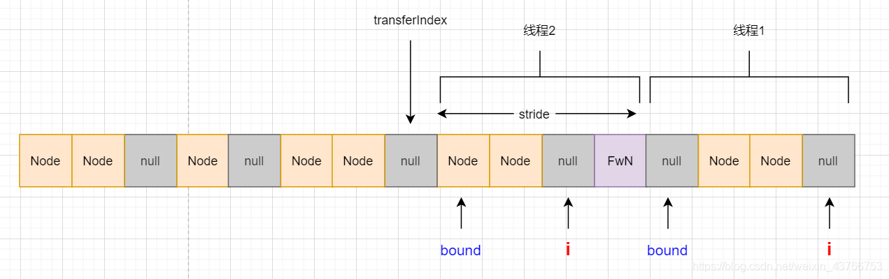

**ConcurrentHashMap 扩容方案的核心思路**： 扩容时，把整个数组进行分段，每个线程负责一段。bound 表示该线程范围的下限，i 表示当前正在迁移的下标。每一个迁移完成的节点都会被赋值 ForwardingNode，表示迁移完成。stride 表示线程迁移的“步幅”，当线程完成范围内的任务后，就会继续往前看看还有没有需要迁移的，transferIndex 就是记录下个需要迁移的下标；当 transferIndex==0 时则表示不需要帮忙了。

1. 当散列表中的元素个数大于扩容阈值时，会触发扩容操作。
2. ~~扩容前，会根据 table 的长度获取扩容的唯一标识，多线程协助扩容时，用于判断是否是同一批次的扩容。~~
3. 扩容时的新数组长度为原数组长度的两倍，初始化好新数组，~~然后会确认当前线程负责的槽位，确认好~~之后会从大到小开始迁移数据。
4. 迁移的逻辑同 HashMap 一样，根据 `hash&n==0` 把桶中元素分化成两个链表或树，低位链表(树)存储在原来的位置，高位链表(树)存储（原来的索引位置 + 原来的数组长度）处。
5. 迁移完成的槽位在里面放置 ForwardingNode 类型的元素，标记该槽位已迁移完成。
   1. 当有线程来读取数据的时候，发现当前节点为ForwardingNode 节点，会调用对应的 find 方法，定向到新散链表中去查询元素。
   2. 当有线程来写数据的时候，发现当前节点为 ForewardingNode 节点，会调用 helpTransfer 方法，判断是否需要协助扩容。
   3. 如果是其他还没被迁移的节点，是可以正常读写的。
6. 扩容完成后，将新数组赋值给成员属性 table。


==JDK1.8，ConcurrentHashMap 正在扩容过程中（假设从16扩容到32），如果此时只有一个线程进行扩容，并且正在迁移table[15]处的节点，此时来了一个线程，要在table[1]处进行插入，能插入成功吗==

在 JDK 8 中，`ConcurrentHashMap` 的扩容是分段进行的，扩容过程中不同桶的迁移是独立的，不会锁住整个 map，而是通过局部锁和 CAS 来保证线程安全。假设 `ConcurrentHashMap` 正在从容量 16 扩容到 32，并且正在迁移 `table[15]` 的节点。如果一个线程正在迁移 `table[15]`，而另一个线程要插入到 `table[1]`，插入是**可以成功的**。

原因如下：

- **扩容是桶级别的独立操作**：在扩容过程中，`ConcurrentHashMap` 会按桶进行分段迁移，也就是说某个桶的迁移不会影响其他桶的操作。
- **散列表的局部锁机制**：当迁移某个桶时，扩容过程中会通过 CAS 和分段锁来处理每个桶。假设 `table[15]` 正在迁移，但这不会影响 `table[1]`，因为它们的迁移是并行的，且没有互相锁定。
- **并发插入**：在扩容期间，其他线程可以并发地操作未被迁移的桶，如 `table[1]`。并发插入操作是安全的，因为扩容期间并不会改变未迁移桶的位置。

因此，即使 `table[15]` 正在迁移，`table[1]` 上的插入操作仍然能够成功执行。


==JDK1.8 ConcurrentHashMap 的负载因子可以指定值吗？==

HashMap 是可以指定负载因子的，但是 ConcurrentHashMap 不可以，ConcurentHashMap 中没有声负载因子的属性，无法保存自定义的负载因子，构造函数中传的负载因子，只是用于计算初始容量，计算扩容时的值使用的是默认值 0.75。


==JDK1.8 为什么使用 synchronized 替换 ReenTrantLock？==

- 性能差别不大：在JDK1.6 中对 synchronized 锁的实现进行了大量的优化，会从无锁>偏向锁>轻量级锁>重量级锁逐步转换，也就是锁膨胀的优化。
- 使用 CAS + synchronized 加锁的对象是每个链表的头节点，提升并发度并减少了内存开销；如果使用可重入锁达到同样的效果，则需要大量继承 ReentrantLock 的对象，造成大量的内存浪费。


==ConcurrentHashMap 和 HashTable 的效率哪个更高？为什么？==

在 `Hashtable` 中，整个哈希表的操作都由一个 **全局锁**（即对整个哈希表加锁）来保护。这意味着无论你执行查询、插入、删除等操作，都会对整个表加锁，从而导致高并发情况下，多个线程访问 `Hashtable` 时会产生较大的锁竞争，性能瓶颈非常明显。

而 ConcurrentHashMap 的锁粒度更低，使用的是桶级别的锁（table[i]）。

- 在 JDK1.7 中采用分段锁实现线程安全。
- 在 JDK1.8 中采用 CAS+Synchronized 实现线程安全。


==JDK8，ConcurrentHashMap，当链表升级为红黑树过程中，此时来了一个新的线程，要对该红黑树进行读操作，此时会怎么处理？如果再有新的线程对该红黑树进行写操作，怎么处理？==

1. **链表升级为红黑树的过程**

当 ConcurrentHashMap 中某个桶（bucket）的链表长度超过了阈值（默认是 8），并且桶的总大小大于阈值（默认是 64），链表会被升级为红黑树。这个过程在 put 操作中进行，如果发现链表太长，才会触发这种升级。

在触发红黑树升级的过程中，会锁住桶（bucket）所在的段。JDK 8 使用了 分段锁 来保证并发安全，即每个桶对应的链表或树会有一个独立的锁来保护它。这是为了避免对整个 ConcurrentHashMap 的大范围锁定。

2. **读操作的处理**

假设在链表升级为红黑树的过程中，来了一个新的线程尝试读取（get）该桶的数据。

- 读操作（get）: ConcurrentHashMap 在设计时尽量避免对读操作加锁，因此它是通过 无锁 方式实现并发的。即使在链表升级为红黑树的过程中，读操作也会尽量绕过锁定。
  
  - 在升级过程中，如果读操作尝试读取数据，JDK 8 会在读取链表或红黑树的结构时保证一致性。具体来说，读操作会读取数据的一个快照，这样即使升级过程中结构在发生变化，读操作也能正确地返回数据。

  - 在这种情况下，读操作会获取到升级前或升级后的数据，不会因为结构调整而出现读取不一致的问题。

3. **写操作的处理**

如果在链表升级为红黑树的过程中，有另一个线程对红黑树进行写操作（例如 put 或 remove），则会如何处理呢？

- 写操作（put 或 remove）: 在进行写操作时，如果链表正在升级为红黑树，ConcurrentHashMap 会使用锁来保护数据结构的修改，确保操作的原子性。具体来说，这种写操作会等到当前升级过程完成后再进行。这样能够保证不会在结构调整的过程中修改正在变动的结构。

  - 写操作通常会尝试获取桶的锁（synchronized），以保证在结构调整完成之前不会发生并发修改。

  - 如果有并发写操作，它们会被排队等待，直到桶内的结构调整完成。

4. **总结**

- 读操作：即使在链表升级为红黑树过程中，get 操作也能无锁读取数据，并且不会受到升级影响，能保证数据一致性。
- 写操作：在链表升级为红黑树的过程中，写操作会通过锁机制进行同步，确保结构的原子性和一致性，避免在结构升级过程中进行并发修改。


==ConcurrentHashMap 为什么 key 和 value 不能为 null？==

ConcurrentHashMap 的 key 和 value 不能为 null 主要是为了避免二义性。

null 是一个特殊的值，表示没有对象或没有引用。如果你用 null 作为键，那么你就无法区分这个键是存在于 ConcurrentHashMap 中为null，还是根本没有这个键。同样，如果你用 null 作为值，那么你就无法区分这个值是否是真正存储在 ConcurrentHashMap 中的，还是因为找不到对应的键而返回。

当 get() 返回 null 时无法判断是哪种情况，在并发环境下 containsKey() 不再可靠。


==HashMap 的 key 和 value 为什么可以为 null，而 ConcurrentHashMap 不能？==

HashMap是非线程安全的，默认单线程环境中使用，不会存在一个线程操作该 HashMap 时，其他的线程将该 HashMap 修改的情况，如果 get(key)为 null，可以通过 containsKey(key)来判断这个 key 的 value 为 null，还是不存在这个key，从而做相应的处理；也就不存在二义性问题。

而在多线程环境下，可能会存在多个线程同时修改键值对的情况，get(key) 和 containsKey(key) 两个操作和在一起不是一个原子性操作，可能在执行中间，有其他线程修改了数据，这时是无法通过containskey(key) 来判断键值对是否存在的，这会带来一个二义性的问题，~~Doug Lea说二义性是多线程中不能容忍的！~~

可以 putIfAbsent() 解决 get(key) 和 containsKey(key) 两个操作和在一起不是一个原子性操作的问题。

`putIfAbsent` 方法会在指定的 `key` **不存在**时将 `key` 和 `value` 插入 `ConcurrentHashMap`，如果 `key` 已经存在，它不会做任何修改。

`computeIfAbsent` 方法在指定的 `key` 不存在时，会 **计算并插入**一个新的值。该值是通过一个 `Function`（函数）计算出来的。

```java
ConcurrentHashMap<String, String> map = new ConcurrentHashMap<>();
map.putIfAbsent("key1", "value1"); // 插入 key1 和 value1
map.putIfAbsent("key1", "newValue"); // 不会更新，返回 value1

// 安全的累加
while(true) {
    // 第二次调用的时候，由于已经存在 key1，所以不会执行后面的函数了，但是会返回 value 值
    // 注意不能使用 putIfAbsent，此方法返回的是上一次的 value，首次调用返回 null，也就是第一次不能累加，少加了一次
    LongAdder adder = map.computeIfAbsent("key1", key -> new LongAdder().increment();
    // 返回的计数器执行累加
    adder.increment();
}

```


## 2、并发


### 2.1 多线程


==并发、并行、串行之间的区别？==

1. 串行（Serial）：

   - 定义：任务一个接一个地顺序执行，当前任务完成后才开始下一个任务。
   - 例子：依次执行A、B、C任务。

2. 并发（Concurrency）：

   - 定义：多个任务在同一时间段内开始，但并非同时执行。任务可能会交替执行，CPU 在不同任务间切换。
   - 例子：A、B、C任务在同一时间段内交替执行。

3. 并行（Parallelism）：

   - 定义：多个任务在同一时刻真正同时执行，通常依赖多核处理器。

   - 例子：A、B、C任务在多个核心上同时执行。

     

总结：

- 串行：任务顺序执行。
- 并发：任务交替执行，可能并非同时。
- 并行：任务真正同时执行。


==创建线程的三种方式？==

在 Java 中，创建线程有三种方法：

- 实现 Runnable 接口；
- 实现 Callable 接口；
- 继承 Thread 类。

实现 Runnable 和 Callable 接口的类只能当做一个可以在线程中运行的任务，不是真正意义上的线程，因此最后还需要通过 Thread 来调用。可以说任务是通过线程驱动从而执行的。


继承与实现接口相比，实现接口会更好一些，因为:

- Java 不支持多重继承，因此继承了 Thread 类就无法继承其它类，但是可以实现多个接口；

- 类可能只要求可执行就行，继承整个 Thread 类开销过大。

  

**实现 Runnable 接口**

需要实现 run() 方法。

通过 Thread 调用 start() 方法来启动线程。

```java
// 创建任务
Runnable runnable = new Runnable() {
    @Override
    public void run() {
        log.debug("通过 Runnable 接口创建的线程");
    }
};

// 创建并启动线程
new Thread(runnable).start();
```


**实现 Callable 接口**

与 Runnable 相比，Callable 可以有返回值，返回值通过 FutureTask 进行封装。

```java
// 创建任务
Callable callable = new Callable() {
    @Override
    public Object call() throws Exception {
        log.debug("通过 Callable 接口创建的线程");
        return 1;
    }
};

// 将任务封装进 FutureTask 中，以便后续从该线程中获取处理结果
FutureTask<Integer> futureTask = new FutureTask<>(callable);
// 创建并启动线程
new Thread(futureTask).start();

// 获取线程执行的结果
// 主线程执行到该 get() 方法时，会进入阻塞状态，直到子线程执行完毕
try {
    System.out.println(futureTask.get());
} catch (Exception e) {
    e.printStackTrace();
}
```


**继承 Thread 类**

```java
// 创建线程
Thread thread = new Thread(){
    public void run() {
        try {
            Thread.sleep(3000);
        } catch (InterruptedException e) {
            log.error(e.getMessage());
        }
        log.debug("通过 Thread 类创建的线程");
    }
};

// 启动线程
thread.start();
```


==如何优雅的停止一个线程？==

一个线程执行完毕之后会自动结束，如果在运行过程中发生异常会提前结束。


Java 提供了线程中断以及判断某个线程是否被中断过的方法：

- interrupt()：给调用了该方法的线程设置一个中断标记，此时
  - 如果调用该方法的线程处于等待或阻塞状态，则会抛出 InterruptedException，并中断线程的执行；
  - 如果调用该方法的线程没有处于等待或阻塞状态，则线程会继续运行（只是设置了一个中断标记
- interrupted()：判断调用了该方法的线程是否被中断过（检查中断标记）
  - 注意，**Thread.interrupted() 的调用线程是当前正在执行的线程**！！！
  - 返回一个 boolean 值，并清除标记位（即：再次调用时，中断标记已经被清除，此时会返回一个 falase）
- isInterrupted()：判断调用了该方法的线程是否被中断过（检查中断标记）
  - 不会清除标记位


总的来说

- interrupt()：设置一个中断标记，如果处于等待或阻塞状态，则会抛出异常并中断线程；
- interrupted()：检测并清除中断标记；
- isInterrupted()：只检测中断标记；

```java
Thread t1 = new Thread(() -> {
    log.debug("t1 线程启动");
}, "t1");
t1.start();
t1.interrupt();

log.debug("第一次调用 t1.isInterrupted(): {}", t1.isInterrupted());
log.debug("第二次调用 t1.isInterrupted(): {}", t1.isInterrupted());

// 注意，Thread.interrupted() 作用于当前正在执行的线程，此处是 main 线程，而不是 t1 线程！！！
log.debug("第一次调用 Thread.interrupted(): {}", Thread.interrupted());
log.debug("第二次调用 Thread.interrupted(): {}", Thread.interrupted());

// interrupt() 作用于 main 线程
Thread.currentThread().interrupt();
log.debug("第一次调用 Thread.interrupted(): {}", Thread.interrupted());
log.debug("第二次调用 Thread.interrupted(): {}", Thread.interrupted());

log.debug("main 线程执行结束");
```

日志输出

```java
19:10:29 [t1] - t1 线程启动
19:10:29 [main] - 第一次调用 t1.isInterrupted(): true
19:10:29 [main] - 第二次调用 t1.isInterrupted(): true
19:10:29 [main] - 第一次调用 Thread.interrupted(): false
19:10:29 [main] - 第二次调用 Thread.interrupted(): false
19:10:29 [main] - 第一次调用 Thread.interrupted(): true
19:10:29 [main] - 第二次调用 Thread.interrupted(): false
19:10:29 [main] - main 线程执行结束
```


==谈谈你对 ThreadLocal 的理解==

`ThreadLocal` 是 Java 提供的一种用于线程隔离的机制，它能够为每个线程提供独立的变量副本。具体来说，`ThreadLocal` 允许每个线程在其内部存储和访问自己的局部变量，避免了不同线程之间的共享问题，从而避免了并发访问的竞争条件和同步问题。

ThreadLocal 底层是通过 ThreadLocalMap 这个静态内部类来存储数据的，ThreadLocalMap 就是一个键值对的 Map，它的底层是 Entry 对象数组，Entry 对象中存放的键是 ThreadLocal 对象，值是 Object 类型的具体存储内容 。

除此之外，ThreadLocalMap 也是 Thread 类一个属性。


ThreadLocal 的底层实现依赖于每个线程的 ThreadLocalMap 来存储每个线程独有的数据。ThreadLocalMap 是一个专门为每个线程管理其私有变量的哈希映射。每个线程都有一个 ThreadLocalMap，其中键是 ThreadLocal 对象，值是当前线程的私有副本。

1. 每个线程有一个 ThreadLocalMap，用于存储该线程的 ThreadLocal 变量副本。

2. ThreadLocalMap 以 ThreadLocal 为键，值为该线程的私有数据。

3. 在 ThreadLocal.set() 和 ThreadLocal.get() 时，JVM 会根据当前线程查找对应的 ThreadLocalMap，通过哈希表获取或存储变量。

   

<span style="color:red">回答流程：</span>

`ThreadLocal` 是 Java 提供的一种用于线程隔离的机制，它能够为每个线程提供独立的变量副本。然后讲一下 ThreadLoal & ThreadLocaMap & Entry & Thread 的关系，再结合 set & get 的源码讲

```java
public void set(T value) {
    Thread t = Thread.currentThread();
    ThreadLocalMap map = getMap(t);
    if (map != null) {
        map.set(this, value);
    } else {
        createMap(t, value);
    }
}

public T get() {
    Thread t = Thread.currentThread();
    ThreadLocalMap map = getMap(t);
    if (map != null) {
        ThreadLocalMap.Entry e = map.getEntry(this);
        if (e != null) {
            @SuppressWarnings("unchecked")
            T result = (T)e.value;
            return result;
        }
    }
    return setInitialValue();
}
```


如果使用不当，ThreadLocal 会导致内存泄漏。

内存泄漏是指程序中已动态分配的堆内存由于某种原因程序未释放或无法释放，造成系统内存的浪费，导致程序运行速度减慢甚至系统崩溃等严重后果。

如果是直接创建线程，然后使用 ThreadLocal（不使用线程池）的话，ThreadLocal 是不存在线程泄露问题的。因为当线程执行结束，那么线程就要销毁，线程中的 threadlocals 属性也随之销毁，那么对应的 Entry 对象当然也会被销毁了。

但是一般都是使用线程池，而线程池中的核心线程是不会被销毁的，导致存放数据的 Entry 对象不会被销毁，从而导致内存泄露问题。

- 来一个线程，new 一个 Entry。因为核心线程不会释放，导致堆内存中存在很多 Entry 对象没有被释放掉，导致内存泄露。
  - 即：每次调用只是创建一个新的 Entry 对象覆盖旧的 Entry 对象，旧的 Entry 对象没有被释放。


另外，线程池导致 ThreadLocal 内存泄露问题，主要原因是就是 Entry 没有被释放掉，所以在设计 Entry 对象的时候，增加了对应的处理：使 Entry 对象的 key 即 ThreadLocal 类继承于 WeakReference 弱引用类。具有弱引用的对象有更短暂的生命周期，在发生 GC 活动时，无论内存空间是否足够，垃圾回收器都会回收具有弱引用的对象。

```java
static class Entry extends WeakReference<ThreadLocal<?>> {
    /** The value associated with this ThreadLocal. */
    Object value;

    Entry(ThreadLocal<?> k, Object v) {
        super(k);
        value = v;
    }
}
```

由于 Entry 对象的 key 是继承于 WeakReference 弱引用类的，若 ThreadLocal 类没有外部强引用，当发生 GC 活动时就会将 ThreadLocal 对象回收。

- 也就是 Entry 的 key 被设置为 null，从而变成一个**无效的 Entry**。
  - 在调用set方法时，如果发生 hash 冲突，就会通过线性检测法处理哈希冲突，若 Entry 数组的 key 与当前 ThreadLocal 不是同一个对象，同时 key 为空的时候，会进行 **清理无效 Entry** 的处理，从而达到清除的目的。

但是，如果此时如果创建 ThreadLocal 类的线程依然活动，那么 Entry 对象中 ThreadLocal 对象对应的 value 就依旧具有强引用而不会被回收，从而导致内存泄漏。


**怎么解决这个问题？**

要想解决内存泄漏问题其实很简单，只需要记得在使用完 ThreadLocal 中存储的内容后将它 **remove** 掉就可以了。


### 2.2 线程池


==线程池的核心参数有哪些？==

```java
public ThreadPoolExecutor(int corePoolSize,
                          int maximumPoolSize,
                          long keepAliveTime,
                          TimeUnit unit,
                          BlockingQueue<Runnable> workQueue,
                          RejectedExecutionHandler handler)
```

   - **核心线程数（`corePoolSize`）**: 保持活动的线程数，默认情况下，如果线程数少于核心线程数，即使空闲，也不会被回收。
   - **最大线程数（`maximumPoolSize`）**: 线程池允许的最大线程数。
   - **空闲线程的存活时间（`keepAliveTime`）**: 空闲线程在被销毁之前的最大存活时间。
   - **时间单位（`unit`）**: 指定空闲线程的存活时间单位。
   - **任务队列（`BlockingQueue`）**: 用于存放待执行任务的队列。常见的队列有`LinkedBlockingQueue`、`ArrayBlockingQueue`、`SynchronousQueue`等。
   - **线程工厂（`ThreadFactory`）**: 用于创建新线程的工厂（主要用于指定线程的名字）。
   - **拒绝策略（`RejectedExecutionHandler`）**: 当线程池无法处理更多的任务时，选择如何处理任务。常见的拒绝策略有：`AbortPolicy`（默认，抛出异常）、`CallerRunsPolicy`（调用者执行任务）、`DiscardPolicy`（丢弃任务）等。


==线程池有几种状态？分别是如何变化的？==

| 状态名     | 描述                                                         |
| ---------- | ------------------------------------------------------------ |
| RUNNING    | 会接收新任务，并且会处理队列中的任务                         |
| SHUTDOWN   | 不会接收新任务，但会处理阻塞队列剩余任务，并中断所有线程（调用 shutdown() 会变成该状态） |
| STOP       | 不会接收新任务，并且不会处理队列中的任务，并中断所有线程（调用 shutdownNow() 会变成该状态） |
| TIDYING    | 所有线程都停止了之后，线程池的状态就会转为 TIDYING，一旦达到此状态，就会调用线程池的 terminated() |
| TERMINATED | terminated() 执行完之后就会转变 TERMINATED                   |


==向线程池中提交一个任务后，线程池的执行流程是怎样的？==

1. 当提交任务时，如果当前活跃线程数小于核心线程数，会立即创建一个新线程执行任务。
2. 如果核心线程数已满，则任务会被提交到任务队列中等待。
3. 如果任务队列已满且活跃线程数还未达到最大线程数时，线程池会创建更多的线程（空闲线程）来执行任务。
4. 如果线程池的线程数达到最大线程数，并且任务队列已满，线程池会根据拒绝策略处理超出的任务。


==常用的线程池工厂方法？==

   - **`Executors.newFixedThreadPool(int nThreads)`**: 创建固定大小的线程池。
     - 核心线程数 == 最大线程数（没有救急线程被创建），因此也无需超时时间。

   - **`Executors.newCachedThreadPool()`**: 创建一个可缓存的线程池，线程池的线程数会根据需求增长，空闲线程会被回收。
     - 核心线程数是 0， 最大线程数是 Integer.MAX_VALUE，救急线程的空闲生存时间是 60s。

   - **`Executors.newSingleThreadExecutor()`**: 创建一个只有单个线程的线程池，适用于只需要一个线程的任务。
     - 使用场景：希望多个任务排队执行。线程数固定为 1，任务数多于 1 时，会放入无界队列排队。


==线程池的核心线程数、最大线程数该如何设置？==

**核心线程数**

- CPU密集型任务：如果任务主要是计算密集型的（比如复杂的数学计算），核心线程数可以设置为与CPU核心数相同。
  - 示例：假设你的机器有4个CPU核心，则可以将核心线程数设置为4。（CPU 高速执行，避免上下文切换）
- I/O密集型任务：如果任务主要是I/O密集型的（例如数据库读写、文件读写、网络请求等），则线程数可以设置得更大，因为I/O操作时线程通常会阻塞，可以通过更多的线程来等待I/O完成。
  - 示例：对于I/O密集型任务，核心线程数可以设置为CPU核心数的2倍或更多。

**最大线程数**

- 一种常见的做法是：最大线程数 = 任务提交速率 * 每个任务的平均处理时间 / CPU核心数。


==并发过程中的：原子性、可见行、有序性？==

由于 `CPU` 和 `内存` & `I/O 设备` 之间的速度是有极大差异的，为了合理利用 CPU 的高性能，平衡这三者的速度差异，计算机体系结构、操作系统、编译程序都做出了相应的优化，主要体现为:

- CPU 增加了缓存，以均衡与内存的速度差异；// 导致 `可见性`问题

- 操作系统增加了进程、线程，以分时复用 CPU，进而均衡 CPU 与 I/O 设备的速度差异；// 导致 `原子性`问题

- 编译程序优化指令执行次序，使得缓存能够得到更加合理地利用。// 导致 `有序性`问题

  

原子性：即一个操作或者多个操作要么全部执行并且执行的过程不会被任何因素打断，要么就都不执行。

- 使用锁：sychronized、ReentrantLock、CAS

可见性：一个线程对共享变量的修改，另外一个线程能够立刻看到。

- 使用 volatile 修饰字段，被 volitile 修饰的字段，每次都从主存中读，每次改修完，立即同步到主存。

有序性：即程序执行的顺序按照代码的先后顺序执行。编译器为了优化性能，有时候会改变程序中语句的先后顺序。

- 使用 volatile 修饰字段，被 volatile 修饰的字段，禁止指令重排序（单例模式的：双重检查锁）


==Java死锁如何避免？==

**造成死锁的几个原因：**

1. 一个资源每次只能被一个线程使用；
2. 一个线程在阻塞等待某个资源时，不释放已占有资源；
3. 一个线程已经获得的资源，在未使用完之前，不能被强行剥夺；
4. 若干线程形成头尾相接的循环等待资源关系；

这是造成死锁必须要达到的4个条件，如果要避免死锁，只需要不满足其中某一个条件即可。而其中前3个条件是作为锁要符合的条件，所以要避免死铁就需要打破第4个条件，不出现循环等待铁的关系。

**在开发过程中：**

1. 要注意加锁顺序，保证每个线程按同样的顺序进行加锁；
2. 要注意加锁时限，可以针对所设置一个超时时间；
3. 要注意死锁检查，这是一种预防机制，确保在第一时间发现死铁并进行解；


==ReentrantLock 中 tryLock() 和 lock() 的区别？==

1. tryLock()：表示尝试加锁，可能加到，也可能加不到，该方法不会阻塞线程，如果加到锁则返回true，没有加到则返回false；

2. lock()：表示阻塞加锁，线程会阻塞直到加到锁，方法也没有返回值；


==synchronized的偏向锁、轻量级锁、重量级？==

**偏向锁：**

很多时候，同步代码其实只有一个线程在执行，并不存在竞争锁的情况。这时候直接加锁就会导致性能问题。偏向锁是 Java 的一种锁优化方式，适用于没有线程竞争的情况。当一个线程获得锁之后，它会偏向于该线程，这意味着后续的锁请求会直接授予该线程，而不需要获取锁。只有当其他线程尝试获取锁时，偏向锁才会被撤销。

简单来说就是：只有第一次使用 CAS 将线程 ID 设置到对象的 Mark Word 头，之后发现这个线程 ID 是自己的就表示没有竞争，不用重新 CAS。以后只要不发生竞争，这个对象就归该线程所有

**轻量级锁：**

轻量级锁是为了减少锁竞争的开销。简单来说：如果一个对象虽然有多线程要加锁，但加锁的时间是错开的（也就是没有竞争），那么可以使用轻量级锁来优化。

假设有两个方法同步块，然后有两个线程0和1会进行访问，但是它们一个是上午访问，一个是下午访问，时间是错开的。即：虽然有多个线程都会访问同一个锁，但是访问时间不存在交叉，没有发生锁竞争。那么就会使用轻量级锁。

**重量级锁：**

当多个线程频繁竞争同一把锁时，轻量级锁会升级为重量级锁。重量级锁会使线程阻塞，操作系统需要将线程从用户态切换到内核态，开销较大。


==synchronized 和 ReentrantLock 的区別？==

ReentrantLock基于 AQS，AQS 有 tryAcquire()，所以 ReentrantLock 可以有 tryLock() 去尝试加锁，加锁失败可以做其他操作。而 synchronized 没有。

ReentrantLock 基于 AQS 的等待队列，从而实现了公平锁和非公平锁，而 synchronied 都是非公平的

`Synchronized` 和 `ReentrantLock` 都用于线程同步，但有几个关键区别：

1. 控制方式：
   - Synchronized：隐式锁，JVM自动管理。
   - ReentrantLock：显式锁，开发者手动控制。
2. 公平性：
   - Synchronized：不保证公平性。
   - ReentrantLock：可设为公平锁，按请求顺序获取锁。
3. 中断响应：
   - Synchronized：无法响应中断。
   - ReentrantLock：可以响应中断（lockInterruptibly()）。
4. 死锁预防：
   - Synchronized：容易导致死锁。
   - ReentrantLock：通过 tryLock() 等方法可避免死锁。


### 2.3 JUC工具


#### 2.3.1 Unsafe

Unsafe 类是 Java 中提供的一个非常强大的类，它允许直接操作内存和执行一些高性能的操作，CAS 底层就是 Unsafe 类实现的。


**常用方法：**

```java
// 用于比较并交换一个对象的 int 类型字段的值。
boolean compareAndSetInt(Object o, long offset, int expected, int x)
    
// 用于比较并交换一个对象的引用类型字段的值。
boolean compareAndSetReference(Object o, long offset, Object expected, Object x)
```


**使用示例**

```java
public class UnsafeCASExample {
    private static final Unsafe unsafe;
    private static final long valueOffset;
    private volatile int value = 0;

    static {
        try {
            // 获取 Unsafe 实例
            Field field = Unsafe.class.getDeclaredField("theUnsafe");
            field.setAccessible(true);
            // 通过反射获取 theUnsafe 字段的值。因为 theUnsafe 是静态字段，它不依赖于任何实例，所以你需要传入 null 来表示访问静态字段。非静态字段，需要传入一个类的实例对象。
            unsafe = (Unsafe) field.get(null);
            // 获取 value 字段的内存偏移量
            valueOffset = unsafe.objectFieldOffset(UnsafeCASExample.class.getDeclaredField("value"));
        } catch (Exception e) {
            throw new Error(e);
        }
    }

    public boolean compareAndSwap(int expected, int newValue) {
        return unsafe.compareAndSetInt(this, valueOffset, expected, newValue);
    }

    public static void main(String[] args) {
        UnsafeCASExample example = new UnsafeCASExample();
        
        // 线程 1
        new Thread(() -> {
            boolean result = example.compareAndSwap(0, 10);
            System.out.println("Thread 1 CAS result: " + result + " new value: " + example.value);
        }).start();

        // 线程 2
        new Thread(() -> {
            boolean result = example.compareAndSwap(0, 20);
            System.out.println("Thread 2 CAS result: " + result + " new value: " + example.value);
        }).start();
    }
}
```


**示例输出：**

```
Thread 1 CAS result: true new value: 10
Thread 2 CAS result: false new value: 10
```


#### 2.3.2 CAS

CAS（Compare-And-Swap）是一种原子操作，常用于在多线程环境下实现数据的同步，避免使用传统的锁机制（如`sychronized`关键字），从而提高性能。


CAS的核心思想是：

1. 在进行更新操作时，先检查要修改的值是否与预期值相等，如果相等，就将该值更新为新值；
   - 即：对于同一个变量，在对这个变量进行修改时，再次从主存读取该变量的最新值，如果读取最新值和修改前读取到的相等，才会进行更新操作。`U.compareAndSetInt(this, SIZECTL, sc, -1)`
2. 如果不相等，表示该值已经被其他线程修改过，那么 CAS 操作会失败，通常会尝试重新执行该操作，直到成功为止。


CAS 操作会保证**原子性**（硬件层面保证原子性：X86架构下的`lock cmpxchg` 指令：在多核状态下，某个核执行到带 lock 的指令时，CPU 会让总线锁住，当这个核把此指令执行完毕，再开启总线。这个过程中不会被线程的调度机制所打断，保证了多个线程对内存操作的准确性，是原子的。），也就是说，在一个线程执行 CAS 操作时，其他线程不能干扰这个操作。因此，即使多个线程并发地更新同一个变量，CAS 也能确保只有一个线程的更新会成功，其它线程会重试，直到它们成功为止。


需要注意的是：CAS 必须借助 volatile 才能读取到共享变量的最新值，从而实现【比较并交换】的效果。

- volatile 的底层实现原理是内存屏障，Memory Barrier（Memory Fence）
  - 对 volatile 变量的写指令后会加入写屏障
    - 写屏障（sfence）保证在该屏障之前的，对共享变量的改动，都同步到主存当中
  - 对 volatile 变量的读指令前会加入读屏障
    - 而读屏障（lfence）保证在该屏障之后，对共享变量的读取，加载的是主存中最新数据


CAS 有三个操作数：

```
U.compareAndSetInt(this, SIZECTL, sc, -1)
```

1. **内存位置（V）**：要更新的共享变量的地址。-- SIZECTL

2. **预期值（A）**：当前内存位置的预期值，通常是读出来的当前值。-- sc

3. **新值（B）**：要写入内存位置的值。-- -1

   

CAS 操作的步骤：

1. **读取**：从内存位置读取当前的值（A）。

2. **比较**：将当前值与预期值（A）进行比较。

3. **交换**：如果当前值等于预期值（A），则将内存位置的值替换为新值（B）；如果不相等，则什么都不做。


`AtomicInteger` 是基于 CAS 实现的线程安全整数类。它通过底层的原子操作来确保对整数值的更新是无锁的。 `AtomicInteger` 底层使用 `volatile` 关键字来保证对值的可见性，并且通过 `unsafe.compareAndSwapInt` 来执行 CAS 操作。与 CAS 有关的常见类包括

- AtomicInteger
- AtomicLong
- AtomicReference
- AtomicStampedReference


CAS 的优缺点

- 优点：
  - 无需加锁，避免了线程阻塞和上下文切换的开销。
- 缺点：
  - 可能会导致"ABA问题"（即值可能在两次比较之间被修改为相同的值），为了解决这个问题，可以使用带版本号的CAS操作。
  - 适用于简单的数据更新操作，复杂的更新操作仍然需要其他同步机制。


#### 2.3.3 AQS

AQS 是 Java 中用于实现同步器的基础框架，它利用原子操作（CAS）和队列（Node 链表）来管理线程间的同步，提供了一个高效、可扩展的同步机制。


**AQS 的核心概念**：

- **同步状态（state）**：AQS 使用一个整数值表示同步状态。通过这个状态值来控制访问资源的权限。
  - 比如在 ReentrantLock 中，state == 0 表示尚未加锁，state == 1 表示已经加锁
- **FIFO 等待队列（Node 链表）**：当线程无法获取锁时，它会被加入一个等待队列中，按照先进先出的顺序等待唤醒。
  - LockSupport.park() 挂起，然后进入 Node 类型的双向链表


state & Node 节点结构如下：

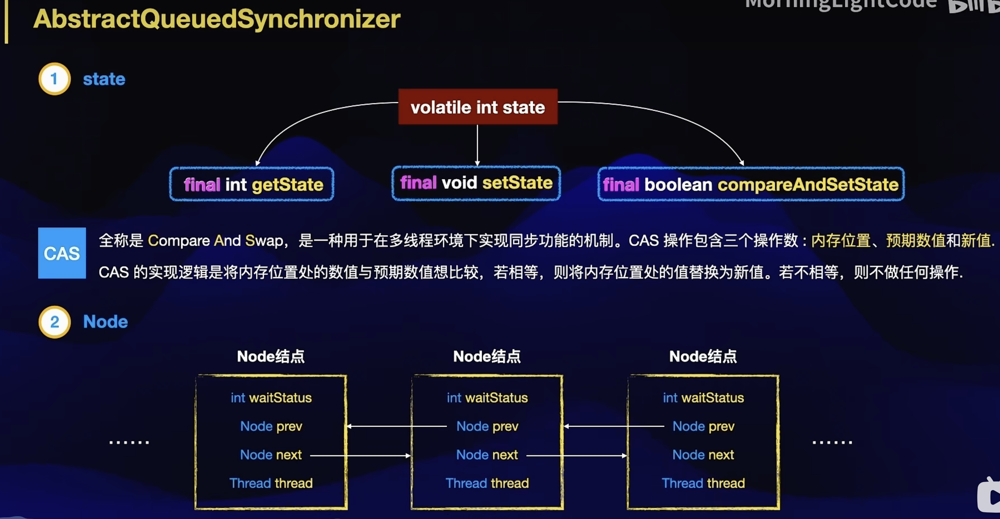


其中 Node 链表的定义如下

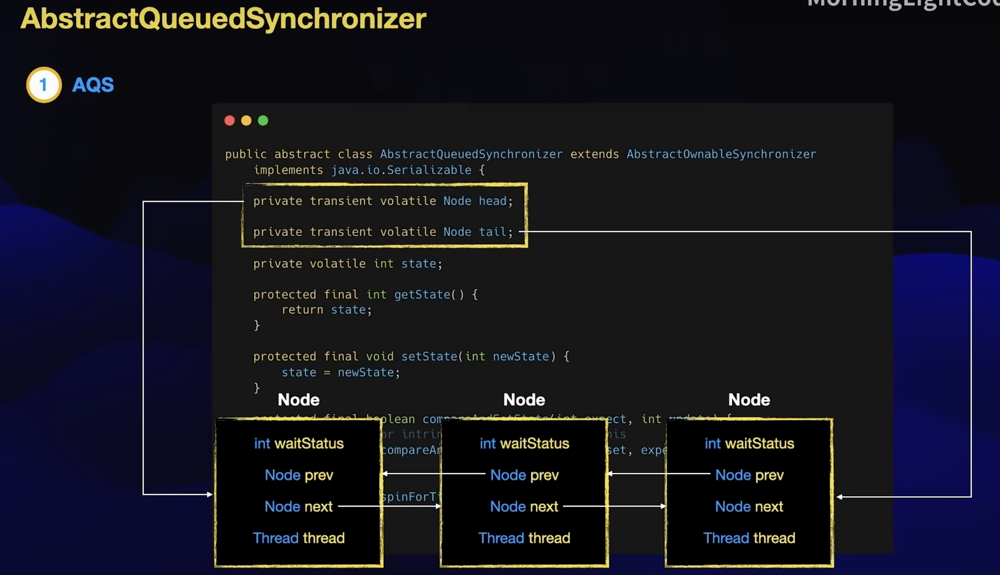


多个线程同时采用 CAS 修改 AQS 的 state 属性时，只有一个线程能修改成功（获取到锁），CAS 修改失败的线程则：

1. 线程进行阻塞：`LockSupport.park(this);`
2. 然后进入 Node 队列中等待唤醒：`LockSupport.unpark(head.next);`

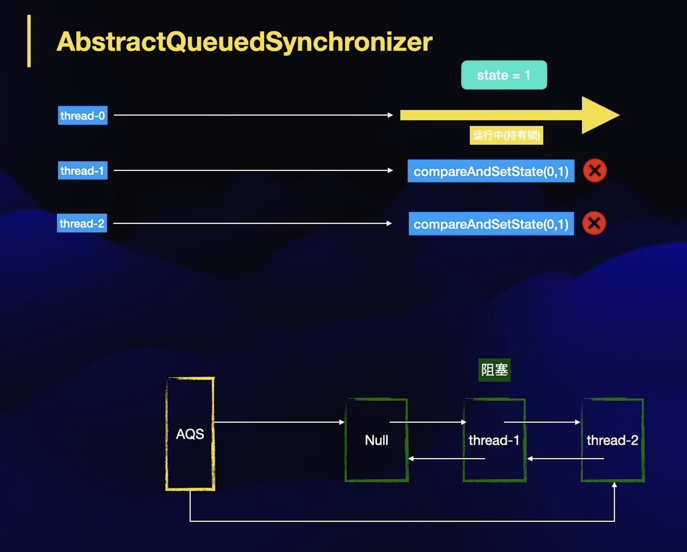


获取到锁的线程执行完毕后，唤醒等待队列中的第一个线程（先进先出）

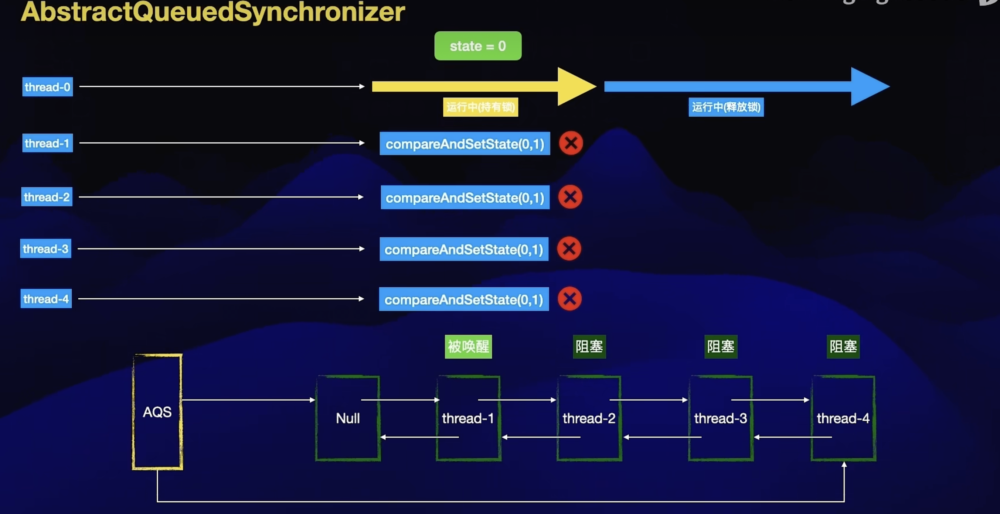


#### 2.3.4 ReentrantLock

ReentrantLock 利用 AQS 的实现原理流程关键点总结：

1. **核心状态 `state`**：
   - `state = 0`：锁空闲。
   - `state >= 1`：锁被占用，数值表示持有线程的**重入次数**。
2. **获取锁 (`lock()`) - 核心方法 `tryAcquire`**：
   - **非公平锁 (默认)**：
     - 直接尝试 CAS 将 `state` 从 0 设为 1。成功则设置当前线程为独占线程。
     - 失败或 `state != 0`：检查持有线程是否是当前线程 (重入)。是则 `state++`。
     - 否则，线程入队并可能阻塞。
   - **公平锁**：
     - 先检查等待队列是否有前驱节点。有则直接排队。
     - 无前驱或当前线程已持有锁：尝试 CAS 或 `state++` (重入)。
   - **失败入队**：获取失败的线程会被构造成 Node 加入 **CLH 双向队列**尾部，并可能被挂起 (调用 `LockSupport.park()`)。
3. **释放锁 (`unlock()`) - 核心方法 `tryRelease`**：
   - 检查当前线程是否是持有者。
   - `state--`。
   - 若 `state` 减为 0，清除独占线程标识。
   - 释放成功且 `state == 0`：唤醒队列中下一个有效节点线程 (`unparkSuccessor`)。


#### 2.3.5 Semaphore

在Java中，`Semaphore`是`java.util.concurrent`包中的一个类，它实现了信号量机制，用于控制对共享资源的访问。

`Semaphore`通过维持一个【许可计数来】限制同时访问某个特定资源的线程数量，确保多线程环境下的并发控制。

形象例子：【停车场车位数】


**主要特点**

1. **许可数**：`Semaphore`内部有一个许可计数（`permits`），它决定了最多有多少个线程可以同时访问共享资源。

2. **阻塞和唤醒机制**：当许可数为0时，尝试获取许可的线程会被阻塞。获取到许可后，许可数减少，线程可以执行资源访问任务；执行完成后，线程释放许可，许可数增加，其他阻塞线程可以被唤醒。

3. **公平性**：`Semaphore`支持公平性，表示线程可以按请求的顺序获取许可。公平性可以通过构造函数来指定。

   

**常见方法**

- **`acquire()`**：请求一个许可，如果没有可用许可，线程将被阻塞，直到获得许可。

- **`release()`**：释放一个许可，将许可数加1，并唤醒一个等待的线程（如果有的话）。

  

**示例代码**

```java
import java.util.concurrent.Semaphore;

public class SemaphoreExample {
    public static void main(String[] args) {
        // 创建一个信号量，初始许可数为3
        Semaphore semaphore = new Semaphore(3);

        // 创建多个线程，模拟多个线程访问共享资源
        for (int i = 0; i < 5; i++) {
            new Thread(new Worker(semaphore)).start();
        }
    }
}

class Worker implements Runnable {
    private Semaphore semaphore;

    public Worker(Semaphore semaphore) {
        this.semaphore = semaphore;
    }

    @Override
    public void run() {
        try {
            // 获取许可
            semaphore.acquire();
            System.out.println(Thread.currentThread().getName() + " is working.");

            // 模拟工作
            Thread.sleep(2000);

            System.out.println(Thread.currentThread().getName() + " finished working.");
        } catch (InterruptedException e) {
            Thread.currentThread().interrupt();
        } finally {
            // 释放许可
            semaphore.release();
        }
    }
}
```


**执行结果**

```java
21:10:07 [Thread-0] - Thread-0 is working.
21:10:07 [Thread-2] - Thread-2 is working.
21:10:07 [Thread-1] - Thread-1 is working.
21:10:09 [Thread-1] - Thread-1 finished working.
21:10:09 [Thread-0] - Thread-0 finished working.
21:10:09 [Thread-2] - Thread-2 finished working.
21:10:09 [Thread-3] - Thread-3 is working.
21:10:09 [Thread-4] - Thread-4 is working.
21:10:11 [Thread-3] - Thread-3 finished working.
21:10:11 [Thread-4] - Thread-4 finished working.
```


**注意事项**

1. **公平性**：`Semaphore`的公平性是通过传入`true`来保证的，表示线程按请求顺序获取许可（即FIFO）。默认是非公平的。
2. **死锁避免**：使用信号量时需要小心避免死锁，因为线程可能因无法获取到许可而被阻塞。


**简要总结**

Java中的`Semaphore`是一种有效的并发控制工具，适用于限制访问共享资源的线程数量，常用于实现资源池等场景。它通过许可机制帮助管理资源访问，避免过度竞争和资源耗尽。


#### 2.3.6 CountDownLatch

CountDownLatch是 Java 并发编程中的一个同步工具类，位于java.util.concurrent包中。 

它允许一个或多个线程等待，直到其他线程完成操作。CountDownLatch 通常用于实现某些任务必须在其他任务完成后才能继续执行的场景。

和 Thread.join() 的思想基本一致，区别是 CountDownLatch 用于对线程池中的线程进行控制。


**主要特点：**

1. **计数器机制**：`CountDownLatch` 维护一个计数器，初始值为 `count`，每当一个线程调用 `countDown()` 方法时，计数器减一。

2. **等待机制**：通过 `await()` 方法，线程可以在 `CountDownLatch` 上等待，直到计数器减到零为止。

3. **线程同步**：当所有线程都调用 `countDown()` 并且计数器为零时，所有调用了 `await()` 的线程才会继续执行。

   

**主要方法：**

- **`void await()`**：使当前线程等待，直到计数器为零。如果计数器已经为零，则立即返回。

- **`void countDown()`**：将计数器减一。如果计数器为零，则所有在 `await()` 上等待的线程将被唤醒。

  


**使用场景：**

- **多线程并行执行任务**：在并发程序中，某些任务需要等待其他任务完成后再开始。例如，启动多个线程去执行任务，所有任务完成后才能继续执行下一步操作。

- **主线程等待所有子线程执行完毕**：主线程可以通过 `await()` 等待所有工作线程的完成。

  

**示例代码：**

```java
import java.util.concurrent.CountDownLatch;

/**
 * 1. 主线程通过调用 latch.await() 来等待所有子线程完成，子线程在执行完各自的任务后调用 latch.countDown()。
 * 2. 当 countDown() 被调用三次后，计数器变为零，主线程才能继续执行，输出 All workers have finished their tasks.
 */
public class CountDownLatchExample {
    public static void main(String[] args) throws InterruptedException {
        // 创建一个计数器为3的 CountDownLatch
        CountDownLatch latch = new CountDownLatch(3);
        
        // 启动3个线程
        for (int i = 0; i < 3; i++) {
            new Thread(new Worker(latch)).start();
        }
        
        // 主线程等待，直到计数器为0
        latch.await();
        System.out.println("All workers have finished their tasks.");
    }
}

class Worker implements Runnable {
    private final CountDownLatch latch;
    
    public Worker(CountDownLatch latch) {
        this.latch = latch;
    }

    @Override
    public void run() {
        try {
            // 模拟工作
            Thread.sleep(1000);
            System.out.println(Thread.currentThread().getName() + " has finished work.");
        } catch (InterruptedException e) {
            Thread.currentThread().interrupt();
        } finally {
            // 每个线程完成任务后调用 countDown() 方法
            latch.countDown();
        }
    }
}
```


**注意事项：**

- `CountDownLatch` 一旦计数器达到零，不能重置。如果需要重置计数器，应该考虑使用 `CyclicBarrier` 或其他工具类。
- `CountDownLatch` 适用于一次性的任务同步，不能重复使用。


==ThreadLocal 是什么？==

ThreadLocal 是 Java 中用于实现线程局部存储的类，它允许每个线程都可以独立地访问和修改它自己的变量副本，而不与其他线程共享。ThreadLocal 通过在每个线程中为变量提供一个独立的副本，从而避免了多线程环境下的数据竞争和同步问题。

ThreadLocal 的底层实现依赖于每个线程的 ThreadLocalMap 来存储每个线程独有的数据。ThreadLocalMap 是一个专门为每个线程管理其私有变量的哈希映射。每个线程都有一个 ThreadLocalMap，其中键是 ThreadLocal 对象，值是当前线程的私有副本。

1. 每个线程有一个 ThreadLocalMap，用于存储该线程的 ThreadLocal 变量副本。
2. ThreadLocalMap 以 ThreadLocal 为键，值为该线程的私有数据。
3. 在 ThreadLocal.set() 和 ThreadLocal.get() 时，JVM 会根据当前线程查找对应的 ThreadLocalMap，通过哈希表获取或存储变量。


==CountDownLatch 和 Semaphore 的区别和底层原理？==

CountDownLatch 表示计数器，可以给 CountDownLatch 设置一个数字，一个线程调用 CountDownLatch 的 await（将会阻塞，其他线程可以调用 CountDownLatch 的 countDown 方法来对 CountDownLatch 中的状态值减一，当数字被減成0后，所有 await 的线程都将被唤醒。对应的底层原理就是，调用 await 方法的线程会利用 AQS 排队，一旦数字被減为0，则会将 AQS 中排队的线程依次唤醒。

Semaphore 表示信号量，可以设置许可的个数，表示同时允许最多多少个线程使用该信号量，通过 acquire() 来获取许可，如果没有许可可用则线程阻寨，并通过 AQS 来排队，可以通过 release() 来释放许可，当某个线程释放了某个许可后，会从 AQS 中正在排队的第一个线程开始依次唤醒，直到没有空闲许可。


==ReentrantLock中的公平锁和非公平锁的底层实现？==

`ReentrantLock`的公平锁和非公平锁在底层实现上有以下区别：

1. **公平锁**：
   - 通过`AQS`的FIFO队列实现，线程按照请求顺序获取锁。
   - 每次获取锁时，会检查当前线程是否是队列中的第一个，确保公平性。
   - 避免线程饥饿，但性能较差。
2. **非公平锁**：
   - 通过`AQS`实现，线程可以直接获取锁，即使不是队列中的第一个线程。
   - 没有公平性保障，可能导致线程饥饿，但性能更高。

总结：公平锁保证顺序获取锁，非公平锁提高性能，但可能导致线程饥饿。


## 3、JVM


### 3.1 类的生命周期

Java 类的生命周期是指从类被加载到内存开始，到它被从内存中卸载的全过程。分别为：加载、连接、初始化、使用、和卸载。其中的连接又分为验证、准备和解析三个步骤。如下图所示

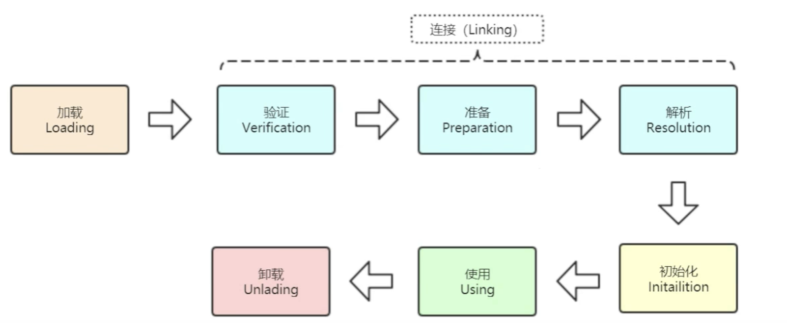


1. **加载（Loading）**

- 在这一阶段，Java 类加载器（ClassLoader）将类的字节码从文件系统加载到内存中。

- 加载的过程通常由 JVM 自动进行，但开发者可以通过自定义类加载器来控制加载的方式。

  

2. **连接（Linking）**

- 连接阶段分为三个子阶段：验证、准备、解析

- **验证（Verification）：** 确保类的字节码符合 JVM 的规范，并且不会破坏 JVM 的安全性。

- **准备（Preparation）：** ~~在这一阶段~~，JVM 为类的静态变量分配内存，并将其初始化为默认值（如`0`、`null`等）。注意，这里的静态变量还未被赋予其显式的初始值。

- **解析（Resolution）：** 将类中的符号引用（如类、字段、方法等）解析为直接引用。即，如果类中引用了其他类中的方法或字段，JVM 会在这一阶段解析它们。

  

3. **初始化（Initialization）**

- 类的初始化是由 `<clinit>` 方法完成的。该方法是 JVM 自动生成的，并且会根据类中静态字段的初始化顺序和静态代码块来执行。

- 如果类中有静态字段或静态代码块，它们将在此阶段进行初始化。

  

4. **使用（Using）**

- 类的实例化或方法调用发生在使用阶段。这时，类被加载并且可以开始实际运行，所有的方法和字段都可以被访问。

- 此阶段通常是最频繁的，在程序运行的过程中，类的对象会被实例化，方法会被调用。

  

5. **卸载（Unloading）**

- 卸载是指类从内存中被移除，通常发生在类加载器不再引用该类时。JVM 会在适当的时候（比如类没有任何活跃引用，或者 JVM 进行内存回收时）进行类的卸载。
- 类卸载的过程是由 JVM 垃圾回收器处理的。


### 3.2 类加载器，JVM 类加载机制

==类加载器==（ClassLoader）是 Java 中的一项核心机制，==用于加载类的字节码到 JVM 中==。JVM 使用类加载器来控制类的加载过程，确保类的独立性、安全性以及适时的加载。Java 类加载机制是基于 **动态加载** 的，意味着类的加载是按需进行的，而不是在程序启动时一次性加载所有类。


**类加载器的工作原理**

JVM 中的类加载器负责根据类的全限定名（包括包名和类名）查找并加载字节码文件。它使用 **委托机制** 来决定如何加载类。类加载器的工作是分层次的，每一层都承担不同的职责。


**类加载器的类型**

1. 启动类加载器（Bootstrap ClassLoader）
   - 启动类加载器是最顶层的类加载器，负责加载 JVM 核心库中的类（例如 java.lang.* 和 java.util.* 等）。这些类的字节码通常存在于 JDK 安装目录下的 rt.jar 或 modules 中。
   - 它是由 C/C++ 编写的，通常无法通过 Java 程序直接访问。
2. 扩展类加载器（Extension ClassLoader）
   - 扩展类加载器负责加载 JDK 中的扩展库（如 JDK 安装目录下的 jre/lib/ext/ 目录中的 JAR 文件）。这些类通常不属于核心库，但提供了一些可选的功能扩展。
   - 它会在启动类加载器之后，负责加载扩展的类。
3. 系统类加载器（System ClassLoader）
   - 也称为 应用程序类加载器，负责加载类路径（classpath）下的类。开发者编写的类文件、第三方库等，通常都通过系统类加载器加载。
   - 它是最常见的加载器，一般会使用 -cp 或 -classpath 指定类路径。
4. 自定义类加载器（Custom ClassLoader）
   - Java 允许开发者自定义类加载器，通过继承 ClassLoader 类来实现自定义的加载行为。比如，可以通过自定义加载器从数据库或网络中加载类，而不仅仅是从本地文件系统或 JAR 包中加载。

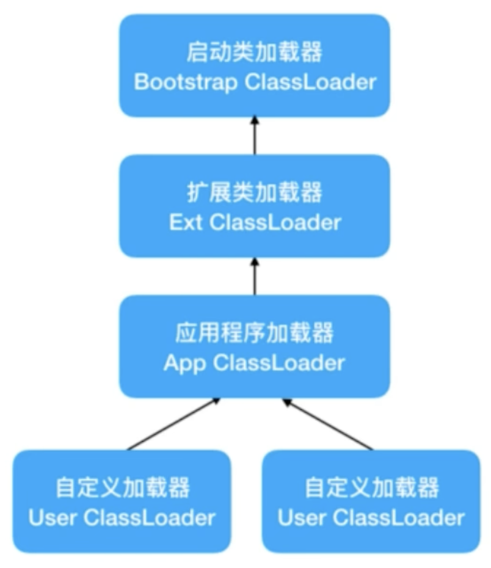


**类加载机制：双亲委派模型**

JVM 中的类加载机制基于 双亲委派模型，即每个类加载器都有一个父类加载器，所有的类加载请求首先会被传递给父类加载器处理。具体流程如下：

1. 类加载请求： 当一个类加载器收到类加载请求时，它首先会询问父类加载器是否已经加载该类。
   
2. 父类加载器加载： 如果父类加载器能加载该类，则直接返回。如果父类加载器无法加载该类，则继续执行下一步。

3. 本地加载： 如果父类加载器无法加载该类，当前的类加载器会尝试加载该类。这通常是通过文件系统、JAR 包、网络等方式进行加载。

4. 防止重复加载： 如果类已经被加载，那么加载器就不会再次加载这个类，而是直接使用已加载的类。

这个机制的核心在于，子类加载器 不会 直接加载父类加载器负责加载的类（比如 java.lang.* 类）。这样就保证了 Java 核心类库的安全性和独立性。


**类加载过程的几个关键点**

1. 类的加载时机：
   - Java 类的加载是 懒加载（lazy loading）的，即当程序第一次访问某个类时，才会开始加载该类。

2. 类加载的线程安全性：
   - 类加载是线程安全的，即 JVM 会确保同一个类只会被加载一次，防止多个线程同时加载同一个类而引发问题。

3. 类的卸载：
   - 类加载器的实例和类的加载有关，当类加载器被垃圾回收时，加载的类也会被卸载。
   
   - 在许多应用场景中，如 Web 容器和应用服务器，使用类加载器来动态加载和卸载应用类（例如，热部署时）。
   
     

**类加载器的委托过程示例**

假设你有一个名为 com.example.MyClass 的类，加载过程可能如下：

1. 系统类加载器请求加载 com.example.MyClass 类。

2. 系统类加载器会将该请求委托给 扩展类加载器，扩展类加载器再将请求委托给 启动类加载器。

3. 启动类加载器会检查该类是否属于 JDK 核心库，如果不是，则返回 null，表明它无法处理该请求。

4. 扩展类加载器同样会检查是否能够处理该请求，如果不能，也会返回 null。

5. 最后，系统类加载器尝试从类路径中加载该类。

   

**为什么需要类加载器？**

1. 动态加载： 类加载器使得 Java 可以动态地加载类，方便进行类的扩展和插件化。
2. 分离性： 使用不同的类加载器，Java 可以加载不同版本的同一个类，实现类的隔离，避免冲突。
3. 安全性： 通过双亲委派模型和自定义加载器，类加载器可以控制哪些类可以被加载，哪些类不能被加载，从而增强 JVM 的安全性。


### 3.3 能说一下 JVM 的内存区域吗？

JVM（Java Virtual Machine）内存区域是 JVM 运行 Java 程序时所使用的内存区域，它分为若干不同的区域，每个区域有不同的用途和生命周期。

JVM 内存结构可以大致分为线程共享的，以及线程私有两大类

堆与元空间属于线程共享的。

虚拟机栈、本地方法栈、程序计数器属于线程私有的。


1. **堆内存（Heap）**

   - 用途： 堆内存用于存储所有对象的实例，以及数组。它是 JVM 内存中最大的一块区域，并且是垃圾回收的主要区域。

   - 生命周期： 堆中的对象会在使用完之后被垃圾回收器（GC）回收。堆是动态扩展的，也就是说它会根据需要增大或缩小。

   - 细分：
     - 年轻代（Young Generation）： 存储新创建的对象。年轻代通常包含三个区域：Eden 区（新对象首先分配到这里）、Survivor 0 区、Survivor 1 区（对象在两者之间来回复制）。如果对象存活足够长时间，会被提升到老年代。
     
       - 举例说明：假设一开始 **S0 区** 空着，**S1 区** 空着，Eden 区有新对象。
         - **第一次 GC**：Eden 区和 S0 区中的存活对象会被复制到 **S1 区**。之后 **Eden 区和 S0 区** 被清空。
         - **第二次 GC**：Eden 区中的新对象和 **S1 区** 中的存活对象会被复制到 **S0 区**。**Eden 区和 S1 区** 会被清空。
         - **第三次 GC**：Eden 区中的对象和 **S0 区** 中的存活对象会被复制到 **S1 区**。
     
     - 老年代（Old Generation）： 存储长时间存活的对象。垃圾回收时，会对老年代进行“全堆”垃圾回收，但通常老年代的回收频率较低。
     
     - ~~永久代（Permanent Generation）（已废弃，Java 8 以后被 Metaspace 取代）： 存储类的元数据、方法信息、常量池等。这部分内存不用于存储普通的 Java 对象，但在 Java 8 之前，它是堆的一部分。Java 8 以后，永久代被 Metaspace 替代，Metaspace 不再有固定的大小。~~
     
       

2. **方法区（Method Area）**

   - 用途： 方法区存储被加载的类信息、方法信息、常量池、静态变量等。它是一个共享内存区域，所有线程都可以访问它。在 Java 8 之后，方法区已被 Metaspace 替代。

     

3. **栈（Stack）**

   - 用途： 每个线程在执行时都会有自己的栈空间。栈用于存储方法的局部变量、操作数栈、部分中间结果等。每当一个方法被调用时，JVM 会为该方法分配一个栈帧，方法调用完成后，栈帧会被销毁。

   - 生命周期： 栈的大小是有限的，栈内存通常用于存储方法的调用信息。每个线程的栈是独立的，栈帧会随着方法调用的结束而被销毁。

   - 栈帧（Stack Frame）： 栈帧中包含了局部变量、操作数栈、动态链接、返回地址等信息。栈帧是每个方法执行的上下文。

     

4. **程序计数器（PC Register）**

   - 用途： 每个线程都有一个程序计数器。它是线程执行过程中当前代码行的地址指示器。JVM 通过程序计数器控制当前线程的执行位置。

   - 生命周期： 程序计数器随着线程的生命周期而存在，每个线程都有独立的程序计数器。

   - 作用： 程序计数器是 Java 线程切换时的一个重要机制，因为每个线程执行时都有独立的程序计数器，确保多线程环境下每个线程都能独立执行。

     

5. **本地方法栈（Native Method Stack）**

   - 用途： 本地方法栈用于支持 JVM 调用本地方法（即非 Java 代码，如 C 或 C++）。它与 Java 栈不同，专门用于本地方法的调用和执行。

   - 生命周期： 本地方法栈的生命周期与线程一致。当线程开始执行时，本地方法栈就开始工作；当线程结束时，本地方法栈被销毁。

     

6. ~~**直接内存（Direct Memory）**~~

   - ~~用途： 直接内存并不是 JVM 内存模型的一部分，而是通过 Java 的 java.nio.Buffer 类访问的内存区域。它是通过 JNI（Java Native Interface）访问系统的物理内存。~~
   - ~~生命周期： 直接内存由操作系统分配，通常用于高性能的 I/O 操作，避免了传统堆内存中的复制和 GC。~~


**内存区域的内存管理与垃圾回收**

- 堆内存（Heap）管理：
  - 垃圾回收器（GC）主要负责清理堆内存中的无用对象，尤其是在年轻代~~和老年代~~中。GC 会定期扫描堆中的对象，释放不再使用的对象。
  - 年轻代 GC（Minor GC）： 主要发生在年轻代，当年轻代的空间不足时，执行垃圾回收。
  - 老年代 GC（~~Major GC 或~~ Full GC）： 当老年代的空间不足时，会触发完整的垃圾回收。老年代 GC 较少发生，但每次回收时会消耗更多资源。

- 方法区与 Metaspace 管理：
  - 方法区用于存储类的元数据、静态变量等，~~但随着类的加载与卸载，方法区内存的管理变得非常复杂。Java 8 后，通过 Metaspace 动态管理方法区的内存，避免了永久代固定大小的问题。~~


### 3.4 Java 对象的创建过程？

Java 创建一个对象的流程可以分为以下几步

1. **类加载：**
   - 在创建 Java 对象之前，JVM 需要先加载相应的类文件。这是因为对象是由类的定义来描述的，因此必须先加载类的字节码。
   - 类加载过程通过**类加载器（ClassLoader）**进行，加载后会将类的信息存储在方法区或 Metaspace 中。
2. **内存分配：**
   - **堆内存分配：** 创建 Java 对象的内存分配通常发生在堆内存中。堆内存用于存储实例化的对象。每次调用 `new` 关键字时，JVM 会从堆内存中为对象分配一块内存空间。
   - **对象初始化：** 在内存分配完后，JVM 会根据类的定义将对象的实例变量（成员变量）初始化为默认值（如 null、0 或 false）。
3. **构造器调用：**
   - 对象的初始化是通过构造函数（构造器）来完成的。在对象分配内存后，JVM 会调用相应的构造函数（无参构造或有参构造）来初始化对象。
   - 如果没有显式定义构造器，JVM 会自动提供一个无参构造器，并初始化实例变量为默认值。
4. **引用赋值：**
   - 在构造函数执行完成后，对象的引用被赋给变量。此时，Java 对象已完全创建并可以通过引用访问。
   - 引用是对象的地址（指针），在堆内存中存储了对象的实例数据，而引用只是指向对象所在内存地址的变量。
5. ~~**对象的生命周期管理：**~~
   - ~~创建的对象会在堆内存中保持，直到它不再被引用为止。此时，垃圾回收器（GC）会将其回收，释放占用的内存空间。~~


### 3.5 Java 对象在内存中的分配方式

~~虚拟机为新对象分配内存，从堆中划出一块确定大小的内存，因为对象所需内存的大小在类加载完后可以完全确定。~~

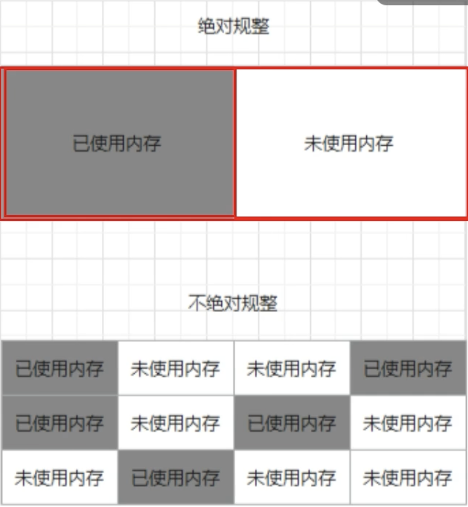


~~在 Java 中，~~对象的内存分配主要依赖于 JVM 的内存管理机制。内存管理分为多个区域，其中最重要的部分是堆内存，而对象的分配方式通常和堆的分配方式密切相关。两种常见的内存分配策略是【指针碰撞】和【空闲列表】。


**1、指针碰撞（Pointer Collision）**

~~指针碰撞是早期的内存分配策略，~~它假设堆内存区域是连续的，分为两个区域：

- 空闲区域：存储尚未分配的内存。
- 已分配区域：存储已经分配了内存的对象。

当一个对象分配内存时，JVM 会使用一个指针来标记堆的分配位置。初始时，指针指向堆的起始位置。分配内存时，这个指针会移动到下一个空闲位置。如果对象的大小是固定的且简单的分配方式，这种策略效率较高，内存分配过程相对较快。

指针碰撞产生内存碎片的原因：

- 对象大小不均：由于不同对象的大小不一致，JVM在分配内存时，如果一个大的对象被分配到堆内存的一个位置，而该位置之后又有一个小的对象，这时当大对象被回收时，内存中会留下一个不规则的小空闲区，这个空闲区可能不足以容纳其他对象。
- 内存回收过程中的影响：当一个对象被回收时（特别是年轻代的垃圾回收），会产生堆内存中的“空洞”或“碎片”，因为已经分配的内存块并不会被完全压缩。虽然GC会尝试通过压缩内存来减少碎片，但并不能完全避免，因为有时即使进行垃圾回收，也无法完全填补这些“空洞”。
- 对象生命周期差异：短期存活和长期存活的对象往往有不同的生命周期，导致堆中间隔出现长时间未被回收的对象。在堆内存中，垃圾回收后仍可能会留下很多小空隙，这些空隙无法高效使用，导致内存碎片。


**2、空闲列表（Free List）**

~~空闲列表是一种更加复杂的内存管理机制。在这种机制下，~~堆内存被划分为一个个的块，每个块大小可以不同。当对象需要分配内存时，JVM 会在空闲列表中查找一个合适的空闲块。如果找到了合适的大小，JVM 会从空闲列表中将这个块移除，并且更新空闲列表。

空闲列表更适用于需要动态管理内存的情况，可以在不同大小的内存块之间进行分配，从而避免了指针碰撞中可能发生的内存浪费。


**区别与选择**

- 指针碰撞：
  - 优点：简单、分配速度快。
  - 缺点：内存碎片可能积累，导致效率降低。
  
- 空闲列表：
  - 优点：能够灵活管理内存，减少内存碎片。
  - 缺点：分配和回收的过程相对复杂，可能导致额外的性能开销。


### ~~3.6 JVM 里 new 对象时，堆会发生抢占吗？JVM 是怎么设计来保证线程安全的？~~

~~在 JVM 中，当通过 new 关键字创建对象时，堆的内存分配确实会有一定的“抢占”问题，尤其是在多线程的情况下。具体来说，JVM 需要确保不同线程在同一时间内不会争用内存，导致线程安全问题。因此，JVM 在堆内存分配时会采用一些机制来避免这种抢占，保证线程安全。~~


~~CAS + TLAB 是 JVM 采用的两种重要机制来解决这个问题：~~

1. ~~CAS（Compare and Swap）：~~
   ~~CAS 是一种无锁的原子操作，用于解决多线程环境下的数据同步问题。当线程尝试修改某个内存位置时，CAS 会比较该位置的值是否符合预期。如果是，它会更新该值。如果不是，CAS 会失败并返回，线程可以重试或采取其他措施。这种机制在 JVM 中广泛用于保证内存分配的原子性，避免线程间的竞态条件。~~

2. ~~TLAB（Thread-Local Allocation Buffer）：~~
   ~~TLAB 是 JVM 为每个线程提供的一块私有内存区域。每个线程在其自己的 TLAB 中分配内存，而不是直接在堆上分配内存。这样，每个线程就避免了与其他线程竞争内存的机会，从而减少了锁的争用，提高了性能。TLAB 的设计能显著减少堆内存的抢占和相关的同步开销。~~

   

~~工作原理：~~

- ~~当一个线程需要分配新对象时，它首先会尝试在自己的 TLAB 中分配内存。如果 TLAB 已满，则它会通过 CAS 操作向堆申请新的内存空间。~~

- ~~如果多个线程同时申请内存，JVM 会使用 CAS 操作确保这些申请是原子的，即保证每个线程独立分配内存，避免了不同线程的内存分配互相干扰。~~

  

~~这些机制结合起来，既保证了内存分配的高效性，又能确保多线程环境下的线程安全。~~


### 3.7 对象的内存布局

在 Java 中，对象的内存布局是 JVM 内存管理中的一个重要概念。每个 Java 对象都在堆内存中有一个固定的内存布局，通常包含以下几个部分：


**1、对象头（Object Header）**

对象头是每个 Java 对象的一个重要部分，它主要用于存储对象的元数据。对象头分为两部分：

- Mark Word：
  - 存储对象的运行时数据，如哈希码（hashcode）、GC 状态（垃圾回收状态）、锁信息（如锁标志位、锁持有者等）。Mark Word 的内容会随着对象的状态变化而变化。例如，在锁竞争、GC、偏向锁等不同的状态下，Mark Word 存储的内容也会不同。
  
- 类型指针（Class Pointer）：
  - 存储对象的类型信息，即指向该对象类的元数据的指针。这使得 JVM 能够知道该对象是哪一个类的实例，可以进行类型检查和方法调用等。

注意：对象头的大小可能根据 JVM 的实现不同而有所差异，通常为 8 字节或 16 字节。


**2、实例数据（Instance Data）**

实例数据区域存储的是对象的成员变量（字段）。它包括对象定义的所有实例字段~~，这些字段的存储顺序由字段声明的顺序和 JVM 的优化策略决定。实例数据是按照类的定义来存储的，并且其数据在内存中是按字节顺序对齐的。~~

例如，如果你有以下类定义：

```java
class MyObject {
    int a;
    long b;
    Object c;
}
```

在内存中，它的布局可能类似于：
- `int a` 占用 4 字节
- `long b` 占用 8 字节
- `Object c` 占用 4 字节（在 32 位系统中）

字段的顺序和大小可能会因为 JVM 的优化和对齐策略而有所不同。


**3、对齐填充（Padding）**

为了提高内存访问的效率，Java 对象的字段通常会按照特定的对齐要求进行对齐。对齐的目标是确保字段的地址是某个特定字节数的倍数。通常情况下，字段会按 8 字节对齐（特别是在 64 位系统中）。如果字段之间的间隔不足以满足对齐要求，JVM 会自动填充一些无用的字节来保证对齐。

例如，如果你的类定义如下：

```java
class MyObject {
    byte a;
    long b;
    int c;
}
```

- `byte a` 只占用 1 字节，但为了让 `long b` 能按 8 字节对齐，JVM 会插入 7 个填充字节（padding）。
- 因此，`a` 后面会有 7 个字节的空隙，`b` 会从下一个 8 字节对齐的位置开始存储。

这种填充方式有助于提升 CPU 对内存的访问效率，但也会浪费一些内存空间。


计算步骤：

1. **`byte a`**：占 1 字节。由于 8 字节对齐要求，JVM 会在 `a` 后面填充 7 字节，使得下一个字段（`int c`）从一个 8 字节边界开始。因此，`a` 需要 8 字节。
2. **`int c`**：占 4 字节。由于 8 字节对齐要求，`int c` 需要填充 4 字节，使得下一个字段（`long b`）从一个 8 字节边界开始。因此，`c` 需要 8 字节。
3. **`long b`**：占 8 字节，它本身已经符合 8 字节对齐，不需要填充。

最终内存布局：

- 32 字节

- 对象头（markWork 4 字节 & klassWord 4 字节）8 字节。

- `byte a`：占用 8 字节（填充 7 字节）。
- `int c`：占用 8 字节（填充 4 字节）。
- `long b`：占用 8 字节。


**内存布局总结：**

Java 对象的内存布局可以大致分为以下几个区域：
1. 对象头：包含 Mark Word 和类型指针，存储对象的元信息。
2. 实例数据：存储对象的实例变量，按照类定义的字段顺序排列。
3. 对齐填充：为了保证内存对齐，可能在实例数据之间插入填充字节。


### 3.8 内存泄漏可能由哪些原因导致呢？

**1、数据连接、IO、Socket 等资源没有释放**

创建的连接不再使用时，需要调用 close 方法关闭连接，只有连接被关闭后，GC 才会回收对应的对象（Connection, Statement,ResultSet, Session）。忘记关闭这些资源会导致持续占有内存，无法被 GC 回收。


**2、ThreadLocal使用不当**

ThreadLocal的弱引用导致内存泄漏也是个老生常谈的话题了，使用完ThreadLocal一定要记得使用remove方法来进行清除。


**3、静态集合**

静态集合的生命周期和JVM 一致，所以静态集合引用的对象不能被释放。

```java
public class OOM {
	static List list = new ArrayList();
	public void oomTests() {
        Object obj = new Object();
        list.add(obj);
    }
｝

```


**4、变量不合理的作用域**

```java
public class Simple {
	Object obj;
    
    public void method1() {
        // 由于作用域原因，method1执行完成之后，obj 对象所分配的内存不会马上释放
        obj = new Object();
        // ... 其他代码
    }
｝
```


### 3.9 如何判断对象仍然存活？

在 Java 中，判断对象是否仍然存活，主要依赖于 **引用计数器** 和 **可达性算法**，这两种方式都在垃圾回收机制中发挥重要作用。


**1. 引用计数器：**

引用计数器是一种简单的垃圾回收方式。每个对象都有一个计数器，记录有多少个引用指向该对象。当计数器的值为零时，表示没有其他对象引用该对象，可以安全地回收。引用计数器的缺点是无法处理循环引用问题（即两个或多个对象相互引用，但没有外部引用指向它们）。例如：

```java
class A {
    B b;
}

class B {
    A a;
}

A a1 = new A();
B b1 = new B();
```

在上面的代码中，`A` 和 `B` 相互引用，但如果没有其他对象引用它们，它们应该可以被垃圾回收。然而，引用计数器无法识别这种情况，导致内存泄漏。


**2. 可达性算法：**

Java 的垃圾回收主要使用 **可达性分析算法**（Reachability Analysis）。其基本原理是通过查找从【根】对象开始的【可达路径】来判断对象是否存活。根对象包括：
- 活跃的线程栈中的局部变量。
- 静态字段。
- ~~JNI（Java Native Interface）引用的对象。~~

从这些根对象开始，垃圾回收器遍历整个对象图，标记所有可达的对象。未被标记的对象就是不可达的，它们可以被回收。可达性算法可以有效地避免循环引用问题，因为只要对象不在可达路径中，即使它们相互引用，也会被认为是垃圾回收的候选对象。


**3. Java 中判断对象是否存活的过程：**

1. **GC Roots**：首先识别出所有的 GC 根对象（如活动线程栈、静态字段等）。
2. **可达性分析**：从这些根对象开始，通过图的遍历（如深度优先搜索）检查所有可达的对象。
3. **标记**：标记所有可达的对象。
4. **清除**：对未标记的对象进行垃圾回收。


### 3.10 GC 的垃圾收集算法？

Java 的垃圾回收（GC）机制使用了多种不同的垃圾收集算法，它们根据不同的应用场景和内存需求做出优化。主要的垃圾收集算法包括以下几种：


**1、标记-清除算法（Mark-and-Sweep）**

这是最基础的垃圾收集算法，分为两个阶段：

- 标记阶段（Marking phase）：从根对象开始，遍历所有可达的对象，标记它们为存活对象。
- 清除阶段（Sweeping phase）：遍历堆中所有对象，清除那些没有被标记的不可达对象。

优点：

- 实现简单，理论上可以保证回收不再使用的对象。

缺点：

- 由于标记和清除过程是独立的，标记阶段完成后，可能会有很多不连续的内存碎片，导致内存利用效率低。
- 需要暂停应用的“停顿”时间。

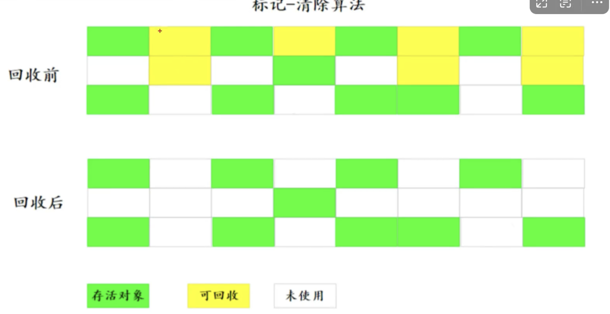


**2、复制算法（Copying）**

复制算法通过将内存分为两块（通常叫做 From 空间和 To 空间），使用时只在一块空间中分配对象。每次垃圾回收时，将活动对象从一块空间复制到另一块空间，复制完成后，原来的空间就可以直接清除。

优点：

- 能有效减少内存碎片。
- 回收速度较快，适合于年轻代（Young Generation）垃圾回收。

缺点：

- 需要两倍的内存空间（从空间和到空间）。
- 对于大对象，复制的成本较高。


**3、标记-整理算法（Mark-Compact）**

标记-整理算法在标记阶段【标记-清除】算法相同，但在清除阶段不直接清除对象，而是将所有存活对象移动到堆的一端，然后清理掉其他部分的内存空间，从而避免了内存碎片问题。

优点：

- 避免了内存碎片问题，回收之后可以得到较为连续的内存空间。

缺点：

- 移动存活对象的过程需要更多的计算资源，性能开销较大。

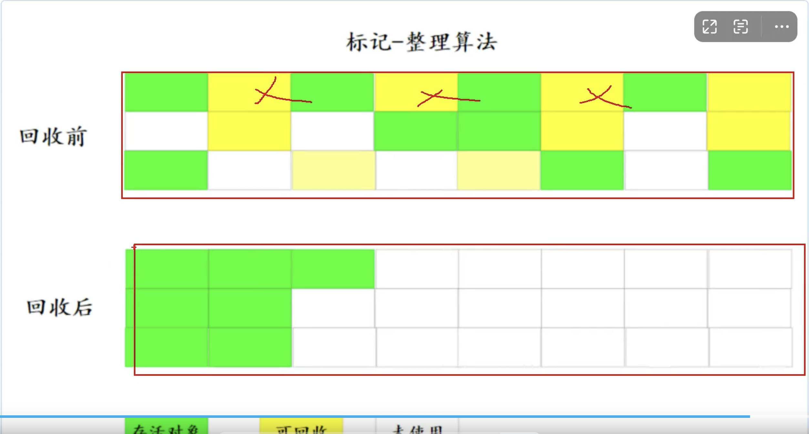


### 3.11 三色标记算法？

[查看视频](https://www.bilibili.com/video/BV1jTQ3YbE5N?spm_id_from=333.788.videopod.episodes&vd_source=2b1eb20c71afa1c8c228b35fc0e93720&p=11)


三色标记算法（Tri-Color Marking Algorithm）是 Java 中用于实现 垃圾回收 的一种标记算法，尤其在 并发垃圾回收（如 CMS 和 G1 GC）中被广泛应用。它是通过三个标记颜色（黑色、灰色、白色）来表示对象的不同状态，目的是为了在垃圾回收过程中有效地跟踪对象的引用关系，避免误回收和提高效率。


**三色标记算法的基本概念**

1. 白色（White）：
   - 白色表示对象是不可达的，即没有任何引用指向该对象。
   - 初始时，所有对象都被视为白色，表示它们都是垃圾。
   
2. 灰色（Gray）：
   - 灰色表示对象是可达的，并且需要进一步检查其引用的对象。
   - 当一个对象被标记为灰色时，表示它本身是活跃的，需要继续检查它引用的对象。
   
3. 黑色（Black）：
   - 黑色表示对象是可达的，且其引用的对象已经被完全遍历过。
   
   - 当一个对象被标记为黑色时，表示它是存活的，而且所有引用的对象已经被检查过，确保没有漏掉任何对象。
   
     

**三色标记算法的工作过程**

1. 标记阶段：
   - 从根对象（如栈中的局部变量、静态字段等）开始，标记所有可达的对象。根对象首先被标记为灰色。
   - 然后，遍历所有的灰色对象，检查它们所引用的对象。如果引用的对象没有被标记，标记它们为灰色，并继续检查它们的引用。
   - 一旦一个对象的所有引用对象都被处理完，它会被标记为黑色。

2. 清除阶段：
   - 在标记完成后，所有黑色对象都是存活的，可以继续使用，而白色对象则被视为垃圾，将被回收。
   
   - 三色标记算法的关键在于通过灰色对象来指示还需要检查的引用关系，从而确保没有对象被遗漏。
   
     

**三色标记算法的优点与缺点**

优点：
- 避免了误回收：由于通过标记所有可达对象并区分三种状态，避免了错误回收正在使用的对象。
- 支持并发回收：三色标记算法适合并发垃圾回收，在回收过程中可以并发进行标记和回收操作，减少了应用程序的停顿时间。

缺点：
- 标记和清除过程复杂：需要额外的内存和计算资源来管理三种状态的对象。
- 可能导致标记不完整：如果标记过程中有某些对象未能及时处理，可能会导致一些可达对象被误回收，影响回收的准确性。
- 需要额外的同步机制：在并发回收时，需要同步操作来避免并发修改和避免数据不一致的问题。


### ~~3.12 能详细说一下CMS收集器的垃圾收集过程吗？~~

~~CMS（Concurrent Mark-Sweep）收集器是 Java 早期的并发垃圾回收器之一，设计目的是减少垃圾回收时的停顿时间，尤其是在处理大规模堆内存时。它在进行垃圾回收时，大部分工作都与应用程序线程并行进行，因此能够大大减少Stop-the-World的时间。~~


1. ~~初始标记（Initial Mark）~~

   - ~~目标：在堆中标记根对象（即从GC Roots开始的对象），包括栈中的局部变量、静态变量等。~~

   - ~~特征：Stop-the-World（STW）阶段。这意味着在此阶段应用线程会暂停，直到标记完成。~~

   - ~~时间开销：时间较短，因为只标记GC Roots及其直接引用的对象，不需要遍历整个堆。~~

2. ~~并发标记（Concurrent Mark）~~

   - ~~目标：遍历堆中的所有对象，从初始标记的对象开始，递归地标记所有可达对象。这个过程并行进行，不会阻塞应用线程。~~

   - ~~特征：并发阶段，应用线程可以继续执行。~~

   - ~~时间开销：时间较长，因为需要遍历整个堆并标记所有可达的对象，但这段时间不会影响应用程序的执行。~~

3. ~~重新标记（Remark）~~

   - ~~目标：在并发标记过程中，由于应用线程在运行，可能有新的对象变得可达。重新标记阶段会修正并发标记期间的遗漏。~~

   - ~~特征：Stop-the-World阶段。这个阶段会暂停应用程序的执行，直到重新标记完成。~~

   - ~~时间开销：由于重新标记的对象较少，因此时间开销相对较小，通常比初始标记阶段时间短。~~

4. ~~并发清理（Concurrent Sweep）~~

   - ~~目标：清除那些被标记为不可达的对象，即“垃圾”对象。这个过程也是并发进行的，不会阻塞应用线程。~~

   - ~~特征：并发阶段，应用线程继续执行。~~

   - ~~时间开销：时间相对较长，因为清理垃圾对象时需要遍历堆并进行回收，但同样不会暂停应用程序。~~

5. ~~重分配（Concurrent Reset）~~

   - ~~目标：回收完垃圾对象后，清理CMS工作中产生的临时数据和状态，准备下一轮的回收。~~

   - ~~特征：这是一个内部清理阶段，确保下一次垃圾回收能够顺利进行。~~

   - ~~时间开销：时间非常短，几乎可以忽略不计。~~


### ~~3.13 G1垃圾收集器了解吗？~~

~~G1垃圾收集器（Garbage-First Collector）*是Java 7引入的一种新的垃圾回收器，旨在解决以前的垃圾回收器（如CMS）在处理大堆内存时存在的问题，尤其是*停顿时间可预测性和内存碎片问题。G1 GC特别适用于对响应时间要求高的应用。~~


~~G1垃圾收集器的工作流程~~

1. ~~初始标记（Initial Mark）：标记根对象（GC Roots）及其直接引用的对象。应用线程会暂停，这一过程时间较短。~~
2. ~~并发标记（Concurrent Mark）：标记所有可达对象。这个过程在应用线程运行时并发执行。~~
3. ~~最终标记（Final Mark）：修正并发标记阶段可能遗漏的对象，通常是在标记过程中应用程序有变化时发生。这个阶段也会暂停应用线程，但停顿时间相对较短。~~
4. ~~筛选回收（Evacuation）：根据堆内存区域的垃圾比例，G1 GC会回收最脏的区域（垃圾最多的区域）。这个过程会根据设定的最大停顿时间进行调节，尽量保持在可接受的范围内。~~


### 3.14 对象一定分配在堆中吗？有没有了解逃逸分析技术？

对象不一定分配在堆中~~，在Java中~~，对象的分配位置主要取决于几个因素，包括：逃逸分析、JVM的优化策略以及垃圾回收器的选择。


**1、对象分配的位置**

Java中的对象通常分配在堆内存中，但在某些情况下，JVM会将对象分配在其他内存区域，如栈（Stack）*或*方法区（Metaspace）。具体分配在哪里取决于JVM的优化技术和运行时环境。

- 堆（Heap）：默认情况下，大多数对象都分配在堆内存中，堆是JVM中管理内存的主要区域。

- 栈（Stack）：对于一些临时的对象，如果经过逃逸分析（Escape Analysis）优化，JVM可能会将对象分配到栈中，而不是堆上。栈上的对象在方法调用结束时会自动销毁，因此不需要垃圾回收。

- ~~方法区（Metaspace）：类元数据等非实例数据会分配在方法区（或原来JVM中的永久代）中，但普通对象不会在这里分配。~~

  

**2、逃逸分析（Escape Analysis）**

逃逸分析是一种用于确定对象的引用是否“逃逸”方法或者线程的技术。通过逃逸分析，JVM可以判断一个对象的生命周期范围，从而做出一些优化决策。主要优化包括：

- 栈上分配：如果对象的引用不会逃逸到方法外（即不会被外部方法或线程访问），JVM可以将对象分配在栈上，而不是堆上。栈上分配的对象会在方法执行完毕后立即被销毁，不需要垃圾回收。
- ~~分配对象池：对于一些局部变量，如果它们没有逃逸，JVM可能会通过对象池来管理这些对象，避免频繁的堆分配和回收。~~
- 同步消除：如果通过逃逸分析发现一个对象只会被单一线程访问，JVM可能会移除对该对象的同步操作，提升并发性能。


### 3.15 了解哪些性JVM监控和故障处理工具？

1. jps：列出当前正在运行的Java进程及其进程ID。
2. jstack：获取Java进程的线程堆栈信息，帮助诊断死锁或长时间执行的线程。
3. jmap：生成堆内存的dump文件，供内存分析工具分析内存泄漏或优化。
4. JConsole：提供实时的JVM性能监控，包括内存、线程、CPU等指标，帮助分析应用程序的运行状况。
5. Java VisualVM：功能更强大的监控工具，支持堆分析、线程分析、CPU分析等，可以远程连接JVM进行深入调试和性能分析。


### ~~3.16 JVM 的常见参数配置知道哪些？~~


### 3.17 线上服务CPU占用过高怎么排查？

1. 使用 `top` 命令查看系统资源占用，确认是哪个进程导致 CPU 占用过高。
2. 使用 `top -H -p 进程ID` 找到哪个线程占用 CUP 过高。
3. 使用 jstack 线程ID 查询线程的堆栈信息。


### 3.18 内存飙高问题怎么排查？

[查看视频](https://www.bilibili.com/video/BV1jTQ3YbE5N?spm_id_from=333.788.player.switch&vd_source=2b1eb20c71afa1c8c228b35fc0e93720&p=21)

分析：内存飚高如果是发生在java进程上，一般是因创建了大量对象所导致，持续飚高说明垃圾回收跟不上对象创建的速度，或者内存泄露导致对象无法回收。


### ~~3.19 频繁minor gc 怎么办~~

~~通常情况下，由于新生代空间较小，Eden区很快被填满，就会导致频繁Minor GC，因此可以通过增大新生代空间-Xmn来降低Minor GC的频率。~~


## 4、数据库

### 4.1 MySQL


#### ==MySQL 自行计划==

MySQL的EXPLAIN语句用于显示查询的执行计划，帮助开发者理解MySQL如何执行查询，并通过优化执行计划来提高查询性能。EXPLAIN的输出包含多个字段，常见字段及其作用如下：


id

- 作用：标识查询中每个操作的顺序，数字越大表示执行的优先级越高。在一个复杂查询中，多个操作可能有不同的id。

- 枚举值：整数值（例如 1、2、3）。

  

select_type

- 作用：描述查询的类型。它表示查询的层次结构，帮助理解查询的复杂度。

- 枚举值：
  - SIMPLE：简单查询（没有子查询）。
  
  - PRIMARY：主查询（外部查询）。
  
  - UNION：UNION操作的第二部分。
  
    

table

- 作用：表示查询中涉及的表名，指明该行操作作用于哪张表。

- 枚举值：表名（如users、orders）。

  

type

- 作用：表示MySQL如何连接不同的表，显示连接操作的类型，越优的连接方式通常越高效。

- 枚举值：
  - ALL：全表扫描，性能最差。
  
  - index：索引扫描。
  
  - range：索引范围扫描。
  
  - ref：使用非唯一索引进行查找。
  
  - eq_ref：对于每个索引键值，都会找到一行数据（最优的连接类型之一）。
  
  - const：常数表，常用于主键查找。
  
  - system：表只有一行数据。
  
    

possible_keys

- 作用：列出查询中可能使用的索引。这有助于了解MySQL如何选择合适的索引。

- 枚举值：索引名（如idx_name），如果没有合适的索引，则为NULL。

  

key

- 作用：表示实际在查询中使用的索引，若没有索引被使用，则为NULL。

- 枚举值：索引名（如idx_name），如果没有使用索引，则为NULL。

  

key_len

- 作用：表示MySQL在使用索引时，索引的最大长度（字节数）。这个值帮助我们了解MySQL如何使用索引。

- 枚举值：整数值，表示字节数。

  

ref

- 作用：显示索引的列与查询中的哪个列进行匹配。指明索引查找时所使用的列。

- 枚举值：列名、常量值（如const、column_name）。

  

rows

- 作用：表示MySQL估算查询返回的行数。这是查询优化的参考值，能够帮助判断查询的代价。

- 枚举值：整数值，表示扫描的行数。

  

Extra

- 作用：提供额外的信息，说明执行计划中其他的细节和优化策略。

- 枚举值：
  - Using filesort：表示使用了外部排序。
  
  - Using temporary：表示查询中使用了临时表。
  
  - Using index：表示查询使用了覆盖索引（索引就包含了查询所需的所有列）。
  
  - Using where：表示在查询过程中使用了WHERE子句进行过滤。
  
  - Using join buffer：表示在执行连接时使用了连接缓存。
  
    

总结

- id：查询执行的顺序。
- select_type：查询类型。
- table：查询涉及的表。
- type：连接类型，影响查询性能。
- possible_keys：可能使用的索引。
- key：实际使用的索引。
- key_len：索引长度。
- ref：索引与列的匹配方式。
- rows：扫描的行数。
- Extra：额外的执行信息（如是否使用了临时表、排序等）。


#### ==MySQL 最常见的存储引擎==

最常见的两个 MySQL 存储引擎是 **InnoDB** 和 **MyISAM**，简要介绍如下：

InnoDB

   - **事务支持**：InnoDB 支持 ACID（原子性、一致性、隔离性、持久性）事务，适用于需要数据一致性和可靠性的应用。
   - **行级锁**：支持行级锁，比 MyISAM 的表级锁提供更高的并发性能，适用于高并发写入场景。
   - **外键支持**：支持外键约束，保证数据的完整性和一致性。
   - **崩溃恢复**：InnoDB 内置日志（Redo Log 和 Undo Log）机制，能够在系统崩溃后进行恢复，保证数据安全。
   - **适用场景**：适用于需要事务支持、高并发和数据一致性的场景，如银行、在线交易系统等。

MyISAM

   - **无事务支持**：MyISAM 不支持事务，适用于不需要事务的应用。
   - **表级锁**：MyISAM 使用表级锁，适用于读多写少的场景，因为对表级锁的竞争较少。
   - **性能优势**：对于大多数只涉及查询操作的应用，MyISAM 在读取数据时速度较快。
   - **不支持外键**：MyISAM 不支持外键约束，因此需要应用程序层面来保证数据的一致性。
   - **适用场景**：适用于读密集型应用，如日志分析、数据仓库等。

总结：

- **InnoDB** 适合需要高可靠性、事务支持和高并发的场景，成为 MySQL 默认的存储引擎。
- **MyISAM** 适合读多写少且不需要事务支持的场景，性能上在某些特定场景下优于 InnoDB。


#### ==1、B树 & B+树 的区别？==

1. 数据存储：B树每个节点存储数据和指针，B+树只有叶子节点存储数据，非叶子节点只存指针。
2. 查询方式：B树可以在任意节点找到数据，B+树需要走到叶子节点才能找到数据，叶子节点通过双向链表连接，便于范围查询。
3. 效率：B+树在范围查询上效率更高，因为叶子节点有链表连接，而B树查询可能更直接但性能稍低。


#### ==2、为什么使用 InnoDB 引擎时，建议使用自增索引？==

1. 唯一性：保证主键唯一，避免冲突。
2. 顺序插入：由于主键递增的，插入数据时，InnoDB 会在索引（B+树）中顺序插入新记录，因为它始终在索引的末尾插入新的记录，减少了页分裂和重排的频率。
3. 聚集索引优化：InnoDB 存储引擎的主键索引是聚集索引，即数据行本身的存储顺序与主键的顺序一致。自增索引由于其顺序性，有助于数据行的顺序存储，减少了 I/O 操作。


#### ==3、为什么使用 InnoDB 引擎时，不建议使用uuid==

使用 InnoDB 引擎时，不建议使用 UUID 作为主键的原因有：

1. **插入效率低**：UUID 是随机生成的，每次插入时，数据将分布到索引的各个位置，导致页分裂，增加 I/O 操作，降低插入效率。
2. **索引膨胀**：UUID 长度较长（通常为 36 字符或 16 字节），导致索引占用更多空间，增加存储和查询开销。
3. **排序和聚集性能差**：UUID 的随机性导致数据插入时无法保持顺序，破坏了聚集索引的优化，影响性能。
4. ~~**死锁和锁竞争**：随机插入可能导致多个线程对同一数据页产生竞争，增加死锁和锁竞争的风险。~~


#### ==4、InnoDB 中的 B+树 是怎么产生的？==

插入数据以下数据，数据在在page中是怎么存储的？

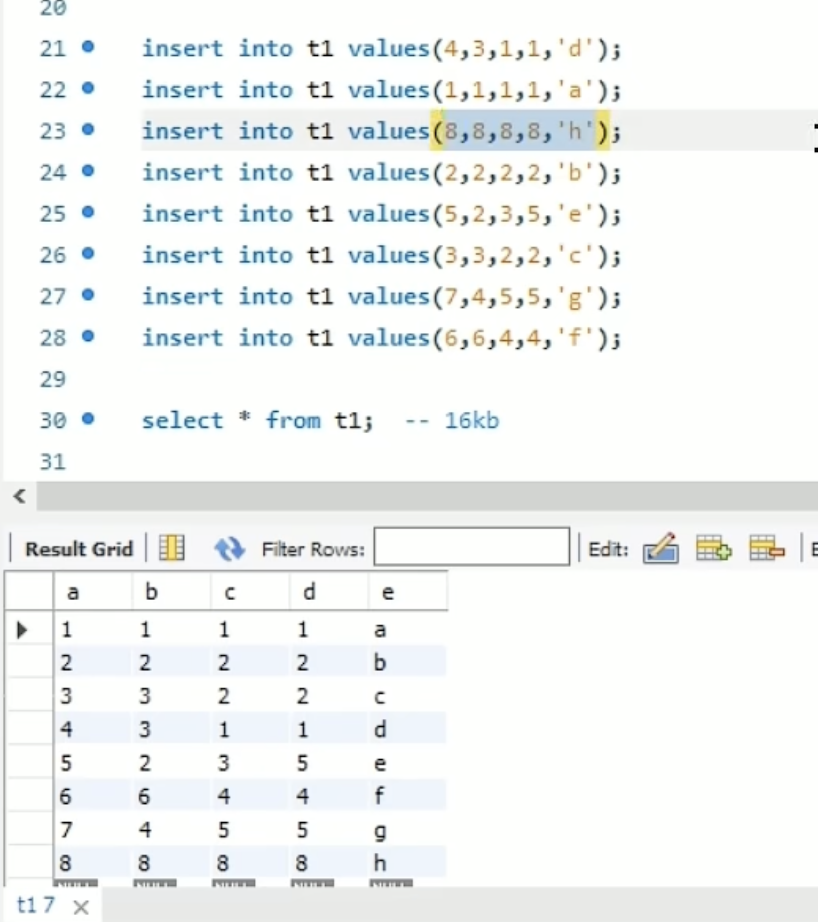

数据在page中的存储结构如下：

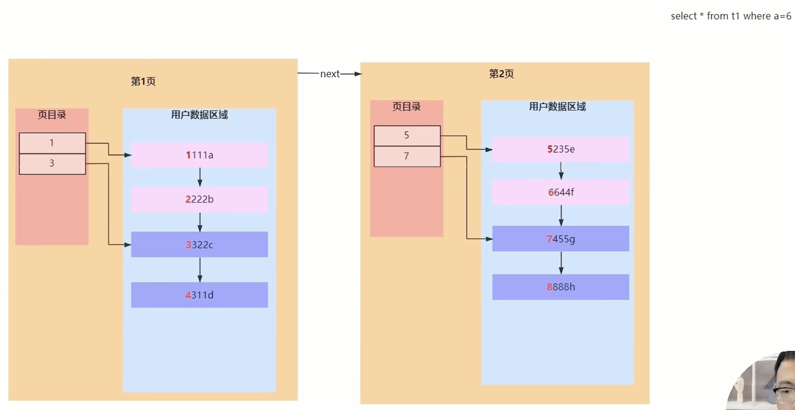


假设此时 a=10000，查找数据时虽然可以根据page目录进行范围查找，不用一条一条查找，但是由于a=10000在很后面，导致需要进行多次IO（每次读取一个page就需要一次IO），导致效率很慢。


此时可以对page目录再建一个目录（这就是所谓索引啦），这就是为什么根节点不存数据，叶子存数据的原因。

对于每一个节点（注意说的不是page），有两个组成部分：主键的值 + 指向子节点的指针

主键一般使用BigInteger类型（8个字节），指针（指针在InnoDB中占6个字节）。也就是说一个节点占用14个字节。

而这些节点是存在page中的，一个page大小为16kb

那么，一个page中可以存的节点数量为：

1. 一个节点的大小为：主键值（8b）+ 指针（6b）= 14b
2. 一个 page 的大小为：16kb=(16 * 1024)b
3. 那么一个 page 中可以存的节点数为：(16 * 1024) / 14 = 1170 个节点

那么一个三层的 B+树 可以有多少个节：1170 * 1170 * 16 = 21902400

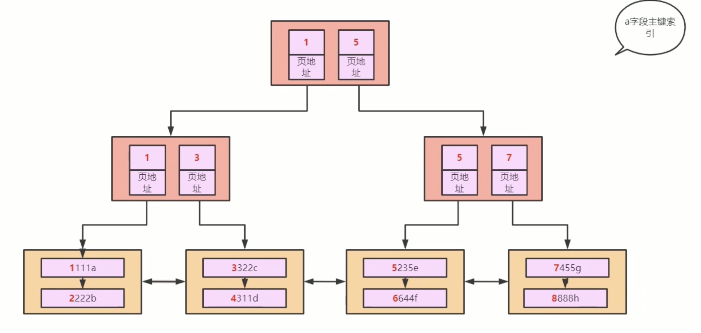


#### ==Mysql锁有哪些，如何理解？==

按锁粒度分类：

1. 行锁：锁某行数据，锁粒度最小，并发度高
2. 表锁：锁整张表，锁粒度最大，并发度低
3. 间隙锁：锁的是一个区间

还可以分为：

1. 共享锁：也就是读锁，一个事务给某行数据加了读锁，其他事务也可以读，但是不能写
2. 排它锁：也就是写锁，一个事务给某行数据加了写锁，其他事务不能读，也不能写

还可以分为：

1. 乐观锁：并不会真正的去锁某行记录，而是通过一个版本号来实现的
2. 悲观锁：上面所的行锁、表锁等都是悲观锁


#### ==SQL 的执行过程==

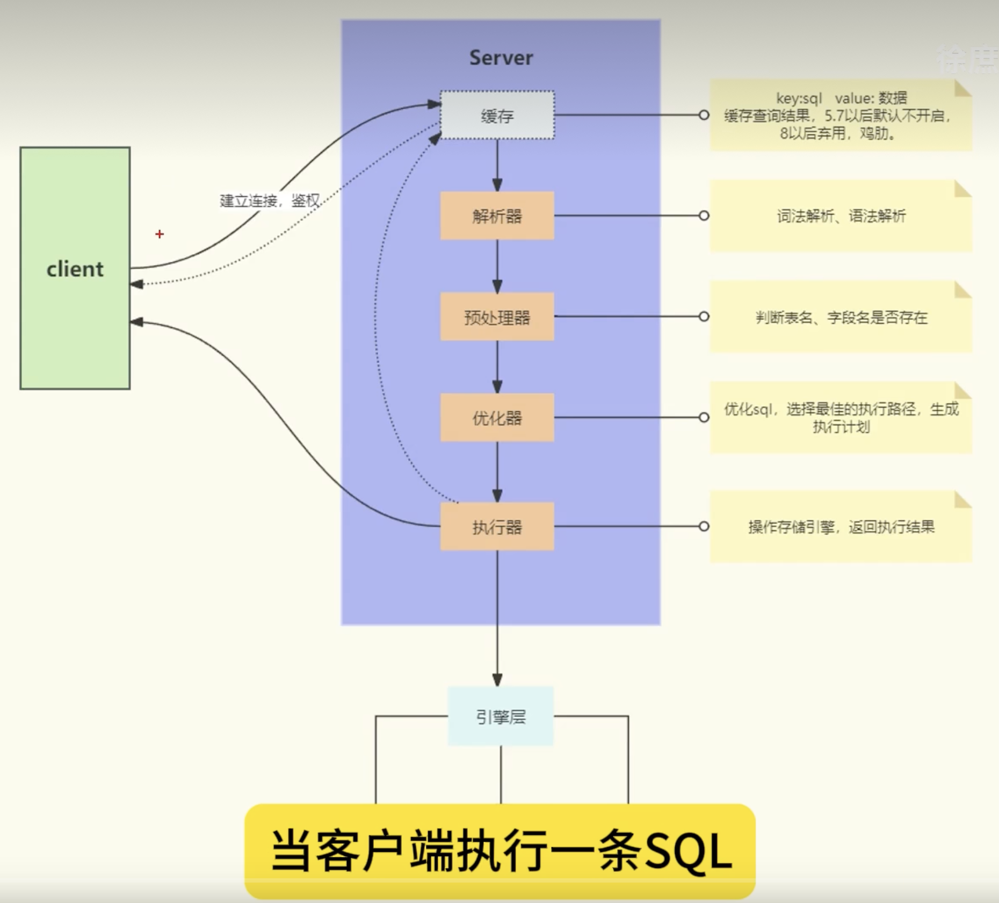


#### ==MySQL 事物隔离级别==

MySQL 的事务隔离级别定义了事务在并发环境下的行为，主要有四种隔离级别：

1. READ UNCOMMITTED（未提交读）：
   - 事务可以读取其他事务未提交的数据（脏读），可能导致不一致数据。
   - 最低的隔离级别，性能最好，但数据一致性最差。
2. READ COMMITTED（已提交读）：
   - 事务只能读取已提交事务的数据，避免脏读，但可能出现不可重复读（同一查询在同一事务中返回不同结果）。
3. REPEATABLE READ（可重复读）：
   - 事务中的所有读取操作都能保证结果一致，即同一查询在事务内返回相同结果，避免不可重复读。但可能出现幻读（其他事务插入新记录，当前事务未能看到）。
4. SERIALIZABLE（可串行化）：
   - 最强的隔离级别，事务执行时完全隔离，避免脏读、不可重复读和幻读，但性能最差，因为它要求事务串行执行。

总结：

- READ UNCOMMITTED：最低隔离级别，允许脏读。
- READ COMMITTED：避免脏读，但可能出现不可重复读。
- REPEATABLE READ：避免脏读和不可重复读，但可能出现幻读。
- SERIALIZABLE：最强隔离，避免所有并发问题，但性能最差。


#### ==MySQL 的 MVCC==

[视频](https://www.bilibili.com/video/BV1YD4y1J7Qq?spm_id_from=333.788.videopod.sections&vd_source=2b1eb20c71afa1c8c228b35fc0e93720)

MVCC的关键概念：

1. DB_TRX_ID（事务ID）： 这是每个事务的唯一标识符，MySQL用它来跟踪哪些数据是由哪个事务修改的。在事务提交时，数据库会记录它所做的更改，并在后续的事务中提供一致性。

2. DB_ROLL_PTR（回滚指针）： 这是指向事务日志（undo log）的指针。Undo log用于记录事务操作之前的数据值。当需要撤销一个事务的更改时，回滚指针会帮助数据库恢复到修改前的状态。

3. Undo Log： Undo log用于存储事务所做修改的反向操作，确保事务能够在失败或回滚时恢复到事务开始时的状态。在MVCC中，它帮助数据库确保可以提供读取快照的一致视图。例如，事务A在修改数据前，Undo log会记录数据的旧值，确保事务回滚时能够恢复原来的数据。

4. Review（快照读取）： 在MVCC中，每个事务会看到自己开始时的数据库状态。为了支持“快照隔离”或一致性读取，数据库会将正在进行的事务视为一组快照，这些快照不受其他事务影响。这意味着，事务可以读取它开始时的数据版本，而不必等待其他事务完成。

   

**如何结合这几个概念工作：**

**在使用MVCC的数据库中，每个事务都会被赋予一个唯一的事务ID（DB_TRX_ID）。当事务开始时，数据库会记录当前状态作为快照。每当事务对数据进行修改时，这些修改会被写入Undo Log中（每个修改的DB_ROLL_PTR都会指向Undo Log中的相应记录），确保在事务回滚时可以撤销这些修改。**

**在查询操作中，数据库会检查当前事务的ID以及相关的事务版本（通过DB_TRX_ID），来判断数据是否应该包含在查询结果中。例如，如果一个事务正在修改某行数据，其他事务可能会看到修改前的数据，除非它们开始时已经看到某个快照。**

**总结来说，MVCC通过事务ID、Undo Log和快照读取等机制，确保数据库在多个并发事务执行时，仍能保持一致性和隔离性，避免并发冲突和保证数据的正确性。**


MySQL 的 **MVCC**（多版本并发控制）是一种机制，用于提高数据库在高并发环境下的性能，同时确保事务的隔离性。其核心要点：

1. **多版本数据存储**：每个事务对数据的修改会生成一个新的版本，原数据不被直接覆盖，从而允许多个事务同时操作不同版本的数据。
2. **事务视图**：每个事务只能看到它开始时的版本快照，保证了**读取一致性**，即一个事务的修改对其他事务不可见，直到它提交。
3. **避免脏读和不可重复读**：通过使用版本号，MVCC 避免了脏读（读取未提交的数据）和不可重复读（同一事务内读取的数据不同）问题。
4. **使用 undo log 和 redo log**：MySQL 通过 **undo log** 来记录数据的旧版本，以便在事务回滚时恢复数据；**redo log** 则记录事务修改的数据，用于事务提交时的持久化。

总结：

MVCC 通过提供数据的多个版本，让每个事务看到一致的数据快照，从而实现高并发环境下的**事务隔离性**和**一致性**。


在MySQL（尤其是InnoDB存储引擎）中，MVCC通过以下方式实现：

- 行版本控制：每行数据都有多个版本，每个版本都有一个版本号（类似于时间戳）。版本号是通过事务ID来管理的。

- 隐藏列：InnoDB在每行数据中增加了两个隐藏的列：

  - DB_TRX_ID：记录最后一次修改该行的事务ID。

  - DB_ROLL_PTR：回滚指针，指向该行的上一个版本。

- 读操作：当读取数据时，InnoDB会根据当前事务的版本号，通过回滚指针找到符合版本要求的数据版本。
- 写操作：当修改数据时，InnoDB不会直接修改当前行，而是创建一个新的版本，并更新回滚指针。

优点

- 提高并发性：读操作不会阻塞写操作，写操作也不会阻塞读操作。
- 保证数据一致性：通过版本控制，确保每个事务看到的数据版本是一致的。


**总结：**MySQL的MVCC（多版本并发控制）是一种用于在高并发场景下提高数据库性能的技术。它通过为每行数据维护多个版本来实现。当一个事务修改数据时，不会直接覆盖旧数据，而是创建一个新的版本，并通过回滚指针链接旧版本。这样，读操作可以根据自己的事务版本号，通过回滚指针找到合适的版本，从而实现读写互不阻塞。这种机制既提高了并发性，又保证了数据的一致性。


#### ==B树 & B+树 的区别？==

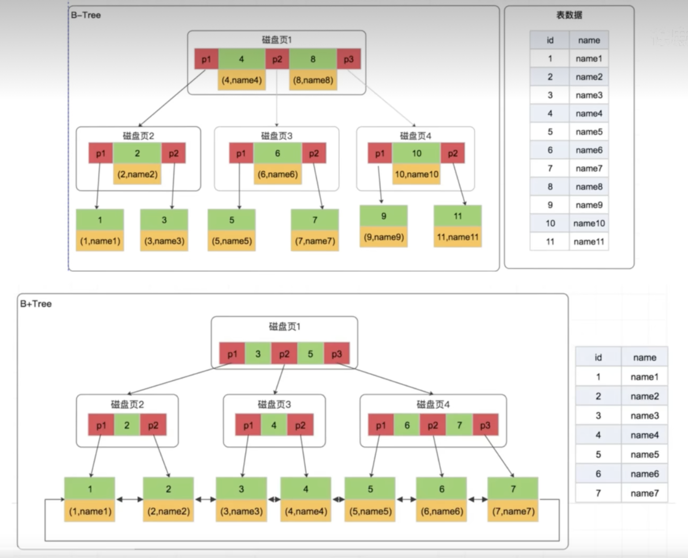


区别：


#### ==BufferPool 工作流程==

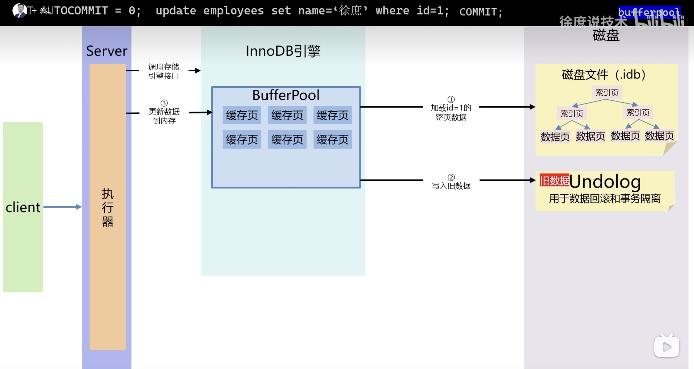

**Buffer Pool** 是数据库系统中用于缓存磁盘数据页的内存区域，目的是提高数据库的性能，减少磁盘I/O操作。简要总结它的工作流程如下：

1. **数据请求**：当数据库查询需要某个数据页时，首先会检查该页是否已经存在于Buffer Pool中。

2. **命中与未命中**：
   - **命中**：如果请求的数据页已经在Buffer Pool中，则直接从内存中读取数据，避免了磁盘I/O。
   - **未命中**：如果数据页不在Buffer Pool中，数据库会从磁盘读取该页，并将其加载到Buffer Pool中。

3. ~~**LRU替换算法**：当Buffer Pool的空间满时，数据库会使用某种页面替换策略（通常是LRU，Least Recently Used）来决定哪个数据页应该被替换掉。被替换的数据页可能被写回磁盘（如果它被修改过）。~~

4. **写入与刷新**：
   1. 将数据读取到 BufferPool 后，将id=1的那一行数据保存到Undolog中，然后修改BufferPool中的数据。
   2. **脏页**：当数据页在Buffer Pool中被修改时，它会被标记为“脏页”。脏页需要在适当的时候刷新到磁盘，以保证数据的持久性。
   3. ~~**刷盘策略**：有时，数据库会定期将脏页刷回磁盘，或者在事务提交时将修改过的数据页写回。~~

5. ~~**缓存管理**：Buffer Pool的大小对性能影响很大。如果Buffer Pool过小，频繁的磁盘I/O会导致性能瓶颈；如果Buffer Pool过大，则可能会浪费内存资源。~~

简而言之，**Buffer Pool**的工作流程就是：查询数据页 → 检查内存 → 若未命中，则**从磁盘加载 → 旧数据存到Undolog → 数据修改时标记为脏页 → 定期或按需刷新脏页到磁**盘。这样可以有效减少磁盘I/O，提高数据库性能。


#### ==MySQL 怎么做到 Redolog 的崩溃恢复的==

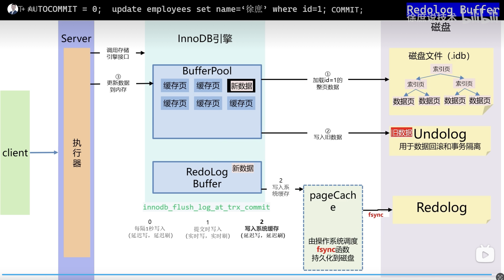

MySQL 使用 **Redo Log**（重做日志）来实现崩溃恢复，确保即使在系统崩溃或意外关闭的情况下，数据库能够恢复到一致的状态。简要总结 MySQL 如何通过 Redo Log 实现崩溃恢复的流程如下：

1. **写入 Redo Log**

   - 在事务提交前，MySQL 会将事务的修改操作（如数据插入、更新、删除）先写入到 **Redo Log** 中，而不是直接写入磁盘数据文件。
   - **Redo Log** 是顺序写入的，记录的是事务的 **redo** 操作（即已经提交的修改操作），它是为了在崩溃后能重新应用这些修改。

2. **事务提交**

   - 当一个事务完成并提交时，MySQL 会首先将事务的日志写入 **Redo Log**，然后才会将数据页刷新到磁盘上。这种策略确保即使发生崩溃，已提交的事务的修改不会丢失。

3. **崩溃发生**

   - 如果系统崩溃，内存中的数据页可能还没有被写回磁盘，但 **Redo Log** 中记录了已提交事务的所有操作。
   - 在崩溃发生后，MySQL 会利用 **Redo Log** 恢复事务操作，确保所有已提交的事务在崩溃后能被重新执行。

4. **崩溃恢复**

   - 当 MySQL 重启时，它会扫描 **Redo Log** 中的内容，找到未完全刷盘的数据页修改。
   - MySQL 会从 **Redo Log** 中提取已提交事务的操作，并将这些操作应用到数据文件中，恢复数据的完整性。
   - 只有已提交的事务会被恢复，未提交的事务会被丢弃（因为这些事务没有写入到 **Commit Log** 中）。

5. **刷盘和清理**

   - 完成恢复后，MySQL 会清理 **Redo Log**，标记已应用的日志作为已处理的日志。

总结：

通过 **Redo Log**，MySQL 能够确保即使在崩溃时也能恢复所有已提交事务的修改操作。它通过先写日志、后写数据的方式，利用崩溃后日志重做的机制，确保数据的持久性和一致性。


#### ==binlog 的刷盘机制==

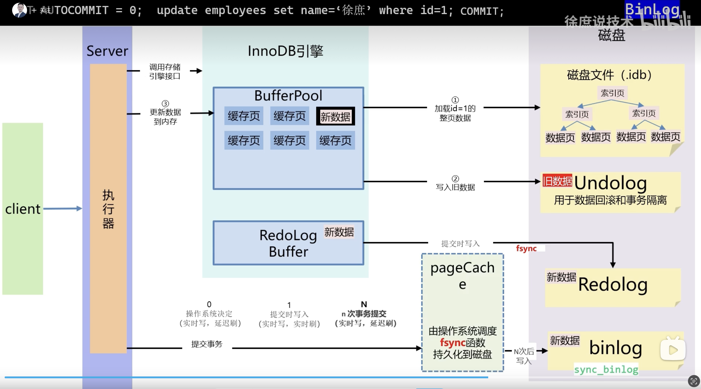

MySQL 的 **Binlog**（二进制日志）是一种用于记录数据库修改的日志文件，主要用于复制和数据恢复。简要总结如下：

- **记录数据更改**：Binlog 记录了所有对数据库进行修改的操作，包括 **INSERT**、**UPDATE**、**DELETE** 等。它用于记录数据库的变更操作，不包括查询操作。
- **数据库复制**：Binlog 是 MySQL 主从复制的核心组件。主服务器会将所有的修改操作写入 Binlog，从服务器通过读取 Binlog 来同步主服务器的数据。
- **数据恢复**：在崩溃恢复或灾难恢复时，Binlog 可以用于重放自某个时间点以来的所有数据库修改操作，确保数据恢复到一致状态。


#### ==redolog & binlog 的区别==

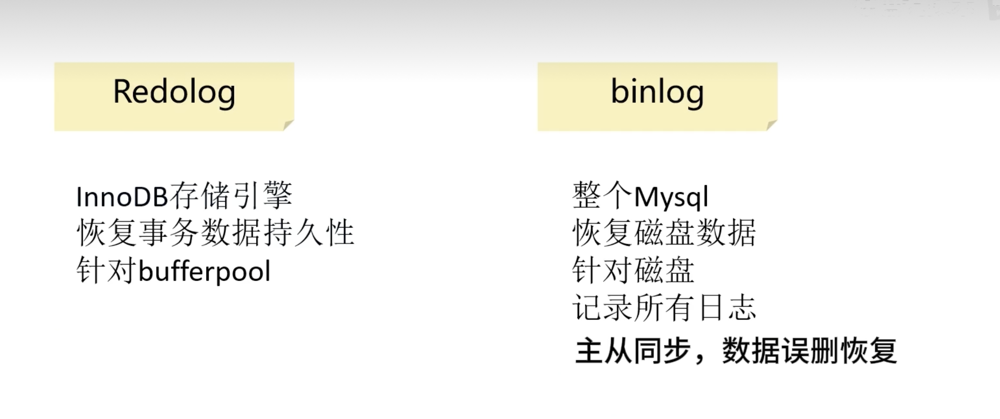


#### ==聚集索引 & 非聚集索引的区别？==

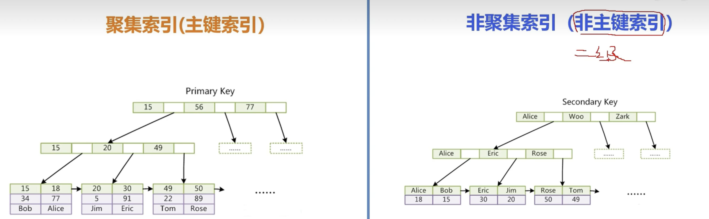


聚集索引和非聚集索引不是一种索引类型而是物理存储的方式：

- InnoDB的默认数据结构是聚簇索引
- MyISAM是非聚簇索引

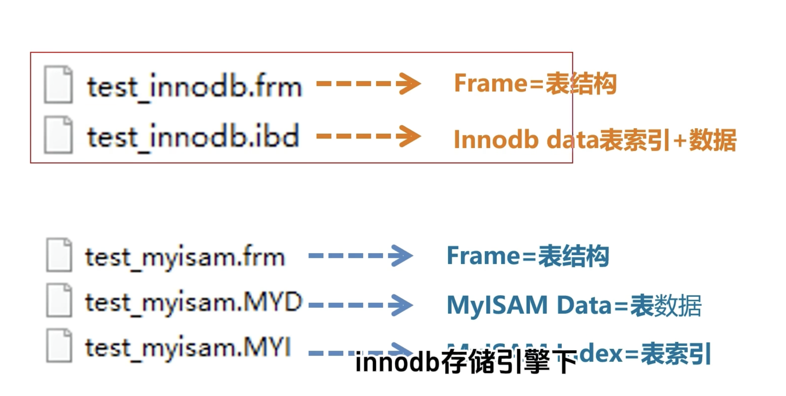


聚集索引（Clustered Index）和非聚集索引（Non-Clustered Index）在 MySQL 中的区别如下：

1. **存储结构**：
   - **聚集索引**：数据表的行数据与索引顺序一起存储，索引的顺序就是数据的存储顺序。每个表最多只能有一个聚集索引。
   - **非聚集索引**：数据表的行数据与索引分开存储，索引存储指向数据行的指针。一个表可以有多个非聚集索引。

2. **访问速度**：
   - **聚集索引**：查询速度较快，因为数据的存储顺序就是索引顺序，可以直接找到数据位置。
   - **非聚集索引**：需要通过索引找到数据位置后再访问数据，因此速度稍慢一些。

3. **数据修改**：
   - **聚集索引**：数据的插入、更新和删除操作可能会影响数据的顺序，从而导致性能下降。
   - **非聚集索引**：修改操作对索引的影响较小，但更新索引仍然需要额外的存储空间。

4. **适用场景**：
   - **聚集索引**：适用于查询数据量较大、范围查询较频繁的场景。
   - **非聚集索引**：适用于查询某些字段经常被查询，但不一定是排序或范围查询的情况。

简而言之，聚集索引改变了数据的存储顺序，而非聚集索引则独立于数据存储，依赖于指针来访问数据。


#### ==COUNT(*)、COUNT(1) 和 COUNT(字段)==

在 MySQL 中，COUNT(*)、COUNT(1) 和 COUNT(字段) 都是用于统计查询结果的记录数，但它们在实现上略有不同。具体的区别如下：

- COUNT(*) 计算所有行数，包括 NULL 值，性能最好。  
- COUNT(1) 计算所有行数，包括 NULL 值，性能与 COUNT(*) 没有区别。
- COUNT(字段) 只计算该字段非 NULL 的行，性能较差，因为需要额外检查 NULL 值。  


#### ==MySQL 分库分表主键ID冲突问题怎么解决？==

MySQL 分库分表时，主键 ID 冲突可以通过以下几种方式解决：

1. **自增主键加库分区规则**：
   - 每个库的自增主键加上不同的步长或偏移量。例如，库1使用自增步长为 1，库2使用步长为 2，以此类推。
2. **全局唯一 ID（UUID）**：
   - 使用 UUID 作为主键，确保在分库分表的情况下也不会发生冲突，但 UUID 会占用较多存储空间。
3. **雪花算法（Snowflake）**：
   - 使用分布式 ID 生成算法，如雪花算法，它通过时间戳、机器 ID 和序列号生成全局唯一的 ID。
4. **业务ID与自增结合**：
   - 将业务标识（如用户ID、订单号）与自增 ID 结合，确保不同表或库的 ID 唯一。

总结：使用雪花算法或全局唯一 ID 是常见的解决方案。


雪花算法通过组合时间戳、机器ID和序列号生成唯一ID，保证分布式环境下不冲突：

- **时间戳（41b）**：保证ID按时间递增。
- **机器ID（10b）**：区分不同机器或节点，避免不同节点生成相同序列号。
- **序列号（12b）**：同一毫秒内生成多个ID时递增。


#### ==limit 用法==

在MySQL中，`LIMIT` 关键字用于限制查询结果的行数。它可以与 `OFFSET` 结合使用来指定从哪个位置开始返回结果。


1. 基本用法：限制返回的行数

```sql
SELECT * FROM table_name LIMIT 5;
```
这个查询将返回表 `table_name` 中的前5行。


2. 使用 OFFSET 跳过前面的行

```sql
SELECT * FROM table_name LIMIT 5 OFFSET 10;
```
这个查询会跳过前10行，然后返回接下来的5行。即，它从第11行开始返回数据。


3. **使用简化的写法（LIMIT后跟两个数字）**

```sql
SELECT * FROM table_name LIMIT 10, 5;
```
这个查询表示从第11行开始，返回接下来的5行（这里 `10` 是偏移量，`5` 是限制的行数）。这个写法与 `LIMIT 5 OFFSET 10` 等价。


4. ~~限制查询结果的顺序~~

```sql
SELECT * FROM table_name ORDER BY column_name DESC LIMIT 3;
```
~~这个查询会根据 `column_name` 列的降序排列，返回前3行。~~

5. ~~结合 `WHERE` 子句使用~~

```sql
SELECT * FROM table_name WHERE column_name = 'value' LIMIT 10;
```
~~这个查询会先筛选出符合 `WHERE` 条件的行，然后限制返回前10行。~~


总结：

- `LIMIT` 用于限制返回的行数。
- `OFFSET` 用于指定从哪一行开始。
- 可以简化为 `LIMIT offset, count` 的写法。


#### ==深分页为什么慢？怎么优化？==

比如执行这个深分页查询（假设age是二级索引）

```sql
SELECT * FROM table_name where age>18 LIMIT 10000, 5; 
```

MySQL 深分页的执行流程。

1. ~~通过二级索引查找记录：~~
   ~~MySQL 首先会通过二级索引查找符合条件的记录。二级索引是基于 age 字段的索引，但它通常不包含所有字段。因此，在这种查询中，索引只包含 age 字段和指向实际数据行的指针（即主键ID）。~~

2. 获取10100条数据：
   由于 LIMIT 10000, 5 的要求，MySQL 会先查找第10001到第10005条数据。这一步是通过二级索引进行的，它会按 age 排序，然后取出对应位置的数据。

3. 回表操作：

   二级索引的记录并不包含所有字段的完整信息，所以 MySQL 会使用 回表 操作，即通过二级索引中找到的主键ID，去主表中获取完整的记录。这一步是耗时的，因为每条记录都需要回到主表去查找其完整的字段。

4. 应用 WHERE 过滤：
   在执行回表查询后，MySQL 会对返回的 10100 条数据进行 WHERE age > 18 的过滤。~~虽然你已经在 WHERE 子句中指定了过滤条件，但是由于深分页时 MySQL 可能已经提前按主键位置从二级索引中取了大量数据，回表后需要在这些数据中再次应用 WHERE 条件。~~

5. 返回结果：
   过滤掉不符合条件的记录后，最终从结果集中取出前 5 条数据，并将它们返回给客户端。

总结起来，通过二级索引先查找，然后再 回表获取完整数据，并且在 回表后应用过滤条件。深分页时，因为需要处理大量数据，可能导致性能问题，因此在实际应用中，建议避免使用深分页~~，或者考虑使用 seek method、keyset pagination 等优化方案。~~


深分页查询会导致 MySQL 在执行时需要从大量数据中提取记录，从而产生性能瓶颈。为了优化深分页查询的效率，可以采取以下几种方法：


**1、使用主键范围查询**

与传统的基于偏移量的分页（LIMIT 10000, 5）不同，主键范围查询基于上一页的最后一条记录来查询下一页的数据，避免了使用 OFFSET 来跳过大量无用的记录。

示例： 假设你使用的是 id 作为主键，并且已经按 id 排序过：

```sql
SELECT * FROM table_name 
WHERE age > 18 AND id > 10000 
ORDER BY id 
LIMIT 5;
```

- 原理：id > 10000 让查询从 id 大于 10000 的记录开始，不需要跳过大量记录。
- 优势：避免了 MySQL 在每次查询时跳过大量数据，从而提高了效率，尤其是在深分页时。


**2、使用主键游标查询**

上一页的最后一个ID作为下一页的起始ID

```sql
SELECT * FROM table_name 
WHERE age > 18 AND id > {last_page_max_id} 
ORDER BY id 
LIMIT 5;
```


#### ==判断某条数据是否存在==

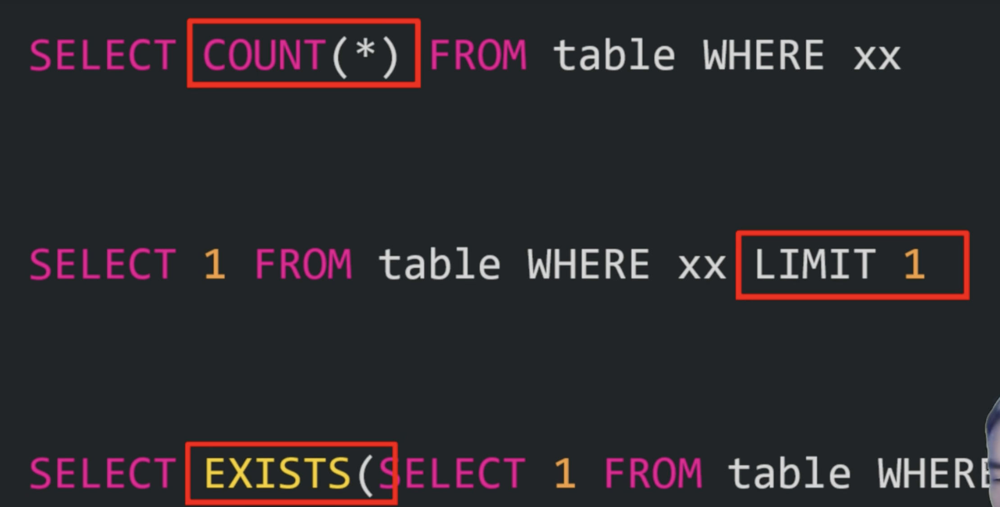


性能区别

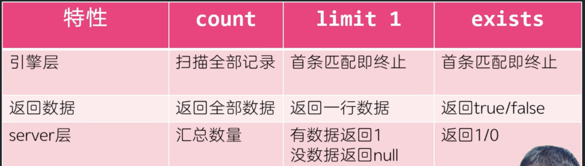


### 4.2 Oracle


## 5、中间件


### 5.1 Redis


#### ==AOF 和 RDB==

AOF (Append-Only File) 和 RBD (Redis-backed Disk) 是两种不同的持久化和存储技术，主要用于确保数据在系统崩溃时不丢失。


**AOF (Append-Only File)**

AOF 是一种 Redis 持久化机制，它通过将所有写命令追加到一个文件（appendonly.aof）中来实现数据持久化。每当 Redis 执行写命令时，这些命令都会被记录到 AOF 文件中。AOF 持久化通过以下三种方式保证数据持久化：

1. Always：每次写操作后都将数据刷新到 AOF 文件。
2. Everysec：每秒刷新一次 AOF 文件。
3. No：由操作系统控制刷新时机。

优点：

- 高安全性：AOF 记录了所有的写命令，即使 Redis 进程崩溃，也可以通过重放 AOF 文件中的命令来恢复数据。
- 灵活性：支持不同的同步策略，用户可以根据需要选择性能与安全性的平衡。

缺点：

- 文件增长：AOF 文件可能会随着时间的推移变得非常大，尤其是在频繁写操作的情况下。虽然 Redis 提供了 AOF 重写功能来优化文件大小，但这仍然是一个管理上的挑战。
- 性能开销：与 RDB 相比，AOF 的写操作性能开销较大，尤其是在Always策略下，因为每次写操作后都要刷新文件。

---


**RBD (Redis-backed Disk)**

RBD 是一种基于磁盘的持久化方式，它通常指的是将 Redis 数据存储在外部磁盘中，而不是内存中。这种方式不常见，但可以将 Redis 配合磁盘存储来扩展数据持久化的能力。

优点：

- 高存储能力：由于数据存储在磁盘上，可以突破内存大小的限制，适合需要存储大规模数据的应用。
- 持久性保证：即使 Redis 进程崩溃，数据仍然可以从磁盘恢复。

缺点：

- 访问速度慢：相对于内存，磁盘的读写速度较慢，因此会影响 Redis 的响应性能。
- 硬件依赖：存储需要依赖外部磁盘，可能带来硬件管理上的问题。

---


**AOF 和 RBD 的对比**

| 特性           | AOF                                    | RBD                                    |
| -------------- | -------------------------------------- | -------------------------------------- |
| **数据持久化** | 持久化写命令，保证高安全性             | 存储在磁盘中，适用于大规模数据存储     |
| **性能**       | 写操作性能较差，尤其是在`Always`策略下 | 访问速度较慢，受限于磁盘性能           |
| **恢复能力**   | 可以重放命令恢复数据                   | 磁盘数据可以直接恢复                   |
| **文件管理**   | AOF 文件可能会增大，需进行重写优化     | 数据存储在磁盘上，容易扩展存储容量     |
| **适用场景**   | 适合需要高可靠性的场景，如缓存系统     | 适用于大规模数据存储，需要突破内存限制 |


总结

- AOF：适用于需要高可靠性且对数据持久化要求较高的场景，尤其是在 Redis 崩溃时能够最大限度减少数据丢失。
- RBD：适用于需要存储大量数据并且数据访问速度要求不高的场景，通常依赖于磁盘存储来实现更大的数据存储空间。

通常，在实际使用中，Redis 支持同时启用 AOF 和 RDB 两种持久化机制，以提供更高的容错性和恢复能力。


#### ==Redis 为什么单线程为什么这么快？==

Redis之所以能在单线程模式下非常快，主要有以下几个原因：

1. **内存操作的高效性**

   - Redis的主要操作是内存中的数据结构操作，而内存的读写速度非常快。由于Redis完全基于内存存储数据，它避免了硬盘I/O的瓶颈，数据的读取和写入非常迅速。

   - ~~Redis采用了高效的数据结构（如链表、哈希表、跳表等），这些数据结构操作非常快速且高效，进一步提高了性能。~~

2. **避免了线程切换的开销**

   - 在多线程程序中，操作系统需要频繁地进行线程切换（Context Switching），每次切换线程都会消耗一定的时间和资源。这些开销会影响程序的性能。Redis作为单线程程序，避免了这种频繁的上下文切换，消除了多线程环境下的线程调度、锁竞争等额外开销。

3. **单线程模型避免了锁竞争**

   - 在多线程模型中，多个线程可能会同时访问共享资源，这就需要加锁来确保数据一致性。加锁会带来额外的开销，尤其在高并发场景下，锁竞争可能会成为性能瓶颈。

   - Redis使用单线程模型，所有操作都是按顺序执行的，因此没有锁的争用问题。在单线程中，所有请求都按序执行，避免了锁的竞争，大大减少了潜在的性能损耗。

4. **非阻塞的IO多路复用机制**

   - ~~Redis使用了事件驱动（event-driven）模型。通过`select`系统调用，它能够高效地处理大量的客户端请求。~~Redis通过I/O多路复用（如`epoll`，`kqueue`等）技术，在单线程中实现了并发处理多个请求。

   - ~~通过这种方式，Redis能够在单线程中非阻塞地处理大量请求，而不会因某些请求的处理阻塞其他请求的执行。~~


#### ==Redis的过期键的删除策略==

Redis提供了多种过期键的删除策略，确保数据的及时清理以避免内存浪费。常见的策略有以下几种：

1. **定期删除（Periodic Removal）**：
   Redis会定期检查并删除那些过期的键。默认情况下，每秒会随机检查一些过期键。如果一个键已经过期，它会被标记为过期并从内存中删除。这种方式是惰性清理，即并不会立即删除过期键，而是在下次检查时删除。

2. **惰性删除（Lazy Removal）**：
   当访问一个键时，如果这个键已经过期，它会被立即删除。该策略只在实际访问过期键时才触发，因此有可能存在一些过期键暂时占用内存，直到被访问时才删除。

3. 定时删除

   每隔一定的时间，会扫描一定数量的数据库的expires字典中一定数量的key（是随机的），并清除其中已过期的key。该策略是定时过期和惰性过期的折中方案。通过调整定时扫描的时间间隔和每次扫描的限定耗时，可以在不同情况下使得CPU和内存资源达到最优的平衡效果。


这三种策略可以组合使用，从而确保系统在高并发环境下仍能有效管理内存并清理过期数据。


#### ==Redis 分布式锁怎么实现的==

[视频](https://www.bilibili.com/video/BV1PDBxYJELG/?spm_id_from=333.788.top_right_bar_window_history.content.click&vd_source=2b1eb20c71afa1c8c228b35fc0e93720)

1. 首先利用setnx来保证：如果key不存在才能获取到锁，如果key存在，则获取不到锁
2. 然后还要利用Iua脚本来保证多个redis操作的原子性
3. 同时还要考虑到锁过期，所以需要额外的一个看门狗定时任务来监听锁是否需要续约
4. 同时还要考虑到redis节点挂掉后的情况，所以需要采用红锁的方式来同时向N/2+1个节点申请锁，都申请到了才证明获取锁成功，这样就算其中某个redis节点挂掉了，锁也不能被其他客户端获取到


#### ==Redis 主从复制的核心原理==

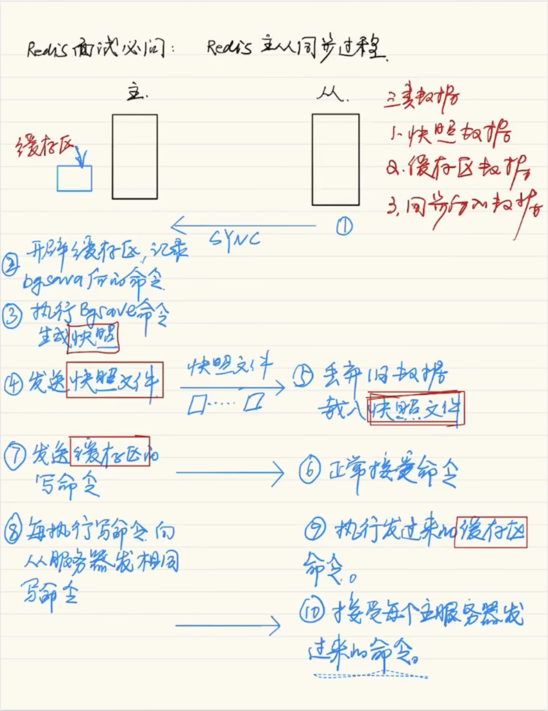

Redis的主从复制是提高Redis的可靠性的有效措施，主从复制的流程如下：

1. 集群启动时，主从库间会先建立连接，为全量复制做准备
2. 主库将所有数据同步给从库。从库收到数据后，在本地完成数据加载，这个过程依赖于内存快照RDB
3. 在主库将数据同步给从库的过程中，主库不会阻塞，仍然可以正常接收请求。否则，redis的服务就被中断了。但是，这些请求中的写操作并没有记录到刚刚生成的RDB文件中。为了保证主从库的数据一致性，主库会在内存中用专门的replication buffer，记录RDB文件生成收到的所有写操作。
4. 最后，也就是第三个阶段，主库会把第二阶段执行过程中新收到的写命令，再发送给从库。具体的操作是，当主库完成RDB文件发送后，就会把此时replocation buffer中修改操作发送给从库，从库再执行这些操作。这样一来，主从库就实现同步了
5. 后续主库和从库都可以处理客户端读操作，写操作只能交给主库处理，主库接收到写操作后，还会将写操作发送给从库，实现增量同
    步


#### ==Redis的数据结构及使用场景==

Redis的数据结构有：

1. 字符串：最常用的类型，可以缓存某个简单的字符串，也可以缓存某个json格式的字符串，Redis分布式锁的实现就利用了这种数据结构，还包括可以实现：计数器、Session共享、分布式ID
2. 哈希表：可以用来存储一些key-value对，更适合用来存储对象
3. 列表：Redis的列表通过命令的组合，既可以当做栈，也可以当做队列来使用，可以用来缓存类似微信公众号、微博等消息流数据
4. 集合：和列表类似，也可以存储多个元素，但是不能重复，集合可以进行交集、并集、差集操作，从而可以实现类似，我和某人共同关注的人、朋友圈点赞等功能
5. 有序集合：集合是无序的，有序集合可以设置顺序，可以用来实现排行榜功能


#### ==Redis集群策略==

Redis供了三种集群策略：

1. 主从模式：这种模式比较简单，主库可以读写，并且会和从库进行数据同步，这种模式下，客户端直接连主库或某个从库，但是但主库或从库宕机后，客户端需要手动修改IP，另外，这种模式也比较难进行扩容，整个集群所能存储的数据受到某台机器的内存容量，所以不可能支持特大数据量
2. 哨兵模式：这种模式在主从的基础上新增了哨兵节点，但主库节点宕机后，哨兵会发现主库节点宕机，然后在从库中选择一个库作为进的主库，另外哨兵也可以做集群，从而可以保证但某一个哨兵节点宕机后，还有其他哨兵节点可以继续工作，这种模式可以比较好的保证Redis集群的高可用，但是仍然不能很好的解决Redis的容量上限问题。
3. Cluster模式：Cluster模式是用得比较多的模式，它支持多主多从，这种模式会按照key进行槽位的分配，可以使得不同的key分散到不同的主节点上，利用这种模式可以使得整个集群支持更大的数据容量，同时每个主节点可以拥有自己的多个从节点，如果该主节点宕机，会从它的从节点中选举一个新的主节点。

对于这三种模式，如果Redis要存的数据量不大，可以选择哨兵模式，如果Redis要存的数据量大，并且需要持续的扩容，那么选择Cluster模式


#### ==布隆过滤器原理，优缺点==

[引用](https://www.jianshu.com/p/28b97568299b)


什么布隆过滤器

```ruby
布隆过滤器（英语：Bloom Filter）是1970年由布隆提出的。
它实际上是一个很长的二进制矢量和一系列随机映射函数。
布隆过滤器可以用于检索一个元素是否在一个集合中。
它的优点是空间效率和查询时间都远远超过一般的算法，缺点是有一定的误识别率和删除困难。

#布隆过滤器的本质
布隆过滤器本质是一个位数组, 位数组就是数组的每个元素都只占用1bit 。
每个元素只能是 0 或者 1。
这样申请一个 10000 个元素的位数组只占用 10000 / 8 = 1250 B 的空间。
布隆过滤器除了一个位数组，还有 K 个哈希函数。
当一个元素加入布隆过滤器中的时候，会进行如下操作：
>> 使用 K 个哈希函数对元素值进行 K 次计算，得到 K 个哈希值。
>> 根据得到的哈希值，在位数组中把对应下标的值置为 1。

#作用
特点是高效地插入和查询，可以用来告诉你 “某样东西一定不存在或者可能存在”。
```

布隆过滤器的优缺点

```ruby
#优点
>> 相比于其它的数据结构，布隆过滤器在空间和时间方面都有巨大的优势。布隆过滤器存储空间和插入/查询时间都是常数（O(k)）。
>> 散列函数相互之间没有关系，方便由硬件并行实现。
>> 布隆过滤器不需要存储元素本身，在某些对保密要求非常严格的场合有优势。
>> 布隆过滤器可以表示全集，其它任何数据结构都不能；
>> k和m相同，使用同一组散列函数的两个布隆过滤器的交并差运算可以使用位操作进行。

#缺点
>> 误算率。随着存入的元素数量增加，误算率随之增加。但是如果元素数量太少，则使用散列表足矣。
>> 一般情况下不能从布隆过滤器中删除元素. 我们很容易想到把位数组变成整数数组，
每插入一个元素相应的计数器加1, 这样删除元素时将计数器减掉就可以了。
然而要保证安全地删除元素并非如此简单。
首先我们必须保证删除的元素的确在布隆过滤器里面. 这一点单凭这个过滤器是无法保证的。
另外计数器回绕也会造成问题。
>> 在降低误算率方面，有不少工作，使得出现了很多布隆过滤器的变种。
```


在使用布隆过滤器防止缓存穿透的场景下，获取 `key1` 的执行流程如下：

1. **查询布隆过滤器**：
   
   - 首先，查询布隆过滤器，看是否存在 `key1`。
   - 布隆过滤器是一个概率型数据结构，如果布隆过滤器中没有 `key1`，则可以直接得出该 `key1` 不存在于缓存中，避免继续查询缓存。此时可以跳过缓存查询，避免浪费计算资源。
   
2. **缓存查询**：
   
   - 如果布隆过滤器判断 `key1` 可能存在，接下来查询 Redis 缓存。
   - 如果 Redis 中有 `key1`，直接返回其缓存值。
   - 如果 Redis 中没有 `key1`，说明缓存中没有该数据。
   
3. **数据库查询与更新布隆过滤器**：
   
   - 如果缓存中没有数据，需要查询数据库或其他持久化存储系统来获取 `key1` 的值。
   - 获取数据后，将该数据存入 Redis 缓存，以便下次快速访问。
   - 此时，你需要 **将 `key1` 存入布隆过滤器**。此时即便布隆过滤器存在一定的误判概率，基于其设计，判断是存在的概率很高，可以避免多次查询数据库。
   
4. **返回结果**：
   
   - 最后，返回从数据库获取的数据，并更新 Redis 和布隆过滤器。
   
     

总结：

- **布隆过滤器存值时机**：当数据库查询返回 `key1` 的数据并成功放入 Redis 后，才会将 `key1` 存入布隆过滤器。


#### ==常见的缓存淘汰算法==

FIFO（FirstInFirstOut，先进先出），根据缓存被存储的时间，离当前最远的数据优先被淘汰；
LRU（LeastRecentlyUsed，最近最少使用），根据最近被使用的时间，离当前最远的数据优先被淘汰；
LFU（LeastFrequentlyUsed，最不经常使用），在一段时间内，缓存数据被使用次数最少的会被淘汰。


#### ==什么是缓存穿透？缓存击穿？缓存雪崩？怎么解决？==

1. 缓存击穿：缓存击穿是指当某个热点数据在缓存中失效时，大量的请求会直接访问数据库，导致数据库压力增大。解决缓存击穿的方法是使用热点数据的永久缓存，或者在缓存失效时使用锁或队列来限制访问数据库的请求数量。
2. 缓存穿透：缓存穿透是指当查询的数据在缓存中不存在时，大量的请求会直接访问数据库，导致数据库压力增大。解决缓存穿透的方法是使用布隆过滤器来过滤掉不存在的数据，或者在缓存中设置空值或默认值，以避免访问数据库。
3. 缓存雪崩：缓存雪崩是指当大量的缓存同时失效时，大量的请求会直接访问数据库，导致数据库压力增大。解决缓存雪崩的方法是使用缓存失效时间的随机化，或者在缓存失效时使用锁或队列来限制访问数据库的请求数量。


1、缓存穿透：缓存中查不到，数据库中也查不到。

1. 对参数进行合法性校验。

2. 将数据库中没有查到结果的数据也写入到缓存。这时要注意为了防止Redis被无用的Key占满，这一类缓存的有效期要设置得短一点。

3. 使用布隆过滤器。

   

2、缓存击穿：缓存中没有，数据库中有。一般是出现在存数数据初始化以及key过期了的情况。他的问题在于，重新写入缓存需要一定的时间，如果是在高并发场景下，过多的请求就会瞬间写到DB上，给DB造成很大的压力。

1. 设置这个热点缓存永不过期。这时要注意在value当中包含一个逻辑上的过期时间，然后另起一个线程，定期重建这些缓存。
2. 在缓存失效时使用锁或队列来限制访问数据库的请求数量。


3、缓存雪崩：缓存大面积过期，导致请求都被转发到DB。

1. 把缓存的时效时间分散开。例如，在原有的统一失效时间基础上，增加一个随机值。
2. 在缓存失效时使用锁或队列来限制访问数据库的请求数量。


#### ==Redis和Mysql如何保证数据一致==

更新缓存---->更新数据库

更新数据库---->更新缓存


删除缓存---->更新数据裤

更新数据裤---->删除缓存

更新数据裤---->删除缓存---->删除缓存


### 5.2 Kafka

#### Kafka线上消息积压如何解决

想解决积压，正确姿势是什么？

​	是消费者慢？业务处理慢？还是分区数就不够？


为什么只加消费者没用？

举个例子：

- 你的topic 有5个分区
- 消费组里原本有 3 个实例，发现消费不过来了
- 你一下子加到10个消费者实例

你以为消费就能提速了，但事实上只有5个消费者在真正消费，其它5个处于“闲着，领不到分区”的状态，看着队列干着急⋯

原因很简单：每个分区同一时间只能被一个组内消费者消费，分区是并发的上限。


1）线上有时因为发送方发送消息速度过快，或者消费方处理消息过慢，可能会导致broker积压大量未消费消息。

- 此种情况如果积压了上百万未消费消息需要紧急处理，可以修改消费端程序，让其将收到的消息快速转发到其他topic（可以设置很多分区），然后再启动多个消费者同时消费新主题的不同分区。

2）由于消息数据格式变动或消费者程序有bug，导致消费者一直消费不成功，也可能导致broker积压大量未消费消息。此种情况可以将这些消费不成功的消息转发到其它队列里去（类似死信队列），后面再慢慢分析死信队列里的消息处理问题。


#### Kafka消息重复消费有几种情况？如何解决？

**消息发送端：**

发送消息如果配置了重试机制，比如网络抖动时间过长导致发送端发送超时，实际broker可能已经接收到消息，但发送方会重新发送消息

**消息消费端：**

如果消费这边配置的是手动提交，刚拉取了一批数据处理了一部分，但还没来得及提交，服务挂了，下次重启又会拉取相同的一批数据重复处理

一般消费端都是要做消费幂等处理的。

- 消费消息前，将消费生成MD5，然后去库里查询有没有相同的MD5，有的话表示消费过了
- 将整条消息保存到库，消费前先判断


#### Kafka消息丢失有几种情况？如何解决

**消息发送端：**

（1） acks=0：表示producer不需要等待任何broker确认收到消息的回复，就可以继续发送下一条消息。性能最高，但是最容易丢消息。大数据统计报表场景，对性能要求很高，对数据丢失不敏感的情况可以用这种。

（2） acks=1：至少要等待leader已经成功将数据写入本地log，但是不需要等待所有follower是否成功写入。就可以继续发送下一条消息。这种情况下，如果follower没有成功备份数据，而此时leader又挂掉，则消息会丢失。

（3） acks=-1或all：这意味着leader需要等待所有备份（min.insync.replicas配置的备份个数）都成功写入日志，这种策略会保证只要有一个备份存活就不会丢失数据。这是最强的数据保证。一般除非是金融级别，或跟钱打交道的场景才会使用这种配置。当然如果min.insync.replicas配置的是1则也可能丟消息，跟acks=1情况类似。

**消息消费端：**

如果消费这边配置的是自动提交，万一消费到数据还没处理完，就自动提交offset了，但是此时你consumer直接宕机了，未处理完的数据丢失了，下次也消费不到了。

```java
@Service
public class KafkaConsumerService {

    // 使用 KafkaListener 消费消息并手动提交 offset
    @KafkaListener(topics = "your_topic", groupId = "my-consumer-group")
    public void listen(ConsumerRecord<String, String> record, Acknowledgment acknowledgment) {
        try {
            // 处理业务逻辑
            String message = record.value();
            System.out.println("Consumed message: " + message);

            // 手动提交 offset
            acknowledgment.acknowledge();  // 提交消息的 offset
        } catch (Exception e) {
            // 异常处理逻辑
            System.err.println("Error processing message: " + e.getMessage());
        }
    }
}
```


#### Kafka的Pull和Push分别有什么优缺点

1. pull表示消费者主动拉取，可以批量拉取，也可以单条拉取，所以pull可以由消费者自己控制，根据自己的消息处理能力来进行控制，但是消费者不能及时知道是否有消息，可能会拉到的消息为空
2. push表示Broker主动给消费者推送消息，所以肯定是有消息时才会推送，但是消费者不能按自己的能力来消费消息，推过来多少消息，消费者就得消费多少消息，所以可能会造成网络堵塞，消费者压力大等问题


## 6、框架

### 6.1 Spring

### 6.2 Spring boot

### 6.3 Spring Cloud