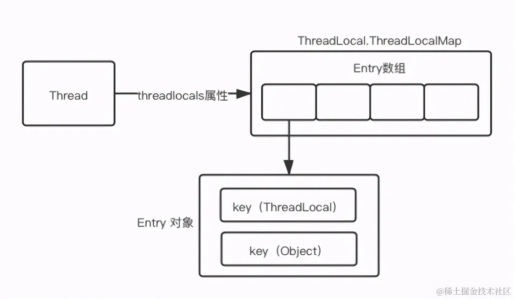

## 1、集合

### 1.1 ArrayList


### 1.2 HashSet

HashSet 就是 HashMap

```java
public boolean add(E e) {
    // private static final Object PRESENT = new Object();
    return map.put(e, PRESENT)==null;
}
```


### 1.3 HashMap

HashMap 的结构图

JDK1.7 的 HashMap 底层存储结构为：数组 + 链表

JDK1.8 的 HashMap 底层存储结构为：数组 + 链表 + 红黑树

JDK1.7 Entry<K,V>

JDK1.8 Node<K,V>

Entry & Node，只是名字不同，结构相同


==HashMap 的底层数据结构是什么？==

数组 + 链表 + 红黑树（JDK1.8才有红黑树）

1. 数组：HashMap 会使用一个数组来存储数据。数组的索引是通过 hashCode 计算得到的，具体来说，它会根据键的哈希值来确定该键值对应该存放在数组的哪个位置。

2. 链表：在数组的每个位置（桶）中，当多个键的哈希值相同时（即发生哈希冲突），会使用链表来存储这些冲突的键值对。链表的每个节点存储一个键值对（key-value），并通过 next 指针连接。

3. 红黑树（可选）：当链表的长度超过一定阈值（通常是 8）且数组长度大于64，HashMap 会将链表转化为红黑树。


==JDK1.8 的 HashMap 做了哪些优化？==

- 数据结构：由 JDK1.7的【数组+链表】改成了 JDK1.8的【数组+链表或红黑树】
  - 原因：插入数据发生 hash 冲突时，元素在桶位置形成链表，链表过长影响查询效率，所以使用红黑树优化。
- 单链表插入方式：单链表的插入方式由 JDK1.7 的头插法改成了 JDK1.8 的尾插法
  - 插入数据时，发生 hash 冲突的话
    - JDK1.7 将新元素放到数组中，原始节点作为新节点的后继节点；
    - JDK1.8 遍历链表，将元素放置到链表的最后；
  - 原因：因为JDK1.7 头插法扩容时，头插法会使链表发生反转，多线程环境下会产生环（死链）。
- 扩容：JDK1.7 扩容的时候需要对原数组中的元素进行重新 hash 定位在新数组的位置，JDK8 采用更简单的判断逻辑，不需要重新通过哈希函数计算位置，新的位置不变或索引+新增容量大小。
  - 原因：提高扩容的效率，更快地扩容。
- 扩容时机：在插入时，JDK1.7 先判断是否需要扩容，再插入。JDK1.8 先进行插入，插入完成再判断是否需要扩容;
- 散列函数：JDK1.7 做了四次移位和四次异或，JDK1.8 只做一次。
  - 原因：做 4次的话，边际效用也不大，JDK1.8 中对算哈希值的哈希算法进行了简化以提高运算效率。


==JDK1.7头插法导致的死链问题？==

死链的产生主要是因为在插入新元素时，链表的指针被错误地设置或更新，导致链表的某些节点无法被访问到，从而形成循环或者无法正确遍历。


==一般用什么作为 HashMap 的 key？==

一般用 lnteger、String 等不可变类当作 HashMap 的 key，String 最为常见。因为字符串是不可变的，所以在它创建的时候 hashcode   就被缓存了，不需要重新计算。并且获取对象的时候要用到 equals() 和 hashCode() 方法，那么键对象正确的重写这两个方法是非常重要的。Integer、String 这些类已经很规范的重写了 hashCode() 以及 equals() 方法。


==HashMap 为什么引入红黑树？==

JDK1.8 以前 HashMap 的实现是：数组+链表，即便哈希函数取得再好，也很难达到元素百分百均匀分布。当有大量的元素都存放到同一个桶时，这个桶下就有一条长长的链表，此时 HashMap 就相当于一个单链表，假如单链表有 n 个元素，遍历的时间复杂度就是 O(n)，完全失去了它的优势。针对这种情况，JDK1.8 中引入了红黑树来优化这个问题。红黑树查找时间复杂度为 O(logn)


==链表过深问题为什么不用二叉查找树代替，而选择红黑树？==

选择红黑树是为了解决二叉查找树的缺陷，二叉查找树在特殊情况下会变成一条线性结构(这就跟原来使用链表结构一样了，造成很深的问题)，遍历查找会非常慢。


==为什么不直接使用红黑树？==

首先红黑树相对于链表来说，数据结构与操作更复杂，会对性能肯定是有影响的。其次引入红黑树就是为了优化查找速度，解决链表查询深度的问题，但当元素小于 8 个的时候，此时做查询操作，链表结构已经能保证查询性能。所以，只有当元素大于 8 个的时候，才会使用红黑树来加快查询速度。


==为什么 HashMap 的数组大小 length 是 2 的 n 次幂？==

方便 & 操作：如果除数是 2 的 N 次幂，则取模操作等价于：除数 & (被除数 - 1)，即：hash % length = hash & (length -1)。

方便扩容：扩容之后的长度是原来的二倍，新的容量也是2的次幂，所以，元素，要么在原位置，要么在原位置再移动2的次幂。


==那么为什么初始容量的默认值是 16 呢？而不是 4 或 8？==

关于这个默认容量的选择，JDK 并没有给出官方解释，那么这应该就是个经验值，既然一定要设置一个默认的 2^n 作为初始值，那么就需要在效率和内存使用上做一个权衡。这个值既不能太小，也不能太大。太小了就有可能频繁发生扩容，影响效率。太大了又浪费空间，不划算。16是一个经验值。

另外，如果输入数据若不是 2 的幂，HashMap 会重新计算得到一个离该数字最接近的 2^n（比如：输入17，重新计算得到 32）


==HashMap 扩容的时机（JDK1.8）？==

创建 HashMap 对象后，并不会立即初始化 table，而是在第一次插入元素时，会判断 table 是否为 null，为 null 时会调用 resize() 进行初始化，这是HashMap节省内存的一种机制。

JDK1.8 在新增数据成功后进行扩容，扩容会发生在两种情况下（满足任意一种条件即发生扩容）

- 放入数据后，数组内元素数量大于阈值时，调用 resize() 进行扩容；
- 存入数据到某一条单链表上，此时单链表长度大于8，且数组长度小于 64 时调用 resize() 扩容；


==HashMap 扩容的流程（JDK1.8）？==

1. 创建一个新数组（新数组大小是旧数组的两倍），并将其赋值给成员变量 table
2. 遍历老数组，将其元素复制到新数组中：
   1. 如果 table[i] 的头节点的 next 指针为 null，说明这个桶只有一个节点，直接计算新的数组下标并插入即可；
   2. 如果节点是红黑树类型，则调用split() 进行红黑树的拆分操作
      1. 生成 low 和 high 两颗红黑树；
      2. 如果生成的 low，high 树中元素个数小于等于6退化成链表，再插入到新数组的相应下标的位置；
   3. 节点为链表类型，会生成 low 和 high 两条链表
      1. 依靠 `hash & oldcap) ==0` 判断 Node 中的每个结点归属于 low 还是 high；
      2. 把 low 插入到新数组中当前数组下标的位置，把 high 链表插入到新数组中【当前数组下标+旧数组长度】的位置
3. 返回新数组 newTab。旧数组会被垃圾回收机制回收。


==添加数据时，是先添加再扩容？还是先扩容再添加？==

JDK1.8 的扩容：新增数据存入成功后进行扩容判断，扩容会发生在两种情况下（满足任意一种条件即发生扩容）

- 元素个数大于阈值，进行扩容：threshold = capacity * loadFactor
- 桶上的链表元素个数大于 8（TREEIFY_THRESHOLD）且数长度小于 64（MIN_TREEIFY_CAPACITY），进行扩容

JDK1.7 的扩容：先判断是否需要扩容，后插入数据（同时满足以下两个条件才会进行扩容）

- 存放新值时当前已有元素的个数大于等于阈值；
- 存放新值时当前存放数据发生 hash 碰撞；
- 即：只有存储元素超过阈值并且当前存储位置不为 null，才会进行扩容


==JDK1.7，默认长度下，可能存第 27 个元素时，才发生扩容==

JDK1.7 扩容必须满足两个条件:

- 存放新值的时候，当前已有元素的个数必须大于等于阈值；
- 存放新值的时候，数据发生 hash 碰撞；

因为上面这两个条件，所以存在下面这些情况

1. 就是 Hashmap 在存值的时候（默认大小为16，负载因子0.75，值12），可能达到最后存满 16 个值的时候，再存入第 17 个值才会发生扩容现象，因为前16个值，每个值在底层数组中分别占据一个位置，并没有发生 hash 碰撞。
2. 当然也有可能存储更多值（超多16个值，最多可以存26个值）都还没有扩容。原理：前11个值全部 hash 碰撞，存到数组的同一个位置（虽然hash冲突，但是这时元素个数小于阈值12，并没有同时满足扩容的两个条件，所以不会扩容），后面所有存入的 15 个值全部分散到数组剩下的 15 个位置（这时元素个数大于等于阈值，但是每次存入的元素并没有发生 hash 碰撞，也没有同时满足扩容的两个条件，所以叶不会扩容），前面 11+15=26，所以在存入第 27 个值的时候才同时满足上面两个条件，这时候才会发生扩容。


==为什么 JDK1.8 改为先插入后扩容了？==

优化覆盖操作，避免无效扩容，提升性能

- JDK 1.7 的问题：
  - 插入元素前会先检查容量是否达到阈值（threshold）。如果达到阈值，会先扩容再插入。
  - 缺陷：若插入的 key 已存在（覆盖操作），实际只需替换 value，无需扩容。但 1.7 仍会先触发扩容，造成性能浪费。
- JDK 1.8 的优化：
  - 先插入新元素（或覆盖旧值），再检查是否需要扩容。
  - 优势：覆盖操作不会触发扩容，减少了不必要的数组复制和哈希重计算。


==HashMap 什么时候会将链表转为红黑树？==

只有当某个桶内的元素超过 8，并且 `HashMap` 的容量大于 64 时，才会允许转换为红黑树。这是为了在小容量的情况下避免额外的内存开销，因为红黑树比链表需要更多的内存。


==HashMap 实现了 Serializable 接口，为什么把存放数据的 table 声明为 transient？==

首先，HashMap 序列化的时候已经将每个元素的 Key 和 Value 都进行序列化。在反序列化的时候，重新计算 Key 和 Value 的位置，重新填充一个数组。所以 table 本身在序列形式中是不必要的，以节省空间。


==HashMap 的 loadFactor 作用是什么？==

loadFactor 是加载因子，表示 HashMap 的拥挤程度，默认值为 0.75。当 HashMap 里面容纳的元素已经达到数组长度的 75% 时，表示数组太挤了，需要扩容。0.75 是在时间和空间成本之间的一个权衡。


==为什么加载因子的默认值是 0.75，并且不推荐我们修改？==

如果 loadFactor 太小，阈值就越小，数组就需要不断的扩容，而扩容是个比较耗时的过程。

如果 loadFactor 太大，阈值就越大，数组放满了也不扩容，导致冲突越来越多，解决冲突而起的链表越来越长，查询效率越来越低。

而 0.75 这是一个折中的值，是一个比较理想的值。


==table 的初始化时机是什么时候（常用无参构成方法）？==

一般情况下，在第一次 put 的时候，调用 resize() 进行 table 的初始化（懒初始化），

- capacity = DEFAULT_INITIAL_CAPACITY（16）

- threshold = DEFAULT_LOAD_FACTOR * DEFAULT_INITIAL_CAPACITY（12）
- loadFactor = DEFAULT_LOAD_FACTOR（0.75）


==红黑树的总结==

HashMap 在 JDK1.8 中的实现增加了红黑树，当链表节点达到 8 个的时候，会把链表转换成红黑树，低于6个的时候，会退回链表。究其原因是因为当节点过多时，使用红黑树可以更高效的查找到节点。毕竟红黑树是一种二叉查找树。

- 节点个数是多少的时候，链表会转变成红黑树？
  - 链表节点个数大于等于 8 时，链表会转换成树结构。
- 节点个数是多少的时候，红黑树会退回链？
  - 表节点个数小于等于 6 时，树会转变成链表。
- 为什么转变条件 8 和 6 有一个差值。
  - 如果没有差值，都是 8，那么如果频繁的插入删除元素，链表个数又刚好在 8 徘徊，那么就会频繁的发生链表转树，树转链表。


==HashMap允许空键空值么？==

HashMap 最多只允许一个键为 null（多条会覆盖），如果键为 null，则存放在 table[0]，但允许多个值为 null。


==你知道 hash 的实现吗?为什么要这样实现？==

JDK1.8 中，具体方式为：`(h=k.hashCode()^(h >>> 16)`，设计者将 key 的哈希值与右移16位的哈希值进行异或运算，以此来让高16位也参与运算，随机性，使得在做 & 运算确定桶下标时更加均匀，减少哈希碰撞的次数。


==为什么重写对象的 equals() 时，要重写 hashcode()，跟 HashMap 有关系吗？==

跟 HashMap 有关系，或者说因为 HashMap 中用到了对象的 hashcode() 所以会有关系

- 对于类 A，如果只重写 equals()，那么就会存在 `A1.egual(A2) == true` 但是`A1.hashcode != A2.hashcode`。
- 当将 A1 和 A2 都作为 HashMap 的 key 时，HashMap 在判断 key 值是否相等时，会先判断 key 的hashcode 是不是一样，不一样就直接会认为不相等了，所以在这种场景下会出现我们认为这两个对象相等，但是 HashMap 认为不相等，所以会有问题。


### 1.4 ConcurrentHashMap 


JDK1.7 结构


JDK1.8 结构


==ConcurrentHashMap 的底层结构及实现原理?==

**JDK1.7**

1. CurrentHashMap 使用分段锁的思想，其内部维护了一个 Segment 数组，Segment 继承了 ReentrantLock。
2. Segment 内部维护了一个 HashEntry 数组，即：table。
3. 数据存储在 table 中，当某个桶（table[i]）发生 hash 冲突时，形成链表。
4. 即：通过 Segment 将数据分段存储（Segment长度为16，也就是分为16段，固定值），然后给每段数据配一把锁（Segment 本身就是锁），当多线程访问不同数据段的数据时，就不会存在锁竞争（一共16把锁），提高了并发访问率。

**JDK1.8**

1. 取消了分段锁的设计，取而代之的是通过【CAS + sychronized】关键字来保证并发更新的安全，synchronized 只是用于锁住【链表或者红黑树】的头节点。只要没有 Hash冲突，就不存在并发问题，从而提升效率。


==JDK1.8 中 ConcurrentHashMap 为什么是线程安全的（怎么保证线程安全的）？==

1. CAS 处理无竞争写入：当插入位置桶为空（头节点为 null）时，直接用 CAS 操作设置头节点，避免加锁开销，保证原子写入。
2. Synchronized 锁桶处理竞争写入：当插入位置桶非空（已有链表或树）时，使用 synchronized 锁住该桶的头节点。
   - 作用： 确保同一时间只有一个线程能修改这个桶内的链表/树结构（增、删、改节点值、树化），保证并发修改的原子性。
   - 关键： 锁粒度是单个桶，不同桶的写操作可并行，大幅提升并发度。
3. Volatile 保证可见性：
   - Node 的 val 和 next 字段用 volatile 修饰。
   - 作用： 确保线程修改节点值或更新链表指针（如 next）后，其他线程（包括读线程）能立即看到最新结果。这是锁和 CAS 能正确工作的内存可见性基础。


==JDK1.8 中 ConcurrentHashMap 的 put 方法如何保证数组元素的可见性？==

1. volatile 数组引用：table 数组声明为 volatile transient Node<K,V>[] table，确保数组引用更新对所有线程立即可见。
2. CAS 操作数组元素：插入元素时，CAS 方式修改数组元素，CAS 本身具有 volatile 写语义，保证修改后的值对其他线程可见。
3. volatile 读获取元素：读取数组元素时（如 tabAt() 方法）通过 U.getObjectVolatile() 实现 volatile 读，强制从主内存获取最新值，避免读缓存。


==ConcurrentHashMap 的 get 方法为什么不加锁？==

无论是 JDK7 还是 JDK8，`ConcurrentHashMap` 都利用 `volatile` 关键字确保了线程安全的同时，也避免了频繁加锁带来的性能损耗。特别是在节点的 `value` 和 `next` 指针上使用 `volatile`，能够确保线程 A 的修改对线程 B 是可见的，而使用 `unsafe.getObjectVolatile()` 则保证了对数组下标元素的访问是原子性的，从而提高了并发性能。


==ConcurrentHashMap 的扩容逻辑？怎么实现多线程扩容？扩容时怎么保证数据的安全对？==


**ConcurrentHashMap 扩容方案的核心思路**： 扩容时，把整个数组进行分段，每个线程负责一段。bound 表示该线程范围的下限，i 表示当前正在迁移的下标。每一个迁移完成的节点都会被赋值 ForwardingNode，表示迁移完成。stride 表示线程迁移的“步幅”，当线程完成范围内的任务后，就会继续往前看看还有没有需要迁移的，transferIndex 就是记录下个需要迁移的下标；当 transferIndex==0 时则表示不需要帮忙了。

1. 当散列表中的元素个数大于扩容阈值时，会触发扩容操作。
2. 扩容前，会根据 table 的长度获取扩容的唯一标识，多线程协助扩容时，用于判断是否是同一批次的扩容。
3. 扩容时的新数组长度为原数组长度的两倍，初始化好新数组，然后会确认当前线程负责的槽位，确认好之后会从大到小开始迁移数据。
4. 迁移的逻辑同 HashMap 一样，根据 `hash&n==0` 把桶中元素分化成两个链表或树，低位链表(树)存储在原来的位置，高们链表(树)存储（原来的索引位置 + 原来的数组长度）处。
5. 迁移完成的槽位在里面放置 ForwardingNode 类型的元素，标记该槽位已迁移完成。
   1. 当有线程来读取数据的时候，发现当前节点为ForwardingNode 节点，会调用对应的 find 方法，定向到新散链表中去查询元素
   2. 当有线程来写数据的时候，发现当前节点为 ForewardingNode 节点，会调用 helpTransfer 方法，判断是否需要协助扩容。
   3. 如果是其他还没被迁移的节点，是可以正常读写的。
6. 扩容完成后，将新数组赋值给成员属性 table。


==JDK1.8，ConcurrentHashMap 正在扩容过程中（假设从16扩容到32），如果此时只有一个线程进行扩容，并且正在迁移table[15]处的节点，此时来了一个线程，要在table[1]处进行插入，能插入成功吗==

在 JDK 8 中，`ConcurrentHashMap` 的扩容是分段进行的，扩容过程中不同桶的迁移是独立的，不会锁住整个 map，而是通过局部锁和 CAS 来保证线程安全。假设 `ConcurrentHashMap` 正在从容量 16 扩容到 32，并且正在迁移 `table[15]` 的节点。如果一个线程正在迁移 `table[15]`，而另一个线程要插入到 `table[1]`，插入是**可以成功的**。

原因如下：

- **扩容是桶级别的独立操作**：在扩容过程中，`ConcurrentHashMap` 会按桶进行分段迁移，也就是说某个桶的迁移不会影响其他桶的操作。
- **散列表的局部锁机制**：当迁移某个桶时，扩容过程中会通过 CAS 和分段锁来处理每个桶。假设 `table[15]` 正在迁移，但这不会影响 `table[1]`，因为它们的迁移是并行的，且没有互相锁定。
- **并发插入**：在扩容期间，其他线程可以并发地操作未被迁移的桶，如 `table[1]`。并发插入操作是安全的，因为扩容期间并不会改变未迁移桶的位置。

因此，即使 `table[15]` 正在迁移，`table[1]` 上的插入操作仍然能够成功执行。


==JDK1.8 ConcurrentHashMap 的负载因子可以指定值吗？==

HashMap 是可以指定负载因子的，但是 ConcurrentHashMap 不可以，ConcurentHashMap 中没有声负载因子的属性，无法保存自定义的负载因子，构造函数中传的负载因子，只是用于计算初始容量，计算扩容时的值使用的是默认值 0.75。


==JDK1.8 为什么使用 synchronized 替换 ReenTrantLock？==

- 在JDK1.6 中对 synchronized 锁的实现进行了大量的优化，会从无锁>偏向锁>轻量级锁>重量级锁逐步转换，也就是锁膨胀的优化。
- 使用 CAS + synchronized 加锁的对象是每个链表的头节点，提升并发度并减少了内存开销；如果使用可重入锁达到同样的效果，则需要大量继承 ReentrantLock 的对象，造成大量的内存浪费。


==ConcurrentHashMap 和 HashTable 的效率哪个更高？为什么？==

在 `Hashtable` 中，整个哈希表的操作都由一个 **全局锁**（即对整个哈希表加锁）来保护。这意味着无论你执行查询、插入、删除等操作，都会对整个表加锁，从而导致高并发情况下，多个线程访问 `Hashtable` 时会产生较大的锁竞争，性能瓶颈非常明显。

而 ConcurrentHashMap 的锁粒度更低，使用的是桶级别的锁（table[i]）。

- 在 JDK1.7 中采用分段锁实现线程安全。
- 在 JDK1.8 中采用 CAS+Synchronized 实现线程安全。


==JDK8，ConcurrentHashMap，当链表升级为红黑树过程中，此时来了一个新的线程，要对该红黑树进行读操作，此时会怎么处理？如果再有新的线程对该红黑树进行写操作，怎么处理？==

1. **链表升级为红黑树的过程**

当 ConcurrentHashMap 中某个桶（bucket）的链表长度超过了阈值（默认是 8），并且桶的总大小大于阈值（默认是 64），链表会被升级为红黑树。这个过程在 put 操作中进行，如果发现链表太长，才会触发这种升级。

在触发红黑树升级的过程中，会锁住桶（bucket）所在的段。JDK 8 使用了 分段锁 来保证并发安全，即每个桶对应的链表或树会有一个独立的锁来保护它。这是为了避免对整个 ConcurrentHashMap 的大范围锁定。

2. **读操作的处理**

假设在链表升级为红黑树的过程中，来了一个新的线程尝试读取（get）该桶的数据。

- 读操作（get）: ConcurrentHashMap 在设计时尽量避免对读操作加锁，因此它是通过 无锁 方式实现并发的。即使在链表升级为红黑树的过程中，读操作也会尽量绕过锁定。
  
  - 在升级过程中，如果读操作尝试读取数据，JDK 8 会在读取链表或红黑树的结构时保证一致性。具体来说，读操作会读取数据的一个快照，这样即使升级过程中结构在发生变化，读操作也能正确地返回数据。

  - 在这种情况下，读操作会获取到升级前或升级后的数据，不会因为结构调整而出现读取不一致的问题。

3. **写操作的处理**

如果在链表升级为红黑树的过程中，有另一个线程对红黑树进行写操作（例如 put 或 remove），则会如何处理呢？

- 写操作（put 或 remove）: 在进行写操作时，如果链表正在升级为红黑树，ConcurrentHashMap 会使用锁来保护数据结构的修改，确保操作的原子性。具体来说，这种写操作会等到当前升级过程完成后再进行。这样能够保证不会在结构调整的过程中修改正在变动的结构。

  - 写操作通常会尝试获取桶的锁（synchronized），以保证在结构调整完成之前不会发生并发修改。

  - 如果有并发写操作，它们会被排队等待，直到桶内的结构调整完成。

4. **总结**

- 读操作：即使在链表升级为红黑树过程中，get 操作也能无锁读取数据，并且不会受到升级影响，能保证数据一致性。
- 写操作：在链表升级为红黑树的过程中，写操作会通过锁机制进行同步，确保结构的原子性和一致性，避免在结构升级过程中进行并发修改。


==ConcurrentHashMap 为什么 key 和 value 不能为 null？==

ConcurrentHashMap 的 key 和 value 不能为 null 主要是为了避免二义性。

null 是一个特殊的值，表示没有对象或没有引用。如果你用 null 作为键，那么你就无法区分这个键是存在于 ConcurrentHashMap 中为null，还是根本没有这个键。同样，如果你用 null 作为值，那么你就无法区分这个值是否是真正存储在 ConcurrentHashMap 中的，还是因为找不到对应的键而返回。

当 get() 返回 null 时无法判断是哪种情况，在并发环境下 containsKey() 不再可靠。


==HashMap 的 key 和 value 为什么可以为 null，而 ConcurrentHashMap 不能？==

HashMap是非线程安全的，默认单线程环境中使用，不会存在一个线程操作该 HashMap 时，其他的线程将该 HashMap 修改的情况，如果 get(key)为 null，可以通过 containsKey(key)来判断这个 key 的 value 为 null，还是不存在这个key，从而做相应的处理；也就不存在二义性问题。

而在多线程环境下，可能会存在多个线程同时修改键值对的情况，get(key) 和 containsKey(key) 两个操作和在一起不是一个原子性操作，可能在执行中间，有其他线程修改了数据，这时是无法通过containskey(key) 来判断键值对是否存在的，这会带来一个二义性的问题，Doug Lea说二义性是多线程中不能容忍的！

可以 putIfAbsent() 解决 get(key) 和 containsKey(key) 两个操作和在一起不是一个原子性操作的问题。

`putIfAbsent` 方法会在指定的 `key` **不存在**时将 `key` 和 `value` 插入 `ConcurrentHashMap`，如果 `key` 已经存在，它不会做任何修改。

`computeIfAbsent` 方法在指定的 `key` 不存在时，会 **计算并插入**一个新的值。该值是通过一个 `Function`（函数）计算出来的。

```java
ConcurrentHashMap<String, String> map = new ConcurrentHashMap<>();
map.putIfAbsent("key1", "value1"); // 插入 key1 和 value1
map.putIfAbsent("key1", "newValue"); // 不会更新，返回 value1

// 安全的累加
while(true) {
    // 第二次调用的时候，由于已经存在 key1，所以不会执行后面的函数了，但是会返回 value 值
    // 注意不能使用 putIfAbsent，此方法返回的是上一次的 value，首次调用返回 null，也就是第一次不能累加，少加了一次
    LongAdder adder = map.computeIfAbsent("key1", key -> new LongAdder().increment();
    // 返回的计数器执行累加
    adder.increment();
}

```


## 2、并发


### 2.1 多线程


==并发、并行、串行之间的区别？==

1. 串行（Serial）：

   - 定义：任务一个接一个地顺序执行，当前任务完成后才开始下一个任务。
   - 例子：依次执行A、B、C任务。

2. 并发（Concurrency）：

   - 定义：多个任务在同一时间段内开始，但并非同时执行。任务可能会交替执行，CPU 在不同任务间切换。
   - 例子：A、B、C任务在同一时间段内交替执行。

3. 并行（Parallelism）：

   - 定义：多个任务在同一时刻真正同时执行，通常依赖多核处理器。

   - 例子：A、B、C任务在多个核心上同时执行。

     

总结：

- 串行：任务顺序执行。
- 并发：任务交替执行，可能并非同时。
- 并行：任务真正同时执行。


==创建线程的三种方式？==

在 Java 中，创建线程有三种方法：

- 实现 Runnable 接口；
- 实现 Callable 接口；
- 继承 Thread 类。

实现 Runnable 和 Callable 接口的类只能当做一个可以在线程中运行的任务，不是真正意义上的线程，因此最后还需要通过 Thread 来调用。可以说任务是通过线程驱动从而执行的。


继承与实现接口相比，实现接口会更好一些，因为:

- Java 不支持多重继承，因此继承了 Thread 类就无法继承其它类，但是可以实现多个接口；

- 类可能只要求可执行就行，继承整个 Thread 类开销过大。

  

**实现 Runnable 接口**

需要实现 run() 方法。

通过 Thread 调用 start() 方法来启动线程。

```java
// 创建任务
Runnable runnable = new Runnable() {
    @Override
    public void run() {
        log.debug("通过 Runnable 接口创建的线程");
    }
};

// 创建并启动线程
new Thread(runnable).start();
```


**实现 Callable 接口**

与 Runnable 相比，Callable 可以有返回值，返回值通过 FutureTask 进行封装。

```java
// 创建任务
Callable callable = new Callable() {
    @Override
    public Object call() throws Exception {
        log.debug("通过 Callable 接口创建的线程");
        return 1;
    }
};

// 将任务封装进 FutureTask 中，以便后续从该线程中获取处理结果
FutureTask<Integer> futureTask = new FutureTask<>(callable);
// 创建并启动线程
new Thread(futureTask).start();

// 获取线程执行的结果
// 主线程执行到该 get() 方法时，会进入阻塞状态，直到子线程执行完毕
try {
    System.out.println(futureTask.get());
} catch (Exception e) {
    e.printStackTrace();
}
```


**继承 Thread 类**

```java
// 创建线程
Thread thread = new Thread(){
    public void run() {
        try {
            Thread.sleep(3000);
        } catch (InterruptedException e) {
            log.error(e.getMessage());
        }
        log.debug("通过 Thread 类创建的线程");
    }
};

// 启动线程
thread.start();
```


==如何优雅的停止一个线程？==

一个线程执行完毕之后会自动结束，如果在运行过程中发生异常会提前结束。


Java 提供了线程中断以及判断某个线程是否被中断过的方法：

- interrupt()：给调用了该方法的线程设置一个中断标记，此时
  - 如果调用该方法的线程处于等待或阻塞状态，则会抛出 InterruptedException，并中断线程的执行；
  - 如果调用该方法的线程没有处于等待或阻塞状态，则线程会继续运行（只是设置了一个中断标记
- interrupted()：判断调用了该方法的线程是否被中断过（检查中断标记）
  - 注意，**Thread.interrupted() 的调用线程是当前正在执行的线程**！！！
  - 返回一个 boolean 值，并清除标记位（即：再次调用时，中断标记已经被清除，此时会返回一个 falase）
- isInterrupted()：判断调用了该方法的线程是否被中断过（检查中断标记）
  - 不会清除标记位


总的来说

- interrupt()：设置一个中断标记，如果处于等待或阻塞状态，则会抛出异常并中断线程；
- interrupted()：检测并清除中断标记；
- isInterrupted()：只检测中断标记；

```java
Thread t1 = new Thread(() -> {
    log.debug("t1 线程启动");
}, "t1");
t1.start();
t1.interrupt();

log.debug("第一次调用 t1.isInterrupted(): {}", t1.isInterrupted());
log.debug("第二次调用 t1.isInterrupted(): {}", t1.isInterrupted());

// 注意，Thread.interrupted() 作用于当前正在执行的线程，此处是 main 线程，而不是 t1 线程！！！
log.debug("第一次调用 Thread.interrupted(): {}", Thread.interrupted());
log.debug("第二次调用 Thread.interrupted(): {}", Thread.interrupted());

// interrupt() 作用于 main 线程
Thread.currentThread().interrupt();
log.debug("第一次调用 Thread.interrupted(): {}", Thread.interrupted());
log.debug("第二次调用 Thread.interrupted(): {}", Thread.interrupted());

log.debug("main 线程执行结束");
```

日志输出

```java
19:10:29 [t1] - t1 线程启动
19:10:29 [main] - 第一次调用 t1.isInterrupted(): true
19:10:29 [main] - 第二次调用 t1.isInterrupted(): true
19:10:29 [main] - 第一次调用 Thread.interrupted(): false
19:10:29 [main] - 第二次调用 Thread.interrupted(): false
19:10:29 [main] - 第一次调用 Thread.interrupted(): true
19:10:29 [main] - 第二次调用 Thread.interrupted(): false
19:10:29 [main] - main 线程执行结束
```


==谈谈你对 ThreadLocal 的理解==

`ThreadLocal` 是 Java 提供的一种用于线程隔离的机制，它能够为每个线程提供独立的变量副本。具体来说，`ThreadLocal` 允许每个线程在其内部存储和访问自己的局部变量，避免了不同线程之间的共享问题，从而避免了并发访问的竞争条件和同步问题。

ThreadLocal 底层是通过 ThreadLocalMap 这个静态内部类来存储数据的，ThreadLocalMap 就是一个键值对的 Map，它的底层是 Entry 对象数组，Entry 对象中存放的键是 ThreadLocal 对象，值是 Object 类型的具体存储内容 。

除此之外，ThreadLocalMap 也是 Thread 类一个属性。




如果使用不当，ThreadLocal 会导致内存泄漏。

内存泄漏是指程序中已动态分配的堆内存由于某种原因程序未释放或无法释放，造成系统内存的浪费，导致程序运行速度减慢甚至系统崩溃等严重后果。

如果是直接创建线程，然后使用 ThreadLocal（不使用线程池）的话，ThreadLocal 是不存在线程泄露问题的。因为当线程执行结束，那么线程就要销毁，线程中的 threadlocals 属性也随之销毁，那么对应的 Entry 对象当然也会被销毁了。

但是一般都是使用线程池，而线程池中的核心线程是不会被销毁的，导致存放数据的 Entry 对象不会被销毁，从而导致内存泄露问题。


另外，线程池导致 ThreadLocal 内存泄露问题，主要原因是就是 Entry 没有被释放掉，所以在设计 Entry 对象的时候，增加了对应的处理：使 Entry 对象的 key 即 ThreadLocal 类继承于 WeakReference 弱引用类。具有弱引用的对象有更短暂的生命周期，在发生 GC 活动时，无论内存空间是否足够，垃圾回收器都会回收具有弱引用的对象。

```java
static class Entry extends WeakReference<ThreadLocal<?>> {
    /** The value associated with this ThreadLocal. */
    Object value;

    Entry(ThreadLocal<?> k, Object v) {
        super(k);
        value = v;
    }
}
```

由于 Entry 对象的 key 是继承于 WeakReference 弱引用类的，若 ThreadLocal 类没有外部强引用，当发生 GC 活动时就会将 ThreadLocal 对象回收。

- 也就是 Entry 的 key 被设置为 null，从而变成一个**无效的 Entry**。
  - 在调用set方法时，如果发生 hash 冲突，就会通过线性检测法处理哈希冲突，若 Entry 数组的 key 与当前 ThreadLocal 不是同一个对象，同时 key 为空的时候，会进行 **清理无效 Entry** 的处理，从而达到清除的目的。

但是，如果此时如果创建 ThreadLocal 类的线程依然活动，那么 Entry 对象中 ThreadLocal 对象对应的 value 就依旧具有强引用而不会被回收，从而导致内存泄漏。


**怎么解决这个问题？**

要想解决内存泄漏问题其实很简单，只需要记得在使用完 ThreadLocal 中存储的内容后将它 **remove** 掉就可以了。


### 2.2 线程池


==线程池的核心参数有哪些？==

```java
public ThreadPoolExecutor(int corePoolSize,
                          int maximumPoolSize,
                          long keepAliveTime,
                          TimeUnit unit,
                          BlockingQueue<Runnable> workQueue,
                          RejectedExecutionHandler handler)
```

   - **核心线程数（`corePoolSize`）**: 保持活动的线程数，默认情况下，如果线程数少于核心线程数，即使空闲，也不会被回收。
   - **最大线程数（`maximumPoolSize`）**: 线程池允许的最大线程数。
   - **空闲线程的存活时间（`keepAliveTime`）**: 空闲线程在被销毁之前的最大存活时间。
   - **时间单位（`unit`）**: 指定空闲线程的存活时间单位。
   - **任务队列（`BlockingQueue`）**: 用于存放待执行任务的队列。常见的队列有`LinkedBlockingQueue`、`ArrayBlockingQueue`、`SynchronousQueue`等。
   - **线程工厂（`ThreadFactory`）**: 用于创建新线程的工厂（主要用于指定线程的名字）。
   - **拒绝策略（`RejectedExecutionHandler`）**: 当线程池无法处理更多的任务时，选择如何处理任务。常见的拒绝策略有：`AbortPolicy`（默认，抛出异常）、`CallerRunsPolicy`（调用者执行任务）、`DiscardPolicy`（丢弃任务）等。


==线程池有几种状态？分别是如何变化的？==

| 状态名     | 描述                                                         |
| ---------- | ------------------------------------------------------------ |
| RUNNING    | 会接收新任务，并且会处理队列中的任务                         |
| SHUTDOWN   | 不会接收新任务，但会处理阻塞队列剩余任务，并中断所有线程（调用 shutdown() 会变成该状态） |
| STOP       | 不会接收新任务，并且不会处理队列中的任务，并中断所有线程（调用 shutdownNow() 会变成该状态） |
| TIDYING    | 所有线程都停止了之后，线程池的状态就会转为 TIDYING，一旦达到此状态，就会调用线程池的 terminated() |
| TERMINATED | terminated() 执行完之后就会转变 TERMINATED                   |


==向线程池中提交一个任务后，线程池的执行流程是怎样的？==

1. 当提交任务时，如果当前活跃线程数小于核心线程数，会立即创建一个新线程执行任务。
2. 如果核心线程数已满，则任务会被提交到任务队列中等待。
3. 如果任务队列已满且活跃线程数还未达到最大线程数时，线程池会创建更多的线程（空闲线程）来执行任务。
4. 如果线程池的线程数达到最大线程数，并且任务队列已满，线程池会根据拒绝策略处理超出的任务。


==常用的线程池工厂方法？==

   - **`Executors.newFixedThreadPool(int nThreads)`**: 创建固定大小的线程池。
     - 核心线程数 == 最大线程数（没有救急线程被创建），因此也无需超时时间。

   - **`Executors.newCachedThreadPool()`**: 创建一个可缓存的线程池，线程池的线程数会根据需求增长，空闲线程会被回收。
     - 核心线程数是 0， 最大线程数是 Integer.MAX_VALUE，救急线程的空闲生存时间是 60s。

   - **`Executors.newSingleThreadExecutor()`**: 创建一个只有单个线程的线程池，适用于只需要一个线程的任务。
     - 使用场景：希望多个任务排队执行。线程数固定为 1，任务数多于 1 时，会放入无界队列排队。


==线程池的核心线程数、最大线程数该如何设置？==

**核心线程数**

- CPU密集型任务：如果任务主要是计算密集型的（比如复杂的数学计算），核心线程数可以设置为与CPU核心数相同。
  - 示例：假设你的机器有4个CPU核心，则可以将核心线程数设置为4。
- I/O密集型任务：如果任务主要是I/O密集型的（例如数据库读写、文件读写、网络请求等），则线程数可以设置得更大，因为I/O操作时线程通常会阻塞，可以通过更多的线程来等待I/O完成。
  - 示例：对于I/O密集型任务，核心线程数可以设置为CPU核心数的2倍或更多。

**最大线程数**

- 一种常见的做法是：最大线程数 = 任务提交速率 * 每个任务的平均处理时间 / CPU核心数。


==并发过程中的：原子性、可见行、有序性？==

由于 `CPU` 和 `内存` & `I/O 设备` 之间的速度是有极大差异的，为了合理利用 CPU 的高性能，平衡这三者的速度差异，计算机体系结构、操作系统、编译程序都做出了相应的优化，主要体现为:

- CPU 增加了缓存，以均衡与内存的速度差异；// 导致 `可见性`问题

- 操作系统增加了进程、线程，以分时复用 CPU，进而均衡 CPU 与 I/O 设备的速度差异；// 导致 `原子性`问题

- 编译程序优化指令执行次序，使得缓存能够得到更加合理地利用。// 导致 `有序性`问题

  

原子性：即一个操作或者多个操作要么全部执行并且执行的过程不会被任何因素打断，要么就都不执行。

- 使用锁：sychronized、ReentrantLock、CAS

可见性：一个线程对共享变量的修改，另外一个线程能够立刻看到。

- 使用 volatile 修饰字段，被 volitile 修饰的字段，每次都从主存中读，每次改修完，立即同步到主存。

有序性：即程序执行的顺序按照代码的先后顺序执行。编译器为了优化性能，有时候会改变程序中语句的先后顺序。

- 使用 volatile 修饰字段，被 volatile 修饰的字段，禁止指令重排序（单例模式的：双重检查锁）


==Java死锁如何避免？==

**造成死锁的几个原因：**

1. 一个资源每次只能被一个线程使用；
2. 一个线程在阻塞等待某个资源时，不释放已占有资源；
3. 一个线程已经获得的资源，在未使用完之前，不能被强行剥夺；
4. 若干线程形成头尾相接的循环等待资源关系；

这是造成死锁必须要达到的4个条件，如果要避免死锁，只需要不满足其中某一个条件即可。而其中前3个条件是作为锁要符合的条件，所以要避免死铁就需要打破第4个条件，不出现循环等待铁的关系。

**在开发过程中：**

1. 要注意加锁顺序，保证每个线程按同样的顺序进行加锁；
2. 要注意加锁时限，可以针对所设置一个超时时间；
3. 要注意死锁检查，这是一种预防机制，确保在第一时间发现死铁并进行解；


==ReentrantLock 中 tryLock() 和 lock() 的区别？==

1. tryLock()：表示尝试加锁，可能加到，也可能加不到，该方法不会阻塞线程，如果加到锁则返回true，没有加到则返回false；

2. lock()：表示阻塞加锁，线程会阻塞直到加到锁，方法也没有返回值；


==synchronized的偏向锁、轻量级锁、重量级？==

**偏向锁：**

很多时候，同步代码其实只有一个线程在执行，并不存在竞争锁的情况。这时候直接加锁就会导致性能问题。偏向锁是 Java 的一种锁优化方式，适用于没有线程竞争的情况。当一个线程获得锁之后，它会偏向于该线程，这意味着后续的锁请求会直接授予该线程，而不需要获取锁。只有当其他线程尝试获取锁时，偏向锁才会被撤销。

简单来说就是：只有第一次使用 CAS 将线程 ID 设置到对象的 Mark Word 头，之后发现这个线程 ID 是自己的就表示没有竞争，不用重新 CAS。以后只要不发生竞争，这个对象就归该线程所有

**轻量级锁：**

轻量级锁是为了减少锁竞争的开销。简单来说：如果一个对象虽然有多线程要加锁，但加锁的时间是错开的（也就是没有竞争），那么可以使用轻量级锁来优化。

假设有两个方法同步块，然后有两个线程0和1会进行访问，但是它们一个是上午访问，一个是下午访问，时间是错开的。即：虽然有多个线程都会访问同一个锁，但是访问时间不存在交叉，没有发生锁竞争。那么就会使用轻量级锁。

**重量级锁：**

当多个线程频繁竞争同一把锁时，轻量级锁会升级为重量级锁。重量级锁会使线程阻塞，操作系统需要将线程从用户态切换到内核态，开销较大。


==synchronized 和 ReentrantLock 的区別？==

ReentrantLock基于 AQS，AQS 有 tryAcquire()，所以 ReentrantLock 可以有 tryLock() 去尝试加锁，加锁失败可以做其他操作。而 synchronized 没有。

ReentrantLock 基于 AQS 的等待队列，从而实现了公平锁和非公平锁，而 synchronied 都是非公平的

`Synchronized` 和 `ReentrantLock` 都用于线程同步，但有几个关键区别：

1. 控制方式：
   - Synchronized：隐式锁，JVM自动管理。
   - ReentrantLock：显式锁，开发者手动控制。
2. 公平性：
   - Synchronized：不保证公平性。
   - ReentrantLock：可设为公平锁，按请求顺序获取锁。
3. 中断响应：
   - Synchronized：无法响应中断。
   - ReentrantLock：可以响应中断（lockInterruptibly()）。
4. 死锁预防：
   - Synchronized：容易导致死锁。
   - ReentrantLock：通过 tryLock() 等方法可避免死锁。


### 2.3 JUC工具


==ThreadLocal 是什么？==

ThreadLocal 是 Java 中用于实现线程局部存储的类，它允许每个线程都可以独立地访问和修改它自己的变量副本，而不与其他线程共享。ThreadLocal 通过在每个线程中为变量提供一个独立的副本，从而避免了多线程环境下的数据竞争和同步问题。

ThreadLocal 的底层实现依赖于每个线程的 ThreadLocalMap 来存储每个线程独有的数据。ThreadLocalMap 是一个专门为每个线程管理其私有变量的哈希映射。每个线程都有一个 ThreadLocalMap，其中键是 ThreadLocal 对象，值是当前线程的私有副本。

1. 每个线程有一个 ThreadLocalMap，用于存储该线程的 ThreadLocal 变量副本。
2. ThreadLocalMap 以 ThreadLocal 为键，值为该线程的私有数据。
3. 在 ThreadLocal.set() 和 ThreadLocal.get() 时，JVM 会根据当前线程查找对应的 ThreadLocalMap，通过哈希表获取或存储变量。


==CountDownLatch 和 Semaphore 的区别和底层原理？==

CountDownLatch 表示计数器，可以给 CountDownLatch 设置一个数字，一个线程调用 CountDownLatch 的 await（将会阻塞，其他线程可以调用 CountDownLatch 的 countDown 方法来对 CountDownLatch 中的状态值减一，当数字被減成0后，所有 await 的线程都将被唤醒。对应的底层原理就是，调用 await 方法的线程会利用 AQS 排队，一旦数字被減为0，则会将 AQS 中排队的线程依次唤醒。

Semaphore 表示信号量，可以设置许可的个数，表示同时允许最多多少个线程使用该信号量，通过 acquire() 来获取许可，如果没有许可可用则线程阻寨，并通过 AQS 来排队，可以通过 release() 来释放许可，当某个线程释放了某个许可后，会从 AQS 中正在排队的第一个线程开始依次唤醒，直到没有空闲许可。


==ReentrantLock中的公平锁和非公平锁的底层实现？==

`ReentrantLock`的公平锁和非公平锁在底层实现上有以下区别：

1. **公平锁**：
   - 通过`AQS`的FIFO队列实现，线程按照请求顺序获取锁。
   - 每次获取锁时，会检查当前线程是否是队列中的第一个，确保公平性。
   - 避免线程饥饿，但性能较差。
2. **非公平锁**：
   - 通过`AQS`实现，线程可以直接获取锁，即使不是队列中的第一个线程。
   - 没有公平性保障，可能导致线程饥饿，但性能更高。

总结：公平锁保证顺序获取锁，非公平锁提高性能，但可能导致线程饥饿。


==CAS 和 volatile==

CAS（Compare-And-Swap）是一种原子操作，常用于在多线程环境下实现数据的同步，避免使用传统的锁机制（如`sychronized`关键字），从而提高性能。


CAS的核心思想是：

1. 在进行更新操作时，先检查要修改的值是否与预期值相等，如果相等，就将该值更新为新值；
   - 即：对于同一个变量，在对这个变量进行修改时，再次从主存读取该变量的最新值，如果读取最新值和修改前读取到的相等，才会进行更新操作。
2. 如果不相等，表示该值已经被其他线程修改过，那么 CAS 操作会失败，通常会尝试重新执行该操作，直到成功为止。


CAS 操作会保证**原子性**（硬件层面保证原子性：X86架构下的`lock cmpxchg` 指令：在多核状态下，某个核执行到带 lock 的指令时，CPU 会让总线锁住，当这个核把此指令执行完毕，再开启总线。这个过程中不会被线程的调度机制所打断，保证了多个线程对内存操作的准确性，是原子的。），也就是说，在一个线程执行 CAS 操作时，其他线程不能干扰这个操作。因此，即使多个线程并发地更新同一个变量，CAS 也能确保只有一个线程的更新会成功，其它线程会重试，直到它们成功为止。


需要注意的是：CAS 必须借助 volatile 才能读取到共享变量的最新值，从而实现【比较并交换】的效果。

- volatile 的底层实现原理是内存屏障，Memory Barrier（Memory Fence）
  - 对 volatile 变量的写指令后会加入写屏障
    - 写屏障（sfence）保证在该屏障之前的，对共享变量的改动，都同步到主存当中
  - 对 volatile 变量的读指令前会加入读屏障
    - 而读屏障（lfence）保证在该屏障之后，对共享变量的读取，加载的是主存中最新数据


CAS 有三个操作数：

1. **内存位置（V）**：要更新的共享变量的地址。

2. **预期值（A）**：当前内存位置的预期值，通常是读出来的当前值。

3. **新值（B）**：要写入内存位置的值。

   

CAS 操作的步骤：

1. **读取**：从内存位置读取当前的值（A）。

2. **比较**：将当前值与预期值（A）进行比较。

3. **交换**：如果当前值等于预期值（A），则将内存位置的值替换为新值（B）；如果不相等，则什么都不做。


`AtomicInteger` 是基于 CAS 实现的线程安全整数类。它通过底层的原子操作来确保对整数值的更新是无锁的。 `AtomicInteger` 底层使用 `volatile` 关键字来保证对值的可见性，并且通过 `unsafe.compareAndSwapInt` 来执行 CAS 操作。与 CAS 有关的常见类包括

- AtomicInteger
- AtomicLong
- AtomicReference
- AtomicStampedReference


CAS 的优缺点

- 优点：
  - 无需加锁，避免了线程阻塞和上下文切换的开销。
- 缺点：
  - 可能会导致"ABA问题"（即值可能在两次比较之间被修改为相同的值），为了解决这个问题，可以使用带版本号的CAS操作。
  - 适用于简单的数据更新操作，复杂的更新操作仍然需要其他同步机制。


==Unsafe==

Unsafe 类是 Java 中提供的一个非常强大的类，它允许直接操作内存和执行一些高性能的操作，CAS 底层就是 Unsafe 类实现的。


**常用方法：**

```java
// 用于比较并交换一个对象的 int 类型字段的值。
public final native boolean compareAndSetInt(Object o, long offset, int expected, int x)
    
// 用于比较并交换一个对象的引用类型字段的值。
public final native boolean compareAndSetReference(Object o, long offset, Object expected, Object x)
```


**使用示例**

```java
public class UnsafeCASExample {
    private static final Unsafe unsafe;
    private static final long valueOffset;
    private volatile int value = 0;

    static {
        try {
            // 获取 Unsafe 实例
            Field field = Unsafe.class.getDeclaredField("theUnsafe");
            field.setAccessible(true);
            unsafe = (Unsafe) field.get(null);
            // 获取 value 字段的内存偏移量
            valueOffset = unsafe.objectFieldOffset(UnsafeCASExample.class.getDeclaredField("value"));
        } catch (Exception e) {
            throw new Error(e);
        }
    }

    public boolean compareAndSwap(int expected, int newValue) {
        return unsafe.compareAndSwapInt(this, valueOffset, expected, newValue);
    }

    public static void main(String[] args) {
        UnsafeCASExample example = new UnsafeCASExample();
        
        // 线程 1
        new Thread(() -> {
            boolean result = example.compareAndSwap(0, 10);
            System.out.println("Thread 1 CAS result: " + result + " new value: " + example.value);
        }).start();

        // 线程 2
        new Thread(() -> {
            boolean result = example.compareAndSwap(0, 20);
            System.out.println("Thread 2 CAS result: " + result + " new value: " + example.value);
        }).start();
    }
}
```


**示例输出：**

```
Thread 1 CAS result: true new value: 10
Thread 2 CAS result: false new value: 10
```


==AQS==


==ReentrantLock==


==Semaphore==


==CountDownLatch==


## 3、JVM


## 4、数据库

### 4.1 MySQL

### 4.2 Oracle


## 5、中间件

### 5.1 Redis

### 5.2 Kafka


## 6、框架

### 6.1 Spring

### 6.2 Spring boot

### 6.3 Spring Cloud